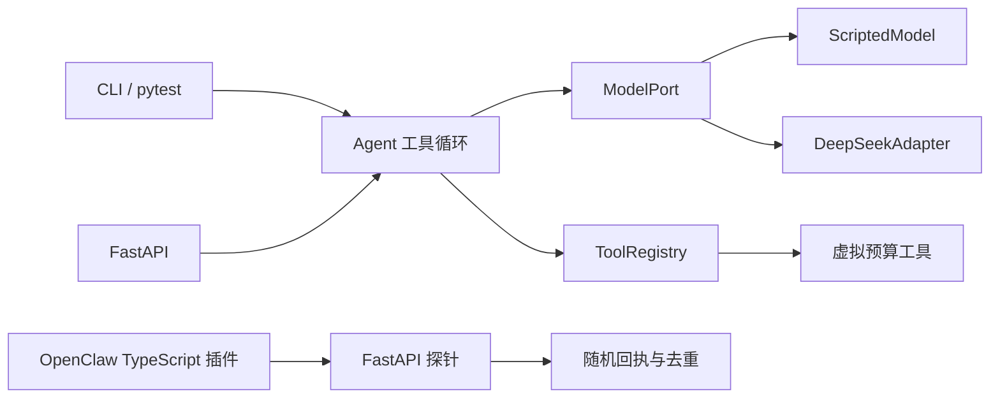

# D1：阶段 0 实现前技术建议

更新日期：2026-09-13。状态：`review`，等待头脑风暴智能体汇总并冻结接口。本文件是实现建议，不表示 B1/B2 已经编码、联调或通过测试。

## 结论

阶段 0 建议采用“可测试的纯 Agent 核心 + 可替换模型适配器 + FastAPI 薄接口 + 独立 OpenClaw TypeScript 桥接”的边界。默认使用确定性测试模型，不需要密钥；只有显式配置后才调用 DeepSeek。财务工具只读取虚拟快照并执行确定性计算，不接触 HTTP、模型 SDK、微信或数据库。



这四层各自回答不同问题：

- Agent 核心决定何时调用模型、如何识别工具请求、校验和执行工具、何时停止；它不知道 DeepSeek、FastAPI 或微信。
- 模型适配器只负责把内部中立消息转换为供应商请求，再把响应转换回中立的 `ModelTurn`。
- 工具注册表保存工具名称、说明、Pydantic 输入模型和处理函数；业务工具不知道是谁请求了它。
- FastAPI 与 OpenClaw 只负责传输、身份/请求关联和错误映射，不在 TypeScript 插件中复制财务计算。

## Agent 核心与 DeepSeek 的接口边界

建议在 Agent 核心中定义中立类型，而不是直接传递 OpenAI SDK 对象：

```text
ModelPort.complete(ModelRequest) -> ModelTurn

ModelRequest:
  messages, tool_definitions, timeout_seconds

ModelTurn:
  text, tool_calls[], finish_reason, provider_metadata

ToolCall:
  id, name, arguments_json
```

`DeepSeekAdapter` 可以使用异步 OpenAI Python SDK，因为 DeepSeek 官方提供 OpenAI 兼容入口。阶段 0 建议配置：

- `base_url=https://api.deepseek.com`
- 模型名称由 `DEEPSEEK_MODEL` 配置，当前默认候选为官方示例中的 `deepseek-flash`，不得散落在 Agent 或工具代码中。
- `DEEPSEEK_API_KEY` 只从服务端环境读取；请求、异常和配置打印时都要脱敏。
- 阶段 0 显式关闭 thinking mode，使最小循环更容易观察；以后通过适配器配置打开，核心无需变化。DeepSeek 当前默认开启 thinking mode，OpenAI 格式可用 `extra_body={"thinking": {"type": "disabled"}}` 关闭。
- SDK 自动重试先设为 0，超时由适配器显式配置，便于 C1 确定一次调用发生了什么。以后是否重试由应用层策略决定。
- 不启用 `/beta` 的 `strict` 工具模式。它有额外 Schema 限制，且不能替代本地校验。阶段 0 以本地 Pydantic 校验为权威。

适配器需要把外部失败归一化为内部错误：`model_timeout`、`model_auth_failed`、`model_balance_exhausted`、`model_rate_limited`、`model_invalid_request`、`model_unavailable`。DeepSeek 当前列出的 400/422 属于请求问题，401 是认证问题，402 是余额问题，429 可归为限流，500/503 可归为服务不可用。内部错误保留 `retryable` 字段，但阶段 0 不做隐藏的自动重试。

更换模型供应商时，只新增另一个 `ModelPort` 实现和消息映射；Agent 循环、Pydantic 工具模型、虚拟财务函数和测试替身保持不变。供应商专有的模型名、thinking 参数、错误类型和 usage 字段不得进入工具层。

## 工具 Schema 与可证明的测试替身

每个工具使用一个 Pydantic v2 输入模型，并由同一个模型完成两件事：

1. `model_json_schema()` 生成发给模型的 JSON Schema。
2. `model_validate_json()` 校验模型返回的 `arguments_json`。

输入模型设置 `ConfigDict(extra="forbid")`，避免模型编造的额外参数被静默忽略。阶段 0 的 `get_budget_snapshot` 建议只接收一个枚举或受限字符串 `period`，输出单独使用 `BudgetSnapshotResult`。金额使用整数分，例如 `remaining_fen=12345`，不用二进制浮点数表示人民币。

Agent 循环按以下顺序处理：

1. 调用 `ModelPort`。
2. 没有工具调用且有最终文本时成功结束。
3. 对每个工具调用检查调用 ID 是否重复、工具名是否存在、参数 JSON 是否有效、Pydantic 是否通过。
4. 执行已注册工具，将结构化结果作为对应 `tool_call_id` 的工具消息加入历史。
5. 再次调用模型；超过 `max_rounds` 时返回 `max_rounds_exceeded`，不得伪造最终回答。

确定性替身建议命名为 `ScriptedModel`。它不是固定回声：第一轮返回带唯一 `tool_call_id` 的预算工具请求；第二轮必须检查收到的历史中包含同一个调用 ID 和真实工具结果，再根据其中的 `remaining_fen` 生成最终文本。测试还应使用一个 spy 工具注册表记录调用次数。

至少用三项证据证明测试覆盖了循环，而非固定回复：

- 改变虚拟财务快照后，工具结果和最终回答一起变化。
- 断言工具处理函数确实执行一次，第二次模型请求包含对应的工具结果。
- 分别脚本化坏 JSON、额外字段、未知工具、重复调用 ID、持续请求工具和模型异常，断言得到稳定的机器错误码。

## FastAPI 探针方案

推荐 FastAPI，而不是临时使用标准库 HTTP 服务。阶段 0 已需要 Pydantic 请求校验、OpenAPI、错误响应、依赖替换和 HTTP 测试；这些能力会直接延续到阶段 1/2。FastAPI 官方的依赖覆盖机制也适合在测试时替换模型适配器和去重存储。

建议先冻结三个薄端点：

| 端点 | 职责 | 不做的事 |
| --- | --- | --- |
| `GET /healthz` | 仅证明 Python 进程可响应 | 不调用模型，不承诺微信或 DeepSeek 可用 |
| `POST /api/v1/probes` | 供 OpenClaw 命令/工具调用，生成并记录随机回执 | 不经过 LLM，不计算预算 |
| `POST /api/v1/agent/runs` | 调用 B1 Agent 循环；模型实现由服务端配置选择 | 客户端不能指定供应商或注入工具 |

`POST /api/v1/probes` 的候选请求：

```json
{
  "source_event_id": "opaque-channel-event-id",
  "challenge": "V001"
}
```

候选成功响应：

```json
{
  "request_id": "server-generated-uuid",
  "challenge": "V001",
  "receipt": "POC-V001-random-value",
  "created_at": "2026-09-13T23:00:00+08:00",
  "replayed": false
}
```

`challenge` 限制为 1—32 位字母、数字、下划线或连字符；`source_event_id` 作为不透明值处理并限制长度。相同 `source_event_id` 在当前去重窗口内重复到达时，返回原来的 `request_id`、`receipt` 和 `created_at`，并将 `replayed` 设为 `true`。阶段 0 可先使用带锁的内存存储证明并发去重；它不承诺进程重启后仍去重。若总控把“重启后重复事件仍需去重”纳入 B2 验收，再替换为单独的 SQLite 实现，不提前建设财务数据库。

`POST /api/v1/agent/runs` 建议要求单独的幂等键，并返回 `run_id`、`status`、最终文本、工具调用摘要与 `replayed`。响应不返回完整提示词、模型 reasoning 内容或原始财务快照。具体字段由头脑风暴和 B1 在冻结接口时确认。

HTTP 层至少区分：客户端请求校验失败 `422`、幂等键复用但载荷不同 `409`、模型超时 `504`、上游模型协议/服务失败 `502`、本地未处理错误 `500`。每类响应还应包含稳定的 `error.code`、`run_id/request_id` 和 `retryable`，测试主要依赖机器码而不是中文文案。

实际桥接默认只监听 `127.0.0.1`。OpenClaw 与 Python 不在同一可信主机时，必须先解决 HTTPS 和鉴权。即使在本机，也建议用环境变量配置的桥接密钥验证请求；密钥和请求头不得写入日志。

### 一个有意义的替代方案

替代方案是“纯 Python CLI + 标准库或轻量 ASGI 路由”。它的依赖更少，适合只教学工具循环；但 B2 必须提供 HTTP 边界，而且后续确定使用 FastAPI。此时临时协议会让 C1 重写接口测试，也失去自动 OpenAPI 和依赖覆盖的学习价值，因此不采用。

DeepSeek 层也可以直接使用 `httpx` 调 REST API，换取完全可控的请求和重试；代价是自行维护消息、工具调用、错误与 keep-alive 解析。阶段 0 使用官方兼容的 OpenAI SDK 更短、更容易把注意力放在 Agent 循环上，但必须通过 `ModelPort` 隔离 SDK，避免形成供应商绑定。

## OpenClaw 与 Python 的职责

OpenClaw TypeScript 插件先共享一个只负责 HTTP 的 `FinanceProbeClient`：

- `api.registerCommand(...)` 注册 `/finance-probe`，绕过 LLM，验证微信入站、TypeScript 参数解析、Python HTTP 调用、随机回执和微信出站是否连通。
- 命令验证通过后，`api.registerTool(...)` 复用同一个客户端。它验证 OpenClaw Agent 是否看见并选择工具，以及工具结果能否返回当前会话。

两者都调用 Python 的 `/api/v1/probes`。命令成功只证明确定性桥接，Agent 工具成功再增加“OpenClaw 模型选择工具”这一层；它们都不能替代 B1 中 DeepSeek → Python 财务工具循环的证据。

TypeScript 负责 OpenClaw 注册、参数 Schema、从受信运行上下文取得来源事件信息、HTTP 超时和通道友好的错误文本。Python 负责生成随机回执、去重、Agent 循环、DeepSeek 适配和财务工具。TypeScript 不生成成功回执；Python 不依赖微信 SDK。

OpenClaw 当前把 `registerCommand` 定义为绕过 LLM 的自定义命令，把 `registerTool` 定义为 Agent 可见工具。其插件 API 仍标为实验性，因此 B2 应固定已验证的 OpenClaw/插件版本并记录版本，避免用未经测试的新版本替换。

## 日志与执行记录

使用一行一条 JSON 的结构化事件，并用 `run_id` 或 `request_id` 串联。建议事件：

- `request_received`：路由、请求 ID、来源类型、载荷字节数、来源事件 ID 的哈希。
- `model_call_started/model_call_finished`：供应商、模型、轮次、耗时、finish reason、工具调用数量、token usage、归一化错误码。
- `tool_call_requested/tool_call_finished`：工具调用 ID、工具名、校验状态、耗时和结果状态。
- `probe_created/probe_replayed`：请求 ID、测试 challenge、随机 receipt、是否重放。receipt 必须同时出现在 Python 日志和微信回复，作为联调证据。
- `run_finished`：状态、总轮次、总耗时和错误码。

默认禁止记录：API key、Authorization/桥接密钥、完整用户消息、完整模型提示词、reasoning 内容、原始工具参数/结果、个人账目、微信账号和原始来源事件 ID。阶段 0 的虚拟数值也只在显式测试输出中展示。若向 DeepSeek 发送 `user_id`，只能发送无个人信息的内部伪名标识；阶段 0 可直接省略。

## 建议目录边界

```text
backend/
├── pyproject.toml
├── src/wife_agent/
│   ├── config.py
│   ├── api/
│   │   ├── app.py
│   │   ├── errors.py
│   │   └── routes/
│   │       ├── health.py
│   │       ├── probes.py
│   │       └── agent_runs.py
│   ├── agent/
│   │   ├── contracts.py
│   │   ├── errors.py
│   │   └── loop.py
│   ├── models/
│   │   ├── deepseek.py
│   │   └── scripted.py
│   ├── tools/
│   │   ├── registry.py
│   │   └── budget.py
│   ├── finance/
│   │   └── virtual_snapshot.py
│   ├── idempotency/
│   │   └── memory.py
│   └── observability/
│       ├── events.py
│       └── redaction.py
└── tests/
    ├── unit/
    │   ├── test_agent_loop.py
    │   ├── test_tool_registry.py
    │   └── test_budget_tool.py
    ├── integration/
    │   ├── test_agent_api.py
    │   └── test_probe_api.py
    └── live/
        └── test_deepseek_opt_in.py

openclaw-plugin/
├── package.json
├── src/
│   ├── index.ts
│   ├── finance-probe-client.ts
│   └── schemas.ts
└── tests/
    └── finance-probe-client.test.ts
```

`tests/live` 必须显式选择且没有密钥时跳过，不能成为普通测试的前置条件。B1 先拥有 `backend/`，B2 在接口冻结后拥有 `openclaw-plugin/` 和 Python 的探针路由；C1 在独立位置提交测试矩阵，C2 再基于明确版本复验。

## 用户需要理解的五个知识点

1. 模型产生的是“调用某工具的请求”，真正执行 Python 函数的是应用程序。
2. Pydantic 输入模型既能生成给模型看的 JSON Schema，也能在执行前做权威校验；模型遵循 Schema 仍不能替代本地校验。
3. 依赖倒置的实际作用：Agent 依赖 `ModelPort`，因此测试替身和 DeepSeek 可以互换，业务工具不需要改变。
4. `/healthz`、确定性探针和 Agent 工具调用证明的是三件不同的事，不能用其中一个成功推断整条链路成功。
5. 幂等性依据来源事件 ID 或明确幂等键，而不是消息文字；两次相同金额的真实输入可能是两笔消费。

## 建议头脑风暴冻结的事项

1. 接受四层边界及上面的目录所有权。
2. 冻结 `ModelPort` 的中立输入输出，不允许核心或工具导入供应商 SDK 类型。
3. 冻结 Pydantic v2、`extra="forbid"`、整数分和本地校验为权威。
4. 冻结三个端点的职责；具体 Agent 响应字段与 B1 一起确认。
5. 明确阶段 0 的重复请求保证是否跨进程重启；若不跨重启，文档必须写出限制。
6. 固定 B2 实测使用的 OpenClaw 与微信插件版本，并要求记录版本证据。

## 官方依据

- [DeepSeek 首次 API 调用](https://api-docs.deepseek.com/)：OpenAI 兼容入口、当前模型名和环境密钥示例。
- [DeepSeek Tool Calls](https://api-docs.deepseek.com/guides/tool_calls/)：模型提出工具调用，开发者提供并执行函数；返回参数仍需本地校验。
- [DeepSeek Thinking Mode](https://api-docs.deepseek.com/guides/thinking_mode/)：thinking 默认状态与开关格式。
- [DeepSeek 错误码](https://api-docs.deepseek.com/quick_start/error_codes/)：400、401、402、422、429、500、503 的含义。
- [Pydantic JSON Schema](https://docs.pydantic.dev/latest/concepts/json_schema/)：由模型生成 JSON Schema 的接口。
- [FastAPI 依赖](https://fastapi.tiangolo.com/tutorial/dependencies/) 与 [测试依赖覆盖](https://fastapi.tiangolo.com/advanced/testing-dependencies/)：接口依赖注入与测试替换。
- [FastAPI 测试](https://fastapi.tiangolo.com/tutorial/testing/)：使用 TestClient 验证 HTTP 接口。
- [OpenClaw 工具与命令](https://docs.openclaw.ai/plugins/sdk-overview/tools-and-commands)：Agent 工具与绕过 LLM 的自定义命令边界。
- [OpenClaw Plugin SDK 概览](https://docs.openclaw.ai/plugins/sdk-overview)：插件 API 的实验性和版本兼容要求。
