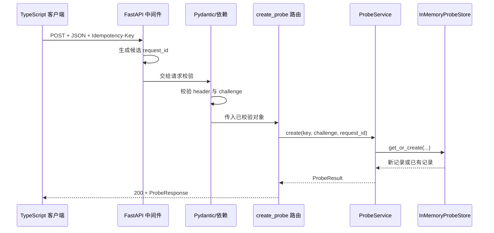
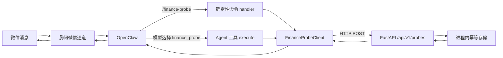

# D2：从微信命令到 FastAPI 探针的数据流

更新日期：2026-09-15。本文以阶段 0 的实际 Python 与 TypeScript 代码为教材。它解释当前代码证明了什么、每层用了什么技术，以及真实微信联调还需要什么证据。

## 1. 这次实现验证的边界

阶段 0 把链路拆成三个可以分别判断的部分：

1. `GET /healthz` 只证明 Python HTTP 服务正在响应。
2. `/finance-probe` 和 `finance_probe` 通过 TypeScript 调用 `POST /api/v1/probes`，证明 OpenClaw 插件能够访问本项目后端并取得后端生成的回执。
3. 腾讯微信通道把手机消息送入 OpenClaw，再把插件结果送回手机。这一步必须由用户扫码并确认手机实收，不能用本地单元测试代替。

这里还没有把真实账目或投资建议接入微信，也没有验证长期主动提醒。探针的作用是先证明最短跨语言链路，出错时能判断问题在微信、OpenClaw、TypeScript、HTTP 还是 Python。

## 2. 本阶段实际使用的技术

| 部分 | 使用的技术 | 在项目中的作用 |
| --- | --- | --- |
| Python HTTP 服务 | FastAPI | 声明路由、中间件、依赖和统一异常处理 |
| HTTP 数据契约 | Pydantic v2 | 校验请求和序列化响应，拒绝空白、超长和额外字段 |
| 幂等存储 | Python `threading.Lock` + 进程内字典 | 并发情况下让同键同内容只创建一份回执 |
| OpenClaw 插件 | TypeScript ESM + OpenClaw Plugin SDK 2026.8.2 | 注册确定性命令和 Agent 工具 |
| HTTP 客户端 | Node.js 内置 `fetch` + `AbortController` | 发送 JSON、设置超时、映射网络失败 |
| 工具 Schema | TypeBox | 向 OpenClaw 声明 Agent 工具的输入和结构化输出 |
| 自动化测试 | pytest、Node.js test runner、假 HTTP 服务 | 分层验证正常、错误、并发和隐私行为 |

几个有意义的替代方案及当前选择：

- HTTP 客户端可以使用 Axios；当前请求只有两个端点，Node 内置 `fetch` 已能处理 header、JSON 和取消，不增加第三方运行依赖。
- 后端响应可以使用 Zod 或 TypeBox 在运行时验证；当前客户端用小型显式解析函数检查精确字段、UUID、回执、时间和 challenge 一致性，使跨语言契约集中在一个文件中。以后响应类型增多时，再评估统一 Schema 校验器。
- 幂等记录可以放 SQLite 或 PostgreSQL；当前探针只验证一个 Python 进程，所以使用带锁内存存储。正式记账前必须换成数据库唯一约束和事务。
- 可以直接改腾讯微信通道插件；当前使用独立 OpenClaw 工具插件，微信通道只负责收发消息，财务桥接可以单独测试和升级。

## 3. 先认识一条真实 HTTP 请求

TypeScript 客户端向 Python 发出的探针请求可写成：

```http
POST /api/v1/probes HTTP/1.1
Host: 127.0.0.1:8000
Content-Type: application/json
Accept: application/json
Idempotency-Key: <本次调用的键>

{"challenge":"V001"}
```

这段请求包含四类信息：

- 方法 `POST` 表示提交一次要处理的输入；`GET /healthz` 用来读取健康状态。
- 路径决定进入哪个 FastAPI 路由。
- header 保存传输元数据。`Idempotency-Key` 不属于业务正文，但决定重复请求如何处理。
- body 是 JSON；本阶段只允许一个 `challenge` 字段。

成功响应是 HTTP 200，并带有 Python 生成的数据：

```json
{
  "request_id": "服务器生成的 UUID",
  "challenge": "V001",
  "receipt": "POC-随机值",
  "created_at": "带时区的 ISO 8601 时间",
  "replayed": false
}
```

`request_id` 用来关联日志和一次后端结果，`receipt` 用来在 Python 日志与微信回复之间人工核对，`created_at` 说明首次结果何时创建，`replayed` 说明这次是否取回已有结果。它们不是同一种编号。

## 4. FastAPI 如何处理请求

代码入口是 [FastAPI 应用](../src/wife_system/api/app.py)、[Pydantic Schema](../src/wife_system/api/schemas.py) 和 [探针服务与存储](../src/wife_system/probes.py)。请求按下面的顺序流动：



各层职责如下：

- `assign_request_id` 中间件先为进入服务的 HTTP 请求生成候选 UUID，并记录方法和路径。即使校验失败，也有安全的请求编号可用于定位。
- `ProbeRequest` 用 `extra="forbid"` 拒绝多余字段，用长度和自定义 validator 拒绝空白 challenge。
- `require_idempotency_key` 验证必填 header。FastAPI 的 `Depends` 把“怎样取得并校验 header”从路由主体中分开。
- `create_probe` 只做 HTTP 到业务层的转换、错误映射和安全日志，没有把去重算法写进路由。
- `ProbeService` 负责创建时间、随机回执和记录；这些依赖可以在测试中替换，因此测试不需要等待真实时间或随机碰运气。
- `InMemoryProbeStore` 在锁内完成“查询或创建”。锁保护的是一个不可拆分的决定，不只是字典的一次读写。

这种结构展示了 FastAPI 依赖注入的实际价值：测试可以提供故障版 `ProbeService`，直接验证 500 的安全响应，而无需破坏生产代码或真的让数据库崩溃。

## 5. 幂等不是“内容一样就算同一件事”

幂等键表示调用身份，challenge 表示调用内容。Python 存储对两者作组合判断：

| 收到的情况 | HTTP 结果 | 是否生成新回执 |
| --- | --- | --- |
| 新键 + 任意合法 challenge | 200，`replayed:false` | 是 |
| 同键 + 相同 challenge | 200，返回原编号、回执和时间，`replayed:true` | 否 |
| 同键 + 不同 challenge | 409，`duplicate_request_conflict` | 否 |

如果只按文字去重，“午饭 18 元”今天和明天各发生一次会被错误合并。如果只在客户端收到响应后缓存，两个并发请求可能已经让后端执行两次。当前实现让 Python 在锁内决定首次创建者，所以并发请求仍共享一个结果。

当前保证只有一个 Python 进程的生命周期。服务重启后字典清空；多个 Uvicorn worker 也不会共享这份字典。正式账目属于不可随意重复的写入，届时需要数据库中的幂等记录、唯一约束和业务写入处于同一事务。

## 6. OpenClaw 命令与 Agent 工具是两条不同路径

插件入口是 [OpenClaw 注册代码](../integrations/openclaw/src/index.ts)，共享客户端是 [FinanceProbeClient](../integrations/openclaw/src/client.ts)，配置与安全错误分别在 [config.ts](../integrations/openclaw/src/config.ts) 和 [errors.ts](../integrations/openclaw/src/errors.ts)。

### `/finance-probe`：确定性命令

用户输入 `/finance-probe V001` 时，OpenClaw 直接调用命令 handler，不先让模型决定是否使用工具。这条路径适合联调，因为同一个输入应直接触发后端请求。

本机 OpenClaw 2026.8.2 的 `PluginCommandContext` 有会话、发送方、参数等字段，却没有单条来源消息 ID。会话 ID 会被多条消息共用；发送方和账号标识代表人；`args` 和 `commandBody` 是消息内容。它们都不符合事件幂等键的语义。

因此 `P0-IF-002` 明确采用降级设计：命令 handler 每次生成随机 invocation UUID，把它作为本次 HTTP 调用的键；不进行隐藏重试，并明确不保证微信把同一事件重新投递时仍命中原记录。`requireAuth:true` 让命令只接受 OpenClaw 已授权的发送者，但它不替代未来的后端鉴权。

这个决定展示了一条重要工程原则：保证范围由输入协议真正提供的身份信息决定。代码不能通过给会话 ID、消息文字或随机数换一个名字，就宣称获得了来源事件级幂等。

### `finance_probe`：Agent 工具

用户用自然语言提出请求时，模型可以选择 `finance_probe`。OpenClaw 调用工具的 `execute(toolCallId, params, signal)`，第一个参数是宿主提供的工具调用 ID。插件将这个 ID 用作幂等键，同一工具调用再次执行时仍能取回 Python 中的同一结果。

这个保证仍然只覆盖“同一工具调用”。它不证明 tool call ID 等于微信来源消息 ID，也不证明用户再次发送同一句话会使用相同 ID。

工具 Schema 由 TypeBox 声明：`challenge` 必须是 1—128 个字符且不允许额外字段。Schema 帮助模型和 OpenClaw 形成正确请求，客户端仍再次校验输入；外部声明不能代替执行边界上的验证。

两条路径共享同一个 `FinanceProbeClient`：



## 7. TypeScript 客户端守住了哪些边界

`FinanceProbeClient` 不负责生成成功数据。它只完成以下工作：

1. 接受调用者给出的 challenge 和幂等键。
2. 默认只访问 `http://127.0.0.1:8000`，并把无鉴权阶段的地址限制在本机回环主机。
3. 用 `fetch` 发送 JSON，用 `AbortController` 在默认 5 秒后取消。
4. 根据 HTTP 状态映射稳定错误码。
5. 对 2xx JSON 做运行时检查：字段集合必须精确，request ID、receipt、带时区时间和 replayed 类型必须正确，返回的 challenge 必须与请求一致。
6. 日志只保存错误码、耗时以及成功结果的请求编号和随机回执，不保存 challenge、原始幂等键、微信身份或异常正文。

只依赖 TypeScript 类型是不够的。类型在编译后消失，而 Python、代理或错误页面都可能返回不符合接口的数据，所以 `parseProbe` 和 `parseHealth` 必须在运行时检查实际 JSON。

当前错误映射为：

| Python/网络结果 | TypeScript 错误码 | 可重试 |
| --- | --- | --- |
| 409 | `duplicate_request_conflict` | 否 |
| 422 | `invalid_request` | 否 |
| 500 或其他 5xx | `backend_unavailable` | 是 |
| 超过配置时间 | `backend_timeout` | 是 |
| 拒绝连接等传输失败 | `backend_unavailable` | 是 |
| 2xx 但 JSON/字段不合约 | `invalid_backend_response` | 否 |

“可重试”是给调用方的事实，不代表插件当前会自动重试。隐藏重试会让联调过程更难判断，也要求幂等键在重试之间保持不变；阶段 0 选择把决定留给上层。

## 8. 插件为什么同时需要 package 和 manifest

[package.json](../integrations/openclaw/package.json) 服务于 Node/npm：声明 ESM、构建脚本、运行依赖、OpenClaw 精确 peer 版本和构建入口。[openclaw.plugin.json](../integrations/openclaw/openclaw.plugin.json) 服务于 OpenClaw 的加载前检查：声明插件 ID、工具所有权、命令激活、配置 JSON Schema 和界面提示。

本阶段固定 OpenClaw `2026.8.2`，因为 Plugin SDK 属于实验性接口。入口的插件 ID 必须和 manifest 一致；运行时注册的 `finance_probe` 必须出现在 `contracts.tools`；安装包加载构建后的 JavaScript，不能依赖用户机器临时编译 TypeScript。

这也是“清单”和“代码”的区别：清单让宿主在执行插件前知道它声称提供什么，入口代码才真正注册 handler 和工具。只写其中一个都不能证明插件可被正确发现和运行。

## 9. 怎样读测试证据

测试分三层：

- Python 测试直接验证 FastAPI 与进程内存储，包括校验错误、顺序重放、冲突、并发、隐私和注入故障。
- TypeScript 客户端测试使用本地假 HTTP 服务，验证发出的 header/body、响应解析、错误映射、超时和拒绝连接。
- 插件注册测试使用假 OpenClaw API，检查命令、工具、`requireAuth`、调用 ID 和用户可见结果。

本地自动化通过后，只能把“代码契约通过”标记为完成。`openclaw plugins inspect ... --runtime --json` 还要证明本机宿主实际识别构建产物；手机端最终需要保存四项相互对应的证据：发送的 challenge、微信收到的 request ID/receipt/time、Python 同一回执日志、OpenClaw 的成功调用记录。

截至 2026-09-15，执行方的 `npm run check` 已完成严格类型检查、构建和 27 项 Node 测试；生产依赖审计为 0 个已知漏洞，`npm pack --dry-run --json` 显示发布包只包含构建产物、manifest 和 package 元数据，共 18 个文件。隔离配置下的 `openclaw plugins inspect wife-system-finance-probe --runtime --json` 把插件识别为 `loaded`，发现 `finance_probe` 工具和 `finance-probe` 命令，且 `diagnostics` 为空。这说明本机 OpenClaw 2026.8.2 实际加载了编译入口，而不只是 TypeScript 编译成功。

执行方还让真实 TypeScript 客户端访问临时 Uvicorn：健康检查成功，同一键的首次探针和重放均返回 200，request ID、receipt 与 created_at 保持一致，第二次为 `replayed:true`；服务随后停止且端口已释放。这条证据覆盖了 Node 到 Python 的真实跨语言 HTTP 边界。它仍不是腾讯微信通道证据；扫码、微信入站、OpenClaw 出站回复和手机实收必须在下一阶段由用户参与验证。

[C2-B2b 独立验收报告](testing/phase-0-c2-b2b-report.md) 进一步以 44 项独立 Node 测试验证真实回环 HTTP、首次与重放、并发、409/422/5xx、超时、取消、拒绝连接、畸形响应、无隐藏重试、命令和工具的幂等键来源、配置限制及隐私；44 项全部通过。C2 还复跑了 27 项执行方测试、TypeScript 类型检查与构建、18 文件发布包清单、隔离 OpenClaw runtime inspect 和 Python 143 项回归，未发现需要返修的桥接缺陷。Python 回归仍有一项已知 Starlette/AnyIO 弃用警告，它来自 B2a 已记录的第三方兼容问题，没有新增失败。

## 10. 建议你亲手完成的练习

先不改代码，回答下面三个问题：

1. 同一个 `Idempotency-Key` 先发送 `V001`，再发送 `V002`，为什么第二次应是 409，而不是生成新回执？
2. `/healthz` 返回 200，为什么仍不能说明微信、TypeScript 插件或 DeepSeek 正常？
3. 为什么命令的随机 invocation UUID 不能解决微信事件重投，而工具调用 ID 可以解决同一工具调用的重复执行？

再做一个小改动练习：在 TypeScript 客户端的假 HTTP 测试中增加一个“200 但 `created_at` 没有时区”的响应，预期得到 `invalid_backend_response`。这个练习同时验证 HTTP 成功状态与业务响应有效性是两件事。

## 11. 当前限制与后续演进

- 真实微信扫码、入站消息、出站回复和手机实收仍需用户参与验证。
- 微信来源事件级幂等尚不可用；当前命令协议没有提供可信来源消息 ID。
- Python 幂等缓存不跨重启、不跨多 worker，不能直接用于真实账目写入。
- 后端目前没有桥接鉴权，因此客户端限制为回环地址。需要跨机器部署时，应先增加 HTTPS、服务身份认证、密钥轮换和日志脱敏，再开放远程地址。
- OpenClaw 或腾讯微信插件升级后，应重新执行构建、插件检查和真实通道测试，不能沿用旧版本结论。
- 投资与理财教学不会由这条探针直接给出；后续应让确定性财务计算、资料检索与带来源解释分别进入可测试工具，再由 Agent 编排。
