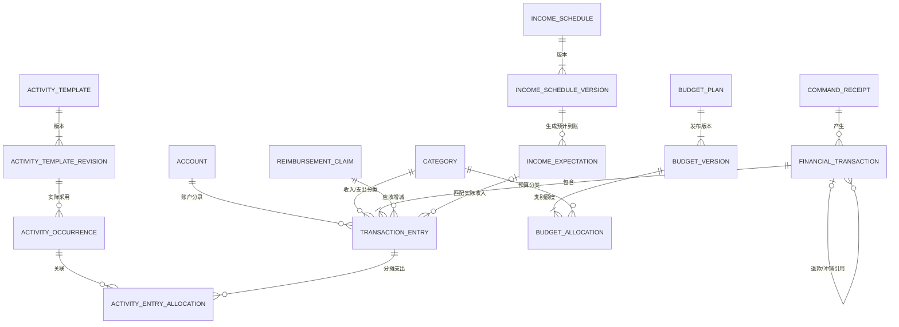

# P1-D3：个人财务数据层技术建议与教学地图

- 任务：`P1-D3`
- 角色：技术顾问
- 文档状态：`review`
- 依据控制版本：`2026-09-16T12:39:07+08:00`
- 编写时间：2026-09-16，Asia/Shanghai

本文是供头脑风暴总控形成 `P1-IF-001` 的技术建议，不代表模型、迁移、数据库或业务服务已经实现。所有示例均为虚拟数据；P1-B3 在接口冻结和重新派发前不得开始。

## 1. 建议总览

建议冻结以下路线：

1. 使用 **SQLAlchemy 2.x 类型化 Declarative 模型**，以 `Mapped[...]`、`mapped_column()` 和显式约束描述持久化；Pydantic 模型继续承担 API/命令输入输出，不让 ORM 模型兼任外部数据契约。
2. 使用 **同步 SQLAlchemy Session**；一个业务命令对应一个短生命周期 Session 和一个明确事务。
3. **SQLite** 用于快速本地开发、纯规则测试和迁移冒烟；**PostgreSQL** 是目标数据库，也是并发、锁、隔离、约束和最终迁移验收的准绳。
4. 已入账金额使用 **有符号 64 位整数最小货币单位**，字段名统一以 `_minor` 结尾；CNY 的最小单位是分。币种使用大写三字母代码，P1 只允许单笔交易单币种。
5. 账本使用 **交易头 + 平衡分录**。每个已入账交易至少两条分录，同币种分录金额之和必须为零；不建设可任意配置的通用会计科目表，而是限制分录目标为账户、支出类别、收入、应收款和期初权益等明确角色。
6. 已入账交易不可原地改写。纠错使用冲销和替代交易；退款引用原支出；代付进入应收款，报销冲减应收款，均不误算为个人收入或消费。
7. 来源幂等、业务写入、审计记录在同一数据库事务内完成；可变聚合使用非空整数 `version_id` 做乐观锁，禁止绕过版本检查的批量 ORM 更新。
8. 账户、类别等主数据采用归档；已入账交易、分录、预算发布版本、收入安排版本、审计和幂等记录不提供普通硬删除。

这条路线优先保证财务口径可解释、历史不被未来计划覆盖、重复请求不重复入账，并保留从 SQLite 开发迁移到 PostgreSQL 的清晰边界。

## 2. 六组选型

### 2.1 SQLAlchemy 2.x 显式模型与 SQLModel

| 维度 | SQLAlchemy 2.x 显式模型 | SQLModel |
| --- | --- | --- |
| 定位 | 成熟 ORM/Core，直接表达表、约束、关系、事务和方言能力 | SQLAlchemy 与 Pydantic 之上的薄层，偏向减少常见 CRUD 样板 |
| 类型体验 | `Mapped[T]` 和 `mapped_column()` 已提供现代类型标注 | 字段写法更短，FastAPI/Pydantic 体验直接 |
| 复杂关系 | 关联实体、复合约束、版本列、自定义类型和迁移边界显式 | 常见关系简洁；复杂场景仍需下沉到 SQLAlchemy |
| 外部契约隔离 | ORM、领域对象、Pydantic Schema 可明确分层 | 同一个类兼具 ORM/Pydantic 身份容易让持久化字段泄入 API |
| 学习价值 | SQL、Session、Unit of Work、约束和迁移知识可迁移到更多 Python 后端 | 入门快，适合 CRUD 原型和表结构简单的 FastAPI 服务 |
| 本项目代价 | 样板代码略多 | 复杂账本最终仍需理解 SQLAlchemy，抽象层切换会增加调试路径 |

**推荐：SQLAlchemy 2.x 显式模型。** 当前领域包含平衡分录、退款关联、应收款、版本化计划、幂等唯一约束和乐观锁，已经超过“一个 Pydantic 类同时代表 API 与表”的舒适范围。SQLModel 仍是有意义的替代方案：若范围缩减为少量独立 CRUD 表、没有多分录和复杂迁移，它能减少样板；本项目不采用它作为核心账本建模层。

SQLAlchemy 2.x 官方已把 `mapped_column()` 与 `Mapped[...]` 作为类型化 Declarative 的主要写法；SQLModel 官方也明确其底层仍是 SQLAlchemy 和 Pydantic，复杂能力可以直接使用 SQLAlchemy。因此选择显式 SQLAlchemy 不牺牲类型体验，换来更清楚的边界。

### 2.2 SQLite 本地开发与 PostgreSQL 目标环境

| 环境 | 负责内容 | 不能据此宣称通过的内容 |
| --- | --- | --- |
| SQLite | 快速单元测试、仓储接口测试、纯函数月度汇总、从空库应用迁移、开发者本地探索 | PostgreSQL 并发、行锁、隔离级别、目标类型、约束触发器和索引行为 |
| PostgreSQL | 集成验收、并发幂等、退款/预算竞争、目标迁移、时间和约束行为、最终数据层运行 | 不代替业务规则单元测试 |

SQLite 连接必须显式启用 `PRAGMA foreign_keys=ON`，不能依赖默认值。SQLite 同时只允许一个写者，这会掩盖或改变 PostgreSQL 多连接并发下的竞争方式，因此它只能证明快速反馈，不是生产等价环境。

以下行为必须在 PostgreSQL 复验：

1. Alembic 从空库完整 `upgrade`，以及开发环境允许的 `downgrade`/重建路径。
2. 主键、外键、命名的 `UNIQUE`/`CHECK` 约束、目标数据库的延迟平衡校验触发器。
3. 同一来源幂等键的两个并发写入：只能有一个业务结果，另一个返回首次结果或稳定冲突。
4. 两个会话同时修改同一可变聚合：旧 `version_id` 必须产生明确并发冲突。
5. 并发退款与并发报销：在锁定原交易或应收款后，不得超额退款、超额结清或产生半写入。
6. 一次转账、退款、冲销或代付的任一步失败时，交易头、全部分录、关联、审计和幂等结果整体回滚。
7. `READ COMMITTED` 下的行锁行为，以及月度快照使用单条汇总查询或只读 `REPEATABLE READ` 时的一致性。
8. `timestamptz` 往返、UTC 存储与 Asia/Shanghai 展示/业务日期边界，特别是月初月末。
9. UUID、`BIGINT`、枚举/检查约束和索引的实际 DDL；关键查询使用目标索引且没有明显全表扫描退化。
10. 服务进程重启后幂等记录仍有效；多 worker 共享 PostgreSQL 时不能重复入账。

### 2.3 整数分与 Decimal/NUMERIC

| 方案 | 优点 | 风险/代价 | 结论 |
| --- | --- | --- | --- |
| `BIGINT amount_minor` + Python `int` | 加减、比较、汇总精确；SQLite/PostgreSQL 行为更接近；字段含义直接 | 跨币种时需要币种小数位元数据；比例计算要显式处理余数 | **用于已入账金额、预算额度、收入计划金额** |
| `NUMERIC(p,s)` + Python `Decimal` | 支持可变小数位和利率类计算；PostgreSQL 对货币建议精确 numeric | SQLite 类型/约束语义不同；隐式 scale 舍入可能隐藏输入错误；性能和代码复杂度略高 | 用于未来利率、汇率或无法用最小单位表达的量，不作为 P1 已入账金额默认 |
| `float`/`double` | 运算方便 | 二进制浮点不能精确表示常见十进制金额 | 禁止参与入账、预算和财务相等判断 |

金额规则建议冻结为：

- 字段名使用 `amount_minor`、`limit_minor`、`expected_minor`；Python 类型为 `int`，数据库类型为 `BIGINT`。
- 金额必须同时携带 `currency`；使用大写 ISO 4217 三字母代码。P1 默认和允许币种为 `CNY`，但默认值来自配置/数据，不把生活费数值写入代码。
- 交易头固定一个币种，全部分录继承并匹配它；跨币种转账和汇率换算不属于 P1，未来需要独立 FX 交易语义。
- 外部输入先从字符串构造 `Decimal`，禁止先经过 `float`。已入账事实若超过币种允许的小数位，返回校验错误，不做静默舍入。
- 预测、比例分摊等计算可用 `Decimal` 中间值；在产生最小单位时统一使用 `ROUND_HALF_UP`。分摊后出现余分时，按稳定的明细顺序分配剩余 1 分，保证明细之和严格等于总额。
- 数据库不负责把任意小数隐式四舍五入为入账金额。所有入账分录在进入仓储前已经是整数分。
- `amount_minor` 使用有符号数表达分录方向，但对用户输入的“金额”要求正数；正负方向由业务命令和分录角色决定。零金额分录禁止。

### 2.4 简单交易表与交易头/分录

简单交易表通常包含 `amount/from_account/to_account/category/type`。它适合单账户收入和支出，但转账会出现两个金额位置，拆分消费会产生重复列，代付/报销需要不断追加状态与特例，最终月度统计依赖大量条件分支。

**推荐交易头 + 平衡分录：**

- `financial_transaction` 保存一次经济事件的身份、类型、发生时间、币种、状态、来源和关联原交易。
- `transaction_entry` 保存对账户、支出类别、收入、应收款或期初权益的有符号影响。
- 每个已入账交易至少两条分录；同一交易的分录按币种求和必须为零。
- 账户余额由账户分录累计得到，不在账户表维护可漂移的当前余额。
- 支出与预算消耗由 `expense` 分录累计；收入由 `income` 分录累计；转账只有两个账户分录，所以不会进入收入和消费。

虚拟示例，单位均为分：

| 场景 | 分录 | 统计口径 |
| --- | --- | --- |
| 收入 100.00 | 电子账户 `+10000`；收入 `-10000` | 实收 `10000`，账户增加 |
| 午餐 18.00 | 电子账户 `-1800`；餐饮支出 `+1800` | 实际支出和餐饮消耗 `1800` |
| 账户转账 50.00 | 来源账户 `-5000`；目标账户 `+5000` | 只改变资金位置，不计收入/消费 |
| 午餐退款 8.00 | 退款账户 `+800`；原餐饮支出 `-800` | 净支出减少，退款单独可见；引用原交易 |
| 为他人代付 100.00 | 电子账户 `-10000`；应收款 `+10000` | 形成应收，不计个人消费 |
| 收到报销 60.00 | 电子账户 `+6000`；应收款 `-6000` | 应收剩余 `4000`，不计收入 |
| 自己 20.00 + 代付 80.00 | 电子账户 `-10000`；个人支出 `+2000`；应收款 `+8000` | 个人消费只有 `2000` |

退款必须引用原支出交易；累计退款不得超过原支出仍可退金额。纠错冲销必须生成原交易的完整反向分录，并可再创建替代交易，不能覆盖原记录。分录平衡是跨行不变量：业务服务在写入前校验，PostgreSQL 再用可延迟到事务提交时检查的约束触发器兜底；SQLite 仅执行服务层校验。

### 2.5 同步与异步 SQLAlchemy

**推荐同步 SQLAlchemy。** 当前是单用户、模块化单体、短事务和有限并发，瓶颈更可能来自业务正确性、外部模型和渠道，而不是数据库连接吞吐。同步 Session 更容易读懂事务范围、调试锁和编写迁移，也能直接用于命令行、后台任务和测试。

建议接口层使用普通 `def` 路由或明确把同步业务服务放入工作线程，避免在 `async def` 事件循环中直接执行阻塞数据库调用。每个请求/任务获得独立 Session；绝不跨线程或任务共享 Session。

异步 SQLAlchemy 是以后有实测证据时的迁移选项，例如并发请求规模明显上升、数据库等待成为主要瓶颈、应用已形成完整 async 驱动链。`AsyncSession` 同样不能在并发任务间共享，还需要处理隐式 IO、懒加载和 async 驱动差异；P1 不为尚未出现的吞吐问题提前承担复杂度。

### 2.6 幂等、事务、审计、并发与删除

| 主题 | P1 最小边界 |
| --- | --- |
| 来源幂等 | `command_receipt` 保存 `source_system`、`key_version`、HMAC-SHA-256 来源键摘要、请求指纹、结果类型/ID和完成时间；唯一约束为 `(source_system, key_digest)`。摘要输入为 `source_system + "\\0" + raw_event_id`，密钥由应用配置提供并按版本轮换。同键同指纹返回首次结果，同键不同指纹返回 `duplicate_request_conflict`。不以消息文本生成键，不保存原始事件编号或私人消息。 |
| 事务 | 一个命令在一个 `Session.begin()` 中完成幂等占位、聚合加载、校验、交易头、全部分录、关联和审计；异常整体回滚。提交只在服务边界发生，仓储不得自行提交。 |
| 审计修订 | 已入账事实通过冲销/退款/替代记录历史；活动模板、收入安排和预算采用不可变版本；通用 `audit_event` 记录实体、动作、前后版本、原因和命令编号，不把原始聊天或密钥写入日志。 |
| 乐观锁 | 账户、类别、活动模板身份、收入安排身份、预算计划/草稿等可变聚合使用非空整数 `version_id`。命令携带 `expected_version`；不匹配返回稳定并发冲突。禁止对这些聚合使用绕过 ORM 逐行版本检查的 bulk update/delete。 |
| 行锁 | 退款锁定原交易；报销锁定应收款；发布预算版本锁定预算计划；在 PostgreSQL 中用 `SELECT ... FOR UPDATE` 或等价写竞争控制。 |
| 删除 | 已入账交易、分录、发布版本、幂等和审计不可普通硬删除；账户、类别、模板用 `archived_at`；计划用有效期/停用版本；仅未发布草稿和测试数据库可按明确维护流程硬删除。 |

幂等表和业务结果必须共享事务。`request_fingerprint` 同样对“命令 schema 版本 + 已校验结构化字段的规范 JSON”计算 HMAC-SHA-256，不纳入到达时间等易变字段。幂等密钥在记录保留期内必须稳定；若轮换，先暂停写入，以维护迁移统一重算历史摘要并切换 `key_version`，再恢复服务，不能让同一原始事件因新旧密钥得到两个可写摘要。并发插入相同唯一键时，由 PostgreSQL 唯一约束决定单一赢家；失败一方回滚后读取已提交结果。业务层不能用“先查询是否存在，再插入”作为唯一保障，因为两个请求可以同时查询到不存在。

## 3. 推荐表关系与约束

### 3.1 关系图



### 3.2 主要表

| 表 | 关键字段 | 关键约束 |
| --- | --- | --- |
| `account` | `id`、`name`、`currency`、`version_id`、`archived_at` | 币种大写三字母；归档账户不能用于新交易；余额只从分录计算 |
| `category` | `id`、`kind`、`name`、`version_id`、`archived_at` | `kind` 限收入/支出；同一命名空间内类别名称唯一；历史分录可继续引用归档类别 |
| `financial_transaction` | `id`、`kind`、`occurred_at`、`currency`、`related_transaction_id`、`relation_kind`、`command_receipt_id`、`created_at` | 直接插入为 `posted`；退款/冲销必须引用原交易；同笔交易单币种 |
| `transaction_entry` | `transaction_id`、`line_no`、`entry_role`、`amount_minor`、目标外键 | `(transaction_id,line_no)` 唯一；金额非零；目标外键组合必须与角色一致；每笔至少两行且合计为零 |
| `reimbursement_claim` | `id`、`status`、`version_id`、`created_at` | 应收余额由 `receivable` 分录累计；余额不能因报销变为负数 |
| `activity_template` | `id`、`current_revision_id`、`version_id`、`archived_at` | 只保存稳定身份，不原地覆盖历史内容 |
| `activity_template_revision` | `template_id`、`revision_no`、名称、参考金额范围、来源摘要、`created_at` | `(template_id,revision_no)` 唯一；参考金额只用于预测 |
| `activity_occurrence` | `template_revision_id`、`occurred_at`、`status`、`version_id` | 同一模板同一天可有多条；没有“日期 + 模板”唯一约束 |
| `activity_entry_allocation` | `occurrence_id`、`expense_entry_id`、`allocated_minor` | 分配额正数；每条支出分录的活动分配合计不得超过该分录金额 |
| `income_schedule` | `id`、`current_version_id`、`version_id`、`archived_at` | 保存稳定安排身份 |
| `income_schedule_version` | 金额、币种、频率、生效区间、预计到账规则、`revision_no` | 版本不可变；新版本只影响其生效日期后的预计到账 |
| `income_expectation` | `schedule_version_id`、`due_date`、`expected_minor`、`status` | 预计到账不是实际收入；可与零或多条实际收入分录匹配，匹配金额合计决定状态 |
| `budget_plan` | `id`、周期类型、时区、`version_id`、`archived_at` | P1 周期类型为月；发布操作锁定此行 |
| `budget_version` | `plan_id`、`version_no`、生效区间、状态、调整理由、`created_at` | 发布后不可变；同一计划的已发布生效区间不能重叠 |
| `budget_allocation` | `budget_version_id`、`category_id`、`limit_minor` | `(budget_version_id,category_id)` 唯一；额度非负 |
| `command_receipt` | 来源、`key_version`、键摘要、请求指纹、结果引用、时间 | 来源与键摘要复合唯一；保留旧版本摘要密钥的受控验证能力；不保存原事件编号或消息 |
| `audit_event` | 命令编号、实体类型/ID、动作、前后版本、原因、时间 | 追加写；不作为当前状态来源，不记录密钥或未脱敏聊天 |

聚合根和需要独立引用的记录使用应用生成的 UUID 主键；纯分录行或关联表可使用稳定复合主键。各表按用途设置 `created_at` 和必要索引。PostgreSQL 使用原生 UUID/`timestamptz`；SQLAlchemy 的跨方言类型负责 SQLite 开发表示。时间在数据库按带时区时间点保存，服务内部统一 UTC；月度边界和展示按 Asia/Shanghai 计算。

### 3.3 必须冻结的业务不变量

1. 已入账交易至少两条非零分录，单币种，分录合计严格为零。
2. 只有 `account` 分录改变资金账户余额；余额不存冗余可写字段。
3. `transfer` 只能包含来源/目标账户影响及必要的明确费用分录；账户间本金不计收入或支出。
4. `refund` 必须引用原支出，使用反向支出分录；累计退款不得超过原支出剩余可退金额。
5. `reversal` 必须逐行抵消原交易；原交易保持可见。替代交易是新的独立交易。
6. 代付增加应收款；报销减少应收款。应收余额不能为负，报销不是收入，代付中只有明确的个人份额计入支出。
7. 活动模板参考金额和收入预计都不是实际账目，不能自动生成已支付/已到账交易。
8. 活动发生引用当时的模板修订；后续修改模板不改写历史发生记录。
9. 实际收入分录可关联收入预计，但收入安排的新版本不得修改历史交易。
10. 发布预算版本不可改写；同一计划的已发布生效区间不重叠。月度快照必须返回使用的预算版本 ID。
11. 相同来源键和相同请求指纹最多产生一份业务结果；同键不同指纹稳定冲突。
12. 所有修改命令携带预期版本或在事务内锁定竞争资源；并发失败必须明确返回，不能静默覆盖。

## 4. 建议代码目录

以下路径是 P1-B3 冻结后建议创建的位置，目前均为规划：

```text
src/wife_system/finance/
├── domain/
│   ├── enums.py              # 交易、分录、周期和状态枚举
│   ├── money.py              # Decimal 输入到整数分、分摊和舍入
│   ├── commands.py           # 确定性业务命令与结果
│   ├── rules.py              # 平衡、退款、报销、版本等纯规则
│   └── snapshots.py          # 月度快照 DTO 与纯汇总辅助
├── persistence/
│   ├── base.py               # DeclarativeBase、命名约定、公共类型
│   ├── models/               # 按 ledger/activity/income/budget 拆分 ORM 模型
│   ├── session.py            # Engine、sessionmaker、SQLite PRAGMA
│   └── repositories/         # 查询与持久化，不在内部 commit
└── services/
    ├── ledger.py             # 收入、支出、转账、退款、代付、报销
    ├── planning.py           # 活动、收入安排、预算版本
    ├── idempotency.py        # 命令收据与冲突映射
    └── monthly_snapshot.py   # 数据库查询到确定性快照

migrations/
├── env.py
└── versions/

tests/finance/
├── unit/                     # 金额和纯业务不变量
├── integration/              # 仓储、迁移、事务
└── postgres/                 # 并发、锁、目标方言验收
```

API Pydantic Schema 在阶段 2 再放入 `src/wife_system/api/`。ORM 模型不直接作为 HTTP 响应；Agent 和微信也只能调用业务服务/受约束工具，不能拿 Session 自由写表。

## 5. 迁移顺序

建议使用 Alembic，并为所有主键、外键、唯一约束、检查约束和索引设置稳定命名约定。`--autogenerate` 只生成候选迁移，每个迁移必须人工检查；表/列重命名、CHECK 变化、数据回填和 PostgreSQL 触发器必须手写并验证升级/降级。

建议迁移批次：

1. **0001 基础与主数据**：UUID/时间约定、`account`、`category`、`command_receipt`、`audit_event`。
2. **0002 活动**：`activity_template`、修订、发生记录。
3. **0003 账本**：交易头、分录、原交易引用、应收款；先创建行级约束，再加入 PostgreSQL 延迟平衡触发器。
4. **0004 活动与账目关联**：活动—支出分录分配及约束/索引。
5. **0005 收入安排**：安排身份、不可变版本、预计到账及实际收入关联。
6. **0006 预算**：计划、发布版本、类别额度和生效区间索引。
7. **0007 汇总索引与目标方言加固**：月度范围、账户、类别、来源幂等、原交易、应收款等查询索引；补齐 PostgreSQL 专属并发/约束能力。

每批迁移都要在空 SQLite 和空 PostgreSQL 上升级；PostgreSQL 还要从上一版本升级并运行数据不变量检查。生产型迁移不依赖 ORM 当前默认值，历史回填应分“新增可空列 → 回填 → 建约束/改非空”步骤。

## 6. 从业务命令到月度快照的数据流


写入流程必须保持：

- 命令边界只接受字符串/整数等可验证数据；金额转换完成后领域层只看到整数分。
- 幂等唯一约束和业务行在同一事务内。失败事务不留下“成功”收据。
- 领域层产生完整分录集合并验证平衡；仓储只持久化，不决定财务口径。
- `flush()` 用于尽早暴露约束错误，只有服务边界提交。
- 月度快照不在 P1 存储可被修改的缓存表，先作为确定性读模型。它返回 `period`、`as_of`、`budget_version_id` 和所用规则版本，便于以后保存证据。

月度快照口径：

- **实收**：期间内已入账 `income` 分录的相反数，预计到账不计入。
- **实际支出**：期间内 `expense` 分录之和；退款产生负支出，因此同时给出毛支出、退款和净支出。
- **转账**：按交易类型单列资金移动，不进入实收或支出。
- **代付/报销**：`receivable` 分录形成应收增减，单列现金流与未收回余额；不进入收入/消费。
- **分类消耗**：按支出分录的 `category_id` 汇总净额。
- **剩余额度**：所选已发布预算版本的类别额度减分类净消耗；结果必须携带预算版本 ID。
- **账户余额**：期初权益交易与全部账户分录累计，不从月度消费反推。

若快照由多条 SQL 组成，PostgreSQL 使用只读 `REPEATABLE READ` 事务；更优先把一个快照实现为一条带 CTE 的汇总查询。并发场景必须证明同一快照不会混合两个提交时点的数据。

## 7. 有意义的替代方案

替代方案是 **SQLModel + 单一现金流交易表 + `Decimal/NUMERIC` + 同步 Session**。它适用于首版只支持单账户收入/支出、没有拆分、代付/报销和严格历史修订的产品：模型短、FastAPI CRUD 快、输入输出代码少。

本项目不推荐该方案，因为当前验收已经要求转账、退款、代付、报销、活动多笔关联和预算历史。单表会把这些差异压进可空列和类型分支；以后迁移到分录账本需要重写历史数据并重新证明统计口径。保留它作为范围显著缩小时的降级选项，而不是当前默认。

## 8. 主要风险

1. **模型复杂度**：平衡分录比单表难学。通过限制分录角色、提供场景构造函数和禁止自由写分录降低风险。
2. **跨行不变量**：普通 CHECK 不能验证整笔交易平衡。需要服务校验和 PostgreSQL 延迟约束触发器双层保障，并单独测试迁移。
3. **SQLite 假绿**：单写者、动态类型和外键开关可能掩盖目标行为。任何并发或方言相关结论必须来自 PostgreSQL。
4. **乐观锁旁路**：SQLAlchemy `version_id_col` 只在 ORM 逐行 flush 时生效。领域写入禁止 bulk update/delete；迁移和维护脚本需另行审查。
5. **版本过度设计**：不是每张表都需要修订表。已入账事实采用追加/冲销；只有会影响历史解释的计划和模板采用不可变版本。
6. **统计重复**：转账、退款、代付、报销若按账户现金流直接汇总会误算。月度快照必须按分录角色和交易关系计算，并有独立场景测试。
7. **隐私与审计冲突**：审计需要可追溯，但不应保存原始聊天。保存结构化命令编号、实体变化和理由；原消息保留策略以后单独决定。
8. **迁移自动生成误判**：Alembic 无法可靠识别所有重命名和 CHECK 变化；候选迁移必须人工审查，不能把 autogenerate 输出直接视为正确。

## 9. 待总控冻结的问题

技术顾问给出以下推荐值，仍由总控结合 C3 测试矩阵写入 `P1-IF-001`：

| 问题 | 推荐冻结值 |
| --- | --- |
| ORM | SQLAlchemy 2.x 类型化显式模型，ORM/Pydantic 分离 |
| 数据库 | SQLite 仅开发；PostgreSQL 为集成验收和目标环境 |
| 金额 | `BIGINT` 整数分 + 三字母币种；输入超精度拒绝；派生分摊 `ROUND_HALF_UP` |
| 账本 | 受限角色的交易头 + 平衡分录；服务校验 + PostgreSQL 延迟约束触发器 |
| 数据库调用 | 同步 Session，一个命令一个事务 |
| 月度快照一致性 | 单查询优先；多查询时 PostgreSQL 只读 `REPEATABLE READ` |
| 乐观锁错误 | 统一稳定码 `concurrent_modification`，要求客户端重读后重试 |
| 幂等冲突 | 同键同指纹返回首次结果；同键不同指纹 `duplicate_request_conflict` |
| 删除 | 财务事实追加/冲销；主数据归档；发布版本不可删除；仅草稿可硬删 |
| UUID | 应用生成 UUID，跨数据库保持同一业务身份 |

仍需总控明确的范围问题：

1. P1 是否把 PostgreSQL 延迟平衡触发器列为 B3 必做，还是先以服务校验交付、在 C4 前补齐。技术顾问建议列为必做。
2. P1 是否允许一笔交易关联多个活动发生。技术顾问建议通过 `activity_entry_allocation` 支持，避免以后破坏性迁移。
3. P1 是否实现 `income_expectation` 实体，还是只按安排规则即时生成预计到账。技术顾问建议实现，便于表示延期、取消和实际匹配。
4. 预算生效区间是否允许回溯发布。技术顾问建议禁止发布到已有已发布版本覆盖的历史区间；纠错创建新版本并记录理由。
5. P1 的报销对象是否需要保存对方名称。技术顾问建议首版只保存可选的用户自定义标签，不保存账号、联系方式或原聊天。

## 10. 阶段 1 教学地图

| 顺序 | 用户要掌握的工程知识 | 对应未来代码位置 | 掌握证据 |
| --- | --- | --- | --- |
| 1 | 表、主键、外键、唯一约束、CHECK 和关系基数 | `finance/persistence/models/`、首批迁移 | 能根据关系图解释为什么活动模板和实际发生分开 |
| 2 | 整数分、Decimal 输入、舍入和分摊余数 | `finance/domain/money.py` | 能解释为什么 18.10 元不能先变成 float，并完成一次精确分摊 |
| 3 | SQLAlchemy 2.x `Mapped`、Session、flush/commit | `persistence/base.py`、`session.py`、repositories | 能追踪一个对象何时只在内存、何时写入、何时提交 |
| 4 | 交易头、平衡分录和财务不变量 | `domain/rules.py`、`services/ledger.py` | 能手画收入、支出、转账、退款和代付/报销分录 |
| 5 | 事务、来源幂等、唯一约束和失败回滚 | `services/idempotency.py`、`services/ledger.py` | 能解释两个重复并发请求为什么只产生一笔交易 |
| 6 | 不可变历史、修订、乐观锁与行锁 | planning services、ORM `version_id` | 能区分计划版本、实际交易、冲销和并发冲突 |
| 7 | Alembic 迁移与 SQLite/PostgreSQL 差异 | `migrations/`、PostgreSQL 集成测试 | 能人工检查一次 autogenerate，并指出必须手写的部分 |
| 8 | 聚合查询、时间边界和月度快照 | `services/monthly_snapshot.py` | 能解释转账为何不算支出、退款如何减少净消费 |

### 用户亲手练习

练习名称：**更新未来收入安排，不改写历史实收**。

实现后使用虚拟数据完成：

1. 创建收入安排版本 V1：每月预计 1000.00 CNY，从 2026-01-01 生效。
2. 写入 2026-01 的一笔实际到账 1000.00，并把它关联到 V1 的预计到账。
3. 创建版本 V2：从 2026-02-01 起预计 1200.00；不得更新 V1 或一月实际交易。
4. 查询一月快照和二月预测：一月实收仍为 1000.00，二月预计为 1200.00。
5. 再尝试用旧 `expected_version` 修改安排，观察稳定的并发冲突。

未来对应位置：

- `src/wife_system/finance/services/planning.py`：新增收入安排版本；
- `src/wife_system/finance/services/ledger.py`：记录实际收入；
- `src/wife_system/finance/services/monthly_snapshot.py`：区分实收与预计；
- `tests/finance/integration/test_income_schedule_versions.py`：练习验收。

验收要求是用户能解释“为什么 V2 不会改变一月交易”，运行测试，并在失败时指出是生效区间、关联或版本检查中的哪一层出了问题。代码由 P1-B3 冻结后产生；当前不得创建这些规划文件。

## 11. 官方依据

- [SQLAlchemy 2.x 类型化 Declarative](https://docs.sqlalchemy.org/en/20/orm/declarative_tables.html)：`Mapped` 与 `mapped_column()` 的模型方式。
- [SQLAlchemy Session 事务](https://docs.sqlalchemy.org/en/20/orm/session_transaction.html)：`Session.begin()` 在成功时提交、异常时回滚。
- [SQLAlchemy 乐观版本列](https://docs.sqlalchemy.org/en/20/orm/versioning.html)：`version_id_col` 的逐行 flush 语义及 bulk update/delete 限制。
- [SQLAlchemy asyncio](https://docs.sqlalchemy.org/en/20/orm/extensions/asyncio.html)：异步驱动、隐式 IO 和 Session 并发边界。
- [SQLModel Features](https://sqlmodel.tiangolo.com/features/)：SQLModel 基于 Pydantic 与 SQLAlchemy，复杂场景可直接使用 SQLAlchemy。
- [PostgreSQL Numeric Types](https://www.postgresql.org/docs/current/datatype-numeric.html)：整数范围、精确 `numeric` 与浮点非精确性。
- [PostgreSQL Transaction Isolation](https://www.postgresql.org/docs/current/transaction-iso.html)：默认 Read Committed、并发可见性和锁行为。
- [PostgreSQL Constraints](https://www.postgresql.org/docs/current/ddl-constraints.html)：主键、外键、唯一和检查约束。
- [SQLite Foreign Keys](https://www.sqlite.org/foreignkeys.html)：外键支持和显式启用要求。
- [SQLite Isolation](https://www.sqlite.org/isolation.html)：单写者和 WAL/隔离边界。
- [Alembic Autogenerate](https://alembic.sqlalchemy.org/en/latest/autogenerate.html)：自动生成能力与必须人工检查的限制。
