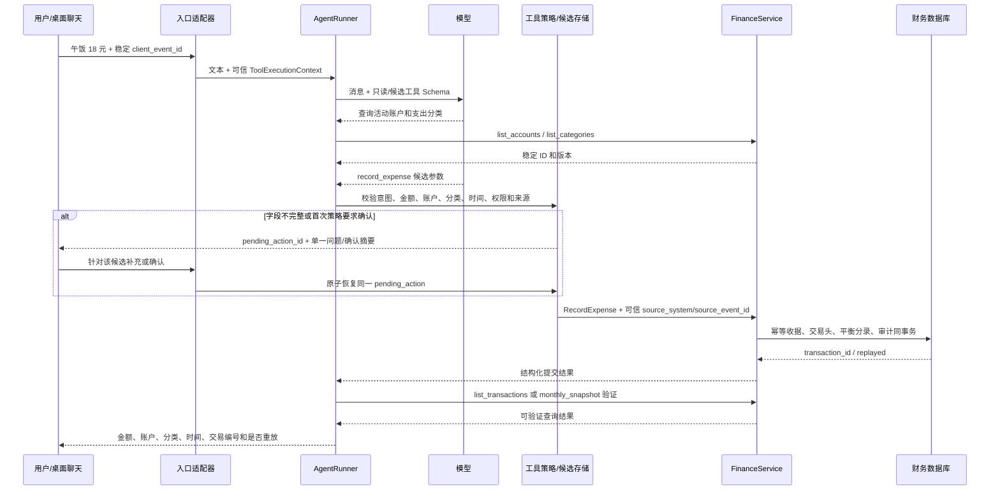

# P2-D5：自然语言财务 Agent 工具技术边界与教学方案

- 任务：`P2-D5`
- 角色：技术顾问
- 文档状态：`review`
- 依据控制版本：`2026-09-16T21:24:36+08:00`
- 官方资料核对日期：2026-09-16
- 数据边界：只使用虚拟示例，不包含真实账目、账号、消息或密钥

本文为头脑风暴总控冻结 P2 接口提供建议，不代表 P2 工具、Agent 状态、FastAPI 财务端点或微信记账已经实现。当前控制文件仍把 P1-C4-R2 记为 `ready`；与此同时，C4 报告已经追加 R2 证据，三个 SQLite 缺陷复验通过，8 个 PostgreSQL 项仍受环境阻塞。总控尚未把新证据同步为验收结论，因此本文复用冻结的 `P1-IF-001` 和实际代码接口，但不把 R1/R2 写成总控已经完成验收。

## 1. 推荐结论

P2 首选以下路线：

1. 继续使用当前可阅读的 Python `AgentRunner` 和 `ToolRegistry`，先扩展为显式、可测试的财务工具循环，不立即引入 LangGraph。
2. Agent 与 `FinanceService` 保持同一 Python 模块化单体进程。工具适配器直接调用同步服务；模型调用、确认等待和数据库事务彼此分开，绝不在等待模型或用户时持有数据库事务。
3. 模型只负责识别意图、提出候选字段、选择受信工具和解释结构化结果。金额解析、整数分转换、余额、预算、退款比例、事务和幂等全部由程序完成。
4. 模型参数和可信执行上下文严格分离。`source_system`、`source_event_id`、身份、权限、接收时间和确认授权由入口适配器注入，模型不能生成或覆盖。
5. P2-A 先交付桌面端稳定来源事件下的单笔支出纵向切片，以及账户、分类、余额、交易和月度快照查询。P2-B 再开放收入、转账和退款写工具。
6. 查询工具可以直接执行。简单写入只有在意图明确、字段完整、来源 ID 可信、权限满足且策略允许时才直接提交；转账和退款首期必须二次确认。
7. 缺字段或多义表达进入持久化 `pending_action`，返回待补充或待确认状态。确认是服务端状态转换，不能接受模型自行传入 `confirmed=true`。
8. 桌面端每次用户提交生成并在重试中复用稳定 UUID。当前 OpenClaw 命令上下文没有可信微信来源消息 ID，因此微信首期不得直接记账；随机 invocation UUID、会话 ID、发送者 ID、消息文本摘要和工具调用 ID都不能冒充微信事件 ID。
9. 微信若暂时无法取得稳定事件 ID，只允许查询，或使用“候选记录 → 明确候选编号确认 → 原子提交”的降级路径。该路径避免同一候选重复入账，但没有解决微信原始消息级去重，文档和测试必须保留这一限制。
10. LangGraph 等到确实需要跨重启、多日暂停、多个可编辑恢复点或复杂分支时再引入。即使使用 LangGraph，财务写入仍必须依赖 `FinanceService` 的事务和数据库幂等。

## 2. 当前真实代码基线

| 能力 | 当前代码位置 | 已有行为 | P2 缺口 |
| --- | --- | --- | --- |
| 模型适配 | `src/wife_system/agent/providers.py` 的 `DeepSeekProvider` | 把中立消息和工具 JSON Schema 发给 DeepSeek，解析工具调用 | 没有持久会话、使用量记录或受控重试 |
| 工具循环 | `src/wife_system/agent/loop.py` 的 `AgentRunner.run()` | 同步执行；默认最多 4 个模型轮次；拒绝未知工具、坏参数、重复调用和空响应 | 工具异常被折叠成 `tool_error`；没有 `paused` 状态、确认恢复或持久执行记录 |
| 工具注册 | `src/wife_system/tools.py` 的 `Tool`/`ToolRegistry` | Pydantic 生成 JSON Schema，执行前 `model_validate()`，工具名称白名单 | handler 只接收模型参数，没有可信 `ToolExecutionContext` 和权限策略 |
| HTTP/JSON | `src/wife_system/api/app.py`、`api/schemas.py` | 健康检查和阶段 0 探针；统一 409/422/500 安全错误 | 没有 Agent 运行、恢复或财务 API |
| 财务输入 | `src/wife_system/finance/schemas.py` | 严格 Pydantic 命令；金额只接受字符串；时间必须带时区 | 这些是确定性业务命令，不应直接当自然语言候选状态 |
| 财务写入 | `src/wife_system/finance/service.py` | 收入、支出、转账、退款等同步方法；一个命令一个 `Session.begin()` | 尚未包装为 Agent 工具，也没有 Agent 确认策略 |
| 财务查询 | 同文件的 `list_accounts()`、`list_categories()`、`account_balance()`、`list_transactions()`、`monthly_snapshot()` | 返回确定性 DTO 和整数分结果 | 工具层需要限制返回范围、稳定分页/截断语义和权限 |
| 财务幂等 | 同文件的 `_claim()`、`_execute()` | HMAC 来源摘要、请求指纹、同事务回执；同键重放或冲突 | 上游必须提供真实稳定 `source_event_id`；Agent 的进程内 `request_id` 不能替代 |
| OpenClaw 桥接 | `integrations/openclaw/src/index.ts` | 命令使用随机 invocation UUID；Agent 工具使用宿主 `toolCallId` | 命令上下文没有可信来源消息 ID，微信事件级幂等未解决 |

需要保留四个不同编号的含义：

| 编号 | 用途 | 能否用作财务来源幂等键 |
| --- | --- | --- |
| `agent_run_id` | 一次 Agent 执行和事件关联 | 不能，除非它由稳定入口事件一对一确定并在重试复用；当前是运行标识 |
| `tool_call_id` | 模型一次工具调用的协议关联 | 只能防同一工具调用的传输重试，不能代表微信消息 |
| `pending_action_id` | 待补充/待确认候选的服务端身份 | 可以派生该候选最终提交的稳定键 |
| `transaction_id` | 财务服务提交后的不可变业务结果 | 是结果，不是请求去重键 |

## 3. 两种实现方案

### 3.1 方案 A：扩展现有小型循环和显式状态机

在现有 `AgentRunner`、`ToolRegistry` 和 `FinanceService` 之间增加：

- `ToolExecutionContext`：可信来源、权限、接收时间和确认信息；
- 财务工具适配器：Pydantic 工具输入到财务命令的确定性映射；
- `WritePolicy`：决定直接提交、追问、确认或拒绝；
- `PendingActionStore`：持久化候选、缺失字段、状态、过期时间和已提交结果；
- 安全的工具结果联合类型和 `paused` 运行状态。

优点是能逐行理解 Function Calling 和业务执行的区别，复用现有测试充分的小循环，新增依赖少，错误和事务边界清楚。代价是暂停恢复、会话状态和执行记录需要自行定义。

**P2 推荐方案 A。** 当前首个纵向切片只有一次解析、零到数次只读查询、一次补充/确认和一次确定性提交，显式状态机足够，也最适合用户学习底层原理。

### 3.2 方案 B：LangGraph 持久化图和 interrupt

把“解析 → 查询 → 候选 → 补充/确认 → 提交 → 验证”建成图节点，用 checkpointer 保存 thread 状态，用 `interrupt()` 暂停并由 `Command(resume=...)` 恢复。

优点是框架直接提供检查点、暂停恢复、状态检查和较复杂的分支编排。代价是新增图、checkpoint、thread 和序列化概念；恢复时节点会从头重新执行，因此中断前副作用仍必须幂等；框架不能替代财务事务、来源事件去重或权限策略。

满足以下任意两项并有测试证据时，再正式比较引入 LangGraph：

- 一个工作流有三个以上可持久化暂停/恢复点；
- 用户需要隔天或服务重启后继续同一评估；
- 同时存在确认、编辑、驳回、重新取数和超时分支；
- 多个步骤需要独立重试、回放和状态检查；
- 自建状态机的恢复缺陷或维护成本已经可测量。

LangGraph 可以替换编排层，不能进入 `finance/` 领域和持久化核心。工具输入输出、`FinanceService` 调用和幂等键语义必须保持框架无关。

## 4. P2-A 最小纵向切片

虚拟输入：`午饭 18 元`。



具体规则：

1. 入口验证身份和渠道，把桌面 `client_event_id` 绑定为可信事件；原消息不成为工具参数。
2. 模型提取 `amount="18.00"` 和支出意图，但不能自己计算 `1800` 分。
3. 工具层用程序查询当前活动账户与支出分类，只接受查询返回的 UUID，不接受模型虚构名称直接落库。
4. 若没有唯一默认账户、没有确定分类或策略尚未获得简单写入授权，保存候选并只问最小必要问题，例如“使用虚拟电子账户并归入餐饮吗？”
5. 时间没有明说时，可以使用入口的可信 `received_at` 作为“刚刚发生”的候选；回执必须展示最终时间。延期消息、导入内容或含日期词的消息不能无条件使用接收时间。
6. 提交时才构造 `finance.schemas.RecordExpense`。`FinanceService` 解析金额、生成平衡分录、执行事务和持久化幂等。
7. 回执只能依据工具返回值生成，至少包含 18.00 CNY、账户、分类、发生时间、`transaction_id`、`replayed` 和纠错入口。
8. 提交后用确定性查询验证交易存在；模型不能仅根据自己刚才的文本宣称成功。

P2-A 限制为一个来源事件最多提交一个财务写命令。`午饭 18，打车 12` 先拆成两个候选并要求批量确认，真正的批量原子写入和稳定子事件编号延期到 P2-C，不能把同一个 `source_event_id` 连续用于两笔命令。

## 5. 工具清单与阶段边界

工具名称使用 `finance_` 前缀，模型只能看到当前身份有权使用的子集。

| 工具 | 类型 | 首期 | FinanceService 映射 | 权限 | 说明 |
| --- | --- | --- | --- | --- | --- |
| `finance_list_accounts` | 读 | P2-A | `list_accounts()` | `finance:read` | 只返回活动账户，供解析稳定 ID |
| `finance_list_categories` | 读 | P2-A | `list_categories()` | `finance:read` | 可按 income/expense 筛选 |
| `finance_get_account_balance` | 读 | P2-A | `account_balance()` | `finance:read` | 程序返回整数分，模型不重算 |
| `finance_list_transactions` | 读 | P2-A | `list_transactions(start,end)` | `finance:read` | 时间范围受限，返回稳定排序和截断标志 |
| `finance_get_monthly_snapshot` | 读 | P2-A | `monthly_snapshot()` | `finance:read` | 消费前评估和预算解释的唯一汇总事实来源 |
| `finance_record_expense` | 写 | P2-A | `record_expense()` | `finance:write` | 首个纵向切片；至多一账户一分类 |
| `finance_record_income` | 写 | P2-B | `record_income()` | `finance:write` | 与支出共用确认和幂等协议 |
| `finance_record_transfer` | 写 | P2-B | `record_transfer()` | `finance:transfer` | 首期始终二次确认，两个账户必须不同 |
| `finance_record_refund` | 写 | P2-B | `record_refund()` | `finance:refund` | 必须选择原支出；不能由模型改退款分类 |

延期工具：拆分收支、冲销、账户/分类创建归档、活动模板与发生、收入安排、预算发布、Markdown 导入、代付/报销、分期、外汇、投资交易。现有 `FinanceService` 已有部分确定性能力不等于都应立即暴露给模型。

消费前评估首期只调用查询工具，输出 `as_of`、预算版本、净支出、剩余额度和缺失信息。它不能自动创建预算、记账或发起投资交易。

## 6. Pydantic 工具契约

### 6.1 可信上下文不属于模型参数

```python
class ToolExecutionContext(BaseModel):
    model_config = ConfigDict(extra="forbid", frozen=True)

    agent_run_id: UUID
    actor_id: UUID
    source_system: Literal["desktop_chat", "wechat_openclaw"]
    source_event_id: str | None
    received_at: datetime
    conversation_id: UUID
    permissions: frozenset[str]
    pending_action_id: UUID | None = None
    approval_grant_id: UUID | None = None
```

该对象由桌面入口或渠道适配器构造，不能出现在发给模型的 JSON Schema 中。日志不记录原始 `source_event_id`、用户消息或 `actor_id`；需要关联时使用内部随机关联 ID或受控摘要。

### 6.2 模型可见输入

以下是建议冻结的字段形状；所有模型均 `extra="forbid"`，金额使用严格字符串。

```python
MoneyText = Annotated[StrictStr, Field(min_length=1, max_length=32)]


class ListAccountsInput(BaseModel):
    model_config = ConfigDict(extra="forbid")


class ListCategoriesInput(BaseModel):
    model_config = ConfigDict(extra="forbid")
    kind: Literal["income", "expense"] | None = None


class GetAccountBalanceInput(BaseModel):
    model_config = ConfigDict(extra="forbid")
    account_id: UUID
    as_of: datetime | None = None


class ListTransactionsInput(BaseModel):
    model_config = ConfigDict(extra="forbid")
    start: datetime | None = None
    end: datetime | None = None
    limit: int = Field(default=20, ge=1, le=50)


class GetMonthlySnapshotInput(BaseModel):
    model_config = ConfigDict(extra="forbid")
    period: str = Field(pattern=r"^\d{4}-(0[1-9]|1[0-2])$")
    as_of: datetime | None = None
    account_ids: list[UUID] = Field(default_factory=list, max_length=20)
    category_ids: list[UUID] = Field(default_factory=list, max_length=50)


class RecordExpenseToolInput(BaseModel):
    model_config = ConfigDict(extra="forbid")
    amount: MoneyText | None = None
    account_id: UUID | None = None
    category_id: UUID | None = None
    occurred_at: datetime | None = None


class RecordIncomeToolInput(RecordExpenseToolInput):
    pass


class RecordTransferToolInput(BaseModel):
    model_config = ConfigDict(extra="forbid")
    amount: MoneyText | None = None
    source_account_id: UUID | None = None
    destination_account_id: UUID | None = None
    occurred_at: datetime | None = None


class RecordRefundToolInput(BaseModel):
    model_config = ConfigDict(extra="forbid")
    amount: MoneyText | None = None
    original_transaction_id: UUID | None = None
    destination_account_id: UUID | None = None
    occurred_at: datetime | None = None
```

可空写字段用于生成候选和统一返回 `needs_input`，不表示 `FinanceService` 可以接收缺字段。真正提交前必须构造现有严格的 `RecordExpense`、`RecordIncome`、`RecordTransfer` 或 `RecordRefund`。

所有 datetime 输入都必须包含时区；适配器统一转换为 UTC，业务日期解释使用 Asia/Shanghai。查询默认值来自可信 `received_at`，不允许模型用本机当前时间代替入口时间。

### 6.3 统一输出联合类型

```python
class ToolError(BaseModel):
    code: str
    message: str
    retryable: bool


class CommittedWrite(BaseModel):
    status: Literal["committed"]
    result_type: str
    result_id: UUID
    replayed: bool
    amount_minor: int
    currency: Literal["CNY"]


class NeedsInput(BaseModel):
    status: Literal["needs_input"]
    pending_action_id: UUID
    missing_fields: list[str]
    question_code: str
    choices: list[dict[str, str]] = Field(default_factory=list)


class NeedsConfirmation(BaseModel):
    status: Literal["needs_confirmation"]
    pending_action_id: UUID
    confirmation_code: str
    summary: dict[str, str]


class FailedTool(BaseModel):
    status: Literal["error"]
    error: ToolError


WriteToolOutput = Annotated[
    CommittedWrite | NeedsInput | NeedsConfirmation | FailedTool,
    Field(discriminator="status"),
]
```

`confirmation_code` 是用户可见的短关联码，不是授权令牌；真正的 `approval_grant_id` 由服务端根据用户回复生成并注入可信上下文。

建议的只读输出形状：

```python
class AccountsOutput(BaseModel):
    status: Literal["ok"] = "ok"
    items: list[AccountView]
    as_of: datetime


class CategoriesOutput(BaseModel):
    status: Literal["ok"] = "ok"
    items: list[CategoryView]
    as_of: datetime


class AccountBalanceOutput(BaseModel):
    status: Literal["ok"] = "ok"
    account_id: UUID
    balance_minor: int
    currency: Literal["CNY"] = "CNY"
    as_of: datetime


class TransactionsOutput(BaseModel):
    status: Literal["ok"] = "ok"
    items: list[TransactionView]
    truncated: bool
    start: datetime
    end: datetime


class MonthlySnapshotOutput(BaseModel):
    status: Literal["ok"] = "ok"
    snapshot: MonthlySnapshot
```

这些输出模型同样使用 `extra="forbid"`；为节省篇幅不重复每个类的 `model_config`。

每个工具的输出映射：

| 工具 | 输出模型 | 关键字段 |
| --- | --- | --- |
| `finance_list_accounts` | `AccountsOutput` | `items: list[AccountView]`、`as_of` |
| `finance_list_categories` | `CategoriesOutput` | `items: list[CategoryView]`、`as_of` |
| `finance_get_account_balance` | `AccountBalanceOutput` | `account_id`、`balance_minor`、`currency`、`as_of` |
| `finance_list_transactions` | `TransactionsOutput` | `items: list[TransactionView]`、`truncated`、`start`、`end` |
| `finance_get_monthly_snapshot` | `MonthlySnapshotOutput` | 直接包装现有 `MonthlySnapshot`，保留 `budget_version_id` 与 `as_of` |
| 四个写工具 | `WriteToolOutput` | 提交、待补充、待确认或安全错误四种状态 |

工具输出保留整数分；若需要 `18.00 CNY` 展示字符串，由公共 `format_minor()` 程序生成。模型可以解释，不负责金额换算、求和或剩余额度计算。

## 7. 稳定错误与映射

### 7.1 Agent/策略层新增错误

| 错误码 | 产生位置 | 可重试 | 行为 |
| --- | --- | --- | --- |
| `permission_denied` | 工具授权 | 否 | 不执行工具，不向模型暴露隐藏工具 |
| `source_event_id_unavailable` | 写入策略 | 否 | 禁止直接写，转候选确认或只读降级 |
| `confirmation_required` | 写入策略 | 否 | 返回 `needs_confirmation`，不是异常堆栈 |
| `missing_required_context` | 入口/策略 | 否 | 身份、时区或接收时间缺失时停止 |
| `ambiguous_reference` | 候选解析 | 否 | 返回候选选项，不猜账户、分类或原交易 |
| `pending_action_not_found` | 恢复 | 否 | 候选不存在或不属于当前身份 |
| `pending_action_expired` | 恢复 | 否 | 重新生成候选，不提交旧内容 |
| `pending_action_stale` | 恢复 | 是 | 账户/分类版本或事实变化，重新查询并确认 |
| `write_limit_exceeded` | 运行策略 | 否 | P2-A 一个来源事件超过一个写入时暂停 |

现有循环错误 `unknown_tool`、`invalid_tool_arguments`、`duplicate_tool_call`、`empty_model_response`、`max_model_turns_exceeded` 和模型错误继续保留。

### 7.2 财务层错误

适配器原样保留 `FinanceError.code` 与 `retryable`，但使用产品安全文案，不能把数据库异常传给模型。至少覆盖：

- `validation_error`、`invalid_amount_precision`、`amount_out_of_range`、`unsupported_currency`；
- `not_found`、`archived_resource`；
- `invalid_transaction_relation`、`refund_exceeds_original`；
- `duplicate_request_conflict`、`concurrent_modification`；
- `database_unavailable`、`persistence_error`。

当前 `AgentRunner` 捕获所有普通工具异常并返回通用 `tool_error`。P2 应让财务工具 handler 返回 `FailedTool`，或增加只接受受信异常类型的映射器；不能把任意异常正文放入工具结果。

## 8. 写入确认、追问和恢复

### 8.1 可以直接提交

同时满足以下条件，且用户已在产品设置中启用“简单单笔直接记账”时，单笔收入或支出可以直接提交：

- 文本是明确已发生的记录意图，不是计划、询问、估计或条件句；
- 金额是精确正数 CNY 字符串；
- 一个活动账户和一个正确类型分类已经通过数据库查询确定；
- 发生时间来自明确表达，或允许使用可信接收时间；
- 入口提供可信、重试时稳定的 `source_event_id`；
- 当前身份具备写权限；
- 没有多个候选、纠错、拆分、异常高额阈值或策略冲突。

没有保存这项用户设置时，第一次完整候选仍需确认。模型自称“置信度高”不能代替上述确定性条件。

### 8.2 必须追问

- 金额缺失、范围表达、单位不明或“十八左右”；
- 没有默认账户，或多个账户都可能匹配；
- 分类不存在、存在多个相近分类，或模型只猜到自然语言名称；
- “昨天”“上周”等时间无法相对可信接收时间唯一解析；
- “改一下刚才那笔”“退了”无法唯一定位原交易；
- 一条消息包含多笔记录，且 P2-A 尚未实现批量确认；
- 话语可能只是计划或询问，例如“午饭大概 18 合适吗”。

一次只问能最大减少不确定性的一个问题，并附数据库返回的少量选项。不能让模型自由编造账户或分类。

### 8.3 必须二次确认

- P2-B 的所有转账和退款；
- 拆分、多笔批量、冲销或纠错；
- 超过应用配置阈值的金额；
- 发生时间在未来或明显远离消息接收时间；
- 分类由推测得出而不是用户明确选择；
- 查询发现余额、预算版本或原交易在候选形成后发生变化。

确认摘要要显示操作类型、金额、币种、账户、分类或原交易、发生时间和候选编号。只接受针对该候选的确认，不接受模型在工具参数中设置布尔值绕过。

### 8.4 状态机

```text
draft -> needs_input -> needs_confirmation -> committing -> committed
   |          |                |                |
   +--------> cancelled <------+-----------> failed
                     \-----------> expired
```

`pending_action` 最少保存：内部 UUID、actor、conversation、动作类型、规范化候选载荷、缺失字段、形成候选时引用的账户/分类版本、状态、创建/过期时间、批准记录和最终 `result_id`。不保存完整提示词、原始微信消息、模型思维过程或密钥。

恢复规则：

1. 用户回复必须先绑定同一 actor 与 conversation。
2. 若只有一个活动候选，可用短确认词恢复；若有多个候选，必须带候选编号。
3. 补充字段后重新执行完整 Pydantic、权限和业务预检。
4. 提交通过数据库条件更新把状态从 `needs_confirmation` 改为 `committing`；只有一个调用者成功。
5. 财务 `source_event_id` 对确认路径派生为 `pending:{pending_action_id}:commit`。重复确认调用同一 FinanceService 命令并取得 `replayed=true`。
6. 服务崩溃后，`committing` 候选先按该幂等键查询/重放，不生成新键。

## 9. 桌面与微信来源幂等

### 9.1 桌面入口

桌面客户端在用户点击发送时生成 UUID `client_event_id`，同一次提交的网络重试必须复用它。后端认证身份后注入：

```text
source_system = "desktop_chat"
source_event_id = client_event_id
```

客户端不得自行选择 `source_system`，服务端还要限制事件 ID 长度和格式。P2 是单用户自用范围；将来多用户化时，幂等唯一范围必须加入账本/actor 作用域，不能直接沿用当前单用户假设。

### 9.2 微信/OpenClaw 当前事实

当前 OpenClaw 2026.8.2 命令上下文包含 sender、account、session 和 command body，但没有经项目验证的来源消息事件 ID：

- 随机 invocation UUID 每次 handler 都不同，不能识别平台重投；
- `toolCallId` 只标识一次模型工具调用，不能证明同一微信消息跨运行稳定；
- session/thread/sender 不是事件身份，多个消息会共享；
- 消息正文或正文哈希会把两次真实相同消费误判为重复，也会因空格、错别字或模型改写漏判；
- 账号、发送者或原消息不应进入幂等键或日志。

因此首选解决方式是让可信渠道适配层提供平台稳定事件 ID，并通过不受模型控制的上下文传入。在此之前：

1. 微信查询可以运行，因为重复查询没有写副作用。
2. 微信写入只能生成 `pending_action`，不能由首条消息直接提交。
3. 用户针对候选编号确认后，使用候选派生键原子提交；重复确认同一候选只产生一笔交易。
4. 重复微信原消息仍可能生成多个待确认候选。系统必须合并显示或要求选择，不能把它们称为已经去重；存在多个候选时，裸“确认”不得提交任何一个。

这是一条安全降级路径，不是微信事件级幂等的完成证明。

## 10. Agent 循环复用与扩展

### 10.1 保留能力

- `ModelProvider` 协议和 `DeepSeekProvider` 薄适配层；
- `Tool` 从 Pydantic 生成 JSON Schema、`ToolRegistry` 白名单；
- 默认最多 4 个模型轮次和单次模型超时；
- 未知工具、坏参数、重复工具调用和空响应的停止条件；
- 不包含提示词、密钥和原始结果的轻量 `ExecutionEvent`。

### 10.2 必须增加

1. `AgentRunner.run()` 接受可信 `RunContext`，不能只接收 `user_message/request_id`。
2. `Tool.invoke()` 接受模型参数与独立的 `ToolExecutionContext`。
3. `RunStatus` 增加 `paused`；结果包含 `pending_action_id` 和稳定 `pause_reason`。
4. 系统提示明确：模型不能计算金额、生成来源 ID、声称未返回的成功、调用隐藏工具或把计划当账目。
5. 写工具提交计数 P2-A 上限为 1；只读工具可多次调用，但总工具调用数需要独立上限，例如 8。
6. 财务安全错误以结构化工具结果返回；未知异常继续统一为 `tool_error`。
7. 持久化执行记录保存 run 状态、工具名、开始/结束时间、结果类型、错误码、模型/版本和 token/成本摘要；不保存原始私密正文和完整工具载荷。
8. 进程内 `_completed` 只作为 Agent 运行优化。财务正确性只依赖 `FinanceService` 的数据库幂等。

### 10.3 重试和停止

- 模型请求：仅对官方标记可重试的超时、限流和临时不可用做最多 1 次有界退避；认证、余额不足、请求格式和无效响应不重试。
- 工具参数错误、未知工具、权限拒绝和重复调用：立即停止当前 run，不让模型反复试探权限边界。
- `database_unavailable`：停止并返回可重试错误；调用方以同一来源事件重试。
- `concurrent_modification`：本轮停止，重新查询后形成新候选；不在旧确认上静默覆盖。
- 工具提交成功后模型最终回答失败：不能重做业务写入。用同一来源键读取重放结果，再生成回执。
- 达到模型轮次、工具次数或写入次数上限：稳定停止，不给“可能已经成功”的模糊文本。

DeepSeek 官方的 Tool Calls 流程是模型返回函数名和参数，应用执行函数并把结果作为 tool message 送回模型；模型本身不执行函数。当前项目代码已经遵循这个分工。DeepSeek `strict` 模式仍是 Beta，且其 JSON Schema 子集有限；P2 不把 Beta strict 当唯一防线，始终使用本地 Pydantic 再校验。

## 11. FastAPI 与进程边界

### 11.1 首选：同进程直接调用

数据流：

```text
桌面/渠道 HTTP -> FastAPI Agent 路由 -> AgentRunner
              -> 财务工具适配器 -> FinanceService -> SQLAlchemy -> 数据库
```

理由：

- 当前 `FinanceService` 已是与 FastAPI 无关的同步 Python 应用服务；
- 直接调用保留 Pydantic 类型和 `FinanceError`，不重复设计内部 HTTP 契约；
- 一个部署单元更容易学习、调试事务和关联事件；
- 避免内部网络失败、服务身份认证、重试和分布式追踪成本。

建议 Agent FastAPI 路由使用普通 `def`，让 FastAPI 在线程池中运行同步 Agent/数据库链；每次工具提交由 `FinanceService` 自己创建短 Session。模型网络调用期间没有数据库 Session。若模型调用显著变慢，先把整个 Agent run 交给受控任务执行器，不要把同步 Session 跨线程共享。

### 11.2 替代：内部 HTTP 财务服务

只有出现以下条件再拆分：

- Agent 和财务服务需要独立部署或独立扩缩容；
- 多种语言客户端必须复用财务服务；
- 团队/权限边界要求单独服务身份；
- 已有可靠的 HTTPS、鉴权、重试、追踪和版本治理。

拆分后仍由财务 HTTP 服务生成事务和幂等结果。Agent 只能传受信入口提供的来源上下文，不能自行生成新幂等键重试。内部 HTTP 的超时不能解释成写入失败，必须用同一键查询或重放。

## 12. 数据库事实、会话状态和记忆

| 信息 | 正确位置 | 规则 |
| --- | --- | --- |
| 账户、分类、账目、预算、收入安排 | 财务关系数据库 | 唯一业务事实来源；只通过确定性服务修改 |
| 待补充/待确认候选 | `pending_action` 持久化表 | 有状态、版本、过期和最终结果；不是已入账事实 |
| Agent 短期对话状态 | run/checkpoint 存储 | 可删除和过期；不能覆盖财务事实 |
| 明确偏好，如默认账户 | 结构化 preference 存储 | 记录来源、确认状态、版本、有效期和删除入口 |
| 常用活动 | 现有活动模板及修订 | 参考金额不是实际消费 |
| 模型推测 | 仅候选/临时上下文 | 标为推测，不自动持久化为偏好或事实 |
| 网页/搜索证据 | 独立证据记录 | 保存来源和时间，不混入账本字段 |

用户纠正偏好时创建新版本或更新结构化偏好并记录原因；用户删除记忆时删除/归档偏好和会话状态，不删除依法或产品规则保留的不可变财务事实。向量记忆/RAG 延期，关系账目不能通过相似度检索决定余额或预算。

## 13. 安全与产品风险

1. **提示注入**：用户消息、导入文件和搜索结果都是数据，不能改变系统提示、工具白名单、权限或确认策略。
2. **越权写入**：模型只看到当前权限允许的工具；服务端在每次调用再次校验 actor、工具权限和资源归属。
3. **重复消息**：财务服务必须收到稳定来源键；缺微信事件 ID 时禁止直接写入，保留未解决限制。
4. **错误分类**：模型只能提出候选；数据库 UUID、分类 kind 和归档状态由工具查询与 FinanceService 校验。
5. **模型幻觉**：未知账户、分类、交易 ID 必须 `not_found`，不能自动创建替代对象或宣称成功。
6. **金额错误**：模型不做小数换分、加总、退款比例或余额计算；工具输出和回执来自确定性程序。
7. **敏感日志**：不记录原消息、完整工具参数、账号、原来源 ID、密钥、模型思维过程或数据库异常正文。
8. **确认绕过**：`confirmed=true`、提示词中的“用户已同意”和模型自报置信度都不是授权；只接受服务端 approval grant。
9. **过时快照**：消费评估必须展示 `as_of` 与 `budget_version_id`；确认前事实变化时使候选 stale。
10. **消费建议边界**：明确区分账本事实、预算规则和建议；数据不足时说明缺口，不承诺生活保障或收益。
11. **投资教学边界**：首期只做知识解释和情景模拟，不提供交易工具，不代表持牌投资建议，不代用户下单。
12. **框架重放**：未来 LangGraph 恢复会重新执行节点，所有副作用节点仍必须使用稳定幂等键。

## 14. 建议目录、所有权和阶段

以下均为冻结后建议创建或调整的位置，当前尚未实现：

```text
src/wife_system/
├── agent/
│   ├── context.py              # RunContext / ToolExecutionContext
│   ├── loop.py                 # 扩展现有有界循环和 paused 状态
│   ├── policy.py               # 写入、确认、权限和一次一写策略
│   ├── pending.py              # 候选状态机端口
│   ├── finance_tools.py        # 工具输入/输出和 FinanceService 适配
│   ├── prompts.py              # 版本化系统提示
│   └── events.py               # 脱敏执行事件
├── api/
│   ├── agent_routes.py         # run/resume/status HTTP 边界
│   └── agent_schemas.py
└── finance/                    # 复用 P1，不让 Agent 逻辑进入此层

migrations/versions/            # pending_action / agent_run 所需迁移
tests/agent_finance/             # 执行方单元、组件和 SQLite 冒烟
tests/independent/agent_finance/ # 测试智能体独立场景
```

文件所有权建议：

- 未来 P2 执行智能体：`src/wife_system/agent/**`、分配的 `api/**`、新迁移、`tests/agent_finance/**` 和运行说明；不得修改独立测试。
- 测试智能体：`tests/independent/agent_finance/**` 和独立报告；未经返修授权不得修改产品代码。
- 技术顾问：只读代码并讲解；架构变化回到总控冻结。
- 总控：冻结工具名、Schema、错误、确认策略、文件所有权和验收；只有总控能给最终项目结论。

阶段建议：

1. **P2-A**：可信桌面事件、五个只读工具、单笔支出、显式候选状态、脚本化模型测试。
2. **P2-B**：收入、转账、退款；二次确认、过期/stale、服务重启恢复。
3. **P2-C**：批量候选和一条消息多笔交易的稳定子操作 ID；仍不加入延期财务类型。
4. **P2-W**：只有渠道提供稳定消息事件 ID 后才开放微信直接写；此前保持查询/候选确认降级。
5. **P2-LG（条件阶段）**：用实际恢复需求和场景评测比较显式状态机与 LangGraph，再决定迁移编排层。

## 15. 验收场景

总控应把以下场景与测试智能体的矩阵合并后冻结：

1. 桌面虚拟“午饭 18 元”字段完整时只产生一笔支出，并能查询验证。
2. 同一桌面事件同载荷重试返回同一交易且 `replayed=true`。
3. 同一来源事件不同载荷返回 `duplicate_request_conflict`。
4. 缺账户、分类、金额或时间时数据库没有交易，只返回一个最小问题。
5. 多个相似账户/分类时返回候选，不让模型猜 UUID。
6. “午饭大概 18”“准备吃午饭”不直接入账。
7. 发生时间的默认和相对日期按 Asia/Shanghai 可解释，回执展示最终值。
8. 未授权身份看不到或不能执行写工具。
9. 一次运行第二个写调用被 `write_limit_exceeded` 阻止。
10. 转账和退款没有 approval grant 时只能进入待确认。
11. 退款原交易不存在、不是支出或金额超限时使用冻结财务错误。
12. 重复确认同一 `pending_action` 只提交一次；并发确认只有一个状态转换成功。
13. 候选过期、资源归档或版本变化后不能按旧内容提交。
14. 模型返回未知工具、坏 UUID、额外字段、重复调用或超过轮次时稳定停止。
15. 模型超时、限流、无效响应和数据库不可用不生成虚假成功回执。
16. 写入已成功但最终自然语言生成失败时，重试不会重复记账。
17. 月度查询返回的金额、退款、转账和预算版本与 `FinanceService` 快照完全一致。
18. 日志 canary 验证消息、金额参数、账号、来源 ID、密钥和数据库正文不泄露。
19. 服务重启后待确认候选可恢复，已提交候选返回原结果。
20. OpenClaw 缺稳定消息 ID 时，首条微信文本不能直接写；重复原消息只会产生需处理的候选问题，报告明确消息级去重未完成。

P1-C4-R2 报告已给出三个缺陷修复通过的独立证据，但控制面尚未同步验收状态。P2 可以对 Agent 适配层使用隔离 SQLite 和脚本化 FinanceService，最终集成基线仍必须绑定总控正式接受的 P1 快照。8 个 PostgreSQL 风险不能由 P2 Agent 测试代替。

## 16. 教学地图

| 顺序 | 知识 | 当前真实代码入口 | P2 将来入口 | 用户掌握证据 |
| --- | --- | --- | --- | --- |
| 1 | HTTP 与 JSON 边界 | `api/app.py:create_probe()`、`integrations/openclaw/src/client.ts` | `api/agent_routes.py` | 能区分 HTTP 成功、业务成功和安全错误 |
| 2 | Pydantic 校验与 JSON Schema | `tools.py:Tool.schema()/invoke()`、`finance/schemas.py` | `agent/finance_tools.py` | 能解释模型参数为何仍要本地校验 |
| 3 | Function Calling | `agent/providers.py:DeepSeekProvider.complete()` | 财务工具 Schema | 能说明模型提出调用、程序执行函数 |
| 4 | 工具执行循环 | `agent/loop.py:AgentRunner._run_uncached()` | 扩展后的 context/policy | 能定位未知工具、重复调用、最大轮数和停止位置 |
| 5 | 候选、追问与确认 | 当前尚无 | `agent/pending.py`、`policy.py` | 能画出 draft 到 committed 的状态转换 |
| 6 | 事务 | `finance/service.py:_execute()` | 工具适配器直接复用 | 能解释为什么模型等待期间不能持有 Session |
| 7 | 幂等 | `finance/service.py:_claim()`、阶段 0 进程缓存 | 入口事件到财务命令的来源映射 | 能区分 run ID、tool call ID、source event ID 和 transaction ID |
| 8 | 记忆与事实 | P1 ORM 与快照 | pending/preference/checkpoint | 能判断账户、偏好、推测和网页证据该放哪里 |
| 9 | 框架取舍 | 当前显式小循环 | LangGraph 条件实验 | 能说明 checkpointer 为何不能替代业务幂等 |

### 用户亲手练习

练习名称：**给现有循环增加一个只读账户余额工具**。

在 P2-A 实现稳定后，用户在独立练习范围完成：

1. 定义 `GetAccountBalanceInput(account_id, as_of=None)`，禁止额外字段。
2. handler 只调用 `FinanceService.account_balance()`，返回 `balance_minor`、`currency` 和实际 `as_of`。
3. 注册 `finance_get_account_balance`，让 `ScriptedModelProvider` 先调用工具再生成文字答复。
4. 增加四个检查：合法 UUID、坏 UUID/多余字段、未知账户、同一查询重复执行不产生任何财务写入。
5. 用自己的话解释：模型选择账户余额工具，Pydantic 验证 UUID，FinanceService 查询账本，模型只负责把结构化余额解释给用户。

建议未来位置：

- `src/wife_system/agent/finance_tools.py`：Schema 与 handler；
- `src/wife_system/agent/loop.py`：只读工具执行路径；
- `tests/agent_finance/test_balance_tool.py`：练习测试；
- 教学代码检查子任务：只检查练习范围和上述四项证据，不替项目测试智能体作独立验收。

## 17. 建议总控冻结的项目

建议把以下内容写入 P2 接口冻结：

1. 方案 A：现有小型循环、显式持久候选状态、同进程 `FinanceService`。
2. 九个首批/次批工具的名称、模型参数、统一输出和 FinanceService 映射。
3. `ToolExecutionContext` 永不进入模型 Schema；来源、身份、权限和批准只能由可信入口注入。
4. P2-A 一个来源事件最多一个财务写入；查询不受该计数影响但有总调用上限。
5. 直接写入、追问和二次确认的规则；转账与退款首期必须确认。
6. `pending_action` 状态、过期、stale、并发确认和最终结果语义。
7. 桌面稳定 client event ID；微信无稳定事件 ID 时禁止首条消息直接写。
8. 财务金额与快照只由程序计算，模型不能生成整数分、余额、退款比例或预算结论。
9. 稳定 Agent/策略错误与现有 FinanceError 映射。
10. 默认最多 4 个模型轮次、最多 8 次工具调用和最多 1 次写提交；重试策略有界。
11. 脱敏执行事件和禁止记录字段。
12. 执行/独立测试文件所有权和 P1 接受快照依赖。

仍需总控裁定：

1. “简单单笔直接记账”是默认关闭，还是在用户首次确认后长期启用。技术顾问建议默认关闭，首次明确选择后保存为可撤销偏好。
2. 大额二次确认阈值。技术顾问建议作为用户可配置策略，不把具体生活费金额写进代码；未配置时所有超过单笔安全上限的候选都确认。
3. `pending_action` 默认保留期。技术顾问建议普通记账候选 24 小时，退款/转账候选 30 分钟，过期后重新取数。
4. P2-A 是否新增 Agent FastAPI run/resume 端点，还是先用 Python 服务入口完成组件测试。技术顾问建议先冻结 Python 接口并在同一任务补最薄 HTTP 入口，便于桌面端下一阶段复用。
5. 微信稳定来源 ID 的获取责任和验收版本。技术顾问建议单列渠道任务，不阻塞桌面 P2-A，也不得用随机 UUID 宣称解决。

## 18. 官方依据

- [DeepSeek Tool Calls](https://api-docs.deepseek.com/guides/tool_calls/)：模型提出函数调用，应用负责执行并回传结果；`strict` 仍为 Beta 且使用受限 JSON Schema。
- [Pydantic JSON Schema](https://docs.pydantic.dev/latest/concepts/json_schema/)：`model_json_schema()` 生成模型可用的 JSON Schema；本地执行仍使用 `model_validate()`。
- [Pydantic Models](https://docs.pydantic.dev/latest/concepts/models/)：模型验证和严格数据边界。
- [FastAPI 并发与 async/await](https://fastapi.tiangolo.com/async/)：普通 `def` 路由在外部线程池执行，适合当前同步阻塞链路。
- [LangGraph Interrupts](https://docs.langchain.com/oss/python/langgraph/interrupts)：持久 checkpointer、thread ID、暂停恢复及节点重启语义。
- [LangGraph Persistence](https://docs.langchain.com/oss/python/langgraph/persistence)：checkpoint 的线程状态与 store 的跨线程记忆边界。
