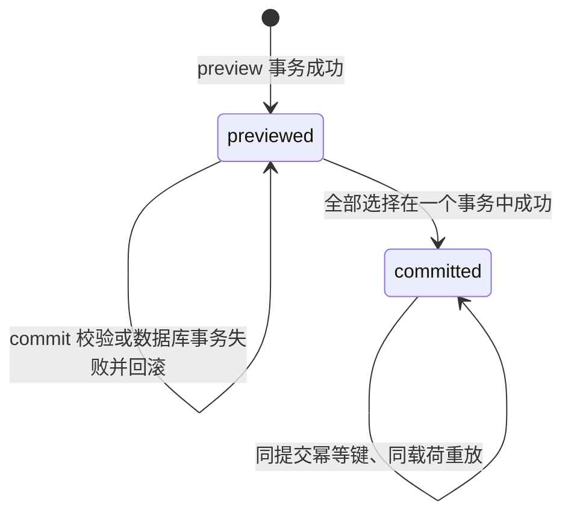

# P3-D7：Markdown 活动导入技术方案

- 任务：`P3-D7`
- 角色：技术顾问
- 状态：`review` 前技术建议；本文不是接口冻结，也不代表已经实现
- 依据总控版本：`2026-09-18T15:20:00+08:00`
- 目标：为 `P3-IF-001` 提供可冻结的数据、API、幂等、事务与安全边界
- 数据边界：文中示例均为虚构数据，不使用真实个人活动或账目

## 1. 结论先行

首版建议采用“离线确定性受限语法 + 持久化最小导入批次/候选 + 一次确认、一个数据库事务”的方案。

| 选择 | 推荐结论 | 首版边界 |
| --- | --- | --- |
| Markdown 解析 | 自定义受限语法的确定性解析器 | 不联网、不调用模型、不安装新解析依赖；超出语法的内容显式返回问题 |
| 预览状态 | 持久化 `activity_import_batch` 与 `activity_import_candidate` | 不保存完整 Markdown、HTML、代码块、链接目标或未采用的自由文本 |
| 活动金额 | 在不可变模板修订上保存可空的最小值和最大值 | 精确金额表示为 `min=max`；不得把范围压成均值或单一事实 |
| 活动组合 | P3 首版不建模 | 组合字段返回 `unsupported_activity_combination`，不能提交为普通活动 |
| API | 预览、读取批次、提交三个端点 | 两个 POST 均要求 `Idempotency-Key`；提交只引用持久候选，不回传可篡改业务字段 |
| 原子提交 | 一个外层 `Session.begin()` 覆盖幂等、批次锁、版本复验、全部模板修订、审计和结果 | 不循环调用会分别开启事务的现有公开 `FinanceService` 方法 |
| 并发 | 批次行锁、模板乐观锁、规范化名称唯一约束 | SQLite 用于快速开发；竞争、锁、唯一性和响应丢失必须在 PostgreSQL 复验 |
| 隐私 | 保存结构化采用结果、HMAC 内容摘要、来源行号和解析器版本 | 原文不落库、不进日志、不发送给模型或外部服务 |

该方案保留现有同步 SQLAlchemy、Pydantic、FastAPI、Alembic 与 `FinanceService` 技术路线，不需要 LangChain、LangGraph、RAG 或模型结构化提取。

## 2. 现状与差距

### 2.1 可以直接复用的基础

1. `src/wife_system/finance/models.py:123-145` 已有稳定的 `ActivityTemplate` 根和不可变 `ActivityTemplateRevision`。
2. `src/wife_system/finance/schemas.py:127-136` 已有创建、修订模板的严格 Pydantic 命令。
3. `src/wife_system/finance/service.py:164-266` 已有 HMAC 来源幂等、请求指纹、短事务、稳定持久化错误映射。
4. `src/wife_system/finance/service.py:585-613` 已有模板创建、修订、版本检查与审计逻辑。
5. `src/wife_system/finance/db.py:23-40` 已有同步 Session 工厂、SQLite 外键启用和事务作用域。
6. `src/wife_system/api/app.py:88-100` 已有依赖注入式 FastAPI 组装；`api/agent_routes.py` 展示了独立 `APIRouter` 的目录模式。
7. 当前 Alembic head 是 `7f3e2d1c9a4b`；新 P3 迁移必须从它继续，不能改写已有 revision。

### 2.2 必须补齐的能力

- 模板修订只有一个 `reference_minor`，无法无损表示 `15–20 元`。
- 活动模板没有供导入匹配使用的规范化当前名称和数据库唯一保护。
- 没有查询“当前活动模板及版本”的专用仓储边界。
- 没有导入批次、候选、候选问题、采用决定或导入来源关系。
- 现有 `create_activity_template()` 与 `revise_activity_template()` 每次各自开启事务；逐个调用无法保证整批全成或全退。
- 当前 FastAPI 没有活动导入路由，也没有导入错误到 HTTP 的映射。
- 当前 `CommandResult` 只表达单个结果；导入提交需要多个候选结果和稳定重放响应。

这些内容都是建议中的待实现项，本文不会把它们描述成现有功能。

## 3. 用户流程与推荐架构


用户侧流程固定为：

1. 客户端把文本和一个新的预览幂等键发送到预览端点。
2. 服务限制 UTF-8 字节数、行数和候选数，再计算带域分隔的 HMAC 内容摘要。
3. 解析器只识别冻结语法，不执行、渲染、访问或转发文本。
4. 服务把每个候选与当前模板作精确规范化名称匹配，记录目标模板版本。
5. 预览事务只创建技术性的批次和候选；不会创建模板、修订、活动发生、账目、预算或收入。
6. 用户检查动作和问题，只接受 `create` 或 `revise` 候选；警告必须显式确认。
7. 提交端点锁定批次并复验模板版本，在一个事务中应用全部已接受候选。
8. 客户端响应丢失时，用相同提交幂等键重放，或 GET 批次读取已经提交的结果。

## 4. Markdown 解析选择

### 4.1 方案比较

| 方案 | 优点 | 代价与风险 | 结论 |
| --- | --- | --- | --- |
| 严格自定义语法 | 无新依赖、离线、行为可读、容易建立安全和负向测试 | 不支持完整 Markdown；语法扩展必须显式编码 | 适合作为首版基础 |
| Markdown AST 库 | 能正确区分标题、列表、围栏代码和 HTML；通常保留来源行映射 | 增加依赖及其升级面；AST 仍不能理解活动业务语义 | 首版不引入；语法扩展后优先评估 `markdown-it-py` |
| 模型结构化提取 | 能理解较自然的表达 | 联网、非确定性、隐私和 prompt injection 面扩大；仍需确定性复核 | P3 禁用 |
| 分阶段混合 | 先用确定性结构切块，再按冻结规则解析字段；以后可替换结构层 | 需要清楚区分结构解析和业务解析 | 最终推荐路线 |

推荐的“分阶段混合”在首版仍完全离线：第一层只识别 H1/H2、普通列表、围栏代码和禁止结构；第二层用小型确定性规则解析金额。这里的“混合”不包含模型。

如果以后需要完整 CommonMark、嵌套列表或更多内联语法，可引入 `markdown-it-py` 替换第一层。其 token 提供来源行 `map=[line_begin, line_end]`，适合保留位置；引入前仍需锁版本、做依赖审计和重跑恶意输入矩阵。

参考资料：

- [CommonMark 规范](https://spec.commonmark.org/spec)
- [`markdown-it-py` 使用说明](https://markdown-it-py.readthedocs.io/en/latest/using.html)
- [`markdown-it-py` Token 来源行说明](https://markdown-it-py.readthedocs.io/en/latest/api/markdown_it.token.html)

### 4.2 首版冻结语法建议

文档结构：

- 可有一个 H1 文档标题；H1 只作显示标签，不成为活动。
- 每个 H2 开始一个活动候选；不接受 H3 及更深层级承载业务字段。
- H2 文本经 NFC、首尾去空白、内部连续空白折叠后作为活动名，最大 120 个 Unicode 字符。
- 同一批次中规范化后重名的 H2 全部标为 `conflict`，不猜测用户想保留哪一个。
- 没有 H2 的文档返回整体错误 `invalid_markdown_structure`。

首版只识别以下金额行：

```markdown
- 参考金额：18.00 元
- 参考金额范围：15.00–20.00 元
- 通常每次 15.00–20.00 元，只用于预测。
```

规则：

- `元` 等价于 `CNY`；其他币种返回候选阻塞问题 `unsupported_currency`。
- 接受 `-`、`–` 或 `至` 作为金额范围分隔符，解析后统一保存整数分。
- 金额遵守 P1 的精度和范围：最多两位小数，不经 `float`，不静默舍入。
- 同一候选出现多个金额字段时标为 `unresolved`。
- 没有金额字段是合法的，表示三个参考金额列均为空。
- 频率、日期、交通费、备注和活动组合在首版没有目标数据字段。它们作为 `warning` 返回，只有用户显式确认忽略后才能接受候选。
- 语法看起来像金额字段但无法验证时是阻塞问题，候选为 `unresolved`。

### 4.3 示例将怎样处理

任务书中的虚构示例会产生：

| 候选 | 解析结果 | 问题 |
| --- | --- | --- |
| 食堂午餐 | 范围 `1500..2000` 分，候选动作取决于精确同名匹配 | “上课日一般一次……”没有目标字段，返回需确认的 `unsupported_free_text` 警告 |
| 健身房 | 金额为空，候选动作取决于精确同名匹配 | 两条频率/交通说明均返回需确认的警告，不会生成发生记录或交通账目 |

自由文本不会静默成为数据库字段。用户可以确认只导入当前结构化部分，也可以修改 Markdown 后重新预览。

### 4.4 代码块、HTML、链接和未知字段

- 围栏代码、缩进代码、HTML 块、HTML 标签、图片和链接均不解释为业务字段。
- 解析器不渲染 HTML，不发起链接请求，不读取本地路径，不执行代码。
- 出现在候选块中的这些结构返回带行号的问题；默认严重度为 `warning`，伪装成已支持字段时为阻塞错误。
- 未知的 `键：值` 字段返回 `unknown_import_field`，不自动映射到已有列。
- 看起来像系统提示、工具指令或 Agent 指令的文本只按普通未支持文本处理。

## 5. 预览状态选择

### 5.1 方案比较

| 方案 | 恢复与并发 | 隐私 | 复杂度 | 结论 |
| --- | --- | --- | --- | --- |
| 持久批次/候选 | 可跨请求恢复；确认绑定固定候选；能保存目标版本并复验 | 会保存必要的结构化候选，需要严格最小化 | 新增表与迁移 | 推荐 |
| 无状态摘要、确认时重传并重解析 | 无批次表 | 服务端持久数据更少 | 客户端必须再次发送原文；解析器版本、候选 ID、响应丢失和并发恢复更复杂 | 不推荐首版 |
| 把原始 Markdown 整份持久化 | 最容易重放和重新解析 | 保存了不必要的个人原文，扩大泄露面 | 实现简单 | 禁止首版 |

推荐持久化最小候选，原因是用户确认的对象必须和预览看到的对象相同。只保存摘要而在确认时重新解析，会让解析器升级、Unicode 规范化或客户端文本变化悄悄改变候选。

### 5.2 推荐批次模型

`activity_import_batch` 建议字段：

| 字段 | 约束与含义 |
| --- | --- |
| `id` | 应用生成 UUID，主键 |
| `owner_id` | 来自可信应用身份；不能从请求 body 自报 |
| `status` | `previewed` 或 `committed` |
| `parser_version` | 首版固定如 `activity-md-v1` |
| `source_label` | 可空、清理后的显示名称；只允许文件基本名，不保存本地绝对路径 |
| `content_key_version` | 内容 HMAC 所用密钥版本 |
| `content_digest` | 对规范化行尾后的 Markdown 作带域分隔 HMAC-SHA-256 |
| `preview_receipt_id` | 唯一引用预览幂等回执 |
| `commit_receipt_id` | 可空、唯一引用成功提交回执 |
| `selection_fingerprint` | 成功提交时保存规范化选择摘要 |
| `version_id` | 非空整数乐观锁；预览为 1，提交后递增 |
| `created_at` / `committed_at` | UTC 时间点 |

`activity_import_candidate` 建议字段：

| 字段 | 约束与含义 |
| --- | --- |
| `id` | UUID；预览、确认和结果都使用这个稳定 ID |
| `batch_id`, `ordinal` | 批次外键；同一批次 ordinal 唯一且决定稳定顺序 |
| `source_heading` | 已清理的 H2，也是拟采用活动名 |
| `source_line_start/end` | 1 基行号；只指向输入位置 |
| `source_block_digest` | 候选块的带域分隔 HMAC；不保存块原文 |
| `name_normalized` | NFC、折叠空白、`casefold()` 后的精确匹配键 |
| `currency` | 首版只能是 `CNY` |
| `reference_min_minor/max_minor` | 可同时为空；否则均非负且 `min <= max` |
| `proposed_action` | `create/revise/unchanged/conflict/unresolved` |
| `target_template_id` | revise/unchanged 时的现有模板 |
| `target_expected_version` | 预览时模板根版本；提交时必须复验 |
| `issues_json` | 规范 JSON 文本，只含稳定 code、severity、field、line；不含原文 |
| `decision` | 提交后为 `accepted` 或 `skipped` |
| `result_template_id/result_version` | 成功提交后记录结果 |

`issues_json` 是受 Pydantic 模型约束的技术快照，不供任意 JSON 查询。使用规范 JSON 文本能保持 SQLite/PostgreSQL 行为一致，也避免首版引入方言专属 JSON 查询。

### 5.3 原文与保留策略

- 完整 Markdown 永不落库。
- HTTP 响应可以返回活动标题、规范化金额、问题码和行号；不回显整段自由文本。
- 日志不记录 Markdown、标题、文件路径、候选字段或错误原文。
- 已提交批次、候选最小结构和来源摘要长期保留，用于修订来源追溯。
- 未提交批次首版也保留，直到项目另行冻结清理/导出策略；不能在没有幂等与恢复设计的情况下私自增加定时硬删除。

未提交候选仍属于个人结构化资料。后续数据导出和删除阶段必须覆盖它；这是首版已知隐私债务。

## 6. 活动模板与金额模型

### 6.1 金额范围

推荐给 `activity_template_revision` 增加：

```text
reference_min_minor BIGINT NULL
reference_max_minor BIGINT NULL
source_import_candidate_id UUID NULL
```

并保留现有 `reference_minor` 作为兼容字段，冻结以下不变量：

1. 无参考金额：三个字段都为空。
2. 精确金额：`reference_minor = reference_min_minor = reference_max_minor`。
3. 范围金额：`reference_minor IS NULL`，上下界非空且 `0 <= min <= max`。
4. 不允许只有一个范围端点。
5. 旧数据迁移时把非空 `reference_minor` 回填到上下界。
6. 现有直接创建/修订命令继续接受 `reference_amount`，并按精确金额同时写三个字段。
7. 新代码读取预测值时必须优先理解上下界；不能在范围场景读取空的兼容单值并当作“没有价格”。

替代方案是新增一对一金额范围表。它避免兼容列，但为每个修订增加连接和生命周期管理；当前一个修订最多一个范围，列扩展更简单。

### 6.2 精确同名匹配

建议在 `activity_template` 根增加当前 `name_normalized`，并建立唯一约束。创建和改名时与 `current_revision_id` 在同一事务更新。

匹配规则：

- 0 个精确当前名：`create`。
- 1 个未归档模板且结构化字段不同：`revise`，记录其 `version_id`。
- 1 个未归档模板且字段相同：`unchanged`。
- 命中归档模板、历史数据存在重复当前名、同批重名或无法唯一定位：`conflict`。
- 文字相似但规范化名称不同：仍为 `create`；不做模糊合并。

规范化只做 NFC、空白折叠和 `casefold()`；不删标点、不做拼音转换、不做简繁转换。这样避免把两个不同活动错误合并。

唯一约束解决两个并发批次都预览为 create 的竞争。第二个提交必须回滚并返回 `concurrent_modification`，要求重新预览。

### 6.3 活动组合

P3 首版不新增活动组合或成员表，理由如下：

- 组合需要成员身份、默认次数、可选成员、嵌套和版本语义，不能靠一段自由文本安全冻结。
- 当前纵向目标是验证导入、预览、确认、幂等和批量事务。
- 提前加入组合会扩大迁移、冲突和 UI 决策面。

出现明确组合/成员字段时，候选为 `unresolved` 并返回 `unsupported_activity_combination`。解析器不能仅凭标题包含“组合”二字推断业务类型。

## 7. 候选 DTO

以下为建议契约示意，尚未写入产品代码：

```python
class ImportIssue(BaseModel):
    model_config = ConfigDict(extra="forbid")
    code: str
    severity: Literal["warning", "error"]
    field: str | None = None
    line: int | None = None


class ActivityImportCandidateView(BaseModel):
    model_config = ConfigDict(extra="forbid")
    candidate_id: UUID
    ordinal: int
    source_heading: str
    source_line_start: int
    source_line_end: int
    proposed_action: Literal[
        "create", "revise", "unchanged", "conflict", "unresolved"
    ]
    currency: Literal["CNY"]
    reference_min_minor: int | None
    reference_max_minor: int | None
    target_template_id: UUID | None
    target_expected_version: int | None
    issues: list[ImportIssue]
```

提交决定建议为：

```python
class CandidateDecision(BaseModel):
    model_config = ConfigDict(extra="forbid")
    candidate_id: UUID
    decision: Literal["accept", "skip"]
    expected_action: Literal["create", "revise", "unchanged", "conflict", "unresolved"]
    expected_template_version: int | None = None
    acknowledged_warning_codes: list[str] = Field(default_factory=list)
```

客户端不回传名称或金额作为提交依据。服务端使用批次中保存的规范化候选，避免“预览 A、提交 B”。

## 8. API 冻结建议

### 8.1 公共约束

- 路径前缀：`/api/v1/activity-imports`。
- 两个 POST 必须携带 `Idempotency-Key`，长度 `1..256`，只允许可打印 ASCII，去除首尾空白后不能为空。
- `source_system`、`owner_id` 和权限由可信应用依赖提供，不允许 body 自报。
- 所有 Pydantic 模型 `extra="forbid"`。
- 服务端生成 `request_id`，错误响应复用现有 `{request_id,error:{code,message,retryable}}` 外壳。

### 8.2 `POST /api/v1/activity-imports/preview`

请求：

```json
{
  "markdown": "# 虚拟活动\n\n## 食堂午餐\n- 参考金额范围：15.00–20.00 元\n",
  "source_label": "virtual-activities.md"
}
```

限制：

- 整个 HTTP body 最大 96 KiB。
- `markdown` 规范化行尾后的 UTF-8 最大 64 KiB；必须按字节检查，不能只依赖 Pydantic 字符数。
- 最多 2,000 行、50 个 H2 候选、每个候选最多 20 个非空内容行。
- H1/H2 名称最大 120 字符；`source_label` 最大 120 字符且只能保存基本名。

首次成功返回 `201 Created`；同键同载荷重放返回 `200 OK`，并设置 `replayed=true`。

```json
{
  "request_id": "00000000-0000-0000-0000-000000000101",
  "batch_id": "00000000-0000-0000-0000-000000000201",
  "batch_version": 1,
  "status": "previewed",
  "parser_version": "activity-md-v1",
  "content_digest": "hmac-sha256:opaque-value",
  "replayed": false,
  "candidates": [
    {
      "candidate_id": "00000000-0000-0000-0000-000000000301",
      "ordinal": 1,
      "source_heading": "食堂午餐",
      "source_line_start": 3,
      "source_line_end": 4,
      "proposed_action": "create",
      "currency": "CNY",
      "reference_min_minor": 1500,
      "reference_max_minor": 2000,
      "target_template_id": null,
      "target_expected_version": null,
      "issues": []
    }
  ]
}
```

预览成功只说明候选已持久化，不表示任何活动模板已经创建。

### 8.3 `GET /api/v1/activity-imports/{batch_id}`

用途：恢复预览、查看提交状态、在响应丢失后读取结果。只能读取当前可信 owner 的批次。

- 找到：`200 OK`，返回与当前状态一致的批次、候选决定和结果。
- 不存在或不属于当前 owner：统一 `404 batch_not_found`，避免枚举其他用户数据。

### 8.4 `POST /api/v1/activity-imports/{batch_id}/commit`

请求：

```json
{
  "confirmed": true,
  "batch_version": 1,
  "content_digest": "hmac-sha256:opaque-value",
  "decisions": [
    {
      "candidate_id": "00000000-0000-0000-0000-000000000301",
      "decision": "accept",
      "expected_action": "create",
      "expected_template_version": null,
      "acknowledged_warning_codes": []
    }
  ]
}
```

规则：

- `confirmed` 只能是字面量 `true`。
- 每个候选必须恰好出现一次，明确 `accept` 或 `skip`；拒绝重复、缺失或外部 candidate ID。
- 只能接受 `create` 或 `revise`。`unchanged/conflict/unresolved` 必须 skip。
- 所有 warning code 必须逐候选确认；error 不能通过确认绕过。
- `expected_action`、模板版本、批次版本和内容摘要必须与预览一致。
- 成功统一返回 `200 OK`；同提交键同载荷返回原结果并标记 `replayed=true`。

成功响应：

```json
{
  "request_id": "00000000-0000-0000-0000-000000000102",
  "batch_id": "00000000-0000-0000-0000-000000000201",
  "batch_version": 2,
  "status": "committed",
  "replayed": false,
  "results": [
    {
      "candidate_id": "00000000-0000-0000-0000-000000000301",
      "decision": "accepted",
      "template_id": "00000000-0000-0000-0000-000000000401",
      "template_version": 1
    }
  ]
}
```

## 9. 状态、幂等与事务

### 9.1 状态图



首版不持久化 `processing` 或 `failed` 状态。校验失败没有状态变化；数据库失败整体回滚，批次仍是 `previewed`。

### 9.2 幂等命名空间

复用 P1 的 `command_receipt`、HMAC 键摘要和规范 JSON 指纹，但使用可信的操作域：

```text
source_system = activity_import.preview:<trusted-channel>:<trusted-owner>
source_system = activity_import.commit:<trusted-channel>:<trusted-owner>
source_event_id = Idempotency-Key
```

这样预览和提交可各自使用相同的客户端字符串而不会互相冲突。原始幂等键不落库。

- 同操作域、同键、同指纹：返回首次结果，`replayed=true`。
- 同操作域、同键、不同指纹：`409 duplicate_request_conflict`。
- 提交成功后客户端换新键再次提交同一批次：`409 import_already_committed`，客户端用 GET 恢复原结果。
- 两个不同提交键并发提交同一批次：批次锁保证只有一个事务改变状态；另一个得到已提交或并发冲突，不重复修订。

内容摘要使用与请求指纹不同的域分隔：

```text
HMAC-SHA-256(secret[key_version], "p3-content-v1\0" + normalized_markdown_bytes)
```

行尾先统一为 `\n` 并移除单个 UTF-8 BOM；正文不作 NFKC，以免改变用户语义。字段值单独作 NFC。

### 9.3 原子提交

提交必须按以下顺序在同一个 `Session.begin()` 内完成：

1. 抢占提交幂等回执；重放则直接返回已保存结果。
2. 按 owner 读取并 `SELECT FOR UPDATE` 锁定批次。
3. 校验状态、批次版本、内容摘要、候选全集、动作和 warning 确认。
4. 按模板 UUID 稳定排序并锁定全部 revise 目标。
5. 复验每个目标的 `version_id`、归档状态、当前名称和当前修订。
6. 再次检查 create 名称；由数据库唯一约束兜住并发空缺竞争。
7. 使用共享的 session 级模板写入原语创建根/修订或追加修订。
8. 为每个 accepted 候选记录审计与 `source_import_candidate_id`。
9. 更新候选决定和结果，把批次置为 `committed` 并递增版本。
10. 保存完整提交结果到幂等回执，flush 后一次提交。

任一步失败时，模板、修订、审计、候选决定、批次状态和成功回执一起回滚。

### 9.4 如何复用 `FinanceService`

不能这样实现：

```python
for candidate in accepted:
    finance.create_activity_template(...)  # 每次自己开启事务
```

推荐把当前创建/修订逻辑提取为接收现有 `Session` 和当前回执的私有写入原语；现有单模板公开命令与新的批量导入命令都调用它。外层公开命令各自拥有事务：

```text
create_activity_template() ─┐
revise_activity_template() ─┼─> session 级模板写入原语
commit_activity_import() ───┘
```

幂等事务执行器可以泛型化以保存 `CommandResult` 或 `ActivityImportCommitResponse`，但不得改变 P1 已冻结的外部语义。

## 10. 稳定错误与 HTTP 映射

候选级问题通常放在成功预览的 `issues` 中；只有整体请求无法安全形成预览时才返回 HTTP 错误。

| HTTP | 稳定 code | 场景 | 可重试 |
| --- | --- | --- | --- |
| 415 | `invalid_content_type` | 不是 JSON/UTF-8 可处理请求 | 否 |
| 404 | `batch_not_found` | 批次不存在或不属于当前 owner | 否 |
| 409 | `duplicate_request_conflict` | 同幂等键不同载荷 | 否 |
| 409 | `import_content_mismatch` | 确认摘要与预览不一致 | 否 |
| 409 | `concurrent_modification` | 模板或批次版本变化、并发名称竞争 | 是，重新读取/预览 |
| 409 | `candidate_not_actionable` | 接受了 conflict/unresolved/unchanged | 否 |
| 409 | `unacknowledged_warning` | 存在未明确确认的候选警告 | 否 |
| 409 | `import_already_committed` | 新幂等键再次提交已完成批次 | 否；GET 恢复 |
| 413 | `import_text_too_large` | HTTP body 或 Markdown 字节超限 | 否 |
| 422 | `invalid_request` | Pydantic 字段、额外字段或确认值错误 | 否 |
| 422 | `invalid_markdown_structure` | 无 H2、非法控制字符或结构无法切块 | 否 |
| 422 | `import_candidate_limit_exceeded` | 行数、候选数或候选内容行超限 | 否 |
| 422 | `invalid_candidate_selection` | 候选缺失、重复或不属于批次 | 否 |
| 422 | `invalid_amount_precision` | 金额小数位超限 | 否 |
| 422 | `amount_out_of_range` | 金额或范围越界 | 否 |
| 422 | `unsupported_currency` | 非 CNY | 否 |
| 503 | `database_unavailable` | 数据库暂时不可用 | 是 |
| 500 | `persistence_error` | 未分类持久化失败 | 是 |

错误 message 只提供安全说明。SQL、驱动文本、堆栈、Markdown、活动名和本地路径不能进入响应。

## 11. 安全与隐私边界

### 11.1 Prompt injection

首版解析链不调用模型，因此文本中的“忽略之前规则”“调用某工具”等内容没有指令权。后续即使增加模型，也只能让模型产生不可信候选，仍必须经过同一 Pydantic、业务校验、版本复验和用户确认；模型不能提供 owner、权限、幂等键或数据库 ID。

### 11.2 Unicode

- JSON 解码后拒绝 NUL、孤立代理项、双向文本控制字符和除换行/制表外的 C0 控制字符。
- 原文摘要只规范行尾和 BOM；业务字段作 NFC，不对整文作 NFKC。
- 名称精确匹配再折叠空白并 `casefold()`。
- 行号按规范化后的文本计算，API 明确使用 1 基闭区间。

### 11.3 日志

允许记录：

```text
request_id, batch_id, parser_version, content_digest 前 12 位,
candidate_count, action_counts, accepted_count, error_code,
duration_ms, replayed
```

禁止记录：Markdown、活动名、source_label、完整 digest、幂等键、候选字段、链接、文件路径、Pydantic 原始 input 或数据库驱动错误。

### 11.4 来源追溯

模板修订通过 `source_import_candidate_id` 关联候选；候选再关联批次。批次保存解析器版本、内容 HMAC，候选保存行号和块 HMAC。这样可以证明“这次修订来自哪个导入候选”，同时不保存整份原文。

## 12. 代码目录与文件所有权建议

建议未来 P3-B5 使用：

```text
src/wife_system/
├── activity_import/
│   ├── __init__.py
│   ├── errors.py          # 稳定导入错误
│   ├── parser.py          # 纯离线、无数据库解析
│   ├── schemas.py         # 候选、预览、确认、结果 DTO
│   ├── repositories.py    # 批次、候选和模板匹配查询
│   └── service.py         # 预览、读取、提交编排
├── api/
│   ├── activity_import_routes.py
│   └── app.py             # 注入服务和 include_router
└── finance/
    ├── models.py          # 范围列、名称匹配键、导入来源关系
    ├── schemas.py         # 保持现有精确金额命令兼容
    └── service.py         # 共享 session 级模板写入原语

migrations/versions/<p3_revision>_add_activity_import.py
tests/activity_import/**                 # 执行方测试
tests/independent/activity_import/**     # 测试智能体专属
docs/b5-activity-import-running.md
```

冻结后的 P3-B5 执行智能体可修改新模块、上述明确的现有组装/财务文件、P3 迁移、`tests/activity_import/**`、运行说明和自己的角色文件。`tests/independent/**`、P3-C8/C9 报告、接口冻结、其他角色状态和 Git 必须只读。

本任务没有创建这些产品文件。

## 13. 依赖与迁移建议

### 13.1 依赖

首版不增加运行依赖。使用标准库完成受限行解析、`unicodedata.normalize()`、正则、HMAC 和摘要；继续使用项目已有 Pydantic、SQLAlchemy、FastAPI、Alembic。

若总控未来冻结完整 CommonMark 支持，再单独评审并锁定 `markdown-it-py`。不能在 P3-B5 中顺手加入 AST 库、模型 SDK 或 HTML 清洗库。

### 13.2 迁移顺序

从 `7f3e2d1c9a4b` 新建一个 P3 revision，升级步骤建议：

1. 为 `activity_template` 增加可空 `name_normalized`。
2. 根据当前修订回填规范化名称；若发现重复，迁移安全失败并报告，不自动合并。
3. 将 `name_normalized` 改为非空并建立唯一约束。
4. 为 `activity_template_revision` 增加范围上下界并从 `reference_minor` 回填。
5. 创建 `activity_import_batch`。
6. 创建 `activity_import_candidate`、约束和索引。
7. 增加 revision 到 candidate 的可空来源外键。
8. 增加金额形状检查约束和批次状态/候选动作检查约束。

如果 SQLite 无法直接修改约束，Alembic 使用 batch table rebuild；PostgreSQL 使用事务 DDL。降级只用于开发测试，必须先移除新外键，再删导入表/列；生产恢复仍按 P1 的备份或修复迁移口径。

### 13.3 PostgreSQL 必须复验

以下行为不能由 SQLite 通过替代：

1. 同一个预览幂等键并发请求只产生一个批次。
2. 同一个提交键并发确认只提交一次。
3. 不同提交键并发确认同一批次只有一个成功改变状态。
4. 两个批次并发 create 同一规范化名称不会产生两个模板。
5. 预览后模板被修订或归档，提交稳定返回 `concurrent_modification` 且整批无写入。
6. 一批中间故障时模板、修订、审计、候选状态和回执全部回滚。
7. 名称唯一、范围金额检查、外键和不可变修订来源约束实际生效。
8. 空 PostgreSQL 从 base 升到新 head，已有 P1/P2 虚拟数据升级后 ID、金额、版本和引用保持不变。
9. 响应提交后丢失，相同键重放或 GET 能恢复同一结果。

## 14. 执行方测试与独立验收边界

### 14.1 P3-B5 执行方自测

- 纯解析单元测试：标题、三个金额形式、未知字段、重复标题、围栏代码、HTML、链接、Unicode 和全部限制。
- DTO 测试：额外字段、严格布尔确认、候选全集和 warning 确认。
- SQLite 服务测试：预览零业务写入、同键重放、不同载荷冲突、精确/范围/空金额、create/revise/unchanged/conflict/unresolved。
- 事务注入测试：第 N 个候选失败后无模板、修订、审计、决定或成功回执残留。
- API 组件测试：三个端点、状态码、安全错误和日志字段。
- 迁移测试：空库升级、已有虚拟数据升级、开发降级/重建。
- 回归：现有 finance、agent finance 与 API 执行方测试。

### 14.2 测试智能体独立重点

- 不复写执行方断言逻辑，围绕冻结行为设计独立输入。
- 检查预览期间 `activity_template`、revision、occurrence、账目、预算和收入表零变化。
- 检查同键/异载荷、同批/异键、版本漂移、名称竞争和响应丢失。
- 在 PostgreSQL 验证锁、唯一性、原子回滚和约束，而不是用 SQLite 推断。
- 搜索数据库、日志和错误响应，确认没有完整 Markdown、自由文本、幂等键或本地路径。
- 验证所有 accepted 候选都有修订来源，所有 skipped 候选没有业务写入。
- 验证 P1/P2 冻结回归没有被金额范围兼容改动破坏。

技术顾问可以解释方案或复跑测试用于教学，但无权代替 C9 给独立结论。

## 15. 实施顺序

1. 总控结合 D7 与 C8 冻结 `P3-IF-001`。
2. 执行方先实现纯解析器和 DTO，用表格案例锁定语法，不接数据库。
3. 编写迁移和 ORM 模型，验证现有数据回填与名称重复预检。
4. 实现批次/候选仓储和预览事务，证明业务表零写入。
5. 提取 session 级模板创建/修订原语，并用原 P1 测试证明行为兼容。
6. 实现批量提交事务、幂等重放、版本复验和来源审计。
7. 增加独立路由与应用注入，再做 HTTP 大小、错误和隐私测试。
8. 完成 SQLite 执行方测试及既有回归。
9. 在 PostgreSQL 执行并发、锁、唯一性、回滚和迁移测试。
10. 执行方提交稳定快照为 `review`；测试智能体绑定快照执行 P3-C9。

冻结前不得开始第 2 步。

## 16. 风险与应对

| 风险 | 影响 | 应对 |
| --- | --- | --- |
| 受限语法让自然文本出现较多 warning | 用户需要修改或确认 | 提供示例模板和精确行号；不静默丢字段 |
| 持久候选包含个人结构化信息 | 扩大数据生命周期 | 不存原文；owner 隔离；后续冻结导出/删除策略 |
| 名称规范化迁移发现重复 | 迁移无法建立唯一约束 | 迁移前只读预检；停止并由用户决定，不自动合并 |
| 范围列与旧单值并存 | 读取方可能误解空单值 | 冻结三种金额形状；回归所有引用点；新代码使用上下界 |
| 批量复用写入逻辑时出现双事务 | 半批写入 | 共享 session 级原语；只允许一个外层事务 |
| 大批量持锁时间长 | 并发延迟 | 首版最多 50 候选；锁按稳定顺序获取 |
| HTML/链接被未来 UI 不安全渲染 | XSS 或外部请求 | API 不返回原 HTML；前端只渲染结构化纯文本并转义 |
| HMAC 密钥轮换影响历史摘要验证 | 来源核对失败 | 保存 key_version；轮换流程沿用 P1 的受控迁移边界 |
| 不保存原文导致以后无法用新解析器重放 | 需要用户重新提供文件 | 这是隐私优先的明确取舍；批次保留 parser_version 和摘要 |

## 17. 有意义的替代方案

如果总控认为首版不需要跨请求恢复，可以选择“无状态预览令牌”方案：服务返回签名的候选载荷，确认时客户端连同原文重新提交，服务复验签名、摘要和当前模板版本。它减少导入表和长期候选数据，但令牌可能很大，客户端必须保管原文，解析器升级会改变结果，响应丢失和批量审计也更难。当前项目明确要求恢复、并发、来源追溯和响应丢失处理，因此仍推荐持久最小批次。

## 18. 学习地图与准确代码位置

| 学习点 | 先读现有代码 | P3 未来对应位置 |
| --- | --- | --- |
| Pydantic 严格边界 | `finance/schemas.py:7-28` | `activity_import/schemas.py` |
| 不可变修订与乐观锁 | `finance/models.py:123-145`、`service.py:598-613` | 范围列、目标版本复验 |
| 持久幂等 | `finance/models.py:50-63`、`service.py:164-253` | preview/commit 回执 |
| 单一事务 | `finance/service.py:232-253` | 批量提交外层事务 |
| FastAPI 薄路由 | `api/agent_routes.py:39-83` | `api/activity_import_routes.py` |
| SQLite/PostgreSQL 差异 | `finance/db.py:23-31`、现有迁移链 | 名称竞争、行锁、迁移约束 |
| 数据与指令隔离 | P3 解析安全边界 | `activity_import/parser.py` |

建议用户在实现完成后的练习：给纯解析器增加一个新的合法金额分隔符，并补齐“正常、重复字段、Unicode、代码块内伪字段”四个案例。这个练习能同时理解纯函数、Pydantic、边界测试和数据/指令隔离。

## 19. 留给总控结合 C8 决定的问题

以下都有推荐默认值，但应由 `P3-IF-001` 明确冻结：

1. 是否接受本文的三种金额行，还是首版只接受两个带标签形式。推荐保留任务书自然句式这一种白名单模式。
2. 未支持自由文本是否允许 warning + 显式确认，还是一律阻塞。推荐 warning 可确认；疑似已支持字段但解析失败仍阻塞。
3. `activity_template.name_normalized` 是否全局唯一且归档后继续占用。推荐继续占用，避免同名身份重用；未来需要恢复/改名时另立命令。
4. 未提交批次的保留/删除能力是否进入 P3-B5。推荐首版保留且不做后台清理，删除与导出作为下一隐私任务冻结。
5. HTTP body/候选限制是否采用 96 KiB、64 KiB Markdown、2,000 行、50 候选、每候选 20 行。推荐采用，C8 可提出更严格的可测边界。
6. 是否要求 source_label。推荐可选，只保存基本名；追溯以 digest、parser_version、候选行号为准。

## 20. 给总控的 `P3-IF-001` 冻结清单

总控应逐项写入冻结文档：

- [ ] 首版解析完全离线，无新依赖、无模型调用；冻结具体标题和金额语法。
- [ ] 代码块、HTML、链接、prompt injection、未知字段和 Unicode 控制字符的处理。
- [ ] 文档、行数、候选数、候选行和名称长度限制。
- [ ] 持久 `activity_import_batch/candidate`，完整 Markdown 不落库。
- [ ] 内容 HMAC、parser_version、行号、候选 ID 和修订来源关系。
- [ ] create/revise/unchanged/conflict/unresolved 的精确定义。
- [ ] 同批重名、精确同名、归档同名、相似名称和并发 create 规则。
- [ ] 活动组合延后，不能伪装成普通模板。
- [ ] 范围金额上下界、精确金额兼容、不变量和旧数据回填。
- [ ] 三个 API 端点、DTO、幂等 header、响应及 owner 边界。
- [ ] 候选全集确认、warning 确认和禁止客户端回传业务字段。
- [ ] 一个外层事务、共享 session 原语、锁顺序、版本复验和整批回滚。
- [ ] 同键重放、异载荷冲突、已提交恢复和响应丢失路径。
- [ ] 稳定错误码、状态码、retryable 与安全 message。
- [ ] 日志白名单和禁止保存内容。
- [ ] 迁移从 `7f3e2d1c9a4b` 继续，SQLite/PostgreSQL 分工明确。
- [ ] 执行方与独立测试的目录、证据和结论权限分开。
- [ ] P3-B5 只能到 `review`；P3-C9 和总控验收前不得标记 complete。

本文建议交总控与 P3-C8 合并评审；技术顾问不自行冻结 `P3-IF-001`，也不派发或开始 P3-B5。
