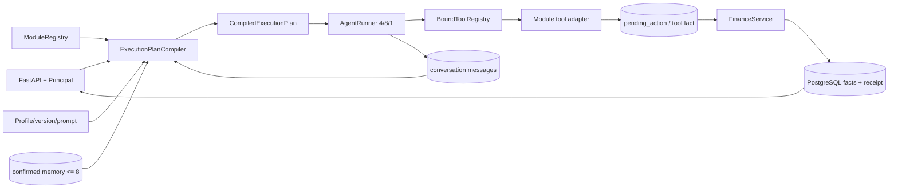

# P4-D10：B6 接管缺陷的最小返修架构裁定

- 任务：`P4-D10`
- 角色：技术顾问
- 状态：`review`；等待头脑风暴总控裁定并发布 `P4-IF-002`
- 控制版本：`2026-09-25T15:15:00+08:00`
- 审计输入：`P4-B6-AUDIT-1`，当前 P4-B6 仍为未接受的 `review`
- 适用对象：顺序返修 `P4-B6-R1`、`P4-B6-R2` 以及其后的 `P4-C11`
- 证据边界：本文只读核对当前代码、migration 与执行方测试；建议均未实现、未独立验收、未冻结

## 0. 裁定结论

当前 B6 不能进入 C11。8 个 P0 和 14 个 P1 均能在当前代码中找到对应证据；`249 passed, 13 skipped` 证明的是已有本地路径没有回归，不能证明跨事务崩溃恢复、多进程 CAS、复合 user 外键、真实 PostgreSQL、生产 app 装配或 Host 对 Agent 的实际控制。

建议按下面两段顺序返修：

1. **R1 先封闭数据与身份边界**：绑定码一次性秘密、认证、Host receipt 与领域事实同事务、activity import principal、复合 user FK、三段 migration、错误包络和旧 PostgreSQL fixture。
2. **R2 再接管运行时**：compiled execution plan、BoundToolRegistry、run/pending fencing 与恢复、conversation/message、memory/setting/event、分页和生产组合根。

总控需要先把本文标为“建议冻结”的值发布为 `P4-IF-002`。R1、R2 只能分别到 `review`；它们的执行方测试和快照不能代替 C11。

### 0.1 最小不变量

返修后必须同时成立：

1. 原始绑定码只存在于首次成功 HTTP 响应的进程内对象中；数据库、receipt、日志、事件、模型上下文均不能保存或重建它。
2. receipt 与同库领域事实共享一个事务；事实已提交而 receipt 未完成的三事务窗口不存在。
3. 只有取得数据库 CAS/lease/fence 的 worker 可以执行下一项副作用；旧 attempt 不能保存结果。
4. start、takeover 和 resume 都从 Host 编译同一类执行计划，并在副作用前重新检查模块、Profile、权限和工具 grant。
5. 所有可连接两个用户对象的 FK 都带 `user_id`；应用层过滤不能代替数据库约束。
6. 生产入口显式装配 Host、Finance、Agent 和 activity import；测试虚拟身份必须由测试构建器显式选择。
7. HTTP 列表返回 `items/next_cursor`；404、405、认证和业务错误都使用冻结 error envelope。

## 1. 当前代码事实

| 代码面 | 当前事实 | 返修含义 |
| --- | --- | --- |
| 绑定码 | 创建路由把 `code` 放进 command result，[HostCommandService](../src/wife_system/host/state.py#L156) 又把完整 result 写入 receipt；消费请求没有 `code_id`（[schema](../src/wife_system/api/host_schemas.py#L80)、[route](../src/wife_system/api/host_routes.py#L205)） | 必须同时改 HTTP DTO、AuthService、receipt 结果策略和 migration |
| Host command | [execute](../src/wife_system/host/state.py#L163) 先提交 receipt claim，再调用自带事务的 command，最后另开事务完成 receipt | 四个命令存在三个事务 crash window |
| pending | [claim_commit](../src/wife_system/agent/pending.py#L240) 返回 `bool`；[resume](../src/wife_system/agent/application.py#L541) 没有检查返回值 | cancel 赢 CAS 后 confirm 仍可能写账 |
| run takeover | lease acquire 会递增 attempt（[workflows.py](../src/wife_system/host/workflows.py#L76)），但 replay 分支随后直接返回（[application.py](../src/wife_system/agent/application.py#L303)） | 接管没有继续 provider/tool，且保存结果没有 attempt fence |
| Host/Agent | registry 已能构造 [BoundToolRegistry](../src/wife_system/host/tools/catalog.py#L77)，实际 Agent 仍由 [finance_registry](../src/wife_system/agent/application.py#L586) 和固定财务提示词（[loop.py](../src/wife_system/agent/loop.py#L103)）驱动 | Host 权限、Profile、prompt、memory 和 module enablement 没有进入真实链路 |
| user scope | `memory_item.superseded_by_id` 是单列 FK（[state_models.py](../src/wife_system/host/state_models.py#L99)）；candidate→item 和 run→pending 没有 FK（[state_models.py](../src/wife_system/host/state_models.py#L68)、[models.py](../src/wife_system/agent/models.py#L15)） | ORM 与 Alembic 必须同步增加三条复合 FK |
| API principal | principal channel 固定为 `api_test`（[host_routes.py](../src/wife_system/api/host_routes.py#L82)）；activity import 总是读取 app state 虚拟 identity（[activity_import_routes.py](../src/wife_system/api/activity_import_routes.py#L25)） | channel 和 owner 必须来自已认证 DeviceSession/Principal |
| 生产入口 | 模块级入口仍是 `app = create_app()`（[app.py](../src/wife_system/api/app.py#L339)），默认没有 HostRuntime 或 AgentApplication（[app.py](../src/wife_system/api/app.py#L98)） | 需要可由 Uvicorn/Electron supervisor 直接调用的生产 factory |
| 分页 | cursor 已绑定 endpoint/user（[cursor.py](../src/wife_system/host/cursor.py#L17)），列表只返回数组，没有生成 `next_cursor`（[host_routes.py](../src/wife_system/api/host_routes.py#L340)） | 复用 codec，补 filter fingerprint、`limit + 1` 和 Page envelope |

## 2. 8 个 P0、14 个 P1 的逐项处置

### 2.1 P0

| ID | 冻结要求与当前行为 | 建议修复 | 切片与执行方证明 | `P4-IF-002` |
| --- | --- | --- | --- | --- |
| `P0-01` | 原码只返回一次；当前原码进入 `host_request_receipt.result_json` 并在同键重放返回 | create receipt 只保存安全完成标记和 `code_id/expires_at`；首次返回 `201`，同键重放返回 `409 one_time_secret_unavailable`，绝不返回 code；新键创建会在同事务撤销该用户/渠道旧 active code | R1；断言 receipt/日志/事件无原码，同键 409，新键替换后旧码不可消费 | **需要**：冻结首次/重放/替换合同 |
| `P0-02` | Host 模式的 import 必须认证；当前固定 app-state identity 允许无 token 写入 | HostRuntime 存在时从 Bearer Principal 构造 `ImportIdentity`；只有显式 legacy test mode 可注入虚拟 identity | R1；无 token/错 token 401 且零写，A/B 用户隔离，P3 显式 test builder 继续通过 | **需要**：冻结 Host/legacy 两种装配互斥规则 |
| `P0-03` | 跨用户关系必须由数据库拒绝；当前三条关系可串用户 | 增加 `memory_item(user_id,id)` unique；三条 FK 采用 `(user_id, foreign_id) -> (user_id,id)`，并同步 ORM、SQLite rebuild 与 PostgreSQL DDL | R1；SQLite FK ON 和 PostgreSQL 直接 SQL 都拒绝三类跨用户写入 | **需要**：冻结约束名、形状和迁移顺序 |
| `P0-04` | 只有 confirm CAS 胜者可写账；当前忽略 `claim_commit=False` | `claim_commit` 返回带 version/attempt fence 的 claim；false 必须重读状态并按状态返回，绝不能调用 FinanceService；committing 使用 lease 恢复 | R2；双连接 barrier 覆盖 cancel 胜、confirm 胜、两 confirm、领域已提交后崩溃 | **需要**：冻结状态/HTTP/线性化点 |
| `P0-05` | 过期 run 必须真正接管；当前只耗 attempt 并返回 running | acquire 成功即重编译 plan、从持久 message/tool facts 继续；所有续租和保存按 `attempt_no` fence；旧 worker 保存行数 0 返回 `run_lease_lost` | R2；两 worker/可控时钟证明新 attempt 继续、旧 attempt 不能落结果、最多三 attempt | **需要**：冻结 takeover/fence/续租检查点 |
| `P0-06` | 模块禁用或失权后旧候选不能提交；当前 resume 只查 `finance:write` | resume 在读取候选后、claim commit 前重新编译并校验 module/profile/version/tool/principal；禁用返回 `module_disabled`，零领域写 | R2；候选后禁用模块、撤权、Profile 变更、隐藏工具猜名均零写 | **需要**：冻结 resume 重检点与稳定码 |
| `P0-07` | 普通设置不能保存秘密；当前生产 service 没使用 `ModuleSettingValue` | 在 `ModuleSettingService.put` receipt/事务之前执行递归 secret-key 拒绝、严格 JSON/8KiB 和模块 validator；失败不创建 receipt | R2；嵌套/大小写/分隔符变体、超限、非法 schema 全部零写 | **需要**：冻结 secret key 归一化与错误码 |
| `P0-08` | candidate 必须绑定提出它的 Profile grant；当前确认可改投所有启用 namespace | proposal 固定 source/target/profile/version；target 在确认时不可改；propose 和 confirm 都复查 profile grant/module enablement；shared 只允许显式目标和用户确认 | R2；daily→wealth、禁用后确认、伪造 profile、改 target 均拒绝 | **需要**：冻结 memory grant operation 和 confirm DTO |

### 2.2 P1

| ID | 当前行为 | 建议处置 | 切片与执行方证明 | `P4-IF-002` |
| --- | --- | --- | --- | --- |
| `P1-01` | [change_password](../src/wife_system/host/auth/service.py#L511) 只检查 absolute expiry，未检查 access expiry | 与 `authenticate_access` 共用 active access 校验；`now >= access_expires_at` 返回 401 `session_expired`，零 credential/session 写入 | R1；恰好到期前后测试 | 不新增概念；在认证映射表中重申 |
| `P1-02` | receipt claim、领域 command、receipt complete 分三个事务 | command 接受同一 `Session`，receipt claim + fact + safe result 同事务提交；仅 post-commit event 在事务外 | R1；四命令三个 crash 点、同键恢复和两连接并发 | **需要** |
| `P1-03` | adapter header 缺失由 FastAPI 422，错误 token 为 403 | header 改为可选依赖，缺失/空/错误统一 401 `channel_adapter_unauthorized`；先认证 adapter 再检查 code | R1；三种输入响应与时序等级一致 | **需要**：冻结 401 |
| `P1-04` | 消费只按 code digest 找行，错误 code/channel 不累计 | 使用 `code_id + code`；已知 active code_id 的 code/channel 失败在一事务内累计，1～4 保持 active，第 5 次锁定，第 6 次不再增；未知随机 code_id 使用统一响应且不创建行 | R1；六次、channel、并发第五次、未知 ID、终态测试 | **需要** |
| `P1-05` | AuthError 映射字典不穷举，默认落 409 | 建立唯一穷举表并在测试中断言 `set(AuthErrorCode)==set(mapping)`；不允许默认状态 | R1；逐码参数化 HTTP 测试 | **需要**：冻结完整映射 |
| `P1-06` | ToolCatalog/BoundToolRegistry 只在孤立合同测试使用 | compiled plan 中绑定 catalog；Runner 的 schema、contains/is_write/invoke 全部走 BoundToolRegistry | R2；可见性和猜名执行两道门走真实 Agent API | **需要** |
| `P1-07` | Profile prompt、conversation、memory 没传给 Runner，真实 messages 为空 | 固定 prompt 组装顺序；start 同事务写 user message；assistant/tool/final 按 run sequence 幂等写；takeover 读取历史继续 | R2；检查 provider 输入、消息顺序、重放无重复 | **需要** |
| `P1-08` | 只在整个 runner 返回后续租一次 | provider/tool 前后各续租；每次保存检查 attempt fence；15/10 秒上限小于 60 秒 lease | R2；慢 provider/tool、续租失败、旧 worker 测试 | **需要** |
| `P1-09` | 只发布 memory/setting；无 subscriber wiring | `host_core` 注册四类 publisher；composition 按 registry 顺序订阅；run terminal 与 session revoke 在 commit 后发布；handler 失败只记脱敏日志 | R2；四类各一次、顺序、失败不回滚、重复容忍 | **需要** |
| `P1-10` | memory 只有 superseded 字段/delete，没有 supersede/invalidate 行为 | 增加 active→superseded、active→invalidated、任意非 deleted→deleted tombstone 的 version CAS；旧值只按隐私策略保留或清空 | R2；两并发 supersede、失效、删除与检索排除 | **需要** |
| `P1-11` | 默认 `app = create_app()` 没有 Host/Agent | 增加生产 config/factory，显式装配 engine/session、Finance、Host、Agent、import；模块导出改为 Uvicorn `--factory` 入口 | R2；临时 P4 head 启动、ready、auth、modules、Agent/import 冒烟 | **需要** |
| `P1-12` | 列表收 cursor 但返回裸数组；candidate 无分页 | 统一 `Page[T]{items,next_cursor}`，三端点 limit+1、不可变时间 desc/UUID asc；cursor 绑定 endpoint/user/filter | R2；第二页、同时间、跨用户/端点/filter cursor、空末页 | **需要** |
| `P1-13` | head 合法 cancelled run 恢复 P3 check 时失败 | state downgrade 先将 `cancelled` 映射为 P3 合法 `error` 且 `error_code='cancelled'`，保留 run/pending/引用；不得映射 success 或删除 | R1；含 cancelled 历史 round-trip SQLite/PostgreSQL | **需要** |
| `P1-14` | import 捕获旧约束名 `uq_activity_template_name_normalized`（[service.py](../src/wife_system/activity_import/service.py#L110)） | 同时识别 P4 `uq_template_user_name` 和可靠 SQLSTATE/constraint；同用户同名竞争败方稳定 409 `concurrent_modification`，不同用户可同名 | R1；真实 PostgreSQL barrier 测试 | 不需新业务概念；补充约束名兼容值 |

## 3. 合同一：一次性绑定码与幂等

### 3.1 推荐方案

采用 **随机 `code_id` + 40-bit 原始 `code` + 一次性响应策略**。`code_id` 是不可猜测 UUID，但不是秘密；它只用于精确定位要累计失败次数的行。code HMAC 域必须包含 `code_id` 与冻结 channel：

```text
HMAC(binding_key, "wife.channel-binding.v2\0" + code_id + "\0" + channel + "\0" + code)
```

创建合同：

```text
POST /api/v1/channel-bindings/codes
Authorization: Bearer <access>
Idempotency-Key: <key>
{"channel":"wechat"}

首次提交：201
{"code_id":"<uuid>","code":"ABCD-2345","expires_at":"...","replayed":false}

同 key、同 payload、已完成：409
{"request_id":"...","error":{"code":"one_time_secret_unavailable",
  "message":"The one-time secret is no longer available.","retryable":false}}

同 key、异 payload：409 idempotency_conflict
```

创建事务保证每个 `(user_id, channel)` 最多一个 active code。用户在首次响应丢失后使用**新 Idempotency-Key** 再创建；新事务先把旧 active code 标为 `revoked`，再插入新 code，最后只把安全字段写入 receipt。客户端无需知道丢失的旧 `code_id`。

消费合同必须包含 `code_id`：

```json
{
  "code_id": "00000000-0000-0000-0000-000000000123",
  "channel": "wechat",
  "provider_account": "virtual-provider",
  "external_subject": "virtual-subject",
  "code": "ABCD-2345"
}
```

adapter token 在查询 code 之前验证。对外把 unknown code_id、wrong code、wrong channel、locked、expired、consumed、revoked 全部归一为 `409 binding_code_invalid`，不返回 code 是否存在、属于谁或是哪种终态。内部审计只记录安全 reason code、code_id digest、adapter/channel 和 request ID，不记录原码或原始外部身份。

### 3.2 五次失败和线性化

主计数维度是**真实 code row，即 `code_id`**。这让错误 code 和错误 channel 都能计到同一行，同时不需要用原码查找。规则如下：

| 请求 | 数据库动作 | 对外结果 |
| --- | --- | --- |
| 第 1～4 次，code_id 存在且 active，但 code/channel 任一错误 | 行锁或条件 UPDATE：`attempts = attempts + 1` | 409 `binding_code_invalid` |
| 第 5 次错误 | 同一 UPDATE 把 `attempts=5,status='locked'` | 409 `binding_code_invalid` |
| 第 6 次及以后 | 终态，不再增长 | 同一 409 |
| unknown code_id | 不创建伪行、不泄漏存在性；adapter 级限速另行计数 | 同一 409 |
| `now >= expires_at` | 先 CAS 为 expired；不再累计 | 同一 409 |
| consumed/revoked/locked | 不改变终态 | 同一 409 |
| 正确且 active | 条件 UPDATE active→consumed，并在同事务创建 binding/audit | 首个 200/201；并发败方同一 409 |

`code_id` 有 128-bit 随机性，配合 adapter token 和外层 adapter/channel 速率限制，unknown ID 不能成为 40-bit code 的枚举索引。adapter 级限速不替代每行五次上限，也不改变统一错误。

### 3.3 替代方案及拒绝理由

| 替代 | 收益 | 拒绝理由 |
| --- | --- | --- |
| 同键重放仍返回原码 | 客户端最方便 | 必须把原码保存或可重建，直接违反一次性秘密边界 |
| 消费只传 code | DTO 更短 | 无法在错误 code 时安全定位计数行；当前实现已经证明五次上限失效 |
| 每次重放自动生成新 code | 表面可恢复 | 同一个幂等 key产生不同副作用和结果，破坏幂等语义；并发重放会制造多个码 |
| 对 expired/consumed/locked 返回不同错误 | 调试方便 | 构成 code_id 存在性与生命周期侧信道 |

### 3.4 数据库、HTTP、恢复和测试

- 数据库：`channel_binding_code` 增加 `status`、`revoked_at`；partial unique 保证每用户/渠道一个 active；digest 唯一不是安全主键。消费锁行或条件 UPDATE，binding/audit 同事务。
- HTTP：首次创建 201；同键安全重放 409；消费成功建议 201，安全重放 200 并带 `replayed=true`；所有无效码 409；adapter 缺失/错误均 401。
- 恢复：创建提交前崩溃则事务全回滚，同键可重新首次执行；提交后响应丢失则同键只返回 secret unavailable，新键替换旧码；消费提交后响应丢失可从 safe receipt 精确重放 binding 结果。
- 执行方测试：首次/重放/异载荷、receipt/日志扫描、替换、1～6 次、过期边界、并发第五次、并发消费、unknown code_id、错 channel、adapter 三态、跨用户与真实 PostgreSQL 行锁。
- `P4-IF-002`：**必须补充**本节所有状态、HTTP 和替换值。

## 4. 合同二：Host command、领域事实和 receipt 一致性

### 4.1 推荐：同库命令共享一个事务

四个当前命令都只修改同一个数据库，因此使用一个 `Session.begin()`：

```python
outcome = command_service.execute(
    operation="binding.code.create",
    command=lambda session: auth.create_binding_code_in_session(session, ...),
)
```

`command` 返回两类结果：

- `public_result`：本次首次 HTTP 可以返回的内容；create binding code 可含进程内 raw code。
- `receipt_result`：允许持久保存和重放的安全内容；严禁 raw code、token、password、credential、原始外部身份。

同一事务顺序是 receipt claim → 领域 mutation → safe receipt complete → commit。事件只在 commit 返回后同步发布。

```mermaid
sequenceDiagram
    participant C as Client
    participant H as HostCommandService
    participant D as Domain service
    participant DB as Database

    C->>H: command + Idempotency-Key
    H->>DB: BEGIN; claim receipt
    alt existing safe completed receipt
        DB-->>H: replay_result / secret marker
        H-->>C: safe replay or 409 secret unavailable
    else first execution
        H->>D: command(session)
        D->>DB: write domain fact in same transaction
        H->>DB: complete safe receipt; COMMIT
        alt response delivered
            H-->>C: first public result
        else process exits after COMMIT
            C->>H: retry same key
            H->>DB: load completed receipt
            H-->>C: safe replay or 409 secret unavailable
        end
    end
```

### 4.2 四命令结果策略

| 命令 | receipt 可保存 | 禁止保存 | 同键恢复 |
| --- | --- | --- | --- |
| initialize | `user_id/initialized=true` | password、bootstrap token | 200 安全重放；并发其他 key 为 `already_initialized` |
| create binding code | `code_id/expires_at/status=created/secret_available=false` | raw code | 409 `one_time_secret_unavailable` |
| consume binding code | `binding_id/channel/created_at` | raw code、adapter token、原始 provider/subject | 200 安全重放 |
| revoke binding | `binding_id/status=revoked` | 外部身份原文 | 200 安全重放 |

登录、refresh 和 change-password 会产生 access/refresh token，它们不是上述 command receipt 的 replayable result；原始 token 仍只在签发响应出现。将来若给这些端点加幂等，也必须采用一次性 secret unavailable，而不是存 token。

### 4.3 三个 crash 时点

1. **领域提交前退出**：同一事务回滚，receipt 也不存在；同键重试重新执行。
2. **领域写完但事务提交前退出**：领域事实、receipt 一起回滚；同键重试重新执行。
3. **数据库 COMMIT 成功、HTTP 响应前退出**：事实和 completed receipt 已同时存在；安全结果精确重放，一次性秘密返回 409，不会出现 incomplete receipt。

旧工作区中若已有 `result_json IS NULL` 的开发数据，不从业务事实猜结果。因为 P4 尚未接受，R1 migration 可把这些行标为 `abandoned` 或在虚拟开发库重建；不得对真实未知事实自动重放副作用。

### 4.4 替代方案

| 方案 | 适用点 | 本轮结论 |
| --- | --- | --- |
| receipt 带 `claimed/running/completed`、owner lease 和恢复 worker | 跨数据库、外部 API 或长任务 | 当前四命令同库且很短，引入 lease 会增加状态与卡死恢复；本轮不采用 |
| 从领域事实重建结果 | 事实有稳定 command correlation 且结果完全安全 | initialize/consume/revoke可部分重建，但 secret、时间和并发语义不统一；不能作为通用协议 |
| 同一数据库事务 | 能原子覆盖 claim、事实和 result | **采用**；最少状态且数据库直接提供线性化 |

### 4.5 测试与冻结

- 故障注入必须在 claim 后、领域 mutation 中、safe receipt complete 前、commit 后响应前四点执行。
- 两连接同 key/同 payload 只能有一个事实；同 key/异 payload 稳定 409；异常回滚后同键可恢复。
- 直接查询 receipt，证明没有 raw code、token、password、原始身份或请求 body。
- `P4-IF-002`：**必须补充**`CommandOutcome` 两类结果、同事务和 crash 表。

## 5. 合同三：run/pending 并发、接管和 deadline

### 5.1 pending CAS 所有权

`claim_commit` 不再返回裸 bool，而返回 `CommitClaim(pending_action_id, version_id, attempt_no, lease_expires_at)` 或明确的 `not_acquired`。第一次成功 CAS：

```text
needs_confirmation(version=N)
  -- WHERE status/version/user/profile/module still match -->
committing(version=N+1, commit_attempt=1, commit_lease=now+60s)
```

只有持有返回 claim 的请求可以首次调用领域 commit。CAS 失败必须重新读数据库并逐状态处理：

| 实际状态 | confirm 请求 | cancel 请求 | GET |
| --- | --- | --- | --- |
| `needs_input` | 409 `confirmation_required` | CAS→`cancelled` | 200 paused/needs_input |
| `needs_confirmation` 且 version 变化 | 409 `pending_action_stale` | 用新 version 重试 CAS或返回 stale | 200 paused/needs_confirmation |
| `committing` 且 lease 未过期 | 409 `commit_in_progress`, retryable=true | 409 `commit_in_progress` | 200 paused/committing |
| `committing` 且 lease 过期 | 单个 recovery CAS 增 attempt/version 后，以同一领域 idempotency key恢复 | 409 `commit_in_progress` | 200 paused/committing；恢复 worker完成后收敛 |
| `committed` | 返回 final_result，`replayed=true` | 返回 committed 真相，不声称取消 | 200 success |
| `cancelled` | 409 `pending_action_cancelled`，零写 | 200 cancelled replay | 200 run status `cancelled` |
| `expired` | 410 `pending_action_expired` | 410 | 200 paused/expired，包含安全 error_code |

领域 key 继续使用 `pending:{pending_action_id}:commit`。如果领域 COMMIT 成功而 `mark_committed` 前进程退出，后续 recovery worker 用同一 key得到 FinanceService replay，再按新的 commit fence 把 pending 标为 committed。旧 worker的 `mark_committed` 必须因 attempt/version 不匹配而失败，不能覆盖新状态。

当前 [get](../src/wife_system/agent/application.py#L366) 把 pending cancelled 映射成 run success；返修后 run 应进入冻结的 `cancelled` 状态，不能伪装成功。

### 5.2 run takeover 与 attempt fence

过期 `running` 被 acquire 后必须继续执行，而不是走 replay early-return。接管步骤：

1. `UPDATE agent_run ... WHERE status='running' AND attempt_no=old AND lease_expires_at<=now`，递增 attempt 并返回新 fence。
2. 从 run、conversation messages 和持久 tool facts 重建输入。
3. 重新编译 execution plan；模块/Profile/权限已失效则保存稳定终态。
4. 以 `run_id:attempt_no` 作为 Runner 本地执行 key，继续 provider/tool。
5. 所有 renew、message append、pending link、terminal result save 都带 `(user_id, run_id, attempt_no, status='running')` 条件。

旧 worker即使晚返回，也只能得到 `run_lease_lost`，不能写 answer/result/message 或发布 terminal event。最多三次 attempt；第三次 lease 到期后保存 `error/run_attempts_exhausted` 的动作本身也必须用当前 fence CAS。

### 5.3 续租与 cooperative deadline

检查点为：provider 前、provider 后、每个 tool 前、每个 tool 后、最终保存前。Profile 可收紧 15/10 秒，但不能放宽；60 秒 lease 因而覆盖单次调用，续租覆盖多轮 4/8/1 循环。

同步 Python 函数不能被安全强杀。tool deadline 是合作式协议：

- Host 传入 monotonic deadline；adapter 在开始、进入事务前、长循环中检查。
- PostgreSQL 设置局部 statement/lock timeout；外部 client 配置自身 timeout。
- deadline 到达且尚未提交，返回 `tool_timeout`，零写。
- 写事务已经提交后才观察到超时，返回/恢复数据库 authoritative committed result；绝不能告诉用户“已取消”并再次写。
- lease 丢失只阻止后续保存和新的副作用，不能宣称回滚已经提交的领域事务。

### 5.4 替代方案与拒绝理由

| 替代 | 拒绝理由 |
| --- | --- |
| 继续依赖进程内 `threading.Lock` | 多 worker、重启和接管不可见；只能作性能优化 |
| 遇到 committing 就每个请求直接重跑 FinanceService | 领域层虽幂等，但无法区分活跃 owner 与恢复者，会制造无界竞争；需要 commit lease/CAS |
| 超时后杀线程并报告取消 | Python/DB 事务可能仍提交，会制造用户认知与事实分叉 |
| run 过期直接标 error | 丢失可恢复工作并违背三次接管合同 |

### 5.5 测试与冻结

- SQLite：状态表、稳定错误、重复确认、cancel/confirm 单进程回归。
- PostgreSQL：两连接 barrier 覆盖两 confirm、cancel/confirm、commit 后崩溃、run takeover、旧 fence 保存、三 attempt、lock timeout。
- 脚本 provider/tool：验证每个 renew 点、4/8/1、15/10/60 边界和 committed-after-timeout 文案。
- `P4-IF-002`：**必须补充**pending commit lease、run fence、状态/HTTP 表和 deadline 真相规则。

## 6. 合同四：Host 真正控制 Agent

### 6.1 唯一 compiled execution plan

`AgentApplication.start/resume/takeover` 都调用一个 `ExecutionPlanCompiler`。最小不可变 plan 包含：

```text
CompiledExecutionPlan
├── user_id / session_id / device_id / trusted channel / permissions
├── module_id / module_version / module_enabled_revision
├── profile_id / profile_version / system_prompt
├── BoundToolRegistry（canonical grants + aliases + execution-time recheck）
├── memory grants（namespace/kinds/operations/每项 limit，总数硬上限 8）
├── limits（4/8/1、provider<=15s、tool<=10s、retry<=1）
├── conversation_id / bounded history window
├── run_id / attempt_no fence / action_schema_version
└── confirmation policy / stable error mapping
```

run 持久保存准确 `module_id/profile_id/profile_version/action_schema_version`，不能再硬编码 `profile_version='1.0.0'`（当前位置 [application.py](../src/wife_system/agent/application.py#L140)）。plan 本身每次编译，不把 callable 或秘密序列化进数据库。

重新检查点：

1. start 创建 run 前：conversation、module、Profile/version、principal 和 schema。
2. provider 前：模块仍启用，Profile/version仍存在，memory/tool view重新绑定。
3. 每个 tool schema 和 invoke：BoundToolRegistry 分别检查可见性和执行授权。
4. resume 读取 pending 后、claim commit 前：module/Profile/version、principal permission、action handler/schema、目标资源版本。
5. recovery/takeover：执行与 start 相同的完整编译；不沿用旧进程对象。

### 6.2 prompt、记忆、消息和工具事实顺序

传给 provider 的顺序固定为：

```text
Host 基础安全规则
→ Profile versioned system prompt
→ 可信上下文摘要（身份只作文字上下文，不进入 tool args）
→ 最多 8 条获准 confirmed memory
→ conversation 历史
→ 最新持久 tool facts
→ 当前 user message
```

用户消息、记忆值、Markdown、历史消息和 tool 内容都标为不可信数据，不能拼进安全规则或覆盖 prompt。当前 [AgentRunner](../src/wife_system/agent/loop.py#L107) 固定插入财务 prompt，R2 必须改为接收 plan/messages；不能通过修改全局常量实现多 Profile。

### 6.3 message 持久化与重放

- run claim 与当前 user message 在一个事务写入；message 使用 `(user_id, run_id, sequence)` unique，`sequence=0`，同 client event 重放不重复。
- 每个 assistant/tool 边界使用 Host 分配的单调 sequence。tool 副作用 key 由 `run_id + sequence` 形成，不能仅信任模型 `tool_call_id`。
- tool message 只保存允许给下一轮模型的安全结构化结果，不保存 token、原始 identity、SQL 参数或内部异常。
- terminal assistant message 与 run terminal result 用 attempt fence 在一个事务写入；commit 后再发布 run-status event。
- provider 在消息落库前崩溃可重调；tool 在消息落库前崩溃必须用稳定 tool/领域 key重放，再补同 sequence message。
- conversation history窗口建议冻结为“最多最近 20 条且 UTF-8 总计不超过 64 KiB”；超过时从最旧非 system 数据截断，不做隐式模型摘要。



### 6.4 稳定错误贯穿

- BoundToolRegistry 对不可见、猜名、禁用、失权统一抛 `tool_not_allowed`；Runner 不得用 `contains=False` 把它降成 `unknown_tool`。
- provider/tool timeout 保留 `model_timeout/tool_timeout`。
- pending cancelled、expired、committing 保留各自稳定码。
- Runner 返回结构化 safe error；AgentApplication 持久化 code/retryable；FastAPI 只映射 code，不暴露异常正文。

可观察 HTTP 语义也要分层：认证、conversation/Profile 归属或请求 DTO 在执行前失败，直接返回统一 4xx envelope；provider、tool 或 4/8/1 循环在已创建 run 后失败，POST/GET 返回 200 `AgentRunResponse(status="error", error_code=...)`，因为 run 本身已经被可靠记录。`tool_not_allowed` 属于后一类，必须是持久 run error、零 handler/数据库副作用；数据库不可达或无法持久化 run 才返回 503。response 丢失后客户端使用同一 `client_event_id` 或 GET run，读取同一终态和同一组幂等 message。

### 6.5 替代方案、测试与冻结

- 替代“继续在 route 中分别 resolve Profile、再调用旧财务 Agent”会产生 start/resume 两套授权，已经导致 P0-06；拒绝。
- 替代“把 manifest/profile/permission 交给模型判断”把可信授权变成不可信文本；拒绝。
- 替代“本轮引入 LangGraph”不能解决 user scope、receipt、CAS 或领域幂等，还扩大恢复状态；维持显式状态机。
- 执行方测试：真实 API→compiler→provider→BoundTool→pending 的纵向测试；prompt 顺序；memory=8；模块/权限变更；消息 replay；tool_not_allowed；takeover history。
- `P4-IF-002`：**必须补充**plan 字段、检查点、history窗口、message unique 和错误贯穿。

## 7. 合同五：memory、setting 和 event

### 7.1 memory grant 与 candidate

建议把 `MemoryGrant` 明确为 `namespace/kinds/operations/limit`，operations 首版只有 `read` 和 `propose`。确认是用户权限 `host:memory` 的动作，不授权给模型。

- propose：解析 `proposed_by_profile_id`，校验 profile 属于 source module、module 已启用、grant 允许对固定 target namespace propose、kind 被允许；保存 profile version。
- confirm：target 不能由请求改写；重新解析同 profile/version和 module enablement；校验原 grant仍允许该 target；principal 具有 `host:memory`；以 candidate status/version CAS。
- `shared.confirmed`：Profile 必须显式声明可 propose shared，candidate 从创建时就以它为 target，且仍由用户显式确认。
- reject：属于减少数据的用户动作，即使模块后来禁用也允许 CAS reject；不创建 item。

当前确认路由把所有 enabled module namespace 合并（[host_routes.py](../src/wife_system/api/host_routes.py#L405)），必须由 service 内部根据 candidate/Profile计算，不能由 route 传任意 `allowed_namespaces`。

### 7.2 最小 memory item 状态机

```text
active --supersede(CAS version)--> superseded --delete--> deleted tombstone
active --invalidate(CAS version)--> invalidated --delete--> deleted tombstone
active ---------------------------> deleted tombstone
```

- supersede 在一个事务创建同用户的新 active item，并把旧 item 指向新 item；只有旧 item 的 active/version CAS 胜者成功。
- invalidate 表示内容不再可信；从检索立即排除，并清空 value/tags或按冻结隐私策略最小保留。
- delete 必须清空 value/tags，保留不含内容的 id、user、namespace、状态、时间、audit/version；重复 delete安全重放。
- retrieval 只返回 active、未过期、获 grant 的 item，排序/tag 命中规则保持，硬上限 8。
- `superseded_by_id`、candidate `memory_item_id` 都使用复合 user FK。

### 7.3 setting 写入边界

顺序固定为：

1. `ModuleSettingValue.model_validate` 执行严格 JSON、finite number、8KiB。
2. 递归归一化 key：casefold 后删除 `_-.`；命中 `apikey/password/secret/token/credential/privatekey/refreshtoken` 即 `422 setting_secret_forbidden`。
3. registry 查 module enabled/setting declaration/schema version。
4. 调用该 module 注册的确定性 value validator。
5. 通过后才 claim receipt 和进入事务；失败零 receipt、零 setting、零 event。

只查 exact `api_key` 的 DTO 不足以覆盖 `Api-Key` 或嵌套字段；只在 route 校验也会被内部调用绕过。确定性 service 边界是唯一正确位置。

### 7.4 四类 post-commit event

注册一个保留 publisher ID `host_core`，在 registry startup 时声明四类事件：

| 事件 | 发布时点 | 最小 payload |
| --- | --- | --- |
| `agent.run_status_changed@1` | run terminal/paused 状态事务 commit 后 | run_id、module_id、status；无 message/answer |
| `memory.changed@1` | candidate/item CAS commit 后 | object_id、namespace、status/version；无 value |
| `module.setting_changed@1` | setting commit 后 | module_id、key、version；无 value |
| `auth.session_revoked@1` | logout/revoke/password change/deactivate commit 后 | session_id digest或安全 ID、reason；无 token |

ModuleDefinition 提供声明式 subscriber handler；composition 按 builtin 注册顺序调用 `events.subscribe`。未声明 publisher/subscriber 在 startup 失败。handler 同步、按注册顺序、事实 commit 后执行；一个 handler 抛错只记录 event ID/type/handler type，不回滚、不重试，继续后续 handler。订阅者必须按 `event_id` 或 idempotency digest容忍重复；事件只提示刷新，GET/数据库仍为真相。

对外失败语义固定为：candidate不存在或跨用户为404；模块禁用、candidate状态/version竞争为409；namespace/Profile grant不足为403；恰好过期为410；setting secret、schema或大小不合法为422。所有失败均使用统一 envelope。事件 handler在事实commit后失败时，原HTTP仍返回已经提交的事实结果；客户端靠GET收敛，不能因通知失败重做memory/setting mutation。

### 7.5 替代方案、测试与冻结

- 让每个业务 module冒充 publisher 会让当前 Host service 发出 manifest 未声明事件；采用 `host_core` 后所有实际 publisher可验证。
- 现在引入 outbox/broker会扩大部署与重试语义；四类事件只作进程内提示，本轮不采用。
- 用设置保存 API key再“加密”仍把密钥生命周期混进普通设置；密钥只进运行配置/OS secret store。
- 测试：candidate grant/禁用/target、shared确认、三种 item 转换并发、secret 变体、validator错误零写、四事件顺序/失败/重复。
- `P4-IF-002`：**必须补充**grant operation、不可改 target、状态机、secret词表和 `host_core`。

## 8. 合同六：user scope 与 migration

### 8.1 准确约束形状

R1 同步 ORM 与 Alembic，建议名称如下：

```text
UNIQUE memory_item(user_id, id)                         uq_memory_item_user_id
FK memory_item(user_id, superseded_by_id)
  -> memory_item(user_id, id)                           fk_memory_item_user_superseded

FK memory_candidate(user_id, memory_item_id)
  -> memory_item(user_id, id)                           fk_memory_candidate_user_item

FK agent_run(user_id, pending_action_id)
  -> pending_action(user_id, id)                        fk_run_user_pending
```

`pending_action(user_id,id)` 和 `agent_run(user_id,id)` 已由 `p4_host_user_scope` 建 unique；`pending_action(user_id,run_id) -> agent_run(user_id,id)` 已在 [SCOPED_RELATIONSHIPS](../migrations/versions/p4_host_user_scope.py#L46) 中。ORM 应移除 `PendingActionRecord.run_id` 的单列 `ForeignKey`，改为与正式 schema 一致的复合 `ForeignKeyConstraint`；migration 可在 P4 user-scope建立复合 FK 后移除旧单列 FK，避免 metadata 与数据库双重漂移。

### 8.2 保持三个 revision

P4 尚未被接受或发布，且 P4-IF-001 冻结的是三段线性 migration。因此推荐**修正现有三个 revision，不增加第四个**：

1. `p4_host_identity`：绑定码状态/active unique/一次性恢复所需字段。
2. `p4_host_user_scope`：P0～P3 的 user unique/FK，移除被复合关系替代的旧单列 FK，并修正 PostgreSQL fixture预期。
3. `p4_host_state`：memory 三关系、run→pending、pending commit lease/fence、message/run sequence等 P4 state字段；head仍叫 `p4_host_state`。

为R2恢复协议预先冻结的最小新增state字段是：`pending_action.commit_attempt_no`（默认0、非负）、`commit_lease_expires_at`（nullable）和以现有`version_id`作为claim fence；`conversation_message.run_id/run_sequence/tool_call_id`（历史消息可空），并增加 `UNIQUE(user_id,run_id,run_sequence)`、`FK(user_id,run_id)->agent_run(user_id,id)` 以及“run_id与run_sequence同时为空或同时非空”的check。R1只负责正式schema和ORM声明，R2负责写入与恢复行为。若总控不接受message/run关联字段，R2无法从崩溃点确定哪些assistant/tool事实已经持久化，必须在派发前给出等价的持久恢复设计。

代价是已经应用未验收 P4 migration 的开发库必须在虚拟数据边界重建或按专用开发说明重置。若总控发现任何不能重建的外部数据库已经把 P4 head当作稳定历史，必须停止并改为第四 revision，同时修订三段冻结；当前输入没有这项证据。

增加第四 revision在传统已发布数据库上更安全，但它直接冲突于当前“三段 P4 target”，还会把尚未验收的错误 schema永久化；本轮拒绝。

### 8.3 run/pending 循环引用

PostgreSQL：在两表 `(user_id,id)` unique 和数据一致性检查后，先建立/核对 pending→run，再以 `ALTER TABLE agent_run ADD CONSTRAINT ... DEFERRABLE INITIALLY IMMEDIATE` 添加 nullable run→pending；正常创建顺序仍是 run → pending → update run。downgrade 先 drop run→pending，再处理状态/列，后续 user-scope downgrade 才 drop pending→run。

SQLite：不能把两个相互引用的表交给两个独立、顺序不明的 batch rebuild。使用一个受控 helper：关闭 FK 的动作必须在 Alembic 事务边界之外完成；创建成对临时表、复制并校验 user 一致、按受控顺序替换两表、重建 index/unique/check，恢复 FK 后立即执行 `PRAGMA foreign_key_check`。任何返回行都使 migration失败。空库、P0～P3历史库和已有虚拟 P4 head都必须覆盖。

memory table drop 顺序是 candidate 先、item 后；否则 candidate→item FK会阻挡 downgrade。

### 8.4 cancelled run 的 head→P3 映射

在恢复 P3 status check 前执行：

```sql
UPDATE agent_run
SET status = 'error',
    error_code = CASE WHEN error_code IS NULL THEN 'cancelled' ELSE error_code END,
    pause_reason = NULL
WHERE status = 'cancelled';
```

这是向旧 schema 的明确语义投影：P3没有 cancelled枚举，只能用 error + cancelled code表达“未成功完成”。它不删除 run/pending/业务引用，不伪装 success，也不产生财务事实。

### 8.5 ORM、create_all 与 C11

ORM metadata 必须声明全部正式复合约束，不能以“只由 Alembic 管”为由继续漂移。`Base.metadata.create_all()` 只允许纯合同/服务单元测试快速建库；它不能作为 migration、SQLite rebuild、PostgreSQL constraint 或 downgrade 证据。C11 必须从空 schema和完整 P0～P3虚拟历史执行 Alembic，再用 inspector与直接非法 SQL断言实际约束。

迁移失败是启动失败而不是业务HTTP重试：Alembic upgrade/downgrade在一致性检查或DDL失败时回滚并非零退出；生产factory发现head不等于`p4_host_state`时不自动迁移，只让`/healthz`存活、`/readyz`返回503 `migration_not_current`。正常运行时跨用户对象一律按404处理，数据库复合FK则作为绕过repository时的最后防线。

执行方测试还要修复当前真实 PostgreSQL旧 fixture：finance必须迁移到 P4 head并使用真实 bootstrap/test user；activity import owner必须存在于 `app_user`；最终 head断言改为 `p4_host_state`，原业务断言不得删除。

### 8.6 测试与冻结

- SQLite：空库、全量虚拟 P0～P3、已有虚拟 P4 head、upgrade重入、head→P3、FK check、三类跨用户直接写。
- PostgreSQL：随机 schema、三段 revision、三类复合 FK、循环关系、cancelled downgrade、同 user合法链、跨 user拒绝。
- metadata：constraint 名/列/目标对比；`create_all` 测试明确标 unit-only。
- `P4-IF-002`：**必须补充**约束形状、修正现有三 revision、SQLite helper、downgrade映射与 create_all限制。

## 9. 合同七：生产组合、API 与分页

### 9.1 生产 app factory

新增一个无副作用配置解析层和可供 supervisor直接调用的 factory，例如：

```text
wife_system.api.production:create_production_app
  → ProductionConfig.from_environment_or_main_process()
  → engine + sessionmaker
  → FinanceService / ActivityImportService
  → build_host_runtime(...)
  → build_host_agent_application(...)
  → create_app(host_runtime=..., agent_application=..., activity_import_service=...)
```

Uvicorn 使用 `--factory`；Electron main只传本机端口、数据库 URL和从 OS secret store取出的 secret，不把值交给 renderer。`create_app()`保留纯依赖注入能力，但模块级 `app=create_app()`不再作为生产入口。

必须来自运行配置而非普通 setting的值：数据库 URL、bootstrap token、channel adapter token、binding HMAC key、Host idempotency key ring/current version、cursor HMAC key、Agent source digest key、Finance receipt key ring，以及启用远程 provider时的 API key/base URL/model allowlist。日志只记录“字段缺失/版本无效”，不记录值或 digest。

- 缺安全 secret、长度不足、重复 key version、非法 provider allowlist：factory fail closed，进程非零退出。
- 数据库暂不可达、Alembic head不符、registry runtime故障：app可提供 `/healthz`，`/readyz` 503并给安全 code。
- provider配置缺失：Host/auth可启动用于本机修复配置，但 Agent endpoint 503 `agent_unavailable`，`/readyz` 503 `agent_provider_unconfigured`；不得静默换成假 provider。Electron supervisor据此显示“需要配置”，不伪装 ready。

### 9.2 activity import 与历史兼容

Host模式：`get_import_identity`依赖 `get_principal`，映射 `owner_id=principal.user_id/channel=principal.channel/permissions=principal.permissions`。无/错 Bearer为统一401。

历史 P3执行方测试：通过显式 `create_app(activity_import_identity=test_identity, host_runtime=None, ...)` 或独立 `create_legacy_test_app` 注入虚拟 identity。若同时传 HostRuntime和静态 import identity，factory启动即拒绝，避免生产误用。生产 factory不提供静态默认 identity。

`P1-14` 的同名竞争捕获 `uq_template_user_name`；跨用户相同 normalized name允许存在。

### 9.3 可信 channel

`AuthenticatedSession`补 `platform`。Principal channel由数据库 DeviceSession派生并冻结映射：

```text
windows_desktop -> desktop_chat
api_test         -> api_test
```

渠道 adapter经 active binding构造其绑定 channel。conversation create不再接受任意 channel，或要求 body值与 principal.channel完全相等；推荐从 body移除。`source_system`与显示 channel分开，二者都不能由模型生成。

### 9.4 错误 envelope

FastAPI/Starlette的 404 与 405增加专用 handler，分别返回 `404 route_not_found`、`405 method_not_allowed`，都使用：

```json
{
  "request_id": "...",
  "error": {"code": "...", "message": "...", "retryable": false}
}
```

AuthError使用穷举 enum→HTTP表，不设默认 409：

- 401：`authentication_required`、`invalid_credentials`、`session_revoked`、`session_expired`、`invalid_refresh_token`、`session_refresh_replayed`、`channel_adapter_unauthorized`。
- 403：`bootstrap_unauthorized`。
- 404：`session_not_found`、`binding_not_found`、`account_not_found`。
- 409：`already_initialized`、`active_session_limit`、`channel_identity_conflict`、`binding_code_invalid`、`one_time_secret_unavailable`。
- 422：`invalid_handle`、`invalid_password`、`invalid_device`、`invalid_channel`。
- 429：`login_rate_limited`，保留 Retry-After。

R1若保留内部细分 `binding_code_expired/consumed/attempts_exceeded`，HTTP边界也必须归一为 `binding_code_invalid`。

### 9.5 统一分页

三个端点返回泛型形状：

```json
{"items": [], "next_cursor": null}
```

| 列表 | 排序 | endpoint bind |
| --- | --- | --- |
| conversations | `created_at DESC, id ASC` | `conversations:v1` |
| messages | `created_at DESC, id ASC` | `conversation-messages:v1:<conversation_id>` |
| memory candidates | `created_at DESC, id ASC` | `memory-candidates:v1:<status/filter-digest>` |

service查询 `limit + 1`；多一行才生成 `next_cursor`，cursor指向最后返回行。cursor payload包含 version、endpoint、user_id、filter fingerprint、sort time、item id并做HMAC；最大512字符。跨用户、跨端点、跨conversation、筛选变化、签名错误和畸形时间统一422 `invalid_cursor`。不可变 created_at保证翻页稳定；新插入项目只会出现在刷新后的第一页。

### 9.6 替代方案、测试与冻结

- 继续模块级空 app依靠调用者注入会让 Uvicorn/Electron启动成功但核心503；拒绝。
- 缺 secret时生成随机临时 key会使重启后所有 token/cursor/idempotency失效，并掩盖配置错误；拒绝。
- offset分页在并发插入时会重复/遗漏；拒绝。
- 执行方测试：production factory配置矩阵、无secret日志、ready降级、Host/legacy import、platform channel、404/405、AuthError全表、三列表第二页/cursor隔离。
- `P4-IF-002`：**必须补充**factory入口、secret分类、readiness码、identity互斥、channel映射、错误表和Page DTO。

## 10. 返修拆分与文件所有权

### 10.1 顺序和共享文件交接

R1先完成并形成不可变有序SHA-256快照；总控核对R1文件和测试证据后，R2只能从该精确快照开始。两个任务不得同时运行。共享文件使用“R1先改安全/Schema/API基础，R2接收后再集成”的明确交接，不存在并发编辑。

| 共享文件 | R1所有内容 | R2接手后允许内容 |
| --- | --- | --- |
| `src/wife_system/api/app.py` | AuthError、404/405、Host/legacy identity基础 | production composition接线和Agent错误贯穿；不得放宽R1映射 |
| `src/wife_system/api/host_routes.py` | auth/binding/receipt DTO调用 | memory分页、conversation分页、runtime集成；不得改回秘密重放 |
| `src/wife_system/api/host_schemas.py` | binding code_id/one-time/Page基础合同 | 各Page具体response与memory DTO；保持R1字段 |
| `src/wife_system/host/state.py` | HostIdempotency/HostCommandService同事务 | Memory/Setting/Conversation行为；不得恢复三事务 |

`agent/application.py`只由R2编辑；三个P4 migration只由R1编辑。R2发现需要新schema时必须停止并交总控决定，不能顺手改migration。

### 10.2 `P4-B6-R1`：安全数据与兼容入口

**精确产品范围**：

- `src/wife_system/host/auth/errors.py`
- `src/wife_system/host/auth/models.py`
- `src/wife_system/host/auth/service.py`
- `src/wife_system/host/state_models.py`
- `src/wife_system/host/state.py` 中 idempotency/command 部分
- `src/wife_system/agent/models.py`（仅正式 schema/constraint/commit lease字段）
- `src/wife_system/api/app.py`
- `src/wife_system/api/host_routes.py`
- `src/wife_system/api/host_schemas.py`
- `src/wife_system/api/activity_import_routes.py`
- `src/wife_system/activity_import/service.py`
- `migrations/versions/p4_host_identity.py`
- `migrations/versions/p4_host_user_scope.py`
- `migrations/versions/p4_host_state.py`

**执行方测试范围**：`tests/host/test_auth.py`、`test_api.py`、`test_migrations.py`，新增R1 PostgreSQL文件；同步但不放宽 `tests/finance/test_postgresql_claim.py` 与 `tests/activity_import/test_postgresql.py` 的P4 fixture/head/user scope。不得修改 `tests/independent/**`。

**输入合同**：总控接受的D10与已发布`P4-IF-002`、当前B6工作区、P0～P3既有业务不变量。

**输出合同**：

- P0-01/02/03与P1-01/02/03/04/05/13/14关闭；
- 三个P4 revision仍为单head `p4_host_state`；
- R2需要的pending/message/constraint字段一次准备齐，R2不改migration；
- 共享文件交接说明包含R1保护不变量。

**必须先通过**：R1定向合同/API/SQLite测试；更新后的两个现有PostgreSQL文件；R1新增绑定、receipt、复合FK、downgrade PostgreSQL用例；P0～P3执行方回归。首次失败不能靠删除断言或反复重跑掩盖。

**交接快照**：列出R1全部产品/migration/执行方测试/运行说明的 `path<TAB>sha256`，排序拼接后再给总摘要；报告的文件数必须与清单相等。总控记录R1起点和终点，但只有总控能执行Git操作。

**不能顺手做**：不重写AgentRunner、不实现memory业务状态机/事件订阅/production provider、不改独立测试/C10/审计/冻结、不启动C11、Electron、OpenClaw、微信或DeepSeek。

### 10.3 `P4-B6-R2`：Host/Agent与通用状态集成

**精确产品范围**：

- `src/wife_system/host/contracts.py`
- `src/wife_system/host/registry.py`
- `src/wife_system/host/runtime.py`
- `src/wife_system/host/factory.py`
- `src/wife_system/host/events.py`
- `src/wife_system/host/cursor.py`
- `src/wife_system/host/tools/catalog.py`
- `src/wife_system/host/state.py` 中 conversation/memory/setting部分
- `src/wife_system/agent/application.py`
- `src/wife_system/agent/pending.py`
- `src/wife_system/agent/loop.py`
- `src/wife_system/agent/context.py`
- `src/wife_system/agent/types.py`
- `src/wife_system/agent/finance_tools.py`（仅Host adapter/fence/deadline接线）
- `src/wife_system/api/agent_routes.py`
- 从R1接手的 `api/app.py`、`api/host_routes.py`、`api/host_schemas.py`
- 新生产factory文件（建议 `src/wife_system/api/production.py`）
- `src/wife_system/modules/daily_finance.py`

**执行方测试范围**：`tests/host/test_contracts_registry.py`、`test_state.py`、`test_workflows.py`、R1后的`test_api.py`，以及 `tests/agent_finance/**` 中Host纵向兼容测试；可新增专门的production composition与PostgreSQL run/pending文件。不得修改R1 migration或独立路径。

**输入合同**：精确R1快照、`P4-IF-002`、R1 PostgreSQL通过证据。起点摘要不匹配立即停止。

**输出合同**：

- P0-04/05/06/07/08与P1-06/07/08/09/10/11/12关闭；
- start/resume/takeover使用唯一compiler和BoundToolRegistry；
- messages/memory/settings/events/pagination/production factory实现冻结语义；
- R1全部安全回归保持通过。

**必须先通过**：compiled plan/真实Agent纵向、CAS/fence/lease、message重放、memory/settings/events、pagination、production factory本地测试；真实PostgreSQL cancel-confirm、takeover、commit恢复、event post-commit、分页同时间边界；随后执行完整P0～P3执行方回归和全部P4执行方套件。

**交接快照**：从R1起点到R2终点的完整有序文件清单和总摘要；明确新增、修改、删除文件数，并与实际清单一致。C11绑定R2终点，不绑定D10或R1中间态。

**不能顺手做**：不改三个migration、不引入LangGraph/MCP/outbox/向量库/SSE/WebSocket、不接真实provider/微信/个人数据、不改Electron、不改独立测试或冻结文档。

## 11. 必须真实执行的 PostgreSQL 场景

SQLite不能替代以下门禁：

1. 两个initialize并发只有一个成功，无半credential/session。
2. binding错误尝试1～6、并发第5次、并发正确消费、active external subject唯一、新码替换旧码。
3. 四个Host command同键并发、异载荷、commit后响应丢失；receipt与领域事实同时可见。
4. 三条复合user FK直接SQL跨用户拒绝；合法同用户关系通过。
5. cancel/confirm和两confirm的barrier；只有CAS owner进入首次领域commit。
6. Finance commit后pending更新前故障，下一recovery通过同键result收敛。
7. run lease过期接管、旧attempt保存失败、续租竞争和三attempt上限。
8. 空schema、完整P0～P3虚拟历史、含cancelled P4虚拟历史的三段upgrade/head→P3 downgrade。
9. activity import同用户同名竞争为409，不同用户同名各自成功；mid-batch fault全回滚。
10. migration inspector核对约束名/列/目标、单head和`foreign_key_check`等价的无孤儿查询。
11. cursor同时间UUID顺序、并发插入后的页面边界和跨user签名拒绝。
12. production factory在随机schema上完成ready/auth/modules/虚拟Agent/import最小冒烟；只使用假provider/假adapter/虚拟数据。

环境负责人必须由总控单独指定。任务结束普通停止容器，不删除volume，不访问真实账户或密钥。

## 12. P4-C11 进入条件

C11只有同时满足以下条件才可从`not_started`变为已派发：

1. 总控接受D10并正式发布`P4-IF-002`；本文自身不是冻结。
2. R1达到`review`，其本地与真实PostgreSQL门禁通过，快照清单/数量/总摘要可复算。
3. R2从精确R1快照开始并达到`review`；R1保护测试、完整249基线的更新等价集合及所有新增执行方测试通过。
4. 8个P0、14个P1各有代码变更、执行方测试和证据映射；不得把任何项改名为“后续优化”。
5. 三个P4 migration仍单head，SQLite/真实PostgreSQL的空库、历史库、复合FK、并发和downgrade均有执行证据。
6. P0～P3旧fixture已升级到P4 head，但原业务断言未删除或放宽；13个原PostgreSQL skip在目标环境有明确结果。
7. 最终R2有序快照固定，工作区没有未说明的产品/依赖/test漂移；C11只读绑定该摘要。
8. Docker/服务资源所有者和清理方式由总控指定；OpenClaw/微信、Electron、DeepSeek和真实数据不属于P4-A C11。

C11随后实现并执行P4-A 64项、审计22项独立复现、P0～P3兼容回归、Alembic/SQLite和真实PostgreSQL门禁。无开放P0/P1后，测试智能体也只能提交独立报告；总控负责最终接受与Git状态。

## 13. 交给总控冻结的内容

建议`P4-IF-002`逐项采纳：

1. `code_id + code`、原码首次201、同键409 `one_time_secret_unavailable`、新键原子替换、统一无效码和五次row级失败。
2. 同库Host command的receipt/fact同事务；`public_result`与`receipt_result`分离。
3. pending commit lease/CAS、`commit_in_progress`、recovery replay和run attempt fence/续租点。
4. CompiledExecutionPlan字段、start/resume/takeover重检、prompt顺序、message持久化/历史窗口和稳定错误贯穿。
5. MemoryGrant operations、candidate target不可改、memory item状态机、setting secret词表和`host_core`四事件。
6. 三条复合FK、修正现有三revision、SQLite循环rebuild、cancelled→error(code=cancelled)降级和create_all限制。
7. 生产factory/secret/readiness、Host/legacy import互斥、platform→channel、404/405/AuthError表、Page/next_cursor合同。
8. R1→R2严格顺序、共享文件交接、PostgreSQL清单和C11门禁。

技术上没有必须留空的选择；上述每项都有推荐值。总控若拒绝其中任何值，应在派发R1前给出替代冻结，尤其不能让执行方自行决定一次性秘密重放、commit线性化或migration revision数量。

## 14. 验证与交付边界

本任务没有运行249项测试、Docker、FastAPI、PostgreSQL、DeepSeek、OpenClaw、微信或Electron，也没有安装依赖。所有示例使用虚拟标识，不含真实个人或财务数据。

本文只修改技术建议和技术顾问状态文件。产品代码、migration、测试、审计、P4-IF-001、C10、控制/总览、其他角色状态、依赖、外部配置和Git状态均保持只读。最终状态为`review`；下一步是总控审阅并发布冻结补充，而不是由技术顾问自动启动R1、R2或C11。
