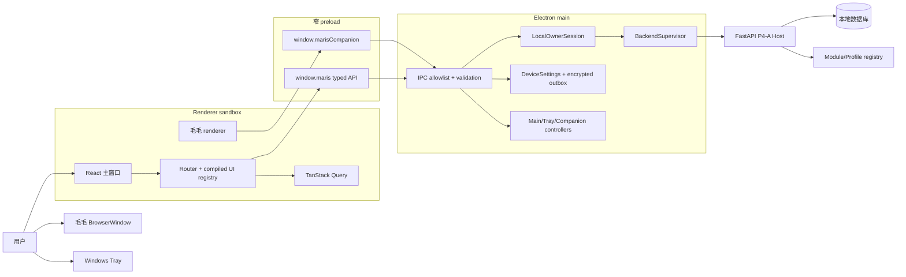
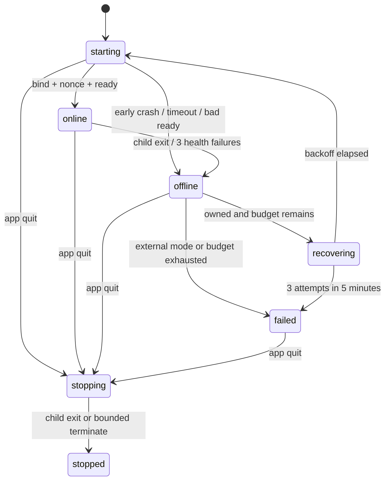
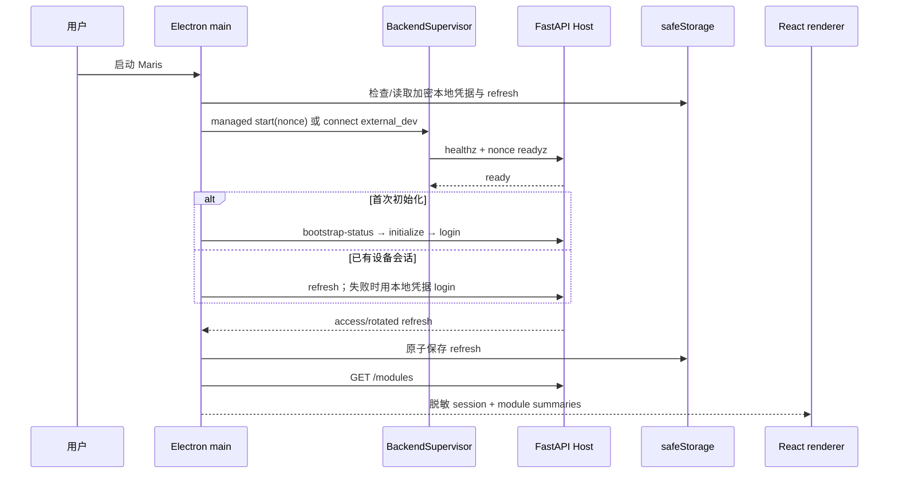
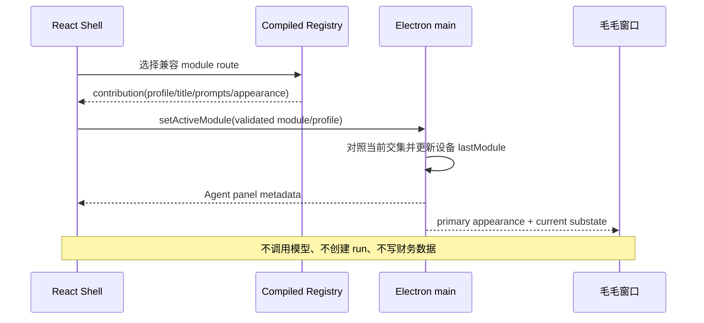
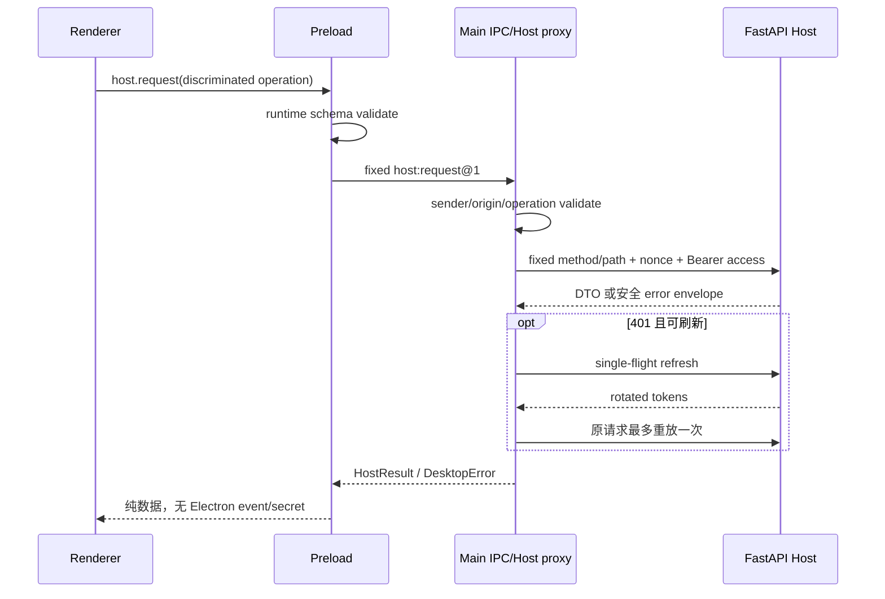
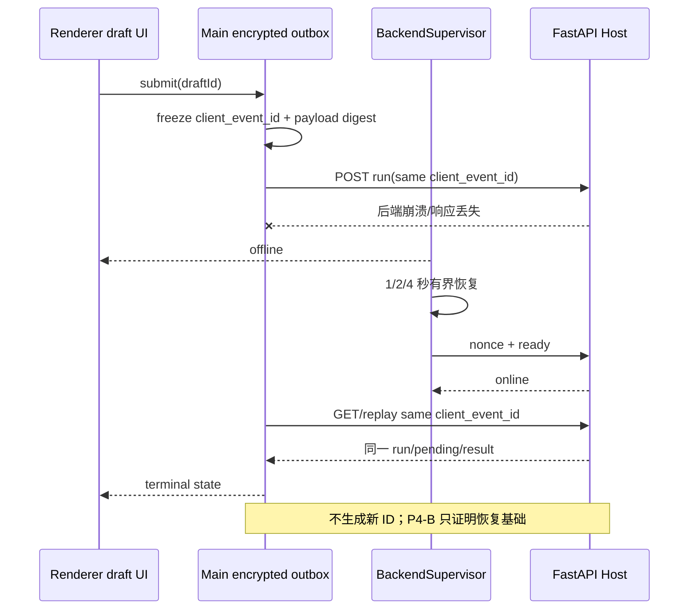

# P4-D11：Windows Shell、毛毛与模块 UI 技术方案

- 任务：`P4-D11`
- 状态：`review / finished`；本文是待总控冻结的技术建议，不是已经实现、测试或冻结的能力
- 控制版本：`2026-09-27T15:15:00+08:00`
- P4-A 输入：总控验收提交 `88fb178`，64/64 项已通过
- P4-B 产品输入：头脑风暴提交 `6b0e485` 及当前工作区视觉基线
- 目标平台：Windows 11 x64，单机、单主人、本地数据库
- 数据边界：只使用虚拟用户、虚拟消息和虚拟财务数据

## 0. 推荐结论与冻结摘要

P4-B 应采用一个 **Electron main / preload / React renderer 安全三层的 Windows Shell**。Electron main 是设备能力、秘密、本地后端、窗口、Tray、毛毛和加密 outbox 的唯一所有者；preload 只把固定的有类型方法暴露给 renderer；renderer 只负责界面、路由和短期交互状态。renderer 不直接访问 Node.js、文件系统、进程、原始 IPC、refresh token、模型密钥或任意 Host URL。

建议总控在 `P4-IF-003` 冻结以下值：

1. 开发运行时用 Node.js `24.x LTS`；桌面运行时用 Electron `44.4.x` 的最新安全 patch，首个候选为 `44.4.5`。Electron、Chromium 和内置 Node 由同一个 Electron 精确版本决定，不能用系统 Node 替换。
2. React `19.3.x`、TypeScript `6.0.x`、React Router `8.4.x`；全部精确 patch 写入锁文件，不使用 `latest` 或宽松 `^` 作为可复现基线。
3. 包管理器用 `pnpm 12.7.x` workspace，候选精确版本 `12.7.0`；根 workspace 首版只包含 `apps/desktop`，Python 仍由 `pyproject.toml` 管理。
4. 构建采用 Electron Forge `7.11.x` + `@electron-forge/plugin-vite` + Vite `7.3.x`。Forge Vite 插件仍被官方标为 experimental，因此必须精确锁版本并设置升级门禁；当前不采用 Forge 8 alpha，也不强行上 Vite 8。
5. 路由用 `createHashRouter`；Host 服务端状态用 TanStack Query v5；临时界面状态优先用 React `useState/useReducer/Context`；P4-B 不引入 Redux/Zustand。出现至少三个跨窗口可写状态域且 Context 已产生实际缺陷时再复评轻量 store。
6. 样式用 CSS Modules + CSS custom properties 语义 token；交互基础件用 Radix Primitives；P4-C/P4-D 图表预留 `ChartAdapter` 和 lazy chunk，P4-B 不安装图表库。
7. OpenAPI 用 `openapi-typescript 7.x + openapi-fetch`。Schema 由本仓库 FastAPI `create_app().openapi()` 离线、确定性导出；运行时禁止下载 Schema。
8. P4-A HTTP DTO 由生成器产生；`DesktopModuleContribution`、IPC、设备设置、窗口和毛毛合同由 TypeScript 手写并做严格运行时校验。两类合同不能混用。
9. main 代理全部 Host 请求并持有 access/refresh token；renderer 只传入判别联合类型的操作和业务参数。refresh token、随机本地 owner 凭据、加密 outbox 由 `safeStorage` 保护并原子落盘，任何明文失败都必须 fail closed。
10. `BackendSupervisor` 支持 `managed` 和 `external_dev` 两种模式，状态固定为 `starting / online / offline / recovering / failed / stopping / stopped`；只停止自己通过子进程句柄启动且实例 nonce 匹配的后端。
11. 未发送消息由 main 的加密 outbox 持久拥有；第一次准备发送时生成并固定 `client_event_id`。断线、重复点击、应用重启均复用同一 ID；第一次提交后修改正文必须派生新 ID。
12. 设备设置使用版本化 JSON、同目录临时文件、flush 后原子替换；账户/模块同步设置继续走 P4-A Host API。设备 JSON 不保存 token、消息正文、账目、模型密钥或启动 nonce。
13. 单一 `CompanionController` 只创建一个毛毛 `BrowserWindow`。模块贡献决定主形态，可信 Shell/Host 状态决定子状态；模块切换不创建第二窗口、第二会话或第二 Agent。
14. 自动化使用 Vitest、React Testing Library、Playwright Electron；多显示器、外部全屏、系统注销、登录启动项和透明/GPU 降级保留目标 Windows 人工证据。Spectron 排除。
15. 建议只派发一个 `P4-B7` 执行任务，使用七个内部里程碑；形成固定快照后再派发 `P4-C12`。技术顾问不创建或启动这些任务。

## 1. 证据口径和当前代码事实

本文严格区分三类信息：

- **官方事实**：框架官方文档明确保证的当前行为或支持策略。
- **代码事实**：提交 `88fb178` 及当前工作区已实现、并由 P4-A 验收支持的行为。
- **项目判断**：建议总控写入 `P4-IF-003` 的 P4-B 唯一值；在实现和独立验收前不能写成产品能力。

### 1.1 P4-A 已经提供的真实接入面

| 已实现事实 | 准确代码位置 | P4-B 用法 |
| --- | --- | --- |
| 所有 Host 合同严格拒绝额外字段，Profile 全局上限为 4/8/1 | [`host/contracts.py`](../src/wife_system/host/contracts.py#L99) | 生成 API 类型时保留严格 DTO；桌面不能扩大 Agent 限制 |
| `AgentProfile` 和 `ModuleManifest` 已有稳定 ID、版本、工具、记忆、权限与设置合同 | [`host/contracts.py`](../src/wife_system/host/contracts.py#L259) | 桌面贡献引用后端 `module_id/profile_id/version`，不复制提示词或工具权限 |
| Python `ModuleDefinition` 把可序列化 manifest 与运行时 callable 分开 | [`host/registry.py`](../src/wife_system/host/registry.py#L50) | TypeScript 只接收安全摘要，不接收 Python factory 或内部路径 |
| registry 启动期拒绝重复 module/Profile/tool/API prefix/route/setting | [`host/registry.py`](../src/wife_system/host/registry.py#L181) | 桌面 compiled registry 实现对称的全量查重，失败时不部分加载 |
| `/api/v1/modules` 返回启用且获准模块的安全摘要 | [`api/host_routes.py`](../src/wife_system/api/host_routes.py#L375) | 与桌面 compiled registry 求交集；缺失项不生成导航 |
| 当前 `ModuleResponse` 只有 module/version/display/profile/API prefix/settings schema | [`api/host_schemas.py`](../src/wife_system/api/host_schemas.py#L104) | UI 路由、图标、starter prompts 和毛毛资源必须来自桌面手写合同 |
| daily 模块真实 ID 为 `daily_finance`，Profile 为 `daily_finance.assistant@1` | [`modules/daily_finance.py`](../src/wife_system/modules/daily_finance.py#L123) | 首个桌面贡献必须精确引用这些值，不使用猜测别名 |
| bootstrap/login/refresh 已返回 access/refresh token 和到期时间 | [`api/host_schemas.py`](../src/wife_system/api/host_schemas.py#L24) | main 负责自动本地 owner 会话，renderer 不保存 refresh token |
| 认证 principal 从 Bearer token 和设备平台构造 | [`api/host_routes.py`](../src/wife_system/api/host_routes.py#L92) | main 附加认证头；module/profile/user 不由 renderer 或模型自报 |
| 统一错误包络包含 `request_id/code/message/retryable`，内部异常被安全替换 | [`api/app.py`](../src/wife_system/api/app.py#L91) | main 把安全字段透传为 `DesktopError`，不传堆栈/SQL/路径 |
| `/healthz` 只表示进程存活；`/readyz` 检查 Host readiness | [`api/app.py`](../src/wife_system/api/app.py#L323)、[`api/host_routes.py`](../src/wife_system/api/host_routes.py#L701) | Supervisor 必须分开处理 alive 与 ready，不能看到 200 health 就开放 UI |
| production factory 显式装配数据库、Finance、Host、Agent 和 activity import | [`api/production.py`](../src/wife_system/api/production.py#L89) | managed sidecar 必须进入这一组合根，不得偷偷使用测试 app 或假服务 |

P4-A 没有 Electron/React 目录、桌面 startup nonce、compiled UI registry、设备设置、加密 outbox、BackendSupervisor、Tray 或毛毛窗口。这些是 P4-B 的待实现范围。P4-A 最终证据见 [总控验收](p4-a-final-coordinator-review.md)；本文不重复 P4-A 测试。

### 1.2 版本事实与冻结策略

截至 2026-09-27：Node 官方把 v24 标为 LTS、v26 标为 Current；Electron 官方稳定发布页列出 44/43/42 三条支持线，44.4.5 携带 Node 24.21.0；React 官方最新为 19.3；TypeScript 官方当前稳定文档为 6.0。Electron 官方只支持最近三个稳定 major，因此“永远固定旧 major”不是安全策略。

推荐采用三层锁定：

1. `packageManager`、`.node-version` 和 CI 精确锁工具版本；
2. `package.json` 对核心构建/安全依赖写精确版本，`pnpm-lock.yaml` 固定完整图；
3. 每月只检查 patch 安全更新；每个 Electron major、React minor/major、TypeScript major 或 Forge/Vite major 单独升级，逐级执行类型、单元、组件、E2E 和 Windows 人工门禁。

版本升级不能和业务功能混在同一验收快照。Electron 安全 patch 不应等到大功能完成才合并；但 major 升级必须逐个 major 阅读 breaking changes。

## 2. 工具链、构建与未来分发

### 2.1 工具链选择

| 项目 | 推荐方案 | 备选方案 | 推荐理由 | 代价 | 何时复评 |
| --- | --- | --- | --- | --- | --- |
| Node.js | `24.x LTS`，候选 `24.21.x` | Node 26 Current | LTS 适合生产构建；与 Electron 44 内置 Node 24 同代，减少双运行时心智差异 | 系统 Node 与 Electron Node 仍是两个运行时，不能混用 ABI | Node 26 进入 LTS且 Forge/Vite/原生依赖门禁通过 |
| Electron | `44.4.x` 最新安全 patch，候选 `44.4.5` | 43.x 支持线 | 当前最新稳定，处于官方三条支持线内；Chromium/Node 安全更新最及时 | 8 周 major 节奏要求持续升级 | 新 major 稳定两周、依赖兼容且 Windows E2E 通过后逐级升级 |
| React | `19.3.x` | React 19.2.7+ | 当前稳定文档线；无需 SSR/RSC，使用普通 SPA 能力 | 新 minor 仍需组件库兼容检查 | Radix、RTL 或 Router 未兼容时暂留 19.2.7+ |
| TypeScript | `6.0.x`，`strict` | 5.9.x | 当前稳定，明确面向现代 ESM；严格类型能把 OpenAPI 漂移定位到调用处 | 6.0 含弃用和默认值变化，需要显式 tsconfig | Forge/Vite 插件或关键类型包不兼容时短期回退 5.9 |
| 包管理器 | `pnpm 12.7.0` workspace | npm workspaces | 严格依赖边界适合 main/preload/renderer 隔离；锁文件和 workspace 清楚；当前版本含供应链控制 | 多学习一个工具；生命周期脚本需显式 allowlist | workspace 始终只有一个包且 pnpm 增加明显排障成本时改 npm |
| workspace | 根 `pnpm-workspace.yaml` + `apps/desktop` | 把 JS 全放 `apps/desktop` 单包 | 为未来 shared contracts/模块 UI 保留边界，同时不搬 Python | 根部新增少量 JS 配置文件 | 第二个 JS 包仍无实际需求时保持单 workspace 包，不拆更多包 |

pnpm 必须启用最小构建脚本 allowlist，只允许 Electron/必要 bundler 的已审计安装脚本；不得允许未知依赖执行 lifecycle script。依赖更新使用 lockfile diff、官方 release note、许可证和安全审计四项门禁。

### 2.2 Electron 构建组合

| 项目 | 推荐方案 | 备选方案 | 推荐理由 | 代价 | 何时复评 |
| --- | --- | --- | --- | --- | --- |
| 开发/打包 | Electron Forge 7.11.x + Forge Vite plugin + Vite 7.3.x | `electron-vite + electron-builder` | Forge 是 Electron 官方偏好的完整打包链，package/make/publish 路径连续；Vite 提供 TS/React 快速开发 | Forge Vite plugin 官方仍标 experimental；必须精确 pin，minor 也不能自动升 | Forge 8 stable 或 plugin 宣布稳定；届时做一条空壳构建对照 |
| Vite 版本 | 7.3 安全维护线 | Vite 8 主线 | Forge 当前兼容风险低；Vite 7.3 仍有安全修复 | 放弃 Vite 8 Rolldown 新收益 | Forge 明确支持 Vite 8且 P4-B 构建/E2E 全通过 |
| Windows 可运行构建 | Forge `package` 生成未签名可运行目录 | 直接 `vite build` 后手工复制 Electron | 能验证真实打包路径、ASAR、preload 和 sidecar 布局 | 输出仍不是面向普通用户的安装器 | P4-B7 里程碑 1 即建立 package smoke |
| 后续安装器 | Forge Maker；Windows 首选 Squirrel 或 WiX，P4-B 不启用发布 | electron-builder NSIS | 与 Forge build lifecycle 一致，可加签名和 publisher | Maker 选择影响更新与安装目录，需发行阶段再冻结 | 用户宣布发行目标、证书和更新通道后 |
| 完全替代 | Tauri 2 + React | 当前不采用 | 更小体积、更强 Rust 边界 | 引入 Rust、WebView2 差异、Python sidecar/透明窗/Tray重新验证；学习路径更散 | Electron 内存/包体或安全维护成本经测量不可接受时 |

P4-B 只要求 `package` 产物在目标 Windows 可运行。签名安装器、证书、发布账号和自动更新全部延后。目录和 Forge 配置要保留 `makers`、`publishers`、Windows signing 与 `autoUpdater` 的扩展位置，但默认不启用网络更新。

## 3. React Shell 技术栈和状态归属

| 项目 | 推荐方案 | 备选方案 | 推荐理由 | 代价 | 何时复评 |
| --- | --- | --- | --- | --- | --- |
| 路由 | React Router 8 `createHashRouter` + lazy route | 自写路由 / BrowserRouter | 打包后的自定义协议和深链恢复稳定；支持 route error boundary | URL 含 hash，桌面应用可接受 | 自定义协议对 history fallback 有完整 E2E 后可改 BrowserRouter |
| Host 服务端状态 | TanStack Query v5 | Redux Toolkit Query | 查询缓存、失效、重试和 request lifecycle 专一；不把权威 Host 数据复制进 UI store | 新增 query key 纪律 | 缓存需求极少到只剩一次启动请求时可移除 |
| 纯 UI 状态 | React state/reducer/context | Zustand | 面板折叠、选中模块、对话输入等规模小，教学路径清楚 | Context 过大可能重渲染 | 至少三个跨窗口可写域或可复现 Context 缺陷时引入 Zustand |
| 表单 | React Hook Form + Zod 4（仅 UI/IPC） | 受控 input + 手写校验 | 表单状态轻；Zod 可在 IPC 边界做运行时判别联合校验 | 与 OpenAPI Schema 有两种类型来源，必须限定边界 | 表单数量很少且原生约束足够时移除 RHF |
| 样式与主题 | CSS Modules + CSS custom properties token | Tailwind / CSS-in-JS | 运行时小、主题和 forced-colors 直观、组件局部作用域清楚 | 需要维护 token 命名 | 页面规模证明原子类显著降低重复时再评估 Tailwind |
| 基础组件 | Radix Primitives，封装为本项目组件 | Mantine / Ant Design | 无样式基础件便于贴近既定视觉，又提供焦点/键盘语义 | 需要自己完成视觉样式 | 交付速度成为主要瓶颈且视觉允许套用完整组件库时 |
| 图表预留 | 手写 `ChartAdapter`，P4-C 再比较 ECharts/Recharts | P4-B 直接安装图表库 | 避免空壳阶段增加体积；后续可 lazy import | P4-B 没有真实图表可看 | P4-C dashboard DTO 冻结时，以中文标签/大数据/无障碍样例选库 |

状态归属必须保持唯一：

| 状态 | 唯一来源 | React 中的表现 |
| --- | --- | --- |
| 模块、Profile、会话、记忆、模块设置 | FastAPI Host | TanStack Query cache；mutation 成功后按 key 失效 |
| 后端 `starting/online/...` | Electron main `BackendSupervisor` | preload 固定订阅 + React external-store adapter |
| refresh/access token、startup nonce | Electron main 内存/安全存储 | renderer 看不到原值，只看 `authenticated/offline/needs_repair` |
| 当前路由、面板折叠、临时 hover/focus | renderer | Router / component state / reducer |
| 关闭策略、窗口位置、毛毛、主题、隐私 | main 设备设置 | renderer 读取脱敏 snapshot，通过 typed IPC 更新 |
| 未发送草稿和已提交 outbox | main 加密 outbox | renderer 编辑副本；main 决定稳定 ID、提交和清除 |

页面切换只改变 route、当前 contribution、Agent panel metadata 和毛毛主形态，不请求模型、不创建 run、不写财务数据。

## 4. 总架构



Electron main 是桌面组合根；Python production factory 是后端组合根。两者通过固定 HTTP/OpenAPI 合同连接，不互相 import 内部代码。P4-B 不把 Host 改成 Electron 内嵌库，也不把 renderer 变成直接数据库客户端。

## 5. 可冻结的模块 UI 注册合同

下面的类型是建议冻结的 TypeScript 合同，不是当前已存在代码：

```ts
declare const moduleIdBrand: unique symbol;
declare const profileIdBrand: unique symbol;
type ModuleId = string & { readonly [moduleIdBrand]: true };
type CanonicalProfileId = string & { readonly [profileIdBrand]: true };
type CompanionStatus =
  | "idle"
  | "listening"
  | "thinking"
  | "tool"
  | "needs_confirmation"
  | "error"
  | "offline";

interface NavigationContribution {
  readonly label: string;
  readonly path: `/${string}`;
  readonly icon: IconKey;
  readonly order: number;
}

interface LazyRouteContribution {
  readonly path: `/${string}`;
  readonly lazy: () => Promise<{ Component: React.ComponentType }>;
}

interface AgentPanelContribution {
  readonly profileId: CanonicalProfileId;
  readonly title: string;
  readonly starterPrompts: readonly {
    readonly id: string;
    readonly label: string;
    readonly text: string;
  }[];
}

interface ModuleSettingContribution {
  readonly key: string;
  readonly schemaVersion: number;
  readonly label: string;
  readonly control: "toggle" | "select" | "number" | "text";
  readonly sensitivity: "normal" | "private";
}

interface CompanionContribution {
  readonly appearanceId: string;
  readonly accessibleName: string;
  readonly visuals: Readonly<Record<CompanionStatus, CompanionVisualKey>>;
}

interface DesktopModuleContribution {
  readonly moduleId: ModuleId;
  readonly version: `${number}.${number}.${number}`;
  readonly hostUiMajor: 1;
  readonly expectedApiPrefixes: readonly `/api/v1/${string}`[];
  readonly navigation: NavigationContribution;
  readonly routes: readonly LazyRouteContribution[];
  readonly agentPanel: AgentPanelContribution;
  readonly settings: readonly ModuleSettingContribution[];
  readonly companion: CompanionContribution;
}
```

`ModuleId` 和 `CanonicalProfileId` 的 brand 只能由统一 runtime parser 在通过 Python 合同相同的 ASCII 语法后创建，普通字符串不能直接当作已验证 ID。`IconKey` 和 `CompanionVisualKey` 只能引用打包时登记的本地资源键，不能是 URL、文件路径或远端 HTML。starter prompt 只预填文字，不自动发送。

### 5.1 编译注册与冲突检查

桌面启动在创建业务 route 前一次性验证全部 contribution：

1. `moduleId`、Profile canonical ID 和 SemVer 采用与 Python Host 相同的 ASCII 语法；不自动 trim、lowercase 或 Unicode 归一化。
2. `hostUiMajor` 必须等于 Shell 当前 major `1`。
3. navigation path、每个 lazy path、`${moduleId}.${setting.key}`、Profile ID 和 appearance ID 全局唯一。
4. 模块 `version` major 必须和后端 Module `version` major 相同。
5. `agentPanel.profileId` 必须存在于后端 `profile_ids`。
6. `expectedApiPrefixes` 必须是后端 `api_prefixes` 的子集。
7. contribution 中最高 `schemaVersion` 必须和后端 `settings_schema_version` 相容；P4-B 首版要求精确相等。
8. 任一编译冲突使桌面 registry fail closed，显示不含内部路径的启动诊断；不得后注册覆盖先注册或只加载一半。

Shell 只能遍历统一 registry，禁止出现 `if (moduleId === "wealth_management")`、switch module ID、按模块 import repository 或特殊 Profile 路由。

### 5.2 后端与桌面交集算法

```text
validatedDesktop = validateCompiledRegistry(allDesktopContributions)
backend = GET /api/v1/modules

for each backend module:
    if desktop contribution missing:
        record safe diagnostic "desktop_module_missing"
        do not navigate or preload

for each desktop contribution:
    if backend summary missing:
        mark unavailable
        do not navigate or preload
    else if hostUiMajor/version/profile/apiPrefix/settings incompatible:
        mark incompatible with safe update hint
        do not navigate or preload
    else:
        expose navigation + lazy route + agent panel + companion mapping
```

当前 P4-A `/modules` 只返回启用模块，所以 fresh launch 时 Shell 无法区分“后端已禁用”和“后端完全缺失”。P4-B 对二者统一使用稳定 `unavailable` 行为：不显示导航、不 preload、不调用 Profile；诊断不声称具体原因。用户刚在当前会话禁用模块时，main 可以显示“已禁用”，但不得从缺失响应反推。这个统一行为无需改 P4-A API，也是本轮推荐默认值。

如果当前 route 对应模块从交集中消失，Shell 回退到第一个兼容模块，优先 `daily_finance` 的排序结果；回退是 registry order 决定，不在 Shell 写 module ID 分支。未知深链显示局部“模块不可用”，不加载远端代码。

## 6. OpenAPI 到 TypeScript

| 项目 | 推荐方案 | 备选方案 | 推荐理由 | 代价 | 何时复评 |
| --- | --- | --- | --- | --- | --- |
| 类型生成 | `openapi-typescript 7.x` | Orval / OpenAPI Generator | 只生成类型、产物小、差异清楚；适合已有 FastAPI 路径合同 | 调用函数需要手写薄封装 | 端点数量大到手写 wrapper 明显重复时复评 Orval |
| 调用层 | `openapi-fetch` | Axios + 手写泛型 | 直接消费生成 `paths`；使用标准 Fetch 语义 | main 仍需包装认证、refresh、超时和错误 | 需要复杂上传/下载拦截器时再评估 |
| Schema 来源 | `create_app().openapi()` 离线导出 | 从运行中 `/openapi.json` 下载 | 不启动服务、不需要数据库/密钥，能在 CI 复现 | 需要一个稳定 normalization 脚本 | FastAPI 以后把 route 注册改成运行时动态时复评 |

建议产物：

```text
apps/desktop/openapi/host.openapi.json
apps/desktop/src/generated/host-api.ts
apps/desktop/src/api/host-client.ts
tools/openapi/export_host_schema.py
```

未来生成形态：

```powershell
python tools/openapi/export_host_schema.py --output apps/desktop/openapi/host.openapi.json
pnpm --filter @maris/desktop generate:api
pnpm --filter @maris/desktop typecheck
pnpm --filter @maris/desktop check:generated
```

`export_host_schema.py` 只导入 [`create_app`](../src/wife_system/api/app.py#L126)、调用 `.openapi()`、排序 JSON key 并写目标文件；不创建 production engine、不读 secret、不启动 Uvicorn。`check:generated` 在临时目录重生成并比较 schema 与 TS 产物，差异即失败。运行时不得访问 `/openapi.json` 或网络生成类型。

必须生成的类型是所有桌面会调用的 FastAPI request、response、path/query 参数和统一 error envelope。不得生成或暴露 Python `ModuleDefinition` callable、内部 repository/model、secret config、IPC、窗口、设备设置或组件 props；这些纯桌面合同手写。

FastAPI DTO 删除 required 字段、修改 enum、改变路径或响应后，`host-client.ts` 的命名 wrapper 和调用组件应在 `tsc --noEmit` 中定位失败。建议 P4-IF-003 为桌面端点补稳定 `operation_id`，但 generated `paths` 仍以 method + path 为最终真相，避免仅重命名 Python 函数造成静默漂移。

## 7. Electron 安全三层与 IPC allowlist

### 7.1 三层职责

| 层 | 必须负责 | 明确禁止 |
| --- | --- | --- |
| main | 应用单实例；窗口/Tray/开机启动；设备设置；`safeStorage`；本地 owner session；Host HTTP 代理；后端子进程；日志和诊断 | 不渲染不可信 HTML；不把 secret/Node/Electron 对象发给 renderer；不接受任意 channel/path/shell 参数 |
| preload | `contextBridge` 暴露固定方法；请求/响应 runtime schema 校验；把事件转换为无 Electron event 的纯数据 | 不暴露 `ipcRenderer`、`send/invoke/on`、`require`、`process`、`Buffer`、文件路径或通用 callback event |
| renderer | React、路由、Query cache、表单、可访问性和视觉 | 不直接读写文件/进程/注册表；不直接 fetch loopback Host；不保存 token/key/nonce；不使用 `dangerouslySetInnerHTML` 渲染外部内容 |

两个窗口都固定：

```ts
webPreferences: {
  contextIsolation: true,
  sandbox: true,
  nodeIntegration: false,
  webSecurity: true,
  allowRunningInsecureContent: false,
  preload: trustedPreloadPath
}
```

主窗口使用 `maris://app/index.html`，毛毛使用 `maris://app/companion.html`；自定义 scheme 注册为 standard/secure。生产环境不加载远端 UI，不使用 `<webview>`，不允许 eval/inline script。开发环境只允许固定 Vite loopback origin，生产构建中不得残留开发 origin。

生产 CSP 起点：

```text
default-src 'none';
script-src 'self';
style-src 'self';
img-src 'self' data:;
font-src 'self';
connect-src 'none';
object-src 'none';
base-uri 'none';
frame-ancestors 'none';
form-action 'none'
```

renderer 的 Host 请求全部走 IPC，所以生产 `connect-src 'none'`。图片只允许打包资源和经过大小/MIME 检查的本地 data URL；后续需要远端图片时另立 allowlist，不扩大当前 CSP。

main 必须：

- 拒绝任意 renderer navigation；只允许主 frame 保持 `maris://app`；
- `setWindowOpenHandler` 默认 deny；外链只接受已解析的 `https:` URL、无 userinfo、命中 host allowlist，再由 main 调 `shell.openExternal`；
- 对应用 session 安装 permission request/check handler，默认拒绝 camera、microphone、geolocation、notifications、clipboard-read 和 MIDI；
- 每个 IPC 同时校验 `senderFrame === sender.mainFrame`、origin、允许的 window/webContents ID 和参数 Schema；
- Forge package 阶段翻转 Electron fuses：禁用 RunAsNode、NODE_OPTIONS、CLI inspect，启用 cookie encryption/ASAR integrity/only-load-app-from-ASAR 等当前平台可用项；精确值在目标 Electron 44 构建测试后冻结。

### 7.2 最小 typed IPC allowlist

所有 request 都用 `ipcMain.handle`/`ipcRenderer.invoke`；所有 main→renderer event 都由 preload 固定订阅并剥离原始 Electron event。没有字符串形式的公开 `invoke(channel, payload)`。

| 公开 preload 方法 | 内部固定 channel | 参数/返回 | 权限与副作用 |
| --- | --- | --- | --- |
| `runtime.getSnapshot()` | `runtime:get-snapshot@1` | 无参数 → 脱敏运行快照 | 只读；无 token/PID/路径 |
| `runtime.subscribe(listener)` | `runtime:state@1` | `BackendStateSnapshot` | preload 只传 payload，并返回 unsubscribe |
| `runtime.recover()` | `runtime:recover@1` | 无参数 → accepted/state | 只触发有界恢复，不接受命令/路径/PID |
| `host.request(request)` | `host:request@1` | `HostRequest` 判别联合 → `HostResult` | main 固定 method/path 表、附 token/nonce；禁止任意 URL/header |
| `deviceSettings.get()` | `device-settings:get@1` | 无参数 → safe snapshot | 不返回磁盘路径、secret 或 outbox 内容 |
| `deviceSettings.update(patch)` | `device-settings:update@1` | 白名单 patch → new snapshot | main 做 schema、版本、范围校验并原子写 |
| `drafts.open(scope)` | `drafts:open@1` | conversation/module → draft | main 创建/恢复稳定 `client_event_id` |
| `drafts.update(value)` | `drafts:update@1` | draft ID + text/version | 长度/版本校验；加密、节流保存 |
| `drafts.submit(id)` | `drafts:submit@1` | draft ID → run receipt | main 固定 payload，重复点击合并 |
| `window.perform(action)` | `window:perform@1` | 固定 action union | 只允许 show/focus/hide/toggle companion；无坐标任意文件操作 |
| `startup.setEnabled(bool)` | `startup:set-enabled@1` | bool → actual bool | 只管理 Maris 自己的登录项 |
| `external.open(linkId)` | `external:open@1` | 已登记 link ID | main 把 ID 映射到固定 HTTPS URL；renderer 不传 URL |
| `diagnostics.getSummary()` | `diagnostics:get-summary@1` | 无参数 → 脱敏摘要 | 不返回日志全文、路径、token、SQL、消息或金额 |
| `app.requestQuit()` | `app:request-quit@1` | 无参数 → accepted | 进入统一 quit 状态机，收口自有后端 |

毛毛 preload 只暴露 `companion.getState()`、`companion.subscribe()`、`companion.openMain()`、`companion.beginDrag()` 中实际需要的子集；不能复用主窗口完整 bridge。

建议的安全错误合同：

```ts
type DesktopError = Readonly<{
  requestId: string | null;
  code: string;
  message: string;
  retryable: boolean;
  area: "ipc" | "backend" | "auth" | "storage" | "window";
}>;
```

main 只接受后端安全 envelope 中的字段。Python traceback、SQL、环境变量、本地路径、子进程 stderr 原文和异常对象只进入脱敏分类器，不穿过 IPC。用户界面始终显示 request ID 或 desktop correlation ID，便于定位而不暴露内部内容。

### 7.3 秘密和本地存储边界

| 数据 | 唯一存放位置 | renderer 能看到什么 |
| --- | --- | --- |
| access token | main 内存 | 仅 `authenticated: true/false` |
| refresh/device token | main 内存 + `safeStorage` 加密 blob | 不可见 |
| 自动本地 owner 随机凭据 | main `safeStorage` 加密 blob | 不可见 |
| 模型 API key | P4-B 不需要；未来只在 Python 后端 secret provider | 仅 provider 是否可用，不见 key |
| startup nonce | main 与本次 managed child 内存；每次启动重建 | 不可见 |
| 设备设置 | `app.getPath("userData")` 下版本化 JSON | 经过白名单的 snapshot |
| 草稿/outbox | 独立 `safeStorage` 加密文件 | 当前 draft 的必要正文和状态 |
| 诊断日志 | main/backend 分离的轮转日志 | 脱敏摘要，不返回原文件路径或全文 |
| localStorage/sessionStorage/IndexedDB | 只允许非敏感视觉缓存；首版尽量不用 | 禁止 token、凭据、消息、账目、ID 映射、nonce、日志 |

Windows `safeStorage` 使用 DPAPI，主要保护其他 Windows 用户，不能防同一 Windows 用户空间中的恶意程序。因此它是本地单主人产品的最小磁盘保护，不是硬件保险库。Electron 的 `encryptString`/`decryptString` 是 main 进程同步 API，只处理很小的凭据与 outbox 单元，并把频繁持久化交给节流队列；不可用或解密失败时不能回退明文，应进入 `needs_local_session_repair`/`storage_unavailable` 安全状态。

### 7.4 P4B-SEC-01～08 映射

| 案例 | 本文设计证据 | 未来主要自动/人工断言 |
| --- | --- | --- |
| P4B-SEC-01 | 三层配置与禁用 Node | 构建配置静态断言 + renderer 探测 `require/process/fs/child_process` 均不存在 |
| P4B-SEC-02 | custom scheme、CSP、navigation/window deny、固定外链 ID | 恶意 URL/新窗/inline script 全拒绝，允许外链只在系统浏览器打开 |
| P4B-SEC-03 | 固定 preload API 表 | 枚举 `window.maris`，与 allowlist 精确相等，无原始 IPC |
| P4B-SEC-04 | sender/origin/window/Schema 四重校验 | 伪 sender、subframe、错型、额外字段、未知动作零副作用 |
| P4B-SEC-05 | main-only token/key + safeStorage fail closed | 扫描三种 Web storage、renderer heap、日志和 crash canary |
| P4B-SEC-06 | main 代理、nonce、loopback、Origin 拒绝和 Bearer | 仅端口、坏 nonce、浏览器 Origin、过期 token、远程地址均失败 |
| P4B-SEC-07 | text node、无 raw HTML、长度/RTL 布局边界 | script/event/超长/RTL fixture 不执行且不撑破布局 |
| P4B-SEC-08 | `DesktopError` 与脱敏日志 | preload/backend/lazy 故障只显示安全 message + request ID |

## 8. 自动本地 owner 会话

P4-B 不增加公众注册、第二用户、云账户或常规登录页面。桌面采用 P4-A 已实现的 bootstrap owner、login、refresh 和 session，只把调用编排放进 main。

### 8.1 首次启动

1. main 启动并确认 `safeStorage` 可用；先生成 256-bit 随机本地 owner 凭据、client fingerprint 和设备 ID 材料，写入加密临时 blob。
2. managed backend 每次启动取得随机 bootstrap token；main 只在内存中持有该 token，后端从受控启动配置取得。
3. main 调 `GET /api/v1/auth/bootstrap-status`。若需要初始化，用固定非个人 handle `local_owner`、随机高熵密码、`Idempotency-Key` 和 bootstrap token 调现有 `/auth/initialize`。
4. 初始化成功后，main 用保存的随机凭据调 `/auth/login`，platform 固定 `windows_desktop`；access token 留内存，refresh token 加密原子保存。
5. 只有加密临时 blob 和 refresh blob 都能恢复后，才把 session 标为 ready；初始化失败清理本次临时材料，不能把原文写日志。

必须先成功创建可恢复的加密凭据，再调用一次性初始化，避免数据库已经初始化而 main 丢失唯一凭据。P4-B 的“自动本地 owner”是 main 代表当前 Windows 用户管理随机设备凭据；它不代表绕过后端 session、把端口当认证或让 renderer自报 user ID。

### 8.2 后续启动、撤销和恢复

```text
读取加密 refresh token
  → 尝试 /auth/refresh
  → 成功：原子保存轮换 token，access 留 main 内存
  → refresh expired/replayed/revoked：读取加密本地 owner 凭据并 /auth/login
  → owner disabled / safeStorage 不可用：needs_local_session_repair，禁止业务请求
```

后端重启不会自动改变数据库 session；main 先恢复 ready，再用现有 access 调一个受保护的只读端点。401 时最多刷新一次，原请求随后最多重放一次。并发 401 由 main 的 single-flight refresh 合并，避免同一旧 refresh token 并发触发 session family 撤销。

用户从账户页显式撤销当前设备或 logout 后，main 清除 access/refresh 并保持 `signed_out_local`，不偷偷自动登录；恢复必须由同一页面的明确“恢复本地会话”动作触发。这个动作使用 OS 保护的本地凭据，不出现公众登录 UI。

未来“应用锁”只控制何时允许 main 解密/使用本地凭据，可接 Windows Hello 或 PIN；它不创建新 `app_user`、不改变 user scope，也不替代后端 session 撤销。

## 9. BackendSupervisor

### 9.1 两种模式和所有权

| 模式 | 启动方式 | nonce/会话 | 停止责任 |
| --- | --- | --- | --- |
| `managed` | main 以 `windowsHide: true`、单 worker、无 reload 启动 Python sidecar | main 生成 startup nonce并验证 ready；随后恢复 owner session | 仅启动它的同一 main 通过子进程句柄停止 |
| `external_dev` | 开发者手工启动 production factory，桌面读取显式 dev URL/nonce | 开发者提供本次 dev nonce；仍需真实 owner session | Electron 永不停止、不重启、不取得进程所有权 |

生产不允许用户在 UI 输入任意 executable、参数、工作目录或 URL。managed 命令来自打包配置白名单；external dev 只在 development build 启用，URL 必须是 `http://127.0.0.1:<port>` 或 `http://[::1]:<port>`。

### 9.2 ready 协议

当前 P4-A `/healthz` 和 `/readyz` 必须保留。P4-B 在 Python sidecar launcher 增加一条只用于父子进程握手的机器行：

```json
{
  "protocol": 1,
  "event": "maris_backend_bound",
  "instance_id": "virtual-uuid",
  "port": 49152,
  "nonce_sha256": "64-lower-hex"
}
```

实际输出使用固定前缀 `MARIS_READY `，并写到专用 pipe 或受控 stdout parser；日志不得输出原 nonce。流程是：

1. main 生成 32-byte nonce，让 sidecar 在 `127.0.0.1:0` 绑定随机端口；如果当前 Uvicorn 启动封装不能可靠报告 port 0，则 main 预选端口并对 `EADDRINUSE` 最多换端口三次。
2. sidecar 绑定成功后输出 port、instance ID 和 nonce digest；main 校验消息来自本次 child pipe、协议版本和 digest。
3. main 调 `/healthz` 验证进程 HTTP alive，再带 `X-Maris-Startup-Nonce` 调 `/readyz`；P4-IF-003 应给 desktop production profile 增加 nonce 校验，原 nonce永不进入 renderer。
4. `/readyz` 只有数据库、Alembic head、module registry 和 provider readiness 全部满足才返回 200。503 保持 `starting`，直到 30 秒 ready deadline。
5. bad nonce、实例 ID 变化、端口非 loopback、提前 EOF 或超时使启动失败并清理本次自有 child；不能连接恰好占用该端口的其他服务。

`healthz=200` 只证明 alive；`readyz=200 + nonce/instance match` 才能进入 `online`。端口不是认证。保护业务 API仍需要 main 持有的 access token。

### 9.3 状态机、超时和有界恢复



冻结参数建议：

- ready deadline：30 秒；轮询从 250 ms 退避到 1 秒；
- online health：每 5 秒一次，连续 3 次失败才判 offline；child exit 立即判 offline；
- managed 重启预算：5 分钟内最多 3 次，退避 `1s / 2s / 4s` 并加 0～250 ms jitter；稳定 online 10 分钟后重置预算；
- graceful stop：先请求 sidecar 内部 shutdown，最多等 5 秒；随后只对记录的 direct child handle 终止；单 worker、无 reload，避免子进程树扩散；
- external dev：从不自动 restart/kill，只把状态变为 offline/failed并允许重新连接。

“PID + nonce”是诊断身份，真正的停止权来自 main 保存的 `ChildProcess` 句柄和 `ownership=managed`。仅凭 PID 不允许执行 `taskkill`，以免 PID 复用伤及别的进程。

### 9.4 Windows 退出与资源收口

- 正常 Quit、Tray Quit、更新前退出都走同一 `requestQuit()`：阻止新请求 → flush 设置/outbox → supervisor `stopping` → destroy 窗口/Tray → `app.quit()`。
- 主窗口关闭若策略为隐藏，不停止后端。
- `before-quit` 设置 `isQuitting`，避免 close handler 把真正退出重新隐藏。
- 系统 `query-session-end/session-end` 只有有限时间：立即停止接收新请求、flush 原子文件、请求后端退出；如果 OS 强制结束，下一启动依赖数据库事务和同一 client event 恢复。
- Electron/main 崩溃无法保证清理；managed 后端使用父进程存活探针或 Windows Job Object 作为后续增强。P4-B 首版先用单 worker + parent PID watcher；此行为必须在目标 Windows 实测，当前为 `unverified`。

### 9.5 源码与未来打包 sidecar

开发源码命令可以调用当前 Python 环境中的 `python -m wife_system.desktop_sidecar`；正式 package 使用确定路径的随包 sidecar。两者必须产生相同 ready 协议、日志 Schema 和 shutdown 行为。renderer 与 React 代码不能知道 Python executable 路径。

正式 sidecar 打包工具（PyInstaller、Nuitka 或嵌入 Python）不在 P4-B 先决定。P4-B 的 Windows package 可要求开发机有受控 Python 环境；当需要给普通用户分发时再以启动时间、体积、杀毒误报和 migration 支持做 sidecar 打包实验。

### 9.6 日志和用户诊断

main 与 backend 分文件，建议每个 5 MiB、保留 5 个轮转文件。字段只允许 timestamp、level、component、event、state、instance digest 前 12 位、request/correlation ID、safe error code、retryable、attempt 和 duration。禁止 token、nonce、header、消息正文、账目、SQL、路径、环境变量和 stderr 原文。

用户可见诊断摘要只含：桌面版本、Electron major、后端状态、安全错误码、最近 request ID、恢复次数、是否 managed、数据库/registry/provider 的 ready 布尔值。不显示 PID、端口、用户名或文件路径。

### 9.7 P4B-SUP-01～06 映射

| 案例 | 本文设计证据 | 未来主要断言 |
| --- | --- | --- |
| P4B-SUP-01 | ChildProcess 句柄 + ownership + nonce/instance | 自有 child 可停；手工 backend、伪 PID 和他实例不受影响 |
| P4B-SUP-02 | port 0/有限换端口、ready line、health/ready 分离、30 秒 | 冲突/坏 nonce/无 ready/超时均清理本次 child并给安全诊断 |
| P4B-SUP-03 | 3/5 分钟重启预算、1/2/4 秒退避 | 启动前/后崩溃进入正确状态，无重启风暴或重复 run |
| P4B-SUP-04 | managed/external_dev 明确模式 + single instance | 重复 app 不产生第二 backend；dev backend 永不被桌面停止 |
| P4B-SUP-05 | 统一 quit、5 秒 stop、单 worker、session-end处理 | 目标 Windows 检查无自有僵尸/端口锁；必须人工证据 |
| P4B-SUP-06 | main 加密 outbox + stable client event | offline/restart/重复点击复用 ID，最终只创建一次 run/候选 |

## 10. 未发送消息、离线恢复和幂等所有权

main 为每个 `(conversation_id, module_id, profile_id)` 维护一条加密 draft/outbox 记录：

```ts
type OutboxItem = Readonly<{
  schemaVersion: 1;
  draftId: string;
  clientEventId: string;
  scope: { conversationId: string; moduleId: string; profileId: string };
  text: string;
  payloadSha256: string;
  state: "draft" | "queued" | "submitting" | "awaiting_result" | "terminal";
  createdAt: string;
  updatedAt: string;
  runId: string | null;
}>;
```

所有权规则：

1. main 创建 `draftId/clientEventId` 并加密保存；renderer 只编辑这个记录的版本化副本。
2. 第一次网络提交前，用户可以修改正文但 ID 不变；main 每次更新 payload digest。
3. 第一次提交发生后，`clientEventId + payloadSha256` 冻结。用户要改正文时建立新 draft 和新 ID，旧 run 保留查询能力，避免同键异载荷冲突。
4. 后端离线时 `queued` 保留；恢复后由 main single-flight 提交。同一按钮重复点击只订阅同一个 Promise。
5. 收到 run ID 后进入 `awaiting_result`。响应丢失或应用重启用同一 `client_event_id` 查询/重放；不得生成新 ID。
6. 只有 Host 返回可恢复的终态并且 main 已原子保存 terminal receipt 后，才删除正文；用户显式“放弃草稿”也可删除。切换页面、隐藏窗口、断线、renderer reload 和应用重启都不能丢弃。
7. outbox 只保证消息/run/candidate 层的同 ID 恢复；P4-C 的候选确认和 FinanceService 事务幂等仍是最终一次写账保证。P4-B 不宣称已经完成桌面写账闭环。

加密 outbox 与普通设备设置分文件，最多保留冻结数量和期限；建议首版最多 20 条、terminal 24 小时后清理、未提交草稿 30 天后提示用户处理。期限属于可逆默认值，P4-IF-003 可直接冻结。

## 11. 主窗口、Tray、单实例和关闭策略

### 11.1 单实例与窗口生命周期

1. main 在创建任何窗口或后端前调用 `app.requestSingleInstanceLock()`。
2. 第二实例没有锁就立即退出；其参数通过 `second-instance` 交给主实例，主实例只处理已知 deep-link/action，随后显示、恢复、聚焦主窗口。
3. 主窗口尽早显示 Shell 骨架和 `starting/offline`，不伪造业务数据；Host ready 后再加载模块交集。
4. hide 不销毁 renderer session；真正 quit 才销毁窗口并停止自有后端。
5. 只有一个 `MainWindowController`、一个 Tray、一个 `CompanionController` 和一个 Supervisor。

### 11.2 精确关闭状态

```ts
type ClosePolicy = "hide_to_tray" | "ask_every_time" | "quit";
```

- 新设备默认 `hide_to_tray`、`closeHintShown=false`。第一次点关闭：阻止 close、隐藏到 Tray、显示一次非敏感系统提示，然后原子保存 `closeHintShown=true`。
- `hide_to_tray`：以后直接隐藏，不再提示。
- `ask_every_time`：每次出现“隐藏 / 退出 / 取消”；取消保持窗口；隐藏不停止 backend；退出进入统一 quit。
- `quit`：直接进入统一 quit，不额外询问。
- Tray 菜单固定“打开 Maris / 隐藏主窗口 / 显示或隐藏毛毛 / 隐私模式 / 退出”。Tray 的退出总是显式退出，不受 close policy 改写。

### 11.3 开机启动

默认关闭。只有用户显式切换后，main 调 `app.setLoginItemSettings` 创建 Maris 自己的启动项；设置中读取 OS 实际状态而不是只相信 JSON。禁用时只清理匹配当前 app path/args 的 Maris 项，不枚举或修改其他应用。开发构建不写真实登录项，使用可替换 adapter 测试。

登录启动、Squirrel 首次运行参数和路径稳定性依赖 packaged build；必须以目标 Windows package 人工验证，当前为 `unverified`。

## 12. 毛毛窗口与设备设置

### 12.1 唯一毛毛窗口

建议配置：

```ts
new BrowserWindow({
  width: 176,
  height: 176,
  minWidth: 128,
  minHeight: 128,
  transparent: true,
  frame: false,
  resizable: true,
  alwaysOnTop: deviceSettings.companion.alwaysOnTop, // 默认 false
  skipTaskbar: true,
  focusable: true,
  show: false,
  webPreferences: secureCompanionPreferences
});
```

这些是首轮建议尺寸，实际以视觉素材和 100%/125%/150% DPI 人工检查微调。关键合同是透明、无边框、可拖动、默认不置顶、可键盘聚焦和可安全降级，不是固定像素。

毛毛默认不启用 click-through：点击毛毛必须能打开/聚焦主窗口并展开当前模块 Agent，键盘也必须能完成同一动作。`setIgnoreMouseEvents` 会破坏发现性和无障碍，P4-B 不开放该设置。拖动只在明确的 `-webkit-app-region: drag` 区域生效，按钮区域为 `no-drag`。

`CompanionController` 的状态来源：

- 主形态：当前可用 `DesktopModuleContribution.companion.appearanceId`；
- 子状态：main 汇总的后端/Agent 状态，优先级固定为 `offline > error > needs_confirmation > tool > thinking > listening > idle`；
- 隐私覆盖：隐私模式下气泡只显示通用状态，不显示金额、账户、消息正文或候选摘要；
- reduced motion：用静态帧/淡入淡出替代循环动画；
- 模块切换：只更新一个窗口的主形态，不创建新窗口、conversation、run 或 Agent。

透明/GPU/合成失败的判定需要真实运行证据：窗口出现黑底、严重闪烁、点击区域错位、屏幕阅读器不可达或 GPU crash 重复达到两次时，当前设备设置 `companion.windowMode` 自动切为 `mini_window`。普通迷你窗保留相同 bridge、状态、点击入口和隐私合同，并显示普通标题栏/实色背景。降级结果原子保存，用户可手动重新试验透明模式。

### 12.2 多显示器、DPI、全屏和拔屏

- Electron 窗口 bounds 按 DIP 保存，不手工乘 `scaleFactor`；素材提供 1x/2x 或 SVG。
- 保存 `displayId`、bounds 和相对于 display workArea 的归一化锚点。恢复时先找原 display；缺失时找离旧中心最近的 display。
- clamp 保证至少 32 DIP 可见且标题/主要点击区在 `workArea` 内；窗口不得夹到任务栏后面。
- 监听 display-added/removed/metrics-changed；拖动/resize 结束 250 ms debounce 保存，退出前立即 flush。
- Maris 自己进入 fullscreen 时可靠隐藏毛毛；外部应用 fullscreen 检测需要 Win32 前台窗口能力，Electron 核心 API没有足够保证。首版通过窄 `FullscreenDetector` adapter 实现并在目标 Windows 手工验证；若 adapter 不可用则保留手动隐藏/隐私快捷入口，不伪报“所有全屏已自动检测”。
- 拔屏、分辨率或缩放改变时先 clamp 再 show，避免窗口永久落在不可见区域。

`FullscreenDetector` 是本任务的主要平台风险。推荐 P4-B7 先实现可替换接口和 Maris 自身 fullscreen；再用维护良好、可审计的 Win32/N-API helper 做外部 fullscreen spike。若 spike 需要未经维护的通用窗口侦测包，P4-IF-003 应把“外部应用全屏自动隐藏”标为 P4-B 的 `unverified/manual` 能力并保留安全手动降级，而不是引入高风险原生依赖。

### 12.3 设备设置 Schema、迁移和原子写入

```ts
interface DeviceSettingsV1 {
  readonly schemaVersion: 1;
  readonly mainWindow: {
    readonly bounds: WindowBounds | null;
    readonly maximized: boolean;
  };
  readonly companion: {
    readonly enabled: boolean;
    readonly windowMode: "transparent" | "mini_window";
    readonly bounds: WindowBounds | null;
    readonly displayId: string | null;
    readonly alwaysOnTop: boolean;
    readonly hideInFullscreen: boolean;
  };
  readonly closePolicy: "hide_to_tray" | "ask_every_time" | "quit";
  readonly closeHintShown: boolean;
  readonly launchAtLogin: boolean;
  readonly privacyMode: boolean;
  readonly appearance: {
    readonly colorMode: "system" | "light" | "dark";
    readonly contrast: "system" | "more";
    readonly motion: "system" | "reduce";
    readonly marketColorConvention: "china" | "international";
  };
  readonly lastModuleId: string | null;
}
```

默认值：毛毛启用、透明候选模式、非置顶、全屏隐藏、关闭到 Tray、开机启动关闭、隐私关闭、颜色/对比/动态跟随系统、中国行情色、最后模块为空。

存储路径由 `app.getPath("userData")` 决定，固定文件名 `device-settings.json`。写入过程：严格验证 → 序列化 canonical JSON → 同目录唯一临时文件 → flush 文件 → replace/rename → 更新内存 snapshot。节流仅合并拖动事件；退出前必须 flush。加载损坏文件时保留脱敏命名的 `.corrupt-<timestamp>` 备份、使用安全默认值，并只记录错误码。

迁移是纯函数 `migrateV1ToV2`，逐版本执行并带 fixture 测试；遇到未来版本不能覆盖原文件，进入只读默认模式并提示升级。JSON 禁止 token、nonce、凭据、API key、消息、账目、个人名称和完整诊断日志。

账户同步和设备本地边界：

- Host module setting：模块是否启用、assistant mode 等跨会话业务偏好，经 [`PUT /api/v1/settings/{module_id}`](../src/wife_system/api/host_routes.py#L671) 持久化；
- device setting：窗口、显示器、Tray、开机启动、毛毛、主题、隐私和最后 route，只在本设备 JSON；
- runtime state：连接、当前 run、临时 hover/打开状态，不作为长期设置；
- outbox：独立加密文件，不塞进 settings JSON 或 module setting。

## 13. 主题、视觉实现和安全布局

### 13.1 语义 token

```css
:root {
  --surface-canvas: ...;
  --surface-panel: ...;
  --surface-raised: ...;
  --text-primary: ...;
  --text-secondary: ...;
  --text-on-accent: ...;
  --accent-primary: ...;
  --status-success: ...;
  --status-warning: ...;
  --status-danger: ...;
  --finance-income: ...;
  --finance-expense: ...;
  --market-up: ...;
  --market-down: ...;
  --focus-ring: ...;
  --border-subtle: ...;
}
```

`market-up/down` 根据 `china/international` 映射红绿；`finance-income/expense` 使用独立蓝紫/橙色族并配图标和正负号，禁止复用行情红绿。success/danger 也不能只靠颜色表达。所有文本、图标和 focus ring 按 WCAG 2.2 AA 目标检查；high contrast 下使用 `forced-colors` 和系统色，不强行保留品牌色。

可见主题能力固定为 `system / light / dark / high-contrast / reduced-motion`：前三项由 `colorMode` 选择，后两项分别由 `contrast` 与 `motion` 表达，并允许系统强制值覆盖。主题来源优先级是用户设备选择 → system；high contrast 和 reduced motion 覆盖动画/装饰，但不覆盖财务语义文字。main 监听 `nativeTheme`/系统变化并广播纯枚举，renderer 设置 `data-theme/data-contrast/data-motion`。

### 13.2 三栏断点

| 宽度（DIP/CSS px） | 左栏 | 中间 | 右侧 Agent |
| --- | --- | --- | --- |
| `>= 1360` | 216 px 标签导航 | 弹性主区 | 320 px 展开 |
| `1120..1359` | 72 px 图标导航 | 弹性主区 | 288 px，可折叠 |
| `960..1119` | 64 px 图标导航 | 全宽主区 | 默认收起为 drawer |

主窗口建议 `minWidth=960`、`minHeight=680`；最终值必须在 100%/125%/150% 缩放检查。Agent drawer 打开后焦点锁在面板内，Escape 关闭并归还触发按钮；折叠状态是设备 UI 偏好，不影响 Agent Profile。

### 13.3 恶意、超长与 RTL 文本

- React 只把动态值作为 text node；禁止 raw HTML。将来 Markdown 使用禁用 HTML 的 parser + 明确 allowlist/sanitizer。
- 容器使用 `min-width: 0`、`overflow-wrap: anywhere`、有界高度和虚拟滚动；不能让长 token 撑开三栏。
- 用户文本容器 `dir="auto"`、`unicode-bidi: plaintext`；ID/request code 用 `dir="ltr"` 和等宽字体，防止 bidi 伪装。
- backend 已限制单消息 32 KiB；通知、导航标签和 starter prompt 再设显示上限，超出显示省略并保留可访问完整说明，不把全文写日志。
- 图标必须有可访问名称；纯装饰插画 `aria-hidden`。毛毛的状态由文本/live region 辅助，动画不是唯一提示。

最终图标、插画和毛毛美术不在 D11/P4-B 技术方案生成。未来资源进入 `apps/desktop/assets`，经过许可证、尺寸、透明边缘、深浅主题和高对比检查，再映射为编译期资源 key。

## 14. 测试策略和 24 项矩阵闭环

### 14.1 分层工具选择

| 项目 | 推荐方案 | 备选方案 | 推荐理由 | 代价 | 何时复评 |
| --- | --- | --- | --- | --- | --- |
| TS 单元 | Vitest（Node/jsdom 分项目） | Jest | 与 Vite 配置接近、运行快；适合合同和纯状态机 | 不能证明 Electron 安全进程 | Vite 被替换时复评 |
| React 组件 | React Testing Library + user-event + jsdom | Playwright Component | 以用户语义断言，适合路由/主题/错误边界 | 不能证明原生窗口/Tray | 组件依赖真实 Chromium API过多时补 Playwright CT |
| main/preload/IPC | 纯函数/adapter 单测 + packaged contract probe | 只做 E2E | sender/Schema/allowlist 可穷举，失败定位快 | 仍需真实 Electron 证明进程隔离 | Electron 提供更稳定的内建 test harness 时 |
| Electron E2E | Playwright `_electron` + Windows runner | WebdriverIO Electron service | 能控制 Electron app、renderer 和 main；团队已有 Playwright 学习价值 | 官方仍标 experimental，native dialog需 main stub | Playwright Electron 连续两个 release 阻断或 Forge 构建不兼容时改 WDIO |
| 安全静态门禁 | ESLint/type-aware rules + restricted imports + CSP/fuse/config tests | Electronegativity/Semgrep | 规则可与本项目边界一一对应，误报可控 | 需维护自定义规则 | 第三方安全工具对 Electron 44 有稳定规则并能降低维护成本时 |
| Windows 人工 | 固定 package + 证据模板 | 仅 CI 截图 | 多屏、全屏、登录项、注销、GPU/透明窗无法稳定完全自动化 | 需要真实设备和人工时间 | Electron/Windows 提供可靠可自动化接口后减少人工 |

Spectron 已停止维护且不支持现代 Electron 安全模型，排除。Playwright Electron 的 experimental 状态必须写入运行说明；执行方 E2E 是自测，不能称为独立验收。

### 14.2 执行方与独立验收边界

- P4-B7 执行方在 `apps/desktop/tests/**` 编写合同、单元、组件、main/preload、最小 packaged E2E，并提交固定依赖/构建/产物摘要；状态只能到 `review`。
- P4-C12 测试智能体在 `tests/independent/desktop/**` 实现安全反例、故障、恢复、目标 Windows E2E 和人工证据；复跑执行方套件时单独统计。
- 技术顾问的文档结构检查不等于任何 P4-B 案例通过。当前 24 项全部保持 `not_run`。

### 14.3 P4B-UI-01～04 映射

| 案例 | 本文设计证据 | 未来主要断言 |
| --- | --- | --- |
| P4B-UI-01 | 严格 compiled registry + 后端交集算法 | enabled/absent/unknown/incompatible fixture 只显示兼容交集，不 preload |
| P4B-UI-02 | lazy route + 局部 error boundary | chunk 首次失败可重试；Shell、会话和其他模块保持 |
| P4B-UI-03 | 离线 OpenAPI 导出、checked-in 产物、diff + tsc | 字段/enum/required 漂移使门禁失败并定位调用处 |
| P4B-UI-04 | contribution 合同和全局冲突检查 | hostUiMajor/route/setting/profile/appearance 冲突 fail closed；无 module ID 分支 |

### 14.4 P4B-CMP-01～06 映射

| 案例 | 本文设计证据 | 未来主要断言 |
| --- | --- | --- |
| P4B-CMP-01 | 单一 CompanionController；形态/子状态分离 | 连续切模块和七种状态始终一个窗口/入口，不创建 run |
| P4B-CMP-02 | `closeHintShown` + `hide_to_tray` | 第一次隐藏并提示，第二次不重复；Tray 恢复无状态丢失 |
| P4B-CMP-03 | 三值 close policy + 统一 quit | hide/ask/quit/取消与 Tray 状态精确一致，自有 backend 只在 quit 停 |
| P4B-CMP-04 | 登录项 adapter，默认 false | packaged fresh profile 无启动项；显式开/关只改 Maris 项；人工证据 |
| P4B-CMP-05 | DIP bounds、display clamp、atomic settings、隐私/键盘 | 多屏/缩放/拔屏/全屏/重启/键盘逐项人工记录 |
| P4B-CMP-06 | transparent→mini 降级、token/high contrast/reduced motion/颜色分域 | 两类设备路径功能一致；焦点和对比可见；财务色与行情色分离 |

### 14.5 Windows 人工证据模板

每项人工验收记录：固定文件摘要、Maris/Electron/Windows 版本、显示器数量与缩放、GPU/透明模式、操作步骤、预期、实际、脱敏截图或短录屏、开始/结束进程列表、安全日志摘要和资源收口。系统注销测试先使用虚拟草稿，不使用真实个人数据。截图不得出现 token、路径用户名、账号标识或真实金额。

## 15. 建议目录、命令和开发数据流

### 15.1 目录

```text
pnpm-workspace.yaml
pnpm-lock.yaml
apps/desktop/
├── package.json
├── forge.config.ts
├── vite.main.config.ts
├── vite.preload.config.ts
├── vite.renderer.config.ts
├── openapi/
│   └── host.openapi.json
├── assets/
│   └── placeholders/
├── electron/
│   ├── main/
│   │   ├── index.ts
│   │   ├── backend-supervisor.ts
│   │   ├── local-owner-session.ts
│   │   ├── host-proxy.ts
│   │   ├── device-settings.ts
│   │   ├── encrypted-outbox.ts
│   │   ├── ipc.ts
│   │   ├── windows.ts
│   │   ├── tray.ts
│   │   └── diagnostics.ts
│   └── preload/
│       ├── main-window.ts
│       ├── companion.ts
│       └── contracts.ts
├── src/
│   ├── shell/
│   │   ├── App.tsx
│   │   ├── router.tsx
│   │   ├── module-registry.ts
│   │   ├── module-intersection.ts
│   │   └── error-boundaries.tsx
│   ├── modules/
│   │   └── daily-finance/
│   │       ├── contribution.ts
│   │       └── WelcomePage.tsx
│   ├── assistant/
│   ├── companion/
│   ├── settings/
│   ├── theme/
│   ├── api/
│   │   └── host-client.ts
│   ├── generated/
│   │   └── host-api.ts
│   └── shared/
│       └── contracts.ts
└── tests/
    ├── unit/
    ├── component/
    ├── ipc/
    ├── e2e/
    └── fixtures/

tools/openapi/
└── export_host_schema.py

src/wife_system/
└── desktop_sidecar.py          # P4-B7 需要时新增的窄启动/ready/shutdown 适配
```

`electron/main`、`electron/preload`、`src` 使用各自 tsconfig project reference，防止 renderer import main/Electron。`src/modules` 只放 UI contribution 和页面，不 import Python 内部概念。OpenAPI generated 文件不手改。

### 15.2 未来命令形态

这些是 P4-B7 的建议脚本名称，本任务没有执行：

```powershell
corepack prepare pnpm@12.7.0 --activate
pnpm install --frozen-lockfile
pnpm --filter @maris/desktop generate:api
pnpm --filter @maris/desktop check:generated
pnpm --filter @maris/desktop dev
pnpm --filter @maris/desktop typecheck
pnpm --filter @maris/desktop lint
pnpm --filter @maris/desktop test:unit
pnpm --filter @maris/desktop test:component
pnpm --filter @maris/desktop test:ipc
pnpm --filter @maris/desktop test:e2e
pnpm --filter @maris/desktop package:win
pnpm --filter @maris/desktop make:win
```

`make:win` 在 P4-B 只作为未来命令占位，默认门禁使用 `package:win`。`publish`、签名和 auto-update 脚本在发行任务冻结前不得启用。

### 15.3 启动与本地 owner 会话



### 15.4 模块切换 → Agent Profile → 毛毛形态



### 15.5 renderer → preload → main → Host API



### 15.6 后端崩溃 → offline → 有界恢复 → 同 ID 重试



## 16. 实施顺序、文件所有权和停止条件

推荐总控只创建一个执行任务 `P4-B7`，由执行智能体在同一固定依赖图内完成以下七个内部里程碑。不要把 main、preload、renderer 各自派给互不共享上下文的独立负责人；它们的安全边界和类型必须一起编译。确需子任务时，只可并行做只读资料核对或不接触共享文件的美术占位资源检查，最终仍由 P4-B7 集成。

| 顺序 | 里程碑与进入条件 | 建议可写范围 | 执行方自测 | 停止/交接条件 |
| --- | --- | --- | --- | --- |
| 0 | 总控发布 `P4-IF-003`，冻结本文列出的版本、合同、nonce、IPC、设置和测试口径 | 仅总控冻结文档 | 冻结值逐项可追踪到 D11 和 24 项矩阵 | 未冻结不得安装依赖或脚手架 |
| 1 | 工具链与安全空壳；输入为固定 P4-A `88fb178` | workspace、`apps/desktop` build/config、main/preload/空 renderer | install lock、typecheck、CSP/fuse/config、dev 和 package smoke | renderer 有 Node 能力、构建不可复现或依赖安全 P0 时停止 |
| 2 | OpenAPI 和模块交集；里程碑 1 package 可启动 | `tools/openapi/**`、generated、api client、registry、daily placeholder | schema drift、TypeScript compile、UI-01/03/04 执行方合同 | 需改变 P4-A 业务 DTO/语义时退回总控 |
| 3 | IPC、设备设置与 local owner；模块合同稳定 | main/preload IPC、session、settings、safe storage adapters | sender/参数反例、token storage、初始化/refresh single-flight、atomic settings | secret 进入 renderer/日志或初始化不可恢复时停止 |
| 4 | BackendSupervisor 与加密 outbox；ready 协议已冻结 | supervisor、sidecar adapter、host proxy、outbox、必要的窄 Host desktop transport | 启动/超时/nonce/崩溃/预算/只停自己、同 ID 重试 | 需要启动非自有服务或改变 Agent/Finance 幂等时停止 |
| 5 | Shell、三栏、主题和 Agent 面板；Host/registry 可连接 | React shell、daily placeholder、assistant、theme、settings UI | RTL/超长/恶意文本、断点、主题、lazy error、键盘 | 业务页面开始伪造余额/建议或页面切换触发模型时停止 |
| 6 | Tray、毛毛、单实例和 Windows 生命周期 | windows/tray/companion、assets placeholders、device adapters | CMP 执行方 E2E、多屏 fixture、降级、close policy、login-item adapter | 原生 fullscreen helper 不可信或窗口/进程不可收口时保留降级并报告 |
| 7 | 固定 package、运行说明和交付快照 | 执行方测试、`docs` 中 P4-B 运行说明、摘要文件 | 一次完整 type/lint/unit/component/ipc/E2E/package smoke；资源关闭 | 自测通过只到 `review`，立即停止扩展，交 P4-C12 |

共享文件所有权建议：

- `package.json`、lockfile、Forge/Vite/tsconfig、generated OpenAPI、main/preload/shared contracts 始终由 P4-B7 集成负责人修改；
- `src/modules/daily-finance/**` 只交付欢迎/能力状态占位，不实现 P4-C dashboard/chat/write；
- Python 只允许 P4-IF-003 明确列出的 desktop nonce/sidecar readiness 窄适配；不得修改 FinanceService、P2 pending/幂等或 P3 import 语义；
- 执行方不得修改现有独立矩阵或 `tests/independent/**`；
- P4-C12 绑定 P4-B7 的有序 SHA-256 快照后再实现独立用例，避免执行方和测试方同时改桌面文件。

任务命名建议保持原任务卡：总控冻结 `P4-IF-003`、执行 `P4-B7`、独立验收 `P4-C12`。D11 不自行创建或派发这些任务。

## 17. 面向实际项目的教学地图

用户会 Python 和 Git，不需要先把所有 JavaScript 生态学完。按一条“类型 → 组件 → HTTP → Electron → 生命周期 → 验证”的实际数据流学习，每节都直接对应未来 P4-B7 文件。

| 顺序 | 要解决的项目问题 | 需要理解的概念 | 对应实际/未来代码 | 可亲手完成的小练习 | 可验证结果 |
| --- | --- | --- | --- | --- | --- |
| 1. TypeScript 类型 | 防止 IPC/module 状态传错字符串或漏字段 | union、literal、readonly、interface、narrowing、`never` 穷尽 | 未来 `src/shared/contracts.ts`；对照 [`ModuleResponse`](../src/wife_system/api/host_schemas.py#L104) | 写 `BackendState` union 和穷尽 `renderLabel`；故意漏 `failed` | `tsc` 在漏分支处报错；补齐后通过 |
| 2. ES Modules | 让 main/preload/renderer 只导入获准模块 | `import/export`、type-only import、package exports、运行时边界 | 三个 tsconfig、`electron/**` 与 `src/**` | 让 renderer 错误 import `electron`，再加 restricted-import rule | lint/类型门禁先失败，移除非法 import 后通过 |
| 3. React 组件与状态 | 实现三栏、折叠 Agent 和模块切换，不调用模型 | component、props、state/reducer、effect、controlled input、error boundary | `src/shell/App.tsx`、router、assistant | 用两个虚拟 contribution 切换标题/毛毛形态，统计 provider 调用为 0 | 组件测试证明 route/标题变化且没有 Host run 请求 |
| 4. HTTP 与 OpenAPI | 安全调用 P4-A modules/session/settings，不手抄 DTO | method/path/status、Bearer、幂等、Schema、代码生成、错误 envelope | [`host_routes.py`](../src/wife_system/api/host_routes.py#L375)、future generated/client | 给测试 Schema 增加 required 字段，观察生成 diff 和调用处编译错误 | `check:generated` 和 `tsc` 精确失败；重生成/修调用后通过 |
| 5. Query cache | 知道 Host 是事实源，mutation 后正确刷新 | query key、stale/cache、invalidation、retry、offline | `src/api/host-client.ts`、Query hooks | 写 `modules` query；禁用 fixture 后只失效 modules/settings key | 测试断言没有全局清缓存，也不显示旧模块导航 |
| 6. Electron 进程模型 | 明白为什么 renderer 不能碰 token、文件和进程 | main/preload/renderer、sandbox、context isolation、custom scheme | `electron/main`、`electron/preload` | 把“读设置、显示按钮、停 backend”三动作分配到正确进程并实现假 adapter | preload API 枚举匹配 allowlist；renderer 无 Node |
| 7. IPC 安全边界 | 防止恶意页面调用任意系统能力 | invoke/handle、contextBridge、sender/origin、runtime validation、least privilege | `electron/preload/contracts.ts`、`main/ipc.ts` | 给 `window.perform` 传额外字段、未知 action 和 subframe sender | 三种输入均稳定拒绝且窗口/设置/进程零副作用 |
| 8. 本地会话和 OS 存储 | 无登录页也能安全恢复 owner session | access/refresh、rotation、single-flight、DPAPI/safeStorage、fail closed | `local-owner-session.ts`；对照 [`refresh`](../src/wife_system/api/host_routes.py#L189) | 用假 safeStorage 做一次成功 refresh 和一次并发 401 | 只发送一次 refresh；新 token 原子保存；renderer 只见布尔状态 |
| 9. 子进程生命周期 | 后端崩溃后可恢复且不杀错进程 | spawn、stdio、nonce、PID/handle、liveness/readiness、backoff、shutdown | `backend-supervisor.ts`、future `desktop_sidecar.py` | 用假 child 演练 early crash、bad nonce、三次失败和 external mode | 状态转换与 1/2/4 秒退避可复算；external child 从不被 kill |
| 10. 幂等与离线 outbox | 断线和重复点击不制造第二次 Agent run | stable ID、payload digest、single-flight、terminal receipt | `encrypted-outbox.ts`；对照现有 Agent `client_event_id` | 同一 draft 连点两次、模拟响应丢失、重启后恢复 | 两次调用共享一个 ID/Promise；Host 只出现同一 run |
| 11. 主题与无障碍 | 既贴近效果图又支持键盘、高对比和 reduced motion | semantic token、focus、ARIA、forced-colors、RTL | `src/theme/**`、shell/companion CSS | 切 light/dark/high contrast，输入长 RTL 文本并键盘开关 Agent | 对比/焦点可辨、布局不溢出、无需鼠标完成主路径 |
| 12. 桌面 E2E | 证明真实 Electron 三层和 Windows 生命周期，不只证明网页 | packaged app、Playwright Electron、fixture、trace、资源收口 | `tests/e2e/**` | 启动 package → 验证一个毛毛 → 隐藏 Tray → 恢复 → 退出 | E2E 结束后无自有后端、无窗口、无占用端口；保存脱敏 trace |

建议学习节奏：先做 1～4，读懂“类型怎样从 Python 到 TypeScript”；再做 5～8，理解状态和安全边界；最后做 9～12，处理桌面系统行为。每个练习控制在一个概念和一个可自动验证结果内，避免一次学习整个 Electron 生态。

## 18. 主要风险、替代方案和总控待冻结项

### 18.1 风险与控制

| 风险 | 影响 | 最小控制 | 仍然未验证 |
| --- | --- | --- | --- |
| Forge Vite plugin experimental | minor 升级可能破坏构建 | 精确 lock、Vite 7.3、构建配置测试、升级单独快照 | Electron 44 + Forge 7.11 + Vite 7.3 尚未在本机安装运行 |
| Electron 更新快 | 旧 Chromium/Node 安全缺陷 | 保持最近三条支持线、每月 patch 检查、major逐级回归 | 当前项目无桌面 CI |
| 自动本地 owner 丢失凭据 | 已初始化数据库无法自动恢复 | safeStorage 临时 blob先成功、再 initialize；refresh 失败可 login | safeStorage 原子恢复与撤销 UX 未在本机验证 |
| startup nonce 接入 P4-A | 只看随机端口可能连到错误服务 | child pipe + digest + `/readyz` nonce + loopback + access token | 当前 `/readyz` 没有 nonce，需要 P4-IF-003 窄扩展 |
| Python 子进程遗留 | 端口/文件锁、重复实例 | single instance、direct handle、单 worker、parent watcher、5秒退出 | Windows logout/main crash 的真实清理 |
| 外部全屏检测 | 毛毛遮挡全屏应用 | 可替换 Win32 adapter、手动隐藏、失败降级 | Electron 核心不能直接保证，原生 helper 尚未选定 |
| 透明/GPU/DPI | 黑底、闪烁、错位、不可达 | 自动 mini-window 降级、DIP clamp、三档缩放人工证据 | 当前设备 GPU/多屏行为 |
| token/消息泄露 | 本地隐私和账户失陷 | main-only secret、safeStorage、独立加密 outbox、日志白名单 | crash dump/杀软行为需 package 后检查 |
| 全局 store 失控 | 事实和 UI 状态互相覆盖 | Query/React/main 按来源分层，暂不引入全局 store | 页面规模扩大后的性能 |
| Playwright Electron experimental | E2E 随版本漂移 | 固定 Playwright、保留 adapter、关键 OS 行为人工补证 | Electron 44 的 E2E 稳定性 |

### 18.2 有意义的整体替代方案

Tauri 2 + React 是最有意义的整体替代：包体和空闲内存可能更低，Rust command 边界也较强。但本项目已有 Python Host，需要额外 sidecar 协议；Tray、透明毛毛、开机启动、WebView2 差异、自动更新和 Windows 测试仍要重新解决，同时用户要并行学习 Rust。当前没有体积或内存证据证明收益高于迁移成本，因此 P4-B 采用 Electron。若固定 Electron package 的空闲内存、冷启动、包体或杀毒误报连续不达总控冻结预算，再用同一 Shell/sidecar场景做 Tauri spike，而不是凭印象重写。

### 18.3 交给总控 `P4-IF-003` 的开放问题

以下问题都有推荐值，但只有总控有权冻结：

1. **版本快照**：采用 Node 24.21.x、Electron 44.4.5、React 19.3.x、TypeScript 6.0.x、pnpm 12.7.0、Forge 7.11.x、Vite 7.3.x；推荐接受，并在冻结当天记录精确 patch 与 SHA/lockfile。
2. **Forge experimental 风险**：接受 Forge Vite plugin 的实验状态，靠精确 pin 和 package/E2E 门禁控制；Forge 8 alpha 不进入生产基线。
3. **desktop nonce**：给 production desktop profile 增加 `X-Maris-Startup-Nonce` 校验和 ready handshake；保留通用 `/healthz`，`/readyz` 只有 nonce + readiness 都满足才供 Supervisor 接受。推荐接受。
4. **自动 owner 凭据**：main 生成随机 `local_owner` credential，经 safeStorage 持久化并调用现有 initialize/login/refresh；未来应用锁只保护本地解密。推荐接受。
5. **P4-B package 环境**：首版允许 package 依赖受控本机 Python 环境，正式 Python sidecar bundling 延后到发行切片。推荐接受，避免 P4-B 同时引入 PyInstaller/Nuitka。
6. **外部全屏**：P4-B7 必须提供 adapter、Maris自身 fullscreen和手动降级；只有找到维护良好、可审计的 Win32 helper 才把“所有外部全屏自动隐藏”列为通过条件。推荐把外部全屏保留为人工/条件门禁。
7. **outbox 默认值**：最多 20 条、terminal 24 小时清理、未提交草稿 30 天提示；推荐接受为可逆设备默认。
8. **窗口默认尺寸**：主窗口最小 960×680 DIP，毛毛候选 176×176 DIP，三栏断点 1120/1360；推荐作为实现起点，允许 P4-B7 在同一视觉基线内用目标 Windows 证据小幅调整。
9. **图表库**：P4-B 只冻结 lazy `ChartAdapter`，不选/安装图表库；P4-C DTO 形成后再在 ECharts/Recharts 间裁定。推荐接受。
10. **发行范围**：P4-B 只交付可运行 unsigned package；安装器、签名、自动更新和 publisher 延后。推荐接受。

这些开放项不包括已经确定的三栏布局、应用名 Maris、单一毛毛、模块切 Profile、Tray 默认、开机启动默认关闭、隐私模式、单机单主人或 P4-B/C/D 边界；不得重新向用户询问这些事实。

## 19. 官方依据、项目判断与未验证边界

### 19.1 官方依据

- [Node.js release schedule](https://nodejs.org/en/about/previous-releases)：生产建议使用 Active/Maintenance LTS；当前 v24 为 LTS。
- [Electron stable releases](https://releases.electronjs.org/?channel=stable) 与 [support policy](https://www.electronjs.org/docs/latest/tutorial/electron-timelines)：当前 44/43/42 为稳定支持线，官方支持最近三个 stable major。
- [React versions](https://react.dev/versions)：当前文档线为 React 19.3。
- [TypeScript 6.0 release notes](https://www.typescriptlang.org/docs/handbook/release-notes/typescript-6-0.html)：6.0 面向现代 ESM并为未来 native compiler 迁移准备。
- [Vite releases](https://vite.dev/releases)：8.x 为当前主线，7.3 仍获得安全维护；[Forge Vite template](https://www.electronforge.io/templates/vite) 明确插件仍属 experimental。
- [Electron Forge build lifecycle](https://www.electronforge.io/core-concepts/build-lifecycle)：package、make、publish 分层，适合把 P4-B 可运行包和未来发行分开。
- [Electron process model](https://www.electronjs.org/docs/latest/tutorial/process-model)、[security checklist](https://www.electronjs.org/docs/latest/tutorial/security)、[context isolation](https://www.electronjs.org/docs/latest/tutorial/context-isolation) 与 [sandbox](https://www.electronjs.org/docs/latest/tutorial/sandbox)：支持 main/preload/renderer 分层、CSP、sender 校验和窄 bridge。
- [Electron safeStorage](https://www.electronjs.org/docs/latest/api/safe-storage)：Windows 使用 DPAPI；官方同时说明它不防同一 Windows 用户空间内其他应用。
- [OpenAPI TypeScript](https://openapi-ts.dev/introduction) 与 [openapi-fetch](https://openapi-ts.dev/openapi-fetch/)：支持从本地 JSON/YAML 生成 `paths` 类型并由轻量 fetch 客户端消费。
- [TanStack Query v5](https://tanstack.com/query/latest/docs/framework/react)：提供服务端状态的查询缓存、失效和生命周期。
- [Playwright Electron](https://playwright.dev/docs/api/class-electron)：提供 Electron 自动化，但官方仍标为 experimental，且原生对话框需要 main 侧替换。
- [Electron code signing](https://www.electronjs.org/docs/latest/tutorial/code-signing) 与 [updates](https://www.electronjs.org/docs/latest/tutorial/updates)：签名和自动更新是发行能力，不是本地 package smoke 的前提。

### 19.2 项目判断

版本组合、Forge/Vite 降一条主线、pnpm、Router/Query/Radix、main 代理、IPC channel、随机本地 owner 凭据、nonce ready、30 秒超时、3 次重启、设备设置字段、断点、窗口尺寸、outbox 容量和实施顺序均是结合本项目得出的建议，不是框架自动保证。

### 19.3 明确未验证

1. 没有安装或运行 Node、pnpm、Electron、React、Forge、Vite、Playwright 或任何桌面依赖。
2. 没有生成 lockfile、脚手架、OpenAPI 产物、package、安装器、签名或更新元数据。
3. 没有启动 FastAPI、Docker、PostgreSQL、DeepSeek、OpenClaw、微信或浏览器登录流程。
4. Electron 44 + Forge 7.11 + Vite 7.3 + TypeScript 6 的本机组合、透明窗口、Tray、DPAPI、登录项、DPI、多屏、外部全屏、系统注销、GPU 降级和进程清理全部是 `unverified`。
5. P4-A 现有 `/readyz` 尚未实现 desktop startup nonce；这是建议冻结的 P4-B 窄扩展，不是当前能力。
6. P4-B 24 项矩阵仍全部是 `not_run`。本文映射的是设计证据，不是执行证据。
7. P4-C 财务驾驶舱、桌面对话、候选确认、写账和刷新闭环没有实现；本轮 outbox 只建立 Shell 恢复基础。

## 20. 交付与冻结清单

本文覆盖任务卡要求的 16 个主题：工具链、构建/分发、React 栈、模块 UI 合同、OpenAPI、Electron 安全/IPC、本地 owner、BackendSupervisor、未发送/离线、主窗口/Tray、毛毛/设备设置、主题、测试、目录/命令/四条数据流、实施顺序和教学地图。24 项矩阵均有明确设计映射。

总控审阅时应冻结：精确依赖版本、compiled registry 与交集、OpenAPI 生成、main-only Host proxy、IPC allowlist、secret/storage、本地 owner 流程、startup nonce/ready、Supervisor 参数、outbox ID 规则、关闭/Tray/单实例、设备设置 Schema、毛毛降级、主题 token/断点、测试分层、目录、命令和 P4-B7 七个里程碑。

交付停在 `review / finished`。本文没有修改产品、migration、测试、矩阵、冻结接口、控制、总览、其他角色、依赖或 Git 状态，也没有创建 `D11-R1`、`P4-IF-003`、`P4-B7` 或 `P4-C12`。
