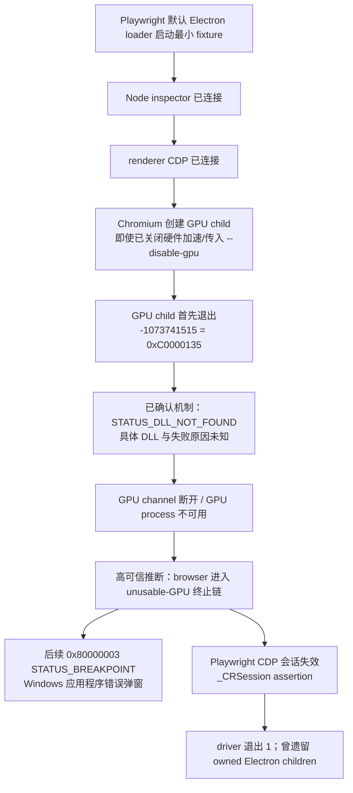
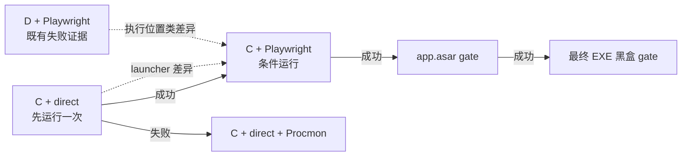

# P4-D13 Windows 25H2 Electron GPU 启动崩溃技术裁定

- 任务：`P4-D13`
- 角色：技术顾问
- 证据截止：2026-09-27，Asia/Shanghai
- 最新输入控制版本：`2026-09-27T23:40:00+08:00`
- 固定输入：`docs/coordination/snapshots/p4-d13-start.sha256`，205 项全部匹配；manifest SHA-256 为 `8fdc986e462b743c308897dae17e2dbf09c85170f9e54687e72847fb1bb867da`
- 性质：只读技术裁定；本文没有启动 Electron、Maris、sidecar，没有运行 C/D 盘实验，没有安装工具，也没有修改产品、依赖、lock、Forge、测试、系统设置或 Git 状态

## 0. 一页结论

### 0.1 裁定

1. **现阶段不能把故障归因于 Playwright、D 盘、Windows 25H2、显卡驱动、Code Integrity 或某个运行库中的任何一个。** 已确认的是 GPU child 首先以 `0xC0000135 STATUS_DLL_NOT_FOUND` 退出；具体缺失、不可见或被拒绝的 DLL 仍未知。Windows 随后的 `0x80000003 STATUS_BREAKPOINT` 和 Playwright assertion 更像同一失败链的下游结果，而不是两个新的独立根因。Microsoft 对两个状态码的定义见 [MS-ERREF NTSTATUS 表](https://learn.microsoft.com/en-us/openspecs/windows_protocols/ms-erref/596a1078-e883-4972-9bbc-49e60bebca55)；Electron 官方 issue `#36324` 展示过相同的“GPU child 装载失败后 browser 因 unusable GPU process 进入 breakpoint”链路，但它只能解释机制，不能证明本机缺少哪一个 DLL。[electron/electron#36324](https://github.com/electron/electron/issues/36324)
2. **最高优先级的两个环境假设是执行位置和 Windows 25H2 GPU sandbox 兼容。** 本机事实与旧的 D→C 恢复案例及 build 26200 sandbox 崩溃案例分别相似，因此值得做受控验证；这些上游 issue 都不是本机结论。[electron/electron#37862](https://github.com/electron/electron/issues/37862)、[electron/electron#52098](https://github.com/electron/electron/issues/52098)、[desktop/desktop#22306](https://github.com/desktop/desktop/issues/22306)
3. **下一动态任务先用 C 盘短 ASCII 任务目录、完全相同且逐文件摘要匹配的 Electron 44.4.5 dist 与最小 fixture，直接启动一次。** 保留 R1 的 `app.disableHardwareAcceleration()`、`--disable-gpu`、隔离 profile、GPU sandbox 和 renderer sandbox，只移除 Playwright launcher/inspector/CDP。直接 C 成功后，才在同一 C 目录运行一次 Playwright fixture。这样可用“C direct 对 C Playwright”判断 Playwright 是否必要，用“C Playwright 对既有 D Playwright”判断执行位置是否必要。不要重跑 D 基线。
4. **C direct 相对既有 D Playwright 同时改变了执行位置和 launcher，所以它只是安全的三角验证入口，不是纯 A/B。** 只有后续 C Playwright 成功，才有同 launcher 的 D/C 对照。即使如此，结论也只能先写成“执行位置、继承 ACL 或文件流元数据相关”，不能直接缩写成“D 盘有问题”。
5. **若 C direct 仍以同码失败，停止 Playwright 分支，先保留一次受控失败的完整日志。** 最小新增工具是官方 Microsoft Sysinternals Process Monitor，使用 backing PML、进程树与精确 PID/路径过滤，寻找 GPU child 退出前最后一组未被后续 `SUCCESS` 满足的 DLL 搜索或拒绝序列。Windows 事件、Code Integrity、WER 和 Electron 文件日志同时作为交叉证据；不猜测并安装 VC++/DirectX runtime。[Process Monitor](https://learn.microsoft.com/en-us/sysinternals/downloads/procmon)、[Microsoft 的应用启动取证指南](https://learn.microsoft.com/en-us/troubleshoot/windows-client/shell-experience/troubleshoot-apps-start-failure-use-process-monitor)
6. **安全开关结论：** `--disable-gpu-sandbox` 只允许在完整原始证据已经保留后做一次 C direct 诊断；`--use-angle=d3d11-warp` 只允许在证据仍指向 GPU/ANGLE/驱动分支时做一次较低优先级诊断；`--in-process-gpu` 不进入最小矩阵；`--no-sandbox` 禁止。任何开关让应用“能启动”都不足以成为生产修复。
7. **继续保持 Electron `44.4.5` 与 lock 不变。** 若 44 的 C direct 在有证据的情况下仍失败，可隔离比较受支持的 Electron `43.7.4`（Chromium 150）与 44.4.5（Chromium 152）；Electron 45 在证据截止日仍为 alpha，只能在总控另行批准后作为一次研究性上界，不能作为发布候选。[44.4.5](https://releases.electronjs.org/release/v44.4.5)、[43.7.4](https://releases.electronjs.org/release/v43.7.4)、[Electron release schedule](https://releases.electronjs.org/schedule)
8. **package 中 `.pyc`/`.egg-info` 的问题与 GPU crash 分离。** 可以先派发一个不启动 Electron 的独立实现切片，用显式 source allowlist 生成 staging tree 并做纯静态/单元测试；但没有真正执行 Forge package 和最终包扫描时，报告必须写 `package not_run`，P4-B 仍保持 blocked。

### 0.2 证据等级

| 等级 | 本文含义 | 可以怎样表述 |
| --- | --- | --- |
| `F` 已确认事实 | 固定日志、文件、摘要或官方定义直接支持 | “已观察到”“已匹配”“状态码定义为” |
| `I` 高可信推断 | 多条固定证据与已知控制流一致，但缺少本机根因捕获 | “更可能是”“可解释为” |
| `T` 待验证假设 | 有相似官方案例或机制支持，必须由指定 A/B/取证区分 | “优先验证”“若 A/B 如此则支持” |
| `N` 当前无本机证据 | 未命中、已由 fixture 排除，或只有泛化可能性 | “不能归因”“当前不支持” |

### 0.3 仍未知的关键事实

- 哪一个 DLL 的最终装载失败或被拒绝；搜索的是 DLL 名、绝对路径还是依赖的依赖。
- 装载失败发生在文件不存在、sandbox 不可见、ACL/Code Integrity 拒绝、架构/签名不符，还是更早的初始化分支。
- 将同字节 dist 移到 C 盘是否改变结果。
- 不经过 Playwright 时是否仍发生同一 GPU child 失败。
- 43/44 的 Chromium 差异是否改变结果。

## 1. 固定证据与边界

| 编号 | 固定事实 | 等级 | 对结论的约束 |
| --- | --- | --- | --- |
| E01 | 最小 fixture 不加载 Maris、Host、sidecar、数据库或真实 profile | `F` | 本次 crash 不能归因于这些产品层组件 |
| E02 | Playwright 默认 Electron loader、Node inspector、renderer CDP 已连接 | `F` | launcher 完全无法启动 Electron 的假设不成立；Playwright 仍可能是触发条件，但优先级降低 |
| E03 | 首个底层失败为 GPU child `-1073741515 = 0xC0000135` | `F` | 根因调查应从 loader/可见性/拒绝加载开始 |
| E04 | 后续才出现 `_CRSession._onMessage` assertion、`0x80000003` 和 Windows 弹窗 | `F` | assertion 不应被当作第一个根因 |
| E05 | Windows 11 25H2 build `26200.9168`，Intel UHD + NVIDIA RTX 4060 Laptop 混合显卡 | `F` | 与上游 build 26200/sandbox 案例相似，仍需本机 A/B |
| E06 | 项目与 Electron dist 在 D 盘 | `F` | 与旧 D→C 案例相似；需要同字节 C 放置验证 |
| E07 | 常见 x64 VC++ runtime 与列出的 DirectX DLL 存在 | `F` | 降低常见 runtime 缺失概率；未排除未知 DLL 或依赖链 |
| E08 | R1 时间窗的 Code Integrity 命中均属 Chrome，没有 Electron/Maris/项目路径 | `F` | 不能把 Chrome 事件外推为本机 Electron 根因 |
| E09 | 官方 Electron ZIP 大小、SHA-256 和 `electron.exe` 版本已核验 | `F` | 降低下载损坏概率；没有证明解压后的每个文件、ACL、ADS 和依赖均正确 |
| E10 | R1 使用 `app.disableHardwareAcceleration()` 和 `--disable-gpu` 后仍出现 GPU child | `F` | 这不矛盾：关闭硬件加速并不保证 Chromium 不创建 GPU process；见 [Electron app API](https://www.electronjs.org/docs/latest/api/app) 与 [electron/electron#28164](https://github.com/electron/electron/issues/28164) |
| E11 | R1 原始动态日志已按旧任务规则清理，只剩报告级证据 | `F` | 下一次运行必须先冻结原始证据保留规则，不能再次删除唯一根因证据 |
| E12 | 最终包发现 11 个 `.pyc` 与 6 个 `.egg-info` | `F` | package hygiene 缺口成立，但与最小 fixture crash 是独立问题 |

Electron 官方说明 Chromium sandbox 会限制进程对系统资源的访问，而且 renderer、GPU、audio、network 等多数子进程都会进入 sandbox；全局 `--no-sandbox` 会移除所有这些进程的 Chromium sandbox。[Electron Process Sandboxing](https://www.electronjs.org/docs/latest/tutorial/sandbox) 因此“GPU sandbox 边界”是有机制基础的假设，同时也是不能随意关闭的生产安全边界。

## 2. 失败链



### 2.1 可以确定的先后关系

- `0xC0000135` 是第一个底层进程错误，Microsoft 定义为 `STATUS_DLL_NOT_FOUND`；它说明动态装载没有完成，但状态码本身不提供 DLL 名称。[Microsoft NTSTATUS](https://learn.microsoft.com/en-us/openspecs/windows_protocols/ms-erref/596a1078-e883-4972-9bbc-49e60bebca55)
- `0x80000003` 是 `STATUS_BREAKPOINT`。在 Electron 官方 issue `#36324` 的相似链路中，GPU child 先因 `0xC0000135` 退出，browser 随后走 unusable GPU process 的故意崩溃路径。它使“同一失败链的第二阶段”成为高可信解释，但本机仍缺少 stack/dump，不能把该 issue 的具体栈直接当成本机栈。[electron/electron#36324](https://github.com/electron/electron/issues/36324)
- Playwright assertion 发生在 GPU child 退出和 CDP 失效之后，现有证据更支持它是目标崩溃的后果。C direct/C Playwright 对照仍需判断 Playwright 是否改变了触发条件。
- DawnGraphite cache 的一次 `0x20` sharing violation 发生在同一故障期，但没有证据显示它先于 DLL 装载失败，也没有证据显示它能导致 `STATUS_DLL_NOT_FOUND`；现阶段只作为伴随信号保留。

## 3. 假设排序

“排序”表示下一步最值得区分的顺序，不表示已经确认的根因。

| 排名 | 假设 | 当前等级 | 支持证据 | 反证/限制 | 最小区分手段 |
| ---: | --- | --- | --- | --- | --- |
| 1 | D 盘/非系统卷的执行位置、继承 ACL、ADS 或 GPU sandbox 可见性差异 | `T`，高优先级 | 本机在 D 盘；官方旧 issue `#37862` 同为 D 盘、双显卡、GPU child `-1073741515`，复制到 C 后恢复 | issue 很旧且已关闭；同一状态码可由不同 DLL 引起；C copy 还可能改变 ACL/ADS/路径长度 | 同摘要 C direct；成功后 C Playwright 与既有 D Playwright 三角对照，并记录 ACL/ADS/路径元数据 |
| 2 | Windows 25H2 build 26200 与 Chromium/Electron GPU sandbox 的兼容问题 | `T`，高优先级 | 本机 build `26200.9168`；Electron `#52098` 与 GitHub Desktop `#22306` 均记录 26200/26300 上 sandboxed GPU/renderer 崩溃，报告者称 GPU-sandbox 开关改变结果 | 上游案例主要呈现 `0x80000003`，不等于本机首码；报告者 workaround 不是官方安全修复 | C direct sandbox-on 原始捕获；只有证据仍指向 sandbox 时做一次 `--disable-gpu-sandbox` 诊断 |
| 3 | Electron dist 解压内容、某个 sidecar DLL、文件 ACL/签名/架构或依赖链异常 | `T`，中等 | 本机首码直接指向 DLL 装载；只核验了官方 ZIP与主 EXE，未保留 per-file loader trace | 官方 ZIP SHA-256 和主 EXE 版本正确，降低整体损坏概率；不能凭状态码猜文件 | 官方 archive 与 dist 的逐文件 manifest；Procmon `CreateFile`/`Load Image`；命名候选后用 Sigcheck |
| 4 | 混合显卡、驱动或 ANGLE 初始化分支 | `T`，中低 | 本机为 Intel+NVIDIA；多个相似 issue 也有混合显卡 | R1 已关闭硬件加速并传 `--disable-gpu`；相似环境不是因果；仍看到 GPU child 本身不构成反证 | 先看 Procmon/日志；只有证据仍指向 GPU vendor/ANGLE 时做一次 sandbox-on WARP 诊断 |
| 5 | Code Integrity、WDAC、DLL 签名级别或第三方注入/安全软件拦截 | `T/N`，低到中 | loader 错误可能由拒绝加载表现出来；同一时间窗有环境级 CI 事件 | 136 条 CI 事件全属 Chrome，无 Electron/项目命中；Defender/AppLocker 也无命中；不允许停用安全控制 | 精确运行时间窗的 CI/WER + Procmon；命名 DLL 后核验签名。保持所有安全控制不变 |
| 6 | Playwright launcher、Node inspector 或 CDP 改变时序/触发失败 | `T`，低 | Playwright 注入 loader、inspector、remote debugging，可能改变启动时序 | loader、inspector、renderer CDP 均已成功；GPU child 在其后失败；最小 fixture 不含产品 | 同一 C 根目录与同一 fixture：direct 成功后仅改为 Playwright launcher |
| 7 | VC++/DirectX 常见 runtime 缺失 | `T/N`，低 | `STATUS_DLL_NOT_FOUND` 在一般情况下可能来自 runtime 或其传递依赖 | 已核对常见 x64 VC++ 注册/文件和列出的 DirectX DLL；没有具体缺失名 | 先命名 DLL；只有证据指向具体 runtime 时才讨论修复，禁止盲装 |
| 8 | profile/cache 冲突 | `N`，低 | DawnGraphite cache 有 sharing violation | R1 使用绝对隔离 userData；首个根因码仍是 DLL-not-found | 保留 cache 日志；不为此重复运行或清全局 profile |
| 9 | Maris 产品、Python Host、数据库、真实用户数据 | `N`，本轮已排除 | 无 | 最小 fixture 根本没有加载它们 | 不进入环境根因矩阵；待环境稳定后才恢复产品层 gate |

### 3.1 对上游 issue 的正确用法

- [electron/electron#37862](https://github.com/electron/electron/issues/37862) 只提高“同字节 C/D 执行位置对照”的优先级。
- [electron/electron#52098](https://github.com/electron/electron/issues/52098) 和 [desktop/desktop#22306](https://github.com/desktop/desktop/issues/22306) 只提高“build 26200 × GPU sandbox”的优先级。
- [electron/electron#36324](https://github.com/electron/electron/issues/36324) 只帮助解释两个异常码如何属于一条链。
- 任何一个 issue 都没有命名本机缺失 DLL，也不能授权关闭 sandbox、修改驱动、降版本或改变系统安全策略。

## 4. 下一执行任务的最小动态矩阵

## 4.1 所有运行都不变的控制项

在任何可执行文件启动前，执行方必须先生成 `run-manifest.json` 与摘要文件，并满足以下条件：

- 使用官方 Electron `44.4.5` Windows x64 archive；archive 摘要必须与已固定值 `11c395820a5aaa8ebcc0686b476d0ac98a730274ebfbdc8cf5538a7c2815cb5d` 一致。
- 从固定 source manifest 复制同一个最小 fixture；fixture 文件摘要与 Electron dist 逐文件摘要在运行前后都一致。
- C 盘使用短 ASCII、任务专属、无空格根目录，例如 `C:\Maris-D13\<run-id>`；不得使用真实用户 profile、Maris 数据库或个人数据。
- 记录源和目标的 NTFS ACL、owner、文件属性、Zone.Identifier/其他 alternate data stream 是否存在、路径长度和卷类型。不得通过“解除锁定”、改 ACL、关闭安全软件等方式预先归一化。
- 保持 R1 的 `app.disableHardwareAcceleration()`、`--disable-gpu`、绝对隔离 userData 与隐藏 sandboxed BrowserWindow；**GPU sandbox 和 renderer sandbox 均保持开启**。
- 初始运行只增加文件日志：`--enable-logging=file`、任务专属 `--log-file`，并使用最小必要 `--log-level`；不先加入安全诊断开关。Electron 官方说明 Windows child process 日志写文件比 stderr 可靠。[Electron command-line switches](https://www.electronjs.org/docs/latest/api/command-line-switches)
- 禁止网络登录、真实账号、真实微信、DeepSeek、Host/sidecar、数据库和真实 profile。
- 每个 cell 最多启动一次，硬超时 60 秒；同配置不得“再试一次”。任何新运行必须由前一 cell 的分支条件授权。

## 4.2 严格顺序

| 顺序/ID | 运行对象与位置 | 相对对照只计划改变的因素 | sandbox | 前置条件 | 结果解释 | 最多启动 |
| --- | --- | --- | --- | --- | --- | ---: |
| A0 固定基线 | 既有 D 盘 Playwright 最小 fixture | 不再运行；只引用 R1 固定证据 | GPU sandbox on；renderer sandbox on | 已完成 | `0xC0000135` → `0x80000003`；作为 D+Playwright 基线 | 0 |
| A1 安全入口 | C 盘，同摘要 Electron 44.4.5，**direct** 最小 fixture | 预期因素为执行位置，同时移除 Playwright；因此是三角验证入口，不宣称纯 A/B | GPU sandbox on；renderer sandbox on | manifest/ACL/ADS/日志目标已写入 | 失败且同码：Playwright 不是必要条件，移动到 C 也不足以恢复；转 F1。成功：进入 A2 | 1 |
| A2 launcher 对照 | 与 A1 完全相同的 C 目录和 fixture，改为 Playwright 默认 loader | launcher/control channel：direct → Playwright | GPU sandbox on；renderer sandbox on | 仅 A1 成功 | A1 成功/A2 失败：支持 Playwright/inspector/CDP/时序分支；A1/A2 均成功：相对 A0 支持执行位置类差异 | 1 |
| F1 取证运行 | C 盘 direct 44.4.5，加 Procmon bounded capture | 只增加观测工具；fixture、参数、安全边界不变 | GPU sandbox on；renderer sandbox on | A1 同码失败；工具来源、权限和保留方案经总控批准 | 命名最后未满足的 DLL 搜索/拒绝链；若能命名，停止开关试验并先验证文件/签名/ACL | 1 |
| S1 GPU sandbox 诊断 | C 盘 direct 44.4.5，加 `--disable-gpu-sandbox` | 只关闭 GPU process sandbox | **GPU sandbox off；renderer sandbox on** | F1 已完整保留但仍不能命名；证据指向 sandbox；总控批准 | sandbox-on 失败/off 成功：支持 GPU sandbox 边界；不能证明缺哪个 DLL，也不能成为产品修复 | 1 |
| G1 WARP 诊断 | C 盘 direct 44.4.5，加 `--use-angle=d3d11-warp` | 只把 ANGLE 后端指向 D3D11 WARP | GPU sandbox on；renderer sandbox on | F1 未命名且日志仍指向 driver/ANGLE；不得与 S1 组合 | 成功：支持硬件驱动/ANGLE 路径；失败：降低该分支，但不能排除所有驱动问题 | 1 |
| V1 稳定版对照 | C 盘 direct，官方 Electron 43.7.4，其余同 A1 | Electron/Chromium 版本 44.4.5/M152 → 43.7.4/M150 | GPU sandbox on；renderer sandbox on | A1/F1 后仍像版本相关；总控批准隔离 archive | 43 成功/44 失败：支持 44/M152 范围回归；二者同码失败：支持跨版本环境/loader 分支 | 每版本 1；44 复用 A1 |
| P1 app.asar gate | C 盘，44.4.5 默认 Electron + Playwright，加载真实 app.asar 测试对象 | 最小 fixture → app.asar | GPU sandbox on；renderer sandbox on；现有生产 fuse 设计不改 | A1、A2 稳定，且总控检查点通过 | 仅证明 app.asar 集成启动；失败返回产品/E2 分层，不直接归因 GPU | 1 |
| P2 最终 EXE gate | C 盘，同摘要最终 `Maris.exe`，**直接黑盒启动** | 从受控 Electron/app.asar 测试对象进入最终打包与 fuse 成品；这是发布 gate，不是纯 A/B | production sandbox/fuses 全部保持 | P1 稳定；package hygiene 与打包证据另行通过 | 证明最终成品在该环境可启动并可收口；不得用 Playwright Electron launcher 驱动 fused EXE | 1 |

### 4.3 为什么接受候选顺序，但要加一个限定

候选顺序的安全方向正确：不重复已弹窗的 D 基线，先复制同摘要内容到 C，再 direct、Playwright、app.asar、EXE。需要补充的限定是：**A1 同时改变“执行位置”和“是否经过 Playwright”**，所以 A1 单独成功不能证明 D 盘是根因，A1 单独失败也不能分别量化这两个因素。

三角关系如下：



如果 A1 与 A2 都成功，A0/A2 的同 launcher 对照支持“C 与 D 的执行位置类差异”。由于复制还可能改变继承 ACL、Zone.Identifier、路径长度或文件流元数据，报告必须使用“执行位置类”而不是直接使用“D 盘根因”。若总控以后必须细分盘符、ACL、ADS 和路径长度，需要另一个经批准的矩阵；本轮不应为了学术纯度再次触发 D 盘弹窗。

### 4.4 分支运行预算

- 环境诊断到第一次总控检查点，最多 **4 次进程启动**：A1；条件 A2 或 F1；至多选择 S1/G1 中一个；条件 V1。不得把 S1 与 G1 组合，也不得重复同一 cell。
- A1/A2 均成功后，停止环境诊断；P1/P2 属于产品恢复 gate，各最多一次。
- F1 命名具体 DLL 后立即停止 S1/G1/V1，先做静态文件、签名、ACL、来源和 manifest 核验。
- 任何新异常码、系统级弹窗、证据采集失败或 owned process 清理失败都会结束本次动态任务；不是继续运行更多 cell 的理由。

## 4.5 弹窗、停止和进程收口

每次启动前记录进程基线、run ID、启动时间、根 PID、可执行文件绝对路径和工作目录。fixture/driver 必须写一个任务专属 owner marker，记录其直接子 PID；不得通过宽泛的进程名清理所有 `electron.exe`。

以下任一事件立即停止当前 run：

- 任何 Windows 应用程序错误、未知软件异常、WER 或 debugger 弹窗；
- GPU/browser/renderer 任一进程出现 `0xC0000135`、`0x80000003` 或新的非零退出；
- 60 秒超时、driver assertion、日志写入失败、PML backing file 失败；
- 出现任务目录之外且无法确认所有权的 Electron/Node 子进程；
- 发现 command line、日志或截图包含未计划的秘密/个人数据；
- Code Integrity、AppLocker 或安全产品首次命中 Electron/任务路径。

停止时按此顺序收口：

1. 先记弹窗标题、错误码、时间和 screenshot 的摘要；不要点击“继续”、debug 或任何会改变状态的选项。
2. 停止/flush 日志捕获，保存进程树和所有退出码。
3. 尝试 fixture 已设计的正常关闭；失败后只终止本 run 的已记录后代 PID，并同时核对 executable path、process start time 和 owner marker。
4. 再次枚举同一任务根目录的 owned process，必须为 0；若不是 0，停止整个任务并交回总控，不启动下一 cell。
5. 对原始证据生成 SHA-256 manifest。原始证据在总控接受前不得删除、覆盖或就地脱敏。

## 5. 精确 DLL / 拦截取证方案

### 5.1 工具比较

| 工具 | 能回答什么 | 回答不了什么 | 权限/系统影响 | 优先级 |
| --- | --- | --- | --- | ---: |
| Windows Application、WER、Code Integrity、AppLocker 事件 | 进程、异常码、fault module、签名/策略拒绝及精确时间窗 | 事件不存在时不能证明没有 loader failure；R1 已未命名 DLL | 读取通常无需改系统；某些 Operational channel 导出可能需要提升权限 | 1，所有 run 同步收集 |
| Electron `--enable-logging=file`、`--log-file`、最小 `--log-level`/targeted `--vmodule` | Chromium/GPU child 生命周期、switch、生效后日志与退出顺序 | 不保证记录 Windows loader 搜索的每个候选路径 | 不需安装；只改变当前诊断进程参数。Windows child 日志应写文件 | 1，与 A1 一起启用 |
| Microsoft Sysinternals Process Monitor | 文件/注册表/process/thread 事件、`CreateFile`、`Load Image`、结果、stack、process tree；native PML 保留全部数据 | 单个 `NAME NOT FOUND`/`ACCESS DENIED` 不等于根因；需要识别后续 fallback/SUCCESS | Microsoft 指南要求管理员运行；会启动诊断进程/驱动并写大型 capture，但不修改产品/安全策略 | 2，A1 同码失败后的最小新增工具 |
| Process Explorer / ListDLLs | 活进程已经成功加载的 DLL、handles、映射文件 | 快速退出的 GPU child 可能来不及采样；看不到“未成功加载”的 DLL | 官方 Sysinternals；查看自有进程通常可不提升，完整跨进程信息可能需提升 | 3，Procmon 命名后或进程存活足够久时辅助 |
| Sigcheck | 候选文件版本、hash、签名与证书链 | 不能自行找出缺失 DLL；VirusTotal 选项会产生外部查询/潜在上传 | 本地文件检查一般不改系统；禁止 `-v`/上传，避免泄露文件/hash 到外部 | 3，只对已命名候选与官方 dist 做离线核验 |
| Loader snaps + WinDbg | Windows loader 的逐步决策、依赖和早期失败栈 | 配置重、日志大，可能改变时序；不适合作为第一个工具 | GFlags per-image loader snaps 会写注册表，WinDbg/Debugging Tools 需安装；必须另行批准、记录回滚 | 4，Procmon 仍无法命名时的最后升级 |

官方依据：

- Process Monitor 支持非破坏过滤、完整事件属性、stack、backing log 和 process tree。[Microsoft Sysinternals Process Monitor](https://learn.microsoft.com/en-us/sysinternals/downloads/procmon)
- Microsoft 的应用启动指南要求以管理员权限捕获，建议保存 **all events** 的原生 PML，并提醒并非每个 `Access Denied` 都是致因。[Troubleshoot Apps failing to start using Process Monitor](https://learn.microsoft.com/en-us/troubleshoot/windows-client/shell-experience/troubleshoot-apps-start-failure-use-process-monitor)
- Process Explorer 展示进程已经打开的 handle 和已经加载的 DLL。[Process Explorer](https://learn.microsoft.com/en-us/sysinternals/downloads/process-explorer)
- ListDLLs 是命令行已加载 DLL 视图。[ListDLLs](https://learn.microsoft.com/en-us/sysinternals/downloads/listdlls)
- Sigcheck 可输出版本、hash、签名和证书链；其 VirusTotal 功能是外部行为，本任务不允许使用。[Sigcheck](https://learn.microsoft.com/en-us/sysinternals/downloads/sigcheck)
- loader snaps 由 GFlags 的 `sls`/Show Loader Snaps 控制，属于需要显式回滚的 per-image 诊断设置。[GFlags command](https://learn.microsoft.com/en-us/windows-hardware/drivers/debuggercmds/-gflag)、[GFlags flag table](https://learn.microsoft.com/en-us/windows-hardware/drivers/debugger/gflags-flag-table)

### 5.2 最小 Procmon 过滤与因果判定

F1 不应一开始就在 GUI 中丢弃大量事件。先将完整 bounded capture 写入任务专属 backing PML；停止后再使用非破坏过滤分析：

1. 通过 Process Tree 选择本 run 的 root `electron.exe` 和所有后代，固定 PID、parent PID、start time 与 image path。
2. `Path begins with <C task root>` 作为辅助，而不是唯一条件；系统 DLL 搜索会访问 Windows/System32 和驱动目录。
3. 优先查看 `Process Create`、`Process Exit`、`CreateFile`、`Load Image`，再按需要查看与 loader 相关的注册表事件。
4. 聚焦 GPU child 退出前的短时间窗；重点结果为 `NAME NOT FOUND`、`PATH NOT FOUND`、`ACCESS DENIED`、`REPARSE`、`INVALID IMAGE HASH` 或类似签名/策略拒绝。
5. **只有同一 DLL 的整条搜索序列最终没有后续 `SUCCESS`，且紧邻 GPU child 退出，才能列为根因候选。** Chromium/Windows 正常会尝试多个路径，单条失败不能被报告为根因。
6. 一旦命名候选，先比较 C/D/official archive 的存在性、bitness、SHA-256、签名、ACL、ADS 与依赖；不要先安装 runtime 或从第三方 DLL 站下载文件。

### 5.3 Electron 日志等级

- A1 先用 `--enable-logging=file` 和显式 `--log-file=<run evidence dir>\electron.log`。Electron 官方说明 Windows child process 的日志无法可靠发送到 stderr，文件最可靠。[Electron logging switches](https://www.electronjs.org/docs/latest/api/command-line-switches)
- 初始不要全局打开最大 `--v`；若普通日志不能显示 GPU child 命令和初始化分支，再在 F1 中使用有界 `--v=1` 或精确 `--vmodule`，并记录完整参数。
- 不长期开放固定 remote debugging port。Playwright 条件 cell 使用其临时 loopback endpoint，日志脱敏时替换动态端口。

### 5.4 原始证据、脱敏副本与保留

每个 run 目录至少包括：

```text
<run-id>/
  run-manifest.json              # 版本、摘要、参数、安全边界、OS/GPU 摘要
  process-tree.json              # PID/PPID/start time/image path/exit code
  electron.log                   # 原始，受限访问
  driver.log                     # direct 或 Playwright driver 原始输出
  events/                        # 精确时间窗 Application/WER/CI/AppLocker 导出
  procmon.pml                    # 仅 F1，原始，受限访问
  screenshots/                   # 仅错误弹窗；不含其他桌面区域
  sanitized/                     # 可进入项目报告的脱敏副本
  evidence.sha256                # 上述文件的完整摘要
```

脱敏规则：

- 原始 PML、EVTX 和日志不就地编辑，放在仅当前用户/诊断人员可读的任务目录；项目文档只引用摘要和脱敏副本。
- 脱敏副本把用户名、home/profile path、任务临时根、动态 loopback 端口、设备名替换为稳定占位符；保留盘符类别、相对路径、DLL basename、状态码、时间相对顺序和 hash。
- 不记录环境变量值、owner/session token、数据库 URL 凭据或真实个人路径。若运行对象意外带入秘密，立即停止并只在受限原始目录处理。
- Sigcheck 不使用 VirusTotal 查询或上传开关；PML/EVTX/截图不上传到公共 issue。
- 总控明确接受前不得清理唯一原始证据；接受后由总控决定保留期限和清理，不让执行方自行删除。

## 6. 四个诊断开关的安全裁定

| 开关 | 本轮裁定 | 允许的唯一场景 | 能证明什么 | 不能证明什么 | 长期生产结论 |
| --- | --- | --- | --- | --- | --- |
| `--disable-gpu-sandbox` | **条件允许一次** | F1 原始证据已保留、仍无法命名，且证据指向 GPU sandbox；C direct、renderer sandbox 保持、不得组合其他诊断开关 | sandbox-on 失败/off 成功可支持“GPU process sandbox 边界是必要条件” | 不能命名 DLL；不能区分 Windows build、执行位置、ACL 与 Chromium bug；不能证明产品安全 | 禁止作为默认/发布参数；成功只触发上游/版本/精确 loader 调查 |
| `--in-process-gpu` | **不进入后续最小任务** | 仅未来在 Electron/Chromium 维护者要求并有 debugger 方案时，由总控另立任务 | 可能显示问题是否依赖 GPU process 边界 | 会把 GPU 故障移入 browser，改变崩溃形态和 blast radius；弱化进程隔离，无法定位具体 DLL | 禁止产品使用；本轮也不运行 |
| `--use-angle=d3d11-warp` | **条件允许一次，低于 Procmon 与 sandbox 诊断** | F1 未命名，日志仍明确指向硬件驱动/ANGLE；C direct、GPU/renderer sandbox 保持 | WARP 成功可支持硬件 GPU/驱动/ANGLE 路径 | 不能证明 sandbox 无关；不能定位 DLL；性能与兼容性未验 | 仅诊断。若以后考虑产品 fallback，必须单独做性能、渲染、安全和设备矩阵并由总控冻结 |
| `--no-sandbox` | **禁止** | 无 | 即使成功，也只能说明至少一个 Chromium sandbox 边界相关 | 它同时关闭 renderer、GPU 和其他 utility process sandbox，信息过宽，无法定位单一边界 | 永久拒绝作为开发恢复和生产 workaround |

Electron 明确说明 `--no-sandbox` 会让 renderer 和 Chromium helper processes 全部在无 sandbox 状态运行，并建议只用于测试；本项目的冻结比官方一般建议更严格，因为存在个人财务数据和本地权限边界，所以连本轮诊断也不使用。[Electron sandbox](https://www.electronjs.org/docs/latest/tutorial/sandbox)、[Electron switches](https://www.electronjs.org/docs/latest/api/command-line-switches)

Chromium 的 sandbox policy 也把 `disable-gpu-sandbox` 定义为只让 GPU process 退出 sandbox，而 `no-sandbox` 是全局退出；这正是前者具有更窄诊断价值、后者信息过宽的原因。[Chromium sandbox policy](https://chromium.googlesource.com/chromium/chromium/+/refs/heads/main/content/common/sandbox_policy.cc)、[Chromium sandbox switches](https://chromium.googlesource.com/chromium/src/+/refs/tags/140.0.7327.0/sandbox/policy/switches.cc)

以下内容保持冻结：renderer sandbox、context isolation、production fuses、安全软件、Code Integrity/WDAC、Windows mitigation、显卡驱动和操作系统版本。不得为了让一次启动通过而修改它们。

## 7. Electron 版本与发布策略

### 7.1 当前版本位置

证据截止日的官方信息：

- `44.4.5` 是 latest stable，Chromium `152.0.7977.130`。[Electron 44.4.5](https://releases.electronjs.org/release/v44.4.5)
- `43.7.4` 是仍受支持的相邻 stable，Chromium `150.0.7871.250`。[Electron 43.7.4](https://releases.electronjs.org/release/v43.7.4)
- Electron 45 的 alpha 日期为 2026-08-27，计划 beta 为 2026-09-29、stable 为 2026-10-20；在本任务证据截止日仍是 prerelease。[Electron schedule](https://releases.electronjs.org/schedule)
- Electron 官方支持最近三个 stable major；alpha 通常比 beta 稳定性更低。[Electron releases and support policy](https://www.electronjs.org/docs/latest/tutorial/electron-timelines)

### 7.2 推荐比较

1. D13 之后的第一个动态任务保持 `44.4.5`，不修改 `package.json` 或 lock。
2. 只有 A1/F1 仍失败且未得到更具体根因时，使用官方独立 archive 对比 `43.7.4`，同一 C direct fixture、同一参数、同一 sandbox、同一日志合同，各版本最多一次。43 与 44 的主要区分价值是 Chromium 150 与 152 的相邻 stable 差异。
3. 43 成功、44 同码失败只能支持“回归位于 Electron/Chromium/依赖版本范围”，不能单凭一次结果永久降级。需要后续最小 bisect/upstream evidence 或官方修复说明。
4. 43 与 44 均失败更支持系统/执行位置/loader/安全边界跨版本问题；不要继续随机尝试多个旧版本。
5. Electron 45 alpha 不进入默认矩阵。只有 43/44 对照明确指向版本，且总控批准一次研究性上界时才可隔离运行；alpha 成功不等于可发布。

### 7.3 何时才足以修改冻结与 lock

版本改变需要同时满足：

- 受控、同摘要、sandbox-on 的比较结果可重复；诊断阶段每 cell 一次后，应由另一个明确任务做两次干净确认，而不是在原任务中无限重试。
- 有命名的 DLL/stack/Procmon 链，或 Electron/Chromium 官方 issue、修复提交、release note 能解释结果；至少要排除“C copy 恰好改变 ACL/ADS”之类混杂因素。
- 目标版本是受支持 stable；若是暂时退回 43，必须记录 EOL 与回升计划。
- 更新后依赖图、full audit、typecheck、lint、generated drift、unit、package、fuse、package resource scan、app.asar E2E 与最终 EXE black-box gate 全部通过。
- renderer/GPU sandbox、production fuses、Code Integrity 和系统安全控制保持不变；没有 `--no-sandbox`、长期 `--disable-gpu-sandbox` 或 `--in-process-gpu`。
- 总控重新冻结精确 Electron/Chromium/Node 版本与 lock 摘要；只有协调方可进行 Git/冻结变更。

以下“能启动”方案不接受为长期 workaround：全局或 GPU sandbox 永久关闭、in-process GPU、关闭 Code Integrity/安全软件、改系统 mitigation、盲目安装 DLL、从非官方 DLL 网站复制文件、长期使用 alpha、未经证据随机降级、修改 production fuses 以适配 Playwright。

## 8. package hygiene 独立拆分

### 8.1 裁定

**可以并且应该拆分。** 当前 [Forge 配置](../apps/desktop/forge.config.ts) 的 `extraResource` 直接复制 `../../alembic.ini`、`../../migrations` 和 `../../src`，`.gitignore` 不参与 Electron Packager 的资源过滤，因此本机 Python 运行产生的 cache/metadata 会进入成品。这个问题不需要启动 Electron 就能实现和验证 source allowlist；先拆出可以减少未来 package 的噪声，也不会影响 GPU 根因调查。

拆分不改变两个事实：

- 静态 staging 通过不等于 Forge package 已通过。
- hygiene 修复不等于 Electron 环境已恢复；P4-B 仍 blocked，P4-C12 不开始。

### 8.2 建议文件边界

后续独立实现任务可只授权：

- 修改 `apps/desktop/forge.config.ts`，让 `extraResource` 只指向本次构建生成的 staging 根；
- 新建 `apps/desktop/scripts/stage-python-resources.mjs`，实现显式映射、clean staging、拒绝 symlink/reparse、生成内容 manifest；
- 修改 `apps/desktop/package.json`，只增加 staging/static-check 脚本；不得改依赖版本；
- 新建 `apps/desktop/tests/unit/package-resources.test.ts`；
- 如 staging 位于 repo 内的专用生成目录，允许只为该目录修改根 `.gitignore`；更优方案是使用任务专属临时目录并由 Forge hook 显式接收路径，避免产生待提交生成物；
- 更新该执行任务自己的运行说明、source manifest 和执行方角色状态。

不授权修改 Python 产品代码、迁移内容、Electron security/fuses、lock、E2E、接口冻结、control/overview 或独立测试报告。

### 8.3 source allowlist

运行时 staging 只接受：

```text
alembic.ini
migrations/env.py
migrations/versions/*.py
src/wife_system/**/*.py
```

显式拒绝：

```text
**/__pycache__/**
**/*.py[cod]
**/*.egg-info/**
tests/**
.pytest_cache/**
build/**
dist/**
scratch/**
任意 symlink、junction、reparse point、越界相对路径
任意不在 allowlist 的文件类型
```

`migrations/README` 和 `migrations/script.py.mako` 是开发/生成辅助，不是 `desktop_sidecar` 调用 `alembic upgrade head` 所需的既有 revision runtime；如执行方认为必须纳入，必须用真实 runtime 证据回到总控扩展 allowlist，不能用“整个 migrations 都复制”回退。

### 8.4 不启动 Electron 的静态测试

1. 在 source tree 故意放置测试专属的 `__pycache__`、`.pyc`、`.pyo`、`.egg-info`、测试文件和未知扩展；staging 结果必须为零命中。
2. 精确比较 staged 相对路径集合与 allowlist 展开集合；排序稳定，每个 staged 文件 hash 等于 source。
3. staging 开始前制造旧文件；新一次 staging 必须原子替换或先在新目录构建后 rename，不允许旧文件残留。
4. 对 symlink/junction/reparse、`..`、绝对路径、源根外目标做拒绝测试，确保不能把工作区外文件带入 package。
5. 验证 `alembic.ini`、`migrations/env.py`、全部现有 revision `.py` 和 `src/wife_system/**/*.py` 完整存在；不通过时禁止 package。
6. 生成 manifest，包含相对路径、大小和 SHA-256；不得包含绝对个人路径。
7. 只运行相关 Vitest/static script；本切片不得启动 Electron、Forge package、sidecar 或数据库。

### 8.5 报告口径

独立 hygiene 实现切片完成时只能写：

> source allowlist staging 与静态测试已通过；Electron/Forge package、app.asar、fuse、最终 resources 扫描和 EXE 启动均为 `not_run`。该结果没有解除 P4-B 的 Electron 环境阻塞，也不构成发布验收。

等环境路线恢复后，真正的 package gate 还必须在故意存在 cache/metadata 的前置条件下运行 Forge package，再扫描最终 `resources`：`__pycache__`、`*.py[cod]`、`*.egg-info`、tests、工具缓存和个人路径均为零命中，并核对 manifest 与 runtime migration/sidecar smoke。只有这一步才能把 package hygiene 标为通过。

## 9. 后续任务拆分、边界和验收

本文只建议总控如何拆分，不创建 Prompt、接口冻结或测试任务。

### 9.1 环境诊断执行切片

允许：复制固定 Electron/fixture 到 C 任务根、静态摘要/ACL/ADS 记录、按 A1→分支矩阵做有限启动、保留脱敏证据、只清理 owned process。Procmon、提升权限或任何诊断开关必须在对应分支到达且总控明确授权后使用。

禁止：重跑 D 基线、加载 Maris/Host/真实 profile、修改产品/依赖/lock/fuse、安装 runtime/驱动、关闭安全控制、使用 `--no-sandbox`、随机版本遍历、重复同一 cell。

验收至少包括：

- run manifest 和 source/dist 摘要匹配；
- 每个实际 cell 有唯一 run ID、完整参数、安全状态、退出码和分支理由；
- 原始日志与 SHA-256 manifest 保留，脱敏副本可复核；
- 结果用本文允许的措辞归因，没有把相似 issue 当本机事实；
- 所有 owned process 收口为 0；若弹窗/收口失败，任务按 blocked/finished 报告；
- 未运行的 cell 明确写 `not_run`，不得按计划推断通过。

### 9.2 package hygiene 实现切片

可与环境诊断在逻辑上独立，但由于协作规则禁止多方同时改相同实现文件，仍由总控安排文件所有权。它不启动 Electron，只提交 staging/allowlist 实现和静态测试证据；Forge package 及最终包扫描留到环境恢复任务。

### 9.3 app.asar 与最终 EXE 恢复切片

只有 A1/A2 在 C 稳定，且必要的版本/loader 结论已由总控接受后才开始。app.asar 由 Playwright 控制；最终 fused `Maris.exe` 采用直接黑盒启动，因为当前 production fuse 有意关闭 Node CLI inspect。恢复任务仍需使用隔离数据、production sandbox/fuses 与 owned-process cleanup。

### 9.4 P4-C12

本技术裁定、环境 A/B、hygiene 静态测试都不是 P4-C12。只有总控接受执行方动态证据、package/EXE gates 真正通过并正式派发后，独立测试方才开始 P4-C12。

## 10. 推荐冻结项

- **P4-D13-F01**：固定根因描述为“GPU child 首先以 `0xC0000135 STATUS_DLL_NOT_FOUND` 退出；具体 DLL 与失败机制未知”。
- **P4-D13-F02**：`0x80000003` 和 Playwright assertion 视为下游现象，除非新的 stack/dump 证明独立先发故障。
- **P4-D13-F03**：不得把 Electron/GitHub Desktop 相似 issue、Chrome Code Integrity 事件或混合显卡事实写成本机根因。
- **P4-D13-F04**：不重复既有 D 盘 Playwright baseline。
- **P4-D13-F05**：第一个动态 cell 为同摘要 Electron 44.4.5 + 同 fixture 的 C 盘 direct sandbox-on 运行，最多一次。
- **P4-D13-F06**：C direct 成功后才允许同目录 C Playwright，最多一次；C direct 失败则跳过 Playwright并进入取证。
- **P4-D13-F07**：A1 是三角验证入口，不是单变量 D/C A/B；只有 C Playwright 与既有 D Playwright 形成同 launcher 对照。
- **P4-D13-F08**：即使 C 恢复，初始结论只能是“执行位置/ACL/ADS/路径元数据类差异”，不得直接写“D 盘根因”。
- **P4-D13-F09**：所有初始 cell 保留 R1 的硬件加速状态、`--disable-gpu`、隔离 profile、GPU sandbox 和 renderer sandbox。
- **P4-D13-F10**：每个 cell 最多一次、60 秒硬超时；不重复同配置；环境诊断首个总控检查点前最多 4 次进程启动。
- **P4-D13-F11**：Windows 错误弹窗、新异常码、日志失败、证据泄密、unowned process 或 owned process 清理失败立即停止整个动态任务。
- **P4-D13-F12**：只按 run PID + descendant + executable path + start time + owner marker 清理；禁止按进程名广泛终止。
- **P4-D13-F13**：原始日志、PML、EVTX、截图先 hash 后保留；总控接受前不得删除或覆盖，项目文档只用脱敏副本。
- **P4-D13-F14**：最小新增取证工具为 Microsoft 官方 Procmon；只有 A1 同码失败后使用一次 bounded backing PML。
- **P4-D13-F15**：单个 `NAME NOT FOUND`/`ACCESS DENIED` 不构成根因；候选必须是退出前未被后续 `SUCCESS` 满足的完整搜索/拒绝链。
- **P4-D13-F16**：命名 DLL 后先做存在性、bitness、hash、签名、ACL、ADS 和 official manifest 核验；禁止猜测安装 runtime 或下载第三方 DLL。
- **P4-D13-F17**：`--disable-gpu-sandbox` 只允许在原始证据已保存且 sandbox 假设仍成立时做一次 C direct 诊断；永不作为生产参数。
- **P4-D13-F18**：`--use-angle=d3d11-warp` 只在证据仍指向 driver/ANGLE 时做一次、sandbox-on、不得与其他诊断开关组合。
- **P4-D13-F19**：`--in-process-gpu` 不进入最小矩阵；`--no-sandbox` 在诊断和生产中均禁止。
- **P4-D13-F20**：renderer sandbox、production fuses、安全软件、Code Integrity/WDAC、系统 mitigation、驱动与 Windows 版本保持不变。
- **P4-D13-F21**：Electron `44.4.5` 和 lock 继续冻结；版本对照只用独立官方 archive，首选受支持的 `43.7.4`，45 alpha 默认不运行。
- **P4-D13-F22**：一次版本对照或 unsafe flag 成功不足以修改 lock；修改版本必须满足可重复证据、受支持 stable、安全边界和完整 package/测试 gate。
- **P4-D13-F23**：package resource allowlist 可拆为不启动 Electron 的独立任务；静态通过时 package/app.asar/EXE 必须报告 `not_run`。
- **P4-D13-F24**：Python runtime resource 采用显式 allowlist；最终 package 对 cache、bytecode、egg metadata、测试、工具缓存和个人路径必须零命中。
- **P4-D13-F25**：app.asar 只有在 C direct/Playwright 稳定后恢复；最终 fused EXE 使用直接黑盒启动，不由 Playwright Electron launcher 驱动。
- **P4-D13-F26**：P4-C12 在总控接受环境、package 和 EXE 动态证据前保持 `not_started`。

## 11. 仍需总控决定的问题

1. 是否接受 A1→A2/F1 的分支顺序、每 cell 一次和首检查点最多 4 次进程启动的预算。
2. 若 A1 同码失败，是否授权执行方仅从 Microsoft 官方来源取得/运行 Procmon，并批准管理员权限与受限 PML 保留位置。
3. F1 无法命名时，S1 与 G1 哪一个由实际日志授权；本文不允许执行方自由遍历两者。
4. 是否批准隔离 Electron 43.7.4 comparator；45 alpha 是否保持完全不运行。
5. 原始 PML/EVTX/screenshot 的受限保留位置、保留期限和接受后清理责任人。
6. 是否先派发 package hygiene 静态实现切片，以及 staging 根是 repo 内忽略目录还是任务临时目录。
7. 若 C Playwright 成功而 D 基线失败，是否已经足以将后续 app/package/EXE gate 全部固定到 C 任务目录，还是还需要另立一个更细的 path/ACL/ADS 诊断任务。
8. 若证据最终确认 Electron 44/Chromium 152 回归，选择临时受支持 stable 43、等待 44 patch，还是向 Electron 提交脱敏最小复现；执行方不得自行决定。

## 12. 面向学习的因果阅读方法

这次故障最重要的工程知识不是记住某个开关，而是区分四层证据：

1. **状态码只说明失败类别。** `STATUS_DLL_NOT_FOUND` 告诉我们 loader 没完成，不告诉我们缺哪一个 DLL。
2. **时间顺序帮助找第一故障。** GPU child 先退出，browser breakpoint 和 Playwright assertion 后出现，所以先调查 GPU loader。
3. **相似案例只产生假设。** 上游 issue 让 C/D、build 26200、GPU sandbox 值得验证，但不会自动成为本机根因。
4. **A/B 必须承认混杂变量。** C direct 同时改变位置和 launcher，因此要借助 C Playwright 完成三角验证，不能看到一次成功就过度归因。
5. **诊断成功不等于产品修复。** 关闭 sandbox 能启动时，得到的是“边界相关”证据；真正的修复仍要恢复全部安全边界并通过发布 gate。

这也是后续报告的最低表达标准：每一个结论都要同时写“观察到了什么、它支持什么、它不能证明什么、下一步由哪个单变量验证”。
