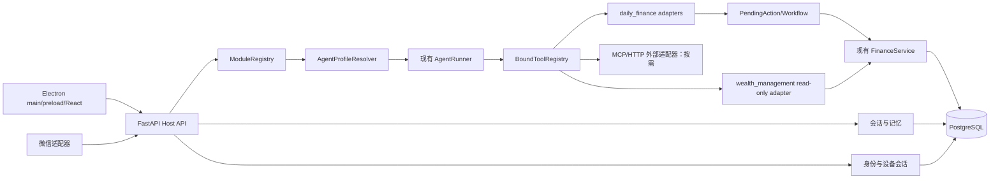

# P4-D9：可扩展个人 AI 应用 Host 最小技术方案

- 任务：`P4-D9`
- 状态：`review` 前技术建议；本文不代表已经实现或冻结
- 固定输入提交：`1d06d92c93d99fb2a3a23da6ff0958932e358814`
- 控制版本：`2026-09-20T12:55:41+08:00`
- 适用范围：P4-A～P4-D 的实现与教学边界
- 默认地区/币种/时区：中国大陆、CNY、Asia/Shanghai

## 0. 推荐结论

P4 应在现有代码上增加一个**可信内置模块的模块化单体 Host**。Host 仍运行在一个 FastAPI/SQLAlchemy 进程中，通过显式组合根注册 `daily_finance` 和最小 `wealth_management`；现有 `AgentRunner`、`ToolRegistry`、`AgentApplication`、`pending_action` 与 `FinanceService` 通过适配器逐步接入，不搬目录、不重写已验收事务核心。

关键默认值如下：

1. 模块采用“Python 工厂 + 严格声明 manifest”的混合注册；启动时显式列出可信内置模块，不扫描和执行未知插件。
2. Agent Profile 是版本化配置，不是独立进程。桌面按当前模块确定性选 Profile；微信没有页面上下文时才使用受限意图路由。
3. Host 维护全局工具目录，再按 Profile、用户权限和模块状态生成绑定工具视图；Schema 可见性与执行时授权各检查一次。
4. 财务工具继续进程内。MCP 是外部工具适配协议，不是 Host 内部模块系统；P4 不强制部署 MCP Server。
5. 当前显式 `pending_action` 状态机抽出通用壳，模块保留自己的 payload、复验和提交 handler；暂不引入 LangGraph。
6. P4-A 建立主人账户、设备会话、渠道绑定和可信 `user_id`。现有虚拟 `actor_id`/`owner_id` 迁移为真实外键，客户端和模型都不能自报身份。
7. 记忆分为共享已确认记忆、模块候选/已确认记忆、会话消息和事实数据库；账本、余额、预算及行情永不复制成长期 Agent 记忆。
8. API 首版使用普通 HTTP JSON 与轮询恢复；P4-C 如确有逐步状态需求再增加单向 SSE。首版不需要 WebSocket，也不以 token 流式输出阻塞正确性验收。
9. Electron main 管窗口、托盘、本地后端子进程和本机凭据；preload 暴露窄而有类型的 IPC；React renderer 不获得 Node.js、进程或密钥权限。
10. P4-D 用只读的最小 `wealth_management` 模块证明导航、Profile、工具、记忆、设置和毛毛映射均由注册驱动；它不接行情、不交易、不实现完整财富规划。

## 1. 证据口径与当前代码现实

本文使用三种证据标签：

- **代码事实**：固定提交中已经存在并有测试支撑的行为。
- **官方保证**：官方文档明确说明的框架或协议能力。
- **项目决定**：建议总控冻结的 P4 默认值；冻结和实现前都不能写成“已经完成”。

### 1.1 可以直接复用的地基

| 现有能力 | 代码位置 | P4 用法 |
| --- | --- | --- |
| 有界模型循环 | [`agent/loop.py`](../src/wife_system/agent/loop.py#L26) | 保留 4 个模型轮次、8 次工具调用、1 次写调用、重复调用拒绝和供应商错误分类；让 Profile 提供限制值 |
| 供应商中立边界 | [`agent/providers.py`](../src/wife_system/agent/providers.py#L31) | `ModelProvider` 继续作为模型适配口；DeepSeek 只是一个 provider |
| 严格工具合同 | [`tools.py`](../src/wife_system/tools.py#L22) | 保留 Pydantic 参数校验、唯一工具名和 handler 分发；外面增加 Host 目录与绑定视图 |
| 可信执行上下文 | [`agent/context.py`](../src/wife_system/agent/context.py#L12) | 扩成含 `user_id`、`device_session_id`、`module_id`、`agent_profile_id` 的 Host 上下文；仍不进入模型参数 Schema |
| 持久 run 幂等 | [`agent/application.py`](../src/wife_system/agent/application.py#L118) | 复用来源摘要、请求指纹和重放；唯一范围加入可信用户 |
| 候选确认与恢复 | [`agent/pending.py`](../src/wife_system/agent/pending.py#L53) | 抽出通用 workflow 壳；保留 24 小时、版本比较交换、过期与重复确认 |
| 六个财务工具 | [`agent/finance_tools.py`](../src/wife_system/agent/finance_tools.py#L456) | 作为 `daily_finance` 的首个工具集合，不立即改名或改输入输出 |
| 事务与持久幂等 | [`finance/service.py`](../src/wife_system/finance/service.py#L157) | 所有财务写入继续由同步 `Session.begin()`、`command_receipt`、审计和领域不变量完成 |
| 统一 HTTP 错误与请求 ID | [`api/app.py`](../src/wife_system/api/app.py#L92) | 提取 Host 级依赖、错误映射和认证；保留现有端点兼容 |
| owner 隔离先例 | [`activity_import/context.py`](../src/wife_system/activity_import/context.py#L11)、[`activity_import/repository.py`](../src/wife_system/activity_import/repository.py#L20) | 说明可信 owner 必须进入查询；P4 将临时 owner 变成账户外键 |
| 模块化业务先例 | [`activity_import/service.py`](../src/wife_system/activity_import/service.py#L70) | 活动导入已有独立 context/schema/repository/service/API，可作为内置模块边界参考 |

代码事实还包括：同步 SQLAlchemy 服务已使用短 Session 和事务上下文；`ToolRegistry.schemas()` 会按权限隐藏 Schema，但当前执行入口仍依靠各财务 adapter 再检查权限；`finance_registry()` 和系统提示词仍固定为财务；应用默认身份仍是静态虚拟 UUID（[`api/app.py`](../src/wife_system/api/app.py#L100)）。

### 1.2 当前没有实现的能力

固定提交中没有模块注册中心、Agent Profile、真实登录、设备会话、微信身份绑定、通用 conversation/message、长期记忆、事件总线、MCP client/server、Electron/React 项目或桌面后端监督器。财务根表也没有 `user_id`；不能仅把前端登录加上就宣称用户隔离完成。

### 1.3 不允许被 P4 破坏的边界

1. `RunContext` 的身份、权限、来源、接收时间和批准信息只能由可信入口构造，不能成为模型工具参数。见 [P2-IF-001](phase-2-interface-freeze.md#3-可信上下文)。
2. 候选、确认、24 小时过期、稳定 `pending:{pending_action_id}:commit` 和并发确认必须保留。
3. 金额、余额、预算、事务、领域幂等和最终成功只能由确定性程序给出。
4. `/healthz`、P0 probe、P2 Agent 三个端点和 P3 activity-import 三个端点在迁移期保持兼容。
5. P3 Markdown 继续是不可信数据；模块 manifest、权限或系统提示词不能由导入文件改变。

## 2. 推荐架构与职责边界



| 名词 | P4 精确定义 | 不能承担的职责 |
| --- | --- | --- |
| Host | 身份、模块注册、Profile 选择、上下文、工具授权、会话/记忆、统一 API 和审计 | 不实现财务算法，不替模块决定业务规则 |
| 模块 | 一组 Profile、工具适配器、API/UI/设置/记忆/事件贡献以及领域依赖 | 不获取其他模块 repository 或数据库万能 Session |
| Agent | 一个由 Profile 描述的逻辑推理角色；同一进程可运行多个实例 | 不直接改库，不发明身份、权限、金额或事实 |
| Workflow | 持久候选、确认、暂停恢复、重试与补偿状态 | 不把自然语言推测变成领域事实 |
| 领域程序 | `FinanceService` 等确定性服务和数据库事务 | 不生成开放式建议或跨模块自由路由 |
| Tool | Agent 能请求的受约束能力，具有 Schema、权限、超时和结构化结果 | 不是任意 Python/SQL 执行入口 |
| MCP | Host 与外部 tool/resource/prompt server 的互操作协议 | 不是内部模块发现、权限数据库或业务事务框架 |

## 3. 技术问题 1：模块注册

### 推荐

采用 **Python + 声明元数据混合**。`ModuleDefinition` 由代码构造：可序列化的 `ModuleManifest` 描述稳定身份和能力，Python factory 提供 router、tool binding、service 和 UI manifest 生成器。唯一组合根显式调用 `register_builtin_modules([daily_finance(), wealth_management()])`。

最小 manifest 字段：

- `module_id`：稳定小写 ID，首版为 `daily_finance`、`wealth_management`；
- `version`：模块 SemVer；
- `host_api_major`：首版固定 `1`；
- `display_name`、`enabled_by_default`；
- `agent_profiles`、`tool_bindings`、`memory_grants`、`permissions`；
- `api_prefixes`、`ui`、`settings_schema_version`；
- `published_events`、`subscribed_events`、`migration_owner`。

发现规则是显式导入，而不是目录扫描。启动时先做纯验证：重复 `module_id`、Profile ID、工具 canonical ID、API 前缀或桌面路由一律失败；Host API 主版本不相容时禁用并报告稳定错误。用户设置只决定已编译模块是否启用，不能指定 import path。

### 替代、代价和重新评估

| 方案 | 收益 | 代价/结论 | 重新评估条件 |
| --- | --- | --- | --- |
| 纯 Python 显式注册 | 类型和调试最清楚 | UI/权限等元数据不易序列化给桌面；可作内部实现，不单独采用 | manifest 字段始终很少且不需跨语言 |
| 纯 YAML/JSON | 非开发者易改 | 不能安全表达 factory；容易误把配置当代码权限；不采用 | 将来只开放无代码主题/提示模板包 |
| Python + manifest | 兼顾运行对象与跨语言声明 | 需要启动验证和两类类型；**采用** | P4-D 验证显示重复描述成本过高 |
| Python entry points/插件市场 | 可由第三方包发现 | 供应链、签名、沙箱、升级和未知代码执行复杂；P4 禁止 | 用户明确需要第三方安装，且有独立签名/隔离设计 |

## 4. 技术问题 2：Agent Profile 与路由

### 推荐

有效系统上下文按固定顺序组装：`Host 基础安全规则 → Profile 版本化提示词 → 可信身份/渠道/页面摘要 → 获准的少量记忆 → 最新工具事实`。用户消息、Markdown、搜索结果和记忆内容都放在不可信数据区域，不能插入或覆盖基础安全规则。

`AgentProfile` 至少声明 `profile_id/module_id/version/prompt_version/provider_policy/tool_grants/memory_grants/limits/confirmation_policy/ui_metadata/eval_suite`。`limits` 含模型轮次、总工具数、写工具数、单次超时和可选成本上限；Host 还保留全局硬上限，模块只能收紧。

- 桌面：当前编译模块和路由确定性选择 Profile，不调用模型做路由。
- 微信：先用受限路由器输出一个已注册 Profile ID 和置信度；歧义、跨模块写入或缺少关键上下文时询问用户。
- 跨模块只读：Host coordinator 可调用各模块公开的只读查询工具，再合并结构化结果；不允许两个 Agent 自由对话。
- 跨模块写入：首版拆成独立候选并分别确认，不做跨模块分布式事务。
- 会话：以 `(user_id, channel, module_id, agent_profile_id)` 逻辑隔离。桌面切换模块时恢复该模块最后活动会话；不会把另一个模块完整对话自动塞入当前上下文。

### 替代、代价和重新评估

单一万能 Agent 省去路由，但工具面、提示词和记忆范围会持续扩大，权限难审计；不采用。每个 Agent 独立进程隔离更强，但当前模块共享一个数据库与领域服务，运维代价没有证据支持；不采用。若出现独立发布团队、不同信任域、不同数据驻留或单个模块故障拖垮 Host，再评估进程隔离。若跨模块计划稳定超过两个子任务且需要持久恢复，再设计显式 Host workflow。

## 5. 技术问题 3：Tool Registry 与 MCP 边界

### 推荐

增加 `ToolCatalog`，保存全局 `ToolDescriptor`；每次 run 通过 `bind(profile, principal, enabled_modules)` 生成只读 `BoundToolRegistry`。当前 `ToolRegistry` 可继续作为最后一跳，不需要重写六个财务 handler。

权限有两道门：

1. **可见性**：只有同时满足 Profile grant、用户/session permission 和模块已启用的工具才进入模型 Schema。
2. **执行时**：按 canonical tool ID 再做相同授权、输入校验、用户资源作用域和确认策略；模型即使猜到隐藏名称也无法执行。

canonical ID 建议为 `module_id.tool_name@major`。为兼容 P2，`daily_finance` 在 Profile 内继续向模型暴露 `finance_list_accounts` 等原名；别名只由 manifest 明确声明。重复 ID/别名在启动时失败。

统一适配结果为：

```text
ToolExecutionResult
├── status: ok | needs_input | needs_confirmation | error
├── payload: 模块原有结构化结果
├── error: {code, retryable, safe_message} | null
├── provenance: {tool_id, tool_version, data_as_of?}
└── audit_id: 内部 UUID；不发送原始隐私参数
```

进程内财务工具不改成 MCP。未来搜索、行情、日历、企业服务或需要被其他 Host 复用的能力适合 MCP/HTTP adapter。adapter 必须限定 server allowlist、工具 allowlist、超时、输出大小、取消、重试、协议版本和脱敏；MCP server 返回的工具说明与内容仍是不可信输入。

官方 MCP 当前采用 Host–Client–Server 架构，server 暴露 tools/resources/prompts；2026-07-28 版本和官方 TypeScript SDK v2 还包含协议版本协商和更新后的授权能力。项目实现时必须固定 SDK 与协商版本，不能把“最新”当稳定配置。[MCP 2026-07-28 说明](https://blog.modelcontextprotocol.io/posts/2026-07-28/)、[官方 TypeScript SDK v2](https://ts.sdk.modelcontextprotocol.io/v2/)

### 替代、代价和重新评估

“所有内部工具都是 MCP”统一了线协议，却引入进程、传输、认证和失败模式，还会削弱当前 Python 类型/事务的可见性；P4 不采用。若某工具需要跨语言、跨进程、独立伸缩或供多个应用复用，再使用 MCP。若只是同进程领域函数，继续直接 adapter。

## 6. 技术问题 4：Workflow 与运行状态

### 推荐

把现有状态机抽为小型 `PendingActionCoordinator`，保留当前六个状态：`needs_input → needs_confirmation → committing → committed`，以及 `expired/cancelled`。通用表保存用户、模块、workflow 类型、payload schema 版本、状态、版本、到期和最终结果；模块注册 `ActionHandler` 负责解析 payload、检查资源版本、生成摘要和幂等提交。

通用状态与财务状态必须分开：Host 知道候选在等待什么，但 `record_expense` 的账户、分类、金额规则仍属于 `daily_finance`。不能做一个能解释所有 JSON 的“万能 workflow”。

为进程重启补充最小恢复边界：

- `agent_run` 增加 `user_id/module_id/profile_id`、`attempt_no`、`lease_expires_at`；旧的 `running` lease 到期后允许同来源事件接管；
- 重复来源消息仍由数据库唯一键和请求指纹重放；
- 响应丢失时以相同 event/confirmation ID 查询或重放；
- 并发确认以数据库 `status + version_id` 比较交换争夺提交权；
- `FinanceService` 稳定命令收据仍是最终写入幂等，Python 锁只减少同进程重复工作；
- 取消只能阻止尚未进入领域事务的工作；事务开始后不能向用户承诺物理取消，只能等待同键结果。

### LangGraph 结论

当前不引入。现有流程只有一个持久候选和清晰状态，显式代码更利于学习和审计。出现下列信号中的至少两项并有场景/缺陷数据时做对照实验：一个流程三个以上持久暂停点；经常跨天恢复；确认、编辑、驳回、重新取数和补偿形成多分支；多个步骤需要独立重试/可视化；当前状态机缺陷或维护成本持续上升。即使引入，业务幂等和事务仍留在领域层。

### 替代、代价和重新评估

LangGraph 是有意义的替代方案，优势是 checkpoint、interrupt 和复杂分支表达；代价是图节点、thread、恢复重放和序列化等新概念，而且不能替代领域幂等。自由的多 Agent 对话不是替代方案，因为它没有可靠状态、权限和停止条件。满足上面的触发信号后，用同一组恢复/并发/副作用测试比较显式状态机与 LangGraph，再决定是否只替换编排层。

## 7. 技术问题 5：登录、用户和渠道身份

### 推荐

#### 7.1 最小账户模型

P4-A 只提供主人账户初始化，不开放公众注册：

| 表 | 关键字段/约束 | 生命周期 |
| --- | --- | --- |
| `app_user` | `id`、`handle_normalized` 唯一、`status`、`created_at`、`version_id` | 禁止业务级物理删除；停用后撤销会话 |
| `password_credential` | `user_id` 唯一、`password_hash`、`algorithm`、`updated_at` | 只存哈希；改密后撤销旧设备会话 |
| `device` | `id/user_id/name/platform/last_seen_at/revoked_at` | 用户可查看和撤销 |
| `device_session` | `id/user_id/device_id/token_digest/expires_at/revoked_at/rotated_from_id` | 原始 token 只在签发时出现；数据库存摘要 |
| `channel_binding_code` | `code_digest/user_id/channel/expires_at/attempts/consumed_at` | 一次性、短时、有限尝试 |
| `channel_identity_binding` | `user_id/channel/provider_account_digest/external_subject_digest/status/version_id` | 同一外部身份只能有一个 active 绑定；解绑保留审计 |

密码使用 Argon2id；FastAPI 官方教程当前也把 Argon2 作为推荐算法，但项目仍需冻结具体库、参数和升级策略。[FastAPI 密码哈希与 OAuth2/JWT 教程](https://fastapi.tiangolo.com/tutorial/security/oauth2-jwt/)

本地桌面建议使用随机不透明 access/refresh token，而不是把长期 JWT 当撤销数据库的替代。短期 access token 只放 renderer 内存或由 Electron main 代理请求；refresh/device token 由 main 使用 Windows OS 保护能力保存。Electron `safeStorage` 在 Windows 使用 DPAPI，但官方说明它不防同一 Windows 用户空间内的其他应用，因此仍需最小权限、可撤销和不写日志。[Electron safeStorage](https://www.electronjs.org/docs/latest/api/safe-storage)

模型 API Key 与用户登录凭据分开保存，绝不进入数据库记忆、提示词、renderer localStorage、Git、错误响应或日志。未来服务端部署使用部署平台 secret manager；桌面本机可由 main 进程调用 OS 凭据能力。

#### 7.2 `user_id` 的无破坏迁移

不能只在 `agent_run` 加 `user_id`。否则财务查询仍可能跨用户读取 UUID。建议按下面顺序：

1. 建 `app_user`、credential、device/session 和 channel binding；生成唯一 bootstrap owner。
2. 向 aggregate roots 增加可空 `user_id`：账户、分类、交易头、活动模板/发生、导入批次、收入安排/预计、预算计划、`command_receipt`、`audit_event`、`agent_run`、`pending_action`。
3. 对现有行回填 bootstrap owner；校验空值、数量、孤儿和关系一致性。
4. 给跨用户引用敏感的 child 增加 `user_id`，使用 `(user_id,id)` 唯一键与复合外键，阻止交易分录引用其他用户账户/分类。
5. 把所有查询/命令签名改为接收可信 `PrincipalContext`，每个 repository 条件都包含 `user_id`；API body 不出现 owner 字段。
6. 来源幂等唯一键改为 `(user_id, source_system, key_digest)`；HMAC domain 加 `user_id`，避免不同用户同事件碰撞。
7. 所有新列设为非空，再删除仅供迁移的兼容路径。SQLite 与 PostgreSQL 分别升级/降级/已有数据复验。

现有 `actor_id` 可在 API DTO 中暂时保留为兼容别名，但持久外键和代码语义统一为 `user_id`。不在一次提交里重命名全部表/字段。

#### 7.3 微信绑定流程

已登录桌面生成短时一次性绑定码；用户在微信发送后，可信渠道 adapter 提交 `channel + provider account digest + external subject digest + code`。服务端锁定 code、检查过期/次数/已消费和外部身份唯一性，再原子建立 binding。冲突不自动抢占；必须先在账户中心撤销旧绑定。模型只能看到“已绑定/未绑定”和内部 user，不看到原始微信身份。

### 替代、代价和重新评估

“Windows 登录即应用登录”操作简单，但无法安全支持微信绑定、撤销和未来远程多端；不采用为唯一身份。JWT 无状态访问适合大规模服务，但本项目更看重设备撤销和本地可解释性；首版采用服务端会话。未来公开注册、横向扩容或第三方客户端出现后，再比较 OAuth/OIDC provider 和签名 access token。

## 8. 技术问题 6：分层记忆与会话

### 推荐

#### 8.1 最小关系模型

| 表 | 关键字段 | 关键索引/约束 |
| --- | --- | --- |
| `conversation` | `id,user_id,channel,module_id,profile_id,status,last_message_at,created_at` | `(user_id,module_id,profile_id,last_message_at)`；profile 必须属于 module |
| `conversation_message` | `id,user_id,conversation_id,role,content,content_digest,sensitivity,created_at,deleted_at` | `(conversation_id,created_at,id)`；user 与 conversation 复合外键 |
| `memory_candidate` | `id,user_id,source_namespace,target_namespace,kind,value_json,source_type,source_ref_digest,sensitivity,status,expires_at,proposed_by_profile_id` | `(user_id,status,expires_at)`；只能 pending→confirmed/rejected/expired |
| `memory_item` | `id,user_id,namespace,kind,value_json,source_type,source_ref_digest,confirmation,confidence,sensitivity,valid_from,expires_at,status,version_id` | `(user_id,namespace,status,kind)`；共享项必须 confirmed |
| `module_setting` | `user_id,module_id,key,value_json,schema_version,version_id` | `(user_id,module_id,key)` 唯一 |

命名空间至少包括 `shared.confirmed`、`daily_finance.confirmed`、`daily_finance.candidates`、`wealth_management.confirmed` 和 `wealth_management.candidates`。Profile 只取得 manifest 声明的读/提议权限；没有“任意 namespace”通配符。

#### 8.2 生命周期、确认和删除

- 会话消息按用户可见保留策略管理；首版建议 90 天默认值，用户可立即删除。
- `memory_candidate` 默认 30 天后过期；拒绝项只保留最小审计元数据，不保留原始敏感值。
- 已确认稳定记忆保留到用户删除、显式失效或被新版本 supersede。
- 模块候选晋升共享记忆必须显示来源摘要、目标范围、敏感级别、到期和受影响模块；确认事务创建共享项并记录候选关系。
- 删除敏感记忆时清除 `value_json`，留下不含内容的 tombstone、时间和审计 ID；“软删除但正文仍可恢复”不能称为忘记。
- 账目、余额、预算、持仓和行情只由领域工具查询；message 和 memory 表不得成为第二本账。

运行时检索先做确定性过滤：`user_id + 获准 namespace + active + 未过期 + kind/tag`，再按最近确认、显式相关标签和有限条数排序，默认最多 8 项。不能把全部账本、全部对话或整份 memory 导出塞进 prompt。

P4 不需要向量数据库。当前记忆少、结构化字段明确、尚无检索质量评测。只有当有效记忆规模显著增长、关键词/标签检索在固定问题集上持续漏召回，并且敏感数据 embedding、删除和供应商边界已设计，才比较 PostgreSQL 全文检索、pgvector 或专用向量库。

### 替代、代价和重新评估

单一 `memory.md` 便于阅读和备份，却缺少作用域、并发、确认、删除与权限约束；仅可作为导出格式。直接保存全部对话作长期记忆会放大隐私和提示注入风险；不采用。若未来大量非结构化私人文档形成经过授权的知识库，再单独设计 RAG，不与用户偏好记忆混表。

## 9. 技术问题 7：FastAPI 与桌面会话 API

### 推荐

#### 9.1 最小 API

| 组 | 建议端点 | 说明 |
| --- | --- | --- |
| 登录 | `GET /api/v1/auth/bootstrap-status`、`POST /initialize`、`POST /login`、`POST /refresh`、`POST /logout` | initialize 只在空系统、本机和一次性窗口可用 |
| 设备 | `GET /api/v1/auth/sessions`、`DELETE /sessions/{id}` | 当前/其他设备可撤销 |
| 绑定 | `POST /api/v1/channel-bindings/codes`、`GET/DELETE /channel-bindings/{id}` | 原始外部身份不返回 UI |
| 模块 | `GET /api/v1/modules` | 返回当前用户启用模块及序列化 UI/Profile 摘要 |
| 会话 | `POST/GET /api/v1/conversations`、`GET /{id}/messages` | 由服务端绑定 user/module/profile |
| Agent | 保留 `POST /api/v1/agent/runs`、`POST /runs/{id}/resume`、`GET /runs/{id}` | P4 可增加 conversation/module 字段，但旧调用继续通过兼容 adapter |
| 记忆 | `GET /api/v1/memories`、`GET /memory-candidates`、`POST /{id}/confirm`、`DELETE /{id}` | 权限和 namespace 在服务端过滤 |
| 设置 | `GET/PUT /api/v1/settings/{module_id}` | 只处理账户同步设置；设备设置在 Electron main |
| 健康 | `/healthz`、`/readyz` | health 只说明进程；ready 才检查数据库/迁移/registry |

FastAPI 依赖适合集中构造 authenticated principal、数据库资源和权限；官方文档明确依赖可承载共享逻辑、数据库和安全检查。[FastAPI Dependencies](https://fastapi.tiangolo.com/tutorial/dependencies/)、[Security dependencies](https://fastapi.tiangolo.com/reference/dependencies/)

#### 9.2 HTTP、SSE、错误与取消

P4-A/B 使用 HTTP JSON：创建 run 后取得状态，GET 可在断线后恢复。每个改变状态的请求使用稳定 `Idempotency-Key` 或业务 ID；同键异载荷返回冲突。错误继续使用 `{request_id,error:{code,message,retryable}}`，增加 `module_disabled/profile_not_found/tool_not_allowed/session_revoked/backend_not_ready`。

P4-C 若需要逐步状态或 token 展示，使用单向 SSE，不上 WebSocket。SSE 足以传 `run.status/tool.started/tool.finished/token/final/error`；所有最终结果仍可 GET 恢复。FastAPI 当前官方提供 SSE 支持，但本项目依赖下限是 `fastapi>=0.115`，官方内置 SSE 文档注明该能力在 0.135.0 加入，因此实现前要么提高并锁定 FastAPI 下限，要么使用现有 Starlette `StreamingResponse`；本文不把它写成当前已可用。[FastAPI SSE](https://fastapi.tiangolo.com/tutorial/server-sent-events/)

取消 endpoint 只设置 run 的 cancel request。模型调用和外部工具尽力协作取消；进入 FinanceService 事务后返回“正在确定结果”，随后以相同幂等键恢复，不能显示虚假取消成功。

#### 9.3 本地后端生命周期

- 开发：Electron main 的 `BackendSupervisor` 启动受配置约束的 Python 子进程，等待结构化 ready 信号并有超时；记录 PID 和启动 nonce；退出时只停止自己启动的子进程。可设置“连接开发者手动启动的后端”，此时 main 不停止它。
- renderer 不执行进程命令，不知道模型密钥或 refresh token。main 通过窄 IPC 代理认证请求；preload 只暴露明确方法。
- 本地后端只绑定 loopback 随机端口；启动 nonce、access token、CORS/origin 与 IPC sender 均验证。端口不是认证。
- 正式部署：桌面只依赖同一 Host API contract。本机 sidecar、局域网或未来 TLS 服务端由 connection profile 决定；远端模式下 main 不管理服务生命周期。
- 后端离线时保留未发送消息和 `client_event_id`，恢复后用同一个 ID 重试；不能生成新 ID 假装新请求。

### 替代、代价和重新评估

WebSocket 支持双向实时，但需要连接恢复、心跳、鉴权刷新和背压；首版无必要。完全由用户手动启动后端最容易调试，却不是桌面产品体验；保留为开发选项。未来出现服务端主动协作、多路双向控制或高频实时数据，再评估 WebSocket。

## 10. 技术问题 8：Electron、React 与模块 UI

### 推荐职责

| 层 | 负责 | 禁止 |
| --- | --- | --- |
| Electron main | app 生命周期、主窗口/毛毛窗口、Tray、BackendSupervisor、OS secret、设备设置、受控外部链接 | 不渲染业务页面，不把通用 shell/文件/进程 API暴露给 renderer |
| preload | 用 `contextBridge` 暴露最小 typed API；校验/转换参数 | 不直接暴露 `ipcRenderer.send`、Node require 或任意 channel |
| React renderer | 导航、页面、Agent panel、表单、图表、主题和状态 | 不访问 Node、密钥、数据库或 Python 进程 |
| FastAPI Host | 登录、模块、会话、Agent、事实数据和权限 | 不管理窗口位置和本机托盘 |

Electron 官方把 main 定义为窗口与原生 API 管理者，每个 `BrowserWindow` 有 renderer；preload 是受控桥梁。官方安全清单要求 context isolation、renderer sandbox、限制导航/新窗口、校验 IPC sender、CSP，并避免把强大 API 暴露给不可信内容。[Electron Process Model](https://www.electronjs.org/docs/latest/tutorial/process-model)、[Electron Security](https://www.electronjs.org/docs/latest/tutorial/security)、[Context Isolation](https://www.electronjs.org/docs/latest/tutorial/context-isolation)

### UI 注册合同

后端 `/modules` 只返回可序列化能力；组件代码来自已编译桌面 registry。Shell 取两者交集：后端启用且本地有兼容 UI 的模块才显示。

```ts
type ModuleId = "daily_finance" | "wealth_management" | (string & {});

interface DesktopModuleContribution {
  moduleId: ModuleId;
  version: string;
  hostUiMajor: 1;
  navigation: readonly NavigationItem[];
  routes: readonly RouteContribution[];
  dashboardCards: readonly DashboardCardContribution[];
  agentPanel: AgentPanelContribution;
  settings: readonly SettingPageContribution[];
  companion: CompanionContribution;
}

interface RouteContribution {
  routeId: string;
  path: string;
  load: () => Promise<{ default: React.ComponentType }>;
  requiredCapability?: string;
}

interface AgentPanelContribution {
  profileId: string;
  title: string;
  starterPrompts: readonly string[];
}

interface CompanionContribution {
  primaryMode: "daily_finance" | "wealth_management" | string;
  stateMap: Readonly<Record<string, CompanionVisualState>>;
}
```

所有 route ID/path、setting ID、Profile ID 和 companion state 在启动时查重。Shell 只做 `builtinDesktopModules.map(register)`，不能写 `if moduleId === "wealth_management"`。React 官方 `lazy()` 能通过动态 `import()` 延迟加载模块页面；TypeScript 官方建议现代代码使用 ES Modules。[React lazy](https://react.dev/reference/react/lazy)、[TypeScript Modules](https://www.typescriptlang.org/docs/handbook/2/modules.html)

后端 DTO 以 FastAPI OpenAPI 为唯一跨语言源，在构建/CI 中生成 TypeScript 类型并检查差异；桌面模块贡献合同手写并版本化，因为它包含 React loader，不能由 Pydantic 生成。生成器和版本在 P4-B 冻结，不允许运行时下载 Schema。

主窗口、Tray、毛毛窗口进入 P4-B；自动更新、安装器签名和发布通道延后到分发阶段。Electron 官方 Tray 支持 Windows 通知区域，但保持后台运行需要 main 明确处理窗口关闭生命周期。[Electron Tray](https://www.electronjs.org/docs/latest/tutorial/tray)

### 替代、代价和重新评估

前端通过后端返回任意组件 URL 属于远程代码加载，违反可信内置模块边界；不采用。微前端/Module Federation 可独立部署，但增加版本与供应链复杂度；只有模块独立团队和发布周期出现后再评估。共享手写 DTO 初期简单，但会漂移；只允许纯 UI 类型手写，API 类型生成。

## 11. 技术问题 9：毛毛与主题

### 推荐

毛毛是一个由 Electron main 管理的透明、无边框、可选置顶 `BrowserWindow`，不是第二套 Agent。main 保存窗口位置、大小、显示器 ID、置顶、透明度、关闭策略和开机启动等设备设置；移动结束时节流写入 `app.getPath("userData")` 下的版本化 JSON，使用临时文件原子替换。显示器变化后把位置夹回当前 work area。

状态必须拆开：

```text
active_module_id      当前桌面模块
active_profile_id     当前逻辑 Agent
primary_mode          毛毛主形态，由模块 contribution 映射
substate              idle/listening/thinking/tool/needs_confirmation/error/offline
privacy_mode          是否隐藏金额与敏感气泡
connection_state      backend starting/online/offline
```

`daily_finance` manifest 映射为“日常管钱”，`wealth_management` 映射为“财富管理”；Host Shell 只读取 contribution。模块切换不能触发财务写入。主窗口关闭默认隐藏到 Tray并保留 Host 入口，首次发生时清晰提示；用户可改为退出/每次询问。全屏时默认隐藏毛毛，离线只显示离线状态。

主题用 CSS custom properties 形成语义 token：surface/text/accent/success/warning/danger/income/expense/market-up/market-down。支持 light/dark/system/high-contrast/reduced-motion。行情颜色约定是模块设置（中国红涨绿跌/国际绿涨红跌），普通收入/支出仍使用自己的语义色，不能复用涨跌颜色。

P4-B 最小验证：透明窗口、拖动、跨重启位置恢复、边界夹取、置顶切换、Tray 打开/隐藏、主窗口关闭策略、全屏隐藏、隐私模式、键盘可达入口和 reduced motion。动画素材、美术皮肤、低电量降帧和自动更新可以延后。

### 替代、代价和重新评估

首版只有 Tray 风险最低但不能验证毛毛模块映射；首版只做悬浮网页又无法验证后台生命周期。推荐 Tray + 一个简化透明窗口同时交付。若透明窗口在目标 Windows 设备上造成 GPU、焦点或无障碍问题，允许降级为 Tray + 普通迷你窗口，不改变 Host 合同。

## 12. 技术问题 10：事件、设置、迁移和第二模块证明

### 推荐

#### 12.1 事件

P4 先用类型化进程内事件总线，只承载 UI 刷新和可丢失通知提示；领域事务不能依赖它完成正确性。事件在事务成功后发布，handler 失败不回滚已提交账本。关键跨进程通知、后台任务或至少一次投递出现后，再加入同事务 outbox。

```python
class EventEnvelope(BaseModel):
    event_id: UUID
    event_type: str                 # transaction.recorded
    event_version: int              # 从 1 开始
    occurred_at: datetime
    user_id: UUID
    producer_module_id: str
    correlation_id: UUID
    idempotency_digest: str | None  # 不放原始键
    sensitivity: Literal["public", "private", "restricted"]
    payload: dict[str, JsonValue]   # 最小必要字段
```

敏感详情不复制进 event payload；消费者用自己的权限调用只读工具。订阅者只能订阅 manifest 声明的类型；事件版本不兼容时拒绝启动。

#### 12.2 设置

- 账户同步：`module_setting`，例如确认偏好、记忆策略；服务端校验 schema/version。
- 设备本地：Electron main JSON，例如窗口/毛毛位置、缩放、开机启动；不上传。
- 运行时：React store，例如当前模块、未读、临时静默；重启可丢弃。

API Key 不属于普通设置 JSON。

#### 12.3 Alembic 与模块 migration

继续一条主 Alembic 链。revision 文件可用 `p4_host_`、`p4_daily_`、`p4_wealth_` 前缀表达 owner，但不能让每个模块产生独立 head。官方 Alembic 支持 multiple bases/version directories，同时也说明这会形成多个 head；当前单团队、单数据库不需要这项复杂度。[Alembic branches and multiple bases](https://alembic.sqlalchemy.org/en/latest/branches.html)

推荐迁移顺序：

1. `p4_host_identity`：账户、credential、device/session、binding；
2. `p4_host_user_scope_nullable`：给现有 aggregates/receipts/runs/pending 增加可空 user；
3. 数据回填与一致性检查；
4. `p4_host_user_scope_constraints`：非空、复合唯一和复合外键；
5. `p4_host_conversation_memory_settings`；
6. `p4_host_module_workflow_columns`：run/pending 的 module/profile/schema/lease；
7. `p4_wealth_minimal`：只有最小规划记录确实需要持久化时才增加；纯只读测试页可以没有表。

SQLAlchemy 官方建议每个并发线程/任务使用自己的 Session，并由应用外层管理事务范围；这与当前同步短事务模型一致，P4 不为 Electron 或 SSE 改成 AsyncSession。[SQLAlchemy Session basics](https://docs.sqlalchemy.org/en/20/orm/session_basics.html)、[Transactions](https://docs.sqlalchemy.org/en/20/orm/session_transaction.html)

#### 12.4 第二模块的可执行证明

`wealth_management` 在 P4-D 只交付“应急资金/储蓄规划”测试页面和一个确定性只读工具。输入是虚拟目标与现有财务 snapshot port；输出是 `current_minor/target_minor/gap_minor/months_of_expense/data_as_of`，不调用行情、不写账、不推荐证券。

扩展性通过以下自动化检查证明：

1. 把 `wealth_management()` 加入唯一 builtin 列表后，`GET /modules`、桌面导航、设置页和毛毛主形态自动出现；Host router 没有模块 ID 分支。
2. 同一通用 Agent run API 可使用 wealth Profile；不新增 `/wealth-agent-chat` 特例。
3. wealth Profile 只能看到自己声明的只读工具和获准财务 snapshot；直接猜 `finance_record_expense` 在可见性和执行时都被拒绝。
4. wealth 只能读 `shared.confirmed` 与 `wealth_management.confirmed`；读取或写入 `daily_finance.confirmed` 失败且无旁路。
5. 禁用 wealth 后，其导航/Profile/工具/设置/毛毛映射消失，daily finance 数据与迁移不变。
6. 路由、工具别名、Profile、namespace 或 setting key 冲突在启动验证时稳定失败。
7. wealth 页面和 adapter 不 import `daily_finance` repository；只依赖公开 query port/DTO。
8. 空库与 P0～P3 已有数据均能升级、降级到允许边界并恢复；PostgreSQL 复验 user scope、唯一键和并发。

### 替代、代价和重新评估

现在引入 Kafka/Redis 是没有可靠投递需求的运维成本；不采用。每模块独立 migration head 会增加升级顺序和合并风险；保持单链。若模块开始独立发布、可选安装或使用独立数据库，再评估 outbox/message broker 和多 migration lineage。

## 13. 说明性 Python 类型草案

这些类型用于冻结边界，不是当前代码：

```python
from collections.abc import Callable
from dataclasses import dataclass
from typing import Literal, Protocol
from uuid import UUID
from pydantic import BaseModel, ConfigDict

class MemoryGrant(BaseModel):
    model_config = ConfigDict(extra="forbid", frozen=True)
    namespace: str
    access: Literal["read", "propose", "confirm"]

class ToolBinding(BaseModel):
    model_config = ConfigDict(extra="forbid", frozen=True)
    canonical_id: str
    model_name: str
    major_version: int = 1
    required_permissions: frozenset[str]
    confirmation: Literal["never", "policy", "always"]
    timeout_seconds: float

class AgentLimits(BaseModel):
    model_config = ConfigDict(extra="forbid", frozen=True)
    max_model_turns: int = 4
    max_tool_calls: int = 8
    max_write_calls: int = 1
    provider_timeout_seconds: float = 15.0
    max_cost_minor: int | None = None

class AgentProfile(BaseModel):
    model_config = ConfigDict(extra="forbid", frozen=True)
    profile_id: str
    module_id: str
    version: str
    prompt_version: str
    module_prompt: str
    tools: tuple[ToolBinding, ...]
    memory: tuple[MemoryGrant, ...]
    limits: AgentLimits
    eval_suite: str

class ModuleManifest(BaseModel):
    model_config = ConfigDict(extra="forbid", frozen=True)
    module_id: str
    version: str
    host_api_major: Literal[1]
    display_name: str
    enabled_by_default: bool
    profiles: tuple[AgentProfile, ...]
    permissions: frozenset[str]
    api_prefixes: tuple[str, ...]
    memory_namespaces: frozenset[str]
    settings_schema_version: int
    migration_owner: str

@dataclass(frozen=True)
class ModuleDefinition:
    manifest: ModuleManifest
    router_factory: Callable
    tool_factory: Callable
    service_factory: Callable
    ui_manifest_factory: Callable

class ActionHandler(Protocol):
    action_type: str
    payload_schema_version: int
    def summarize(self, payload: dict) -> dict: ...
    def validate_versions(self, principal: "PrincipalContext", payload: dict) -> None: ...
    def commit(self, principal: "PrincipalContext", payload: dict, source_event_id: str) -> dict: ...
```

manifest 用 Pydantic 执行严格验证和序列化；runtime definition 用 frozen dataclass 承载 factory，避免把任意 callable 当作配置数据。

## 14. 三条实际数据流

### 14.1 桌面记账

```mermaid
sequenceDiagram
    participant R as React
    participant E as Electron main/preload
    participant H as FastAPI Host
    participant A as daily_finance Agent
    participant W as PendingAction
    participant F as FinanceService
    participant D as PostgreSQL
    R->>E: 午饭 18 元 + stable client_event_id
    E->>H: session token + conversation + message
    H->>H: principal/module/profile/permissions
    H->>A: prompt + BoundToolRegistry + trusted context
    A->>W: record_expense candidate
    W-->>R: needs_confirmation
    R->>H: confirm same pending ID
    H->>W: compare status/version + approval
    W->>F: stable pending commit key
    F->>D: receipt + balanced entries + audit in one transaction
    D-->>R: committed result; dashboard refetches snapshot
```

### 14.2 微信路由

```text
可信微信 adapter
  → 绑定表解析 user_id（失败则只返回绑定流程）
  → 以可信来源事件 ID领取 run
  → 受限路由器选择已启用 Profile；歧义先问
  → Profile 工具视图 + 微信安全策略
  → 候选/查询
  → 结构化短回复
```

在稳定微信消息 ID 未重新验证前，保持 P2 安全降级：只读可执行，写入只能形成候选；不能宣称原消息级幂等完成。

### 14.3 财富管理只读分析

```text
用户打开财富管理
  → 桌面确定性选择 wealth_planner
  → Host 读取 shared.confirmed + wealth.confirmed（最多 8 项）
  → wealth 工具调用公开 finance snapshot port
  → 确定性程序计算应急金 gap/月份范围
  → Agent 解释已知、假设和缺失信息
  → 不写账、不改目标、不调用行情
```

## 15. 建议代码目录与逐步迁移

```text
src/wife_system/
├── host/
│   ├── composition.py          # 唯一 builtin 组合根
│   ├── contracts.py            # manifest/profile/tool/event DTO
│   ├── registry.py             # 查重、兼容、启停
│   ├── context.py              # PrincipalContext / HostRunContext
│   ├── auth/                   # account/device/session/channel binding
│   ├── memory/                 # conversation/message/candidate/item
│   ├── workflows/              # 通用 pending coordinator/handler registry
│   ├── tools/                  # catalog/binding/MCP/HTTP adapters
│   ├── events/                 # typed in-process bus
│   └── settings/
├── modules/
│   ├── daily_finance/          # 对现有 agent/finance/activity_import 的薄适配
│   └── wealth_management/      # P4-D 最小只读证明
├── agent/                      # 现有代码原地保留，逐步参数化
├── finance/                    # 现有确定性领域原地保留
├── activity_import/            # 现有实现原地保留
└── api/                        # 现有 app/routes + 新 host routers

apps/desktop/
├── electron/main/
├── electron/preload/
├── src/shell/
├── src/modules/daily-finance/
├── src/modules/wealth-management/
├── src/assistant/
├── src/companion/
├── src/settings/
└── src/theme/
```

迁移顺序采用“包裹、证明、再整理”：

1. 建 contracts/registry/composition，注册不改变行为的 `daily_finance` adapter；原 API/测试全通过。
2. 建身份表和 Principal dependency，分步回填 `user_id`；保留测试用显式 identity override。
3. 给 run/pending 加 module/profile/user/schema/lease，现有 P2 path 仍使用 daily profile。
4. 建会话、记忆和设置；先用确定性 retrieval，不接向量。
5. 建 Host API 与模块清单；现有 P2/P3 路由作为兼容 facade。
6. 建 Electron Shell、BackendSupervisor 和 compiled UI registry。
7. 把现有财务 dashboard/chat/import 接到 daily module。
8. 注册最小 wealth module并执行扩展性证明。
9. 只有证据显示收益时，再移动目录、引入 SSE、MCP、outbox 或 LangGraph。

## 16. P4-A～P4-D 的实施与验收切片

| 切片 | 依赖 | 可写范围建议 | 可验收结果 |
| --- | --- | --- | --- |
| P4-A Host/身份地基 | P0～P3 固定快照 | `host/**`、必要 `api/**`、用户作用域所需现有 model/service、顺序 Alembic、执行方测试 | 两个 manifest 可注册；真实 principal 注入；用户/设备/绑定/会话地基；daily adapter 不破坏 P2/P3 |
| P4-B Windows Shell | P4-A modules/auth API | `apps/desktop/**`、OpenAPI 类型产物、桌面测试/运行说明 | 登录、导航、Agent panel、设置/主题、Tray/毛毛、后端启停与离线状态；无业务分支 |
| P4-C 日常财务闭环 | P4-A/B | daily UI/adapters、必要只读 API，不改核心不变量 | 虚拟“午饭 18 元”候选→确认→写入→快照/账本刷新；查询、错误、断线恢复 |
| P4-D 第二模块证明 | P4-A/B 和公开 finance query port | wealth module/UI/测试；不接行情/交易 | 最小应急金/储蓄页面与只读 Agent；八项扩展性检查通过 |

每个切片执行方只能到 `review`。测试智能体先核对固定文件摘要，再做权限、隔离、并发、迁移和桌面独立验收；总控才有权冻结/接受。

## 17. 测试建议

| 层 | 必测行为 |
| --- | --- |
| 合同/单元 | manifest/profile/tool/event/settings 严格 Schema；重复 ID/route/namespace；Host API 兼容；Profile limit 只能收紧 |
| 权限 | 工具隐藏 + 猜名执行拒绝；user/module/memory/resource 隔离；禁用模块；撤销 session；绑定冲突/过期/重放 |
| Workflow | needs_input/confirmation/commit/expired/cancel；重启、response lost、重复/并发确认、lease 接管、领域写失败 |
| 数据库 | user 回填、复合 FK、幂等作用域、已有 P0～P3 数据升级/降级；SQLite 常规与 PostgreSQL 并发/约束分别证明 |
| API | 登录/刷新/撤销；严格 body；request ID；统一错误；Idempotency-Key；离线重试复用 client event；SSE 若实现则断线恢复和最终 GET |
| 记忆 | 候选确认/拒绝/过期/晋升/删除；namespace 授权；最多 N 条；事实不进入 memory；日志无内容 |
| Electron | contextIsolation/sandbox/CSP；IPC sender/参数校验；无 Node 暴露；子进程超时/崩溃/只停自己；token 不进 renderer storage |
| UI | compiled/backend registry 交集；懒加载失败；路由冲突；主题/高对比/reduced motion；毛毛位置/Tray/隐私/全屏 |
| 第二模块 | 八项证明；禁止 Host 核心分支；禁用/移除不损 daily；dependency rule 阻止跨模块 repository import |
| 回归 | P0 probe、P1 finance、P2 Agent、P3 import 全部原有测试；冻结接口响应和错误不漂移 |

## 18. 风险表

| 风险 | 具体表现 | 最小控制 | 重新评估信号 |
| --- | --- | --- | --- |
| 安全 | renderer/模块取得 Node、密钥或任意工具 | sandbox/contextIsolation/CSP、窄 IPC、双重授权、可信 builtin | 第三方模块或远程 UI |
| 隐私 | 对话、记忆、账本进入 prompt/日志/事件 | namespace、最少检索、日志白名单、事件最小 payload、可删除 | 外部 embedding/RAG |
| 复杂度 | 为未来抽象通用框架 | 四切片、薄 adapter、启动验证、不搬现有包 | 两个模块仍需大量特例时重构 |
| 模型成本 | 路由和页面切换也调用模型 | 桌面确定性路由、缓存只读结果、Profile 限额 | 有实际 token/延迟数据后调整 |
| 供应商 | DeepSeek/tool/MCP 协议变化 | `ModelProvider`、provider-neutral DTO、固定版本和契约测试 | 切换供应商/模型能力改变 |
| 桌面后台 | 子进程僵尸、端口抢占、GPU/透明窗问题 | supervisor ownership、随机端口、ready timeout、降级窗口 | 正式安装/自动更新 |
| 微信身份 | 外部 ID 冲突、重复回调、解绑劫持 | 一次性码、唯一绑定、审计、稳定事件验证、安全降级 | 官方通道提供新身份/事件保证 |
| 未来部署 | 本地假设泄漏到公网 | API/process 解耦、session revoke、TLS/backup 单列切片 | 需要跨设备持续在线 |

DeepSeek 官方说明模型提出 tool call，应用开发者仍需执行对应函数；这支持继续把权限、校验和副作用留在 Host/领域程序。[DeepSeek Tool Calls](https://api-docs.deepseek.com/guides/tool_calls/)

## 19. 用户学习地图

| 顺序 | P4 切片 | 要理解的知识 | 对应未来代码 | 小练习 |
| --- | --- | --- | --- | --- |
| 1 | A | Host、模块、Agent、workflow、领域程序的区别 | `host/contracts.py`、`composition.py` | 手画“午饭 18 元”并给每一步标负责人 |
| 2 | A | Pydantic 合同、显式注册与启动验证 | `host/registry.py` | 写两个重复 tool ID 的 manifest，预测错误 |
| 3 | A | HTTP 认证、密码哈希、session 撤销 | `host/auth/**`、API dependencies | 解释为何端口和 user_id body 都不是认证 |
| 4 | A | SQLAlchemy Session、事务、user scope、迁移 | auth/finance models + Alembic | 给一条查询补 user scope 并设计跨用户反例 |
| 5 | A | 工具 Schema 与执行权限、MCP 边界 | `host/tools/**` | 比较本地 finance tool 与外部行情 MCP 的失败模式 |
| 6 | A | 会话、候选记忆、确认与删除 | `host/memory/**` | 把“喜欢冰红茶”从候选晋升共享记忆 |
| 7 | B | TypeScript ES Modules、React registry/lazy | `apps/desktop/src/shell/modules.ts` | 注册一个不含业务分支的占位页面 |
| 8 | B | Electron main/preload/renderer 与 IPC 安全 | `electron/main`、`preload` | 判断三个 API 应放在哪个进程并说明原因 |
| 9 | C | 幂等、候选、确认、事务和离线恢复 | 现有 Agent/Finance + daily adapter | 模拟响应丢失，用同一 ID 恢复结果 |
| 10 | D | 扩展性测试、记忆/工具隔离、公开 query port | wealth module + contract tests | 新增一个只读工具并证明 daily 写工具不可见 |

学习时不必先掌握所有依赖。先沿一条数据流读接口和不变量，再学习支撑该切片的框架知识；遇到 `BaseModel`、`Depends`、`Session.begin`、React component 或 Electron IPC 时就地补齐。

## 20. 供总控冻结的编号决策清单

### 推荐直接冻结

1. **P4-D9-F01**：P4 是可信内置模块的 FastAPI 模块化单体，不拆微服务、不支持未知插件安装。
2. **P4-D9-F02**：模块使用 Python factory + 严格 manifest；唯一显式组合根，启动查重和 Host API 主版本检查。
3. **P4-D9-F03**：Profile 是逻辑 Agent 配置；桌面确定性路由，微信受限意图路由，歧义先询问。
4. **P4-D9-F04**：全局 ToolCatalog → Profile 绑定视图；Schema 与执行各授权一次；保留现有 adapter 防御检查。
5. **P4-D9-F05**：现有财务工具进程内；MCP 仅作外部适配，P4 不要求 MCP Server。
6. **P4-D9-F06**：保留显式 pending 状态机与 24 小时普通候选；加入 module/profile/user/schema/lease；暂不使用 LangGraph。
7. **P4-D9-F07**：P4-A 建主人账户、Argon2id credential、可撤销设备 session、一次性微信绑定；无公众注册。
8. **P4-D9-F08**：所有业务事实和幂等范围加入可信 `user_id`；按 nullable→回填→约束分步迁移，body/model 不得自报。
9. **P4-D9-F09**：结构化分层记忆；共享只允许 confirmed；账本事实不进记忆；首版最多检索 8 项，不引入向量库。
10. **P4-D9-F10**：首版 HTTP JSON + GET 恢复；token streaming 延后，确需时用 SSE；不使用 WebSocket。
11. **P4-D9-F11**：Electron main/preload/renderer 三层，renderer sandbox + contextIsolation + CSP；main 管后端/Tray/毛毛/secret。
12. **P4-D9-F12**：后端 OpenAPI 生成 API DTO；React 模块贡献合同手写、版本化、编译期注册。
13. **P4-D9-F13**：毛毛只有一个；主形态和子状态分离，由模块 contribution 映射；隐私模式隐藏金额。
14. **P4-D9-F14**：事件首版为 post-commit 进程内提示，不承担事务正确性；关键跨进程投递出现后引入 outbox。
15. **P4-D9-F15**：单 Alembic 线性链，revision 标注 module owner；不采用 multiple heads。
16. **P4-D9-F16**：P4-D 以最小只读 wealth module 和八项自动检查证明扩展性，不接行情、不交易。
17. **P4-D9-F17**：P0～P3 路径和测试在迁移期保持；先包 adapter，再逐步参数化，不大爆炸搬目录。

### 仍需用户/总控裁定的产品问题

1. **P4-D9-U01**：首次关闭主窗口默认“隐藏到 Tray 并提示一次”，还是直接退出；技术建议前者。
2. **P4-D9-U02**：毛毛首版是否接受“简化透明窗口 + Tray”的范围；技术建议接受，并允许设备不兼容时降级普通迷你窗。
3. **P4-D9-U03**：P4-C 是否坚持只用虚拟/测试数据验收；技术建议是，真实个人数据迁移另立任务。
4. **P4-D9-U04**：会话消息默认保留期是否采用 90 天；确认记忆保留到删除，候选 30 天过期。
5. **P4-D9-U05**：开机启动默认关闭还是开启；技术建议默认关闭，由用户显式开启。
6. **P4-D9-U06**：P4-C 是否需要 token 流式显示；技术建议不作为首版门槛，只流状态或继续轮询。
7. **P4-D9-U07**：财富模块测试目标额和支出数据由固定虚拟 fixture 还是 UI 临时输入；技术建议固定 fixture 先完成独立验收。

## 21. 官方依据、方案推断与未验证项

### 官方保证

- FastAPI 依赖可组合认证、共享逻辑和数据库资源；官方安全教程给出 OAuth2、JWT 与 Argon2 哈希示例。
- Electron 官方进程模型区分 main、renderer、preload；安全指南要求隔离、sandbox、CSP、IPC sender 校验和限制导航。
- React `lazy` 支持动态 import 延迟组件；TypeScript 推荐现代代码使用 ES Modules。
- SQLAlchemy Session/AsyncSession 都是可变有状态对象，并发模型是每线程一个 Session/每 task 一个 AsyncSession；Alembic支持 multiple bases，但它会带来多个 head 的管理。
- DeepSeek Tool Calls 只让模型提出函数调用，应用仍负责执行。
- MCP 官方定义 Host/Client/Server 与 tools/resources/prompts；项目需固定协议和 SDK 版本。

### 方案推断/项目决定

上面的模块 ID、表名、字段、90/30 天保留期、最多 8 条记忆、HTTP/SSE 顺序、事件总线、单 Alembic 链和第二模块范围都是本项目建议，不是框架自动保证。只有总控冻结并由执行/测试闭环后才能称为产品能力。

### 未验证

1. 未安装或运行 Electron/React/Node 工具链，透明窗口、Tray、全屏隐藏、DPAPI 和子进程监督尚无本机证据。
2. 未启动 FastAPI、PostgreSQL、Docker、DeepSeek、OpenClaw 或微信；未执行付费 API。
3. 未验证当前依赖解析出的 FastAPI 版本是否含官方 `fastapi.sse`；实现前必须锁版本。
4. 未选择 TypeScript OpenAPI 生成器、router、状态管理或图表库；P4-B 实现前比较并冻结，本文不偷偷增加依赖。
5. 未验证 MCP SDK 与项目 Python/TypeScript 运行时组合；P4 当前不依赖 MCP 通过。
6. 微信稳定来源事件 ID、长期主动消息和安全事件恢复仍受最新 control 限制；本任务没有恢复或操作它们。
7. 账户多用户隔离、复合外键、session 撤销、记忆删除、SSE 断线和第二模块证明都是待实现设计。

## 22. 交付边界

本文只给出 P4-A～P4-D 可冻结的技术方案和教学地图，没有修改产品代码、迁移、依赖、测试、冻结接口、项目计划、P4 草案、控制文件、外部配置或 Git。下一步应由总控结合测试智能体的矩阵裁定 `F01～F17` 与 `U01～U07`，形成正式 P4 接口冻结；执行智能体不能把本文候选字段直接当成已冻结实现任务。
