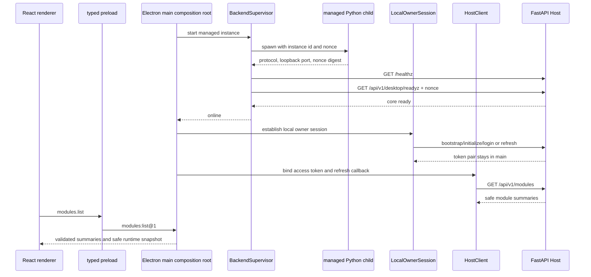

# P4-IF-004：Windows Shell 供应链与真实 Host 组合补充冻结

状态：`frozen`
冻结时间：2026-09-27，Asia/Shanghai
输入：[P4-IF-003](phase-4-interface-freeze-003.md)、[P4-B7 受阻交付](b7-windows-shell-running.md)、[P4-D12 技术裁定](phase-4-d12-b7-supply-chain-advice.md)、[D12 总控审阅](p4-d12-coordinator-review.md)
适用任务：`P4-B7-R1` 及其后 `P4-C12`

本文件补充 P4-IF-003。未被本文件明确改变的 P4-IF-003 条款继续有效；发生冲突时，本文件只在供应链候选、desktop core readiness 和真实 Host 组合范围内优先。

## 1. 总控决定

1. 接受 Electron Forge `8.0.0-alpha.10` 作为发布前 B7-R1 的**临时验证基线**。
2. alpha 不得用于正式发行、公开安装包或真实用户生产数据运行；正式发布前必须迁移到当时通过验收的 beta/rc/stable，优先 stable。
3. 接受 managed desktop 专用 `GET /api/v1/desktop/readyz`；通用 `GET /readyz` 的 provider readiness 语义保持不变。
4. B7-R1 只处理供应链、desktop sidecar/readiness 和 Electron main 真实组合，不进入 P4-C 财务驾驶舱或 P4-D 财富管理业务。

## 2. 冻结条款

### P4-IF-004-F01：候选性质

Forge `8.0.0-alpha.10` 只用于发布前开发和测试。不得据此宣布可正式发布。Forge 8 的 beta、rc 或 stable 出现后另立版本升级与复验任务；不得在 B7-R1 内自由选择其他版本。

### P4-IF-004-F02：同 cohort

以下直接依赖全部精确为 `8.0.0-alpha.10`，禁止混用 Forge 7/8 或不同 alpha：

- `@electron-forge/cli`
- `@electron-forge/plugin-fuses`
- `@electron-forge/plugin-vite`
- `@electron-forge/shared-types`

### P4-IF-004-F03：保留与变更版本

继续精确固定：

- Node `24.21.0`
- pnpm `12.7.0`
- Electron `44.4.5`
- React / React DOM `19.3.0`
- TypeScript `6.0.3`
- Vite `7.3.6`
- React Router `8.4.0`

`@electron/fuses` 精确升级到 `2.0.0`，满足 Forge 8 plugin peer 合同。

### P4-IF-004-F04：候选解析图

clean lockfile 必须精确解析出：

- `@electron/packager@20.3.0`
- `@electron/rebuild@4.2.0`
- `node-gyp@12.4.0`
- `tar@7.5.21`
- `@electron-internal/extract-zip@1.0.5`

实际 clean resolution 与任一精确值不同即停止，交回总控更新冻结；执行智能体不得顺手接受新版本。

### P4-IF-004-F05：workspace 安全配置

继续保留：

- `nodeLinker: hoisted`
- `autoInstallPeers: false`
- `strictPeerDependencies: true`
- `blockExoticSubdeps: true`
- `.npmrc` 的 `node-linker=hoisted`、`save-exact=true` 和 strict peer 设置
- lifecycle scripts allowlist 只允许已核对的 `electron` 与 `esbuild`

移除 Forge 7/Rebuild 3 使用的 Electron node-gyp 本地 tarball override；仅在最终 lock 不再引用时删除对应 vendor tarball。增加精确 `tar: 7.5.21` override。任何新增 install script、Git/exotic dependency 或未知原生二进制均立即停止。

### P4-IF-004-F06：必须消失的依赖

以下包或版本不得残留在完整 lockfile、`pnpm list` 或 `pnpm why`：

- `@electron/packager@18.4.4`
- `extract-zip@2.0.1`
- `@electron/rebuild@3.7.2`
- `@electron/node-gyp@10.2.0-electron.1`
- `tar@6.2.1` 及所有低于 `7.5.21` 的 tar
- `tmp@0.0.33`

若 tmp 重新出现，最低版本为 `0.2.7`，并必须重新 full audit。

### P4-IF-004-F07：审计门禁

以下两项都必须以 `--audit-level high` 返回退出码 0，critical/high 均为 0：

1. 完整依赖图 full audit；
2. production-only audit。

production-only 不能代替 full。禁止降低等级、忽略 GHSA、运行无审查的 `audit fix --force`、添加无期限 allowlist 或以“devDependency”作为自动接受理由。

### P4-IF-004-F08：拒绝 Forge 7 major override

禁止使用 Forge 7.11.2 + Packager 20 major override 作为修复。lockfile 解析和 audit 变绿不能证明旧 callback hooks 与 Packager 20 Promise options hooks 兼容。

### P4-IF-004-F09：alpha 失败与退出

Forge 8 alpha 的 clean install、peer、ESM/config、plugin-vite、fuses、Packager hooks、Windows package、app.asar E2E 或 EXE smoke 任一失败，B7-R1 立即停止；不得在同一任务切换版本、回退 Forge 7 override 或引入本地安全 fork。

### P4-IF-004-F10：Desktop core readiness

新增 `GET /api/v1/desktop/readyz`：

- 只在 managed desktop profile 下可成功；
- 必须验证 `X-Maris-Startup-Nonce`；
- 核心检查仅包含 database connection、当前 Alembic head、非空 module registry 和 desktop gate；
- 不检查或暗示模型 provider ready；
- 缺失/错误 nonce、非 managed、数据库故障、migration 落后或 registry 空均返回稳定 503；
- 错误不得回显 nonce、数据库 URL、路径、SQL、PID、port 或 traceback。

通用 `/readyz` 继续执行完整 Host/provider readiness，provider 缺失时继续返回 `agent_provider_unconfigured`。`/healthz` 继续只表示进程存活。

### P4-IF-004-F11：不伪造 provider

禁止注入虚假 ModelProvider、把 `/healthz` 当完整 ready、降低通用 `/readyz` 条件或为 P4-B 启动 DeepSeek。未来模型调用继续依据 provider 状态 fail closed。

### P4-IF-004-F12：唯一 composition root

Electron main 创建且只创建一套：

- `BackendSupervisor`
- managed/external Host port
- `OwnerSecretStore`
- owner auth client
- `LocalOwnerSession`
- `HostClient`
- runtime state publisher

renderer 和 preload 不构造进程、HTTP client、token store 或 session。

### P4-IF-004-F13：Sidecar handshake

managed Python child 通过专用父子进程通道输出固定协议版本、`instance_id`、loopback port 与 nonce digest；不得输出原始 nonce。只有以下全部成立才进入 `online`：

1. child identity/instance 匹配；
2. nonce digest 匹配；
3. `/healthz` 成功；
4. `/api/v1/desktop/readyz` 成功。

handshake 只接受 loopback；port、PID、命令和路径不进入 renderer。

### P4-IF-004-F14：Supervisor 生命周期

- start/recover single-flight；
- managed ready 失败在返回前 bounded cleanup 本次 owned child；
- recover 先停止旧 owned child，再等待 1/2/4 秒退避并创建新实例；
- online 每 5 秒 health，连续 3 次失败进入 offline；child exit 立即 offline；
- 5 分钟最多 3 次恢复，online 稳定 10 分钟后才重置预算；
- stop 幂等，5 秒正常停止预算后只强停自己拥有的进程树；
- PID 不能单独证明 ownership；隐藏窗口不停止 Host。

### P4-IF-004-F15：External development 模式

只允许 development build、显式 loopback URL 和开发者明确提供的本次 nonce。不得用空 nonce。桌面只观察外部后端，不 stop、restart 或 force-kill 外部进程。

### P4-IF-004-F16：Owner 与 token

- refresh/access token 只在 main 内部流转；
- `LocalOwnerSession` refresh single-flight；
- revoke 同时清除内存 access token 并把持久状态标为 repair；
- OwnerSecretStore 使用 safeStorage、stage/commit/repair 和同目录原子替换；
- token、密码、nonce 和原始认证错误不得进入 IPC、renderer、日志或包。

### P4-IF-004-F17：HostClient 与模块回执

HostClient 只返回严格解析后的安全 `ModuleSummary[]`。401 最多触发一次同一 OwnerSession 的 single-flight refresh，然后单次重试。不得把 openapi-fetch 原始 Response、header、URL、body 或异常透传 renderer。失败使用稳定 `DesktopError` code。

### P4-IF-004-F18：Runtime 发布

安全 snapshot 由 Supervisor state 与 OwnerSession safe state 合成。每次真实状态变化通过 `runtime:state@1` 发给主 renderer；只包含允许的枚举、重试状态和脱敏错误 code，不包含 PID、port、路径、命令、token、nonce、数据库信息或原始异常。

### P4-IF-004-F19：统一退出

Tray quit、应用 quit、Windows session end 走同一 bounded shutdown：

1. 禁止新 recover；
2. flush 设备设置和 outbox；
3. 停止 owned child；
4. 清理窗口、监听器和临时资源。

重复 quit 幂等。主窗口隐藏到 Tray 不触发 shutdown。

### P4-IF-004-F20：实现文件边界

B7-R1 可以修改：

- 根 Node/pnpm 版本、workspace、lock 与安全配置；
- `apps/desktop` 的 package、Forge/Vite、main/preload/shared 和执行方测试；
- 最小 `desktop_sidecar`、`desktop_runtime`、生产装配、Host route/OpenAPI，以及对应 `tests/host` 执行方测试；
- B7-R1 运行说明、source manifest 和执行角色状态。

不得修改 FinanceService、Agent 工具、pending、memory、activity import 业务语义、migration、独立测试、P4 矩阵、独立报告、control、overview、其他角色状态、OpenClaw、微信或 DeepSeek。

### P4-IF-004-F21：结论权限

执行智能体负责实现、执行方测试和可复算交接，只能提交 `review / finished`。不得修改或运行 `tests/independent/**`，不得自行启动 P4-C12，不得宣布 P4-B complete。

### P4-IF-004-F22：完整真实门禁

B7-R1 缺一不可：

1. 固定 Node/pnpm 版本；
2. clean lockfile resolution 与 frozen install；
3. strict peers、exotic dependency、lifecycle script 检查；
4. full 与 production-only audit；
5. 必须消失依赖检查和依赖图/SBOM；
6. OpenAPI generation drift；
7. TypeScript、lint、Vitest；
8. 受影响 Python tests 与 compile；
9. 自有 Uvicorn managed smoke；
10. Forge Windows package；
11. 最终 package 的 app.asar E2E；
12. 真实 `Maris.exe` startup/owner/modules/recover/Tray quit smoke；
13. 包内秘密、token、个人数据和任意更新 URL 扫描；
14. owned process、port、window、Tray、临时目录和工具缓存收口；
15. 有序终点 source manifest、lock hash、package hash和执行方报告。

## 3. 数据流

## 4. 立即停止条件

出现任一项，执行智能体在安全位置停止并交回总控：

- full/prod audit 出现 critical/high；
- 候选 resolved 版本与 F04 不一致；
- 新 install script、Git/exotic dependency、未知 native helper；
- Forge 8/Packager 20 hook、package、Vite、fuses 或 ESM 不兼容；
- desktop core readiness 需要改变通用 `/readyz` 或伪造 provider；
- ready 失败遗留 child、停止非 owned 进程或以 PID 单独判断 ownership；
- token、nonce、密码、个人财务数据或原始私密日志进入 renderer/产物；
- 需要修改独立测试、矩阵、报告或 P4-C/P4-D 业务；
- 同一阻塞连续两个检查点没有有效新进展。

停止时保留已验证快照、失败前后证据和资源状态，不通过换版本、降低门禁、skip/xfail 或重复成功覆盖首次失败。

## 5. 正式发布门禁

即使 B7-R1 与 P4-C12 全部通过，Forge 8 alpha 仍不能成为正式发布依据。用户以后明确宣布首个正式版本前，总控必须重新核对当时 Forge 8 的发布阶段并建立升级任务；至少迁移到通过独立验收的 beta/rc，优先 stable。若 stable 尚不可用，是否发布必须作为新的产品与安全决定，不由本冻结预先授权。
