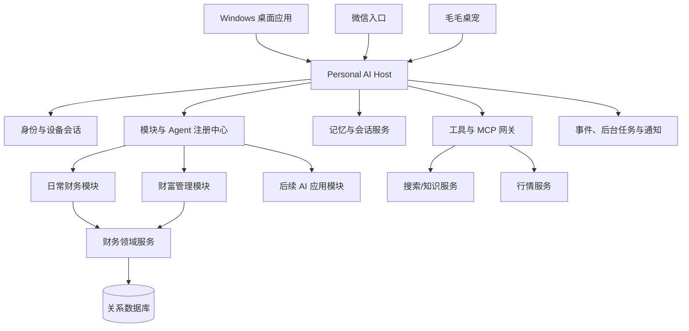

# P4：可扩展个人 AI 应用 Host 架构草案

- 状态：头脑风暴输出，等待技术顾问评审与 P4 接口冻结
- 更新：2026-09-20，Asia/Shanghai
- 基线：`a480bc2 Add P0-P3 teaching set and P4 product plan`
- 目标：在继续交付个人财务能力的同时，为后续新增 AI 应用模块保留稳定、受控、可测试的接入面

## 1. 产品定位

本项目不再只定义为一条“聊天 → 调工具 → 写账”的固定 workflow。它定位为一个**个人 AI 应用 Host**，财务生活和财富管理是第一组内置模块。

Host 统一提供：

- 登录、设备会话、微信身份绑定和用户隔离；
- Agent Profile 注册、模块路由、上下文组装和模型适配；
- 本地工具与 MCP 工具注册、权限、确认和执行审计；
- 共享记忆、模块专属记忆、会话和事实数据边界；
- Windows 桌面导航、聊天面板、毛毛桌宠、主题与设置扩展点；
- 事件、后台任务、通知、可观察性和测试入口。

后续模块通过明确契约接入 Host。模块不直接取得数据库账号、其他模块的内部对象或任意外部调用权限。

## 2. Agent、workflow 与确定性程序的关系

项目仍然需要 workflow，但 workflow 是 Agent 应用内部的可靠执行手段，不再等同于整个产品。

| 层 | 负责内容 | 不负责内容 |
| --- | --- | --- |
| Host | 身份、模块注册、路由、上下文、权限、记忆、工具执行、审计 | 不代替模块业务规则 |
| Agent | 理解意图、选择工具、解释数据、提出方案、跨步骤协作 | 不直接改库，不自行计算关键金额 |
| Workflow | 候选、确认、暂停恢复、重试、补偿、跨步骤状态 | 不凭自然语言决定财务事实 |
| 领域服务 | 金额、余额、预算、收益、事务、幂等和业务不变量 | 不生成开放式建议 |

以“午饭 18 元”为例：

```text
Host 识别当前用户与入口
  → 路由到账本 Agent
  → Agent 生成结构化记账候选
  → 记账 workflow 要求确认
  → FinanceService 校验金额、账户、幂等和事务
  → 写入事实账本
  → Agent 解释回执
```

以“我现在适合拿多少钱做长期配置”为例：

```text
Host 路由到财富管理 Agent
  → 读取共享约束和财富管理专属记忆
  → 调用现金流、应急金、目标与风险工具
  → 确定性程序生成可用范围和情景
  → Agent 解释取舍并提供学习材料
```

## 3. 总体结构



首版继续采用模块化单体。模块契约用于隔离代码和权限，不在 P4 提前拆成多个微服务。

## 4. 模块接入契约

每个模块至少声明以下内容：

| 接入项 | 作用 |
| --- | --- |
| `module_id` 与版本 | 稳定标识、迁移和兼容性判断 |
| 导航与路由 | 主窗口如何出现模块入口 |
| Agent Profiles | 模块包含哪些系统提示词、模型策略和停止条件 |
| Tool Allowlist | Agent 允许读取或调用的工具 |
| Memory Namespaces | 允许访问的共享与专属记忆范围 |
| Permissions | 读取、候选、确认写入、外部网络和通知权限 |
| API Routers | 模块暴露给桌面端的结构化接口 |
| Settings Schema | 模块在设置中心注册的字段和默认值 |
| Events | 可以发布和订阅的稳定事件类型 |
| UI Contributions | 页面、卡片、快捷动作与毛毛状态映射 |
| Migrations | 模块新增的持久化结构和升级/降级规则 |
| Evals | Agent 场景、权限、失败与回归测试集 |

概念清单：

```yaml
module_id: wealth_management
version: 0.1.0
navigation:
  route: /wealth
  label: 财富管理
agent_profiles:
  - wealth_planner
tools:
  read:
    - finance_get_cashflow_snapshot
    - wealth_get_emergency_fund_status
  confirm_write:
    - wealth_update_target
memory:
  read:
    - global.confirmed
    - wealth.confirmed
  propose_write:
    - wealth.candidates
permissions:
  network: denied
  financial_write: confirmation_required
```

P4 先使用代码内注册的可信内置模块。运行时安装任意第三方代码、模块市场和远程脚本加载不进入首版。

## 5. Agent Profile

不同模块可以使用不同逻辑 Agent，但它们由同一个 Host 管理。Agent Profile 至少包含：

- `agent_id`、显示名称和所属模块；
- 基础系统规则与模块系统提示词；
- 模型适配与参数；
- 工具白名单和参数权限；
- 可读/可写记忆命名空间；
- 最大工具轮次、超时、成本和停止条件；
- 需要用户确认的动作；
- UI 标题、快捷问题和毛毛状态；
- 独立评测集与版本。

运行时有效上下文由 Host 组装：

```text
共享安全规则
+ 当前 Agent Profile
+ 可信用户与设备上下文
+ 当前模块/页面
+ 相关且获准的共享记忆
+ 当前 Agent 专属记忆
+ 工具返回的最新事实
```

模块切换由桌面路由确定，不消耗模型调用。微信消息没有页面上下文时，由受限意图路由选择 Agent；存在歧义时先询问用户。

## 6. 工具与 MCP 接入

Host 同时支持两类工具：

1. **进程内领域工具**：复用现有 `ToolRegistry`、`FinanceService`、事务和幂等实现。
2. **外部工具/MCP 服务**：搜索、行情、日历或后续外部 AI 能力通过适配器接入。

不要求为了“像 MCP”而把所有 Python 函数立刻包装成 MCP Server。Host 内部先冻结统一的工具描述、授权、执行结果和错误契约，再为外部协议提供适配层。

工具执行统一经过：

```text
Agent 提出调用
  → Host 核对 Agent 与用户权限
  → Pydantic 校验结构参数
  → 需要时产生确认候选
  → 工具/领域服务执行
  → 审计和脱敏
  → 结构化结果返回 Agent
```

## 7. 记忆与事实分层

| 层 | 示例 | 读取范围 | 写入规则 |
| --- | --- | --- | --- |
| 共享确认记忆 | 币种、稳定偏好、长期目标、风险边界 | 获准 Agent | 明确提供或用户确认 |
| 模块专属记忆 | 分类习惯、规划假设、财富知识水平 | 所属模块 Agent | 显式记住或候选确认 |
| 会话记忆 | 当前追问和临时上下文 | 当前会话 | 按保留策略 |
| 事实数据 | 账目、余额、预算、持仓、行情 | 领域工具 | 只由事务和外部数据工具更新 |

模块专属记忆不能静默晋升为共享记忆。Agent 可以提出候选，由记忆中心显示来源、范围、敏感级别、有效期和影响模块，用户确认后再晋升。

## 8. 账户、设备和渠道绑定

桌面应用增加登录与账户中心。内部 `user_id` 是账目、记忆、会话、模块设置和渠道绑定的统一身份。

首版需要：

- 主人账户初始化与登录；
- 密码安全哈希、短期访问会话和可撤销设备会话；
- 当前设备、退出登录和会话失效；
- 微信一次性绑定码、过期、冲突、解绑和重新绑定；
- API Key/模型凭据独立安全保存，不进入提示词、记忆、日志或仓库；
- 所有业务查询和工具调用强制携带可信 `user_id`，不接受模型提供身份。

持续远程多端使用需要服务端部署、TLS、备份和恢复，作为部署切片单独冻结。P4 本地桌面验证不伪装成已经完成公网多端服务。

## 9. 桌面 UI 的模块扩展面

Host Shell 提供稳定区域：

- 登录与账户中心；
- 左侧模块导航；
- 页面主内容区；
- 右侧模块 Agent 面板；
- 全局命令、通知和连接状态；
- 毛毛独立透明窗口与系统托盘；
- 设置中心的公共页与模块注册页。

模块可以注册页面、仪表盘卡片、快捷动作、Agent 建议和设置字段，不能任意覆盖登录、权限确认、隐私提示和全局错误处理。

第一组内置模块：

```text
日常财务
├── 首页总览
├── 账本与待确认
├── 生活预算与消费评估
└── 活动资料

财富管理
├── 应急资金
├── 储蓄与现金管理
├── 风险保障
├── 资产配置
├── 基金、债券与股票
└── 长期财富目标
```

投资是财富管理的子模块，不与全部理财内容画等号。理财教学是各模块都可调用的能力，不作为毛毛的独立业务形态。

## 10. 毛毛桌宠

桌宠只有一个，固定名称为“毛毛”，共享同一个用户身份和 Host 会话入口。

两种主要形态：

1. **日常管钱**：钱包、账单或预算卡；对应日常财务模块。
2. **财富管理**：现金备用、稳健资产、长期配置等资产配置元素；对应财富管理模块。

子状态由当前页面和事件决定，例如记账、预算、储蓄、风险、投资、待确认、离线。默认跟随模块自动切换，用户可以在设置中关闭跟随或手动锁定形态。

关闭主窗口时，Electron 主进程可以继续驻留托盘，毛毛使用独立透明窗口。设置支持：

- 主窗口关闭后继续显示、隐藏或每次询问；
- 启用/停用、开机启动、启动后只显示毛毛；
- 置顶、大小、透明度、吸附边缘、记住位置；
- 全屏隐藏、低电量降帧、减少动画；
- 点击打开当前模块 Agent，右键打开托盘菜单；
- 隐私模式下不在气泡显示金额。

毛毛可以展示状态和提醒，不能因模块切换自行执行财务写入。

## 11. 设置与主题

设置中心分为：账户与绑定、Agent 与记忆、毛毛、后台与启动、外观与主题、通知与隐私，以及各模块自己的设置页。

设置区分三种范围：

| 范围 | 示例 |
| --- | --- |
| 账户同步 | 记忆策略、默认 Agent、确认偏好 |
| 设备本地 | 窗口位置、毛毛位置、缩放、开机启动 |
| 运行时 | 当前模块、连接状态、临时静默、未读提醒 |

主题支持跟随系统、浅色、深色、强调色、高对比度和减少动态效果。投资行情颜色提供“中国习惯：红涨绿跌”和“国际习惯：绿涨红跌”，普通收支仍使用独立语义色。

## 12. 建议代码边界

```text
src/wife_system/
├── host/
│   ├── auth/
│   ├── agents/
│   ├── tools/
│   ├── memory/
│   ├── modules/
│   ├── events/
│   └── audit/
├── modules/
│   ├── daily_finance/
│   └── wealth_management/
└── finance/                 # 已有确定性财务领域层，逐步适配

apps/desktop/
└── src/
    ├── shell/
    ├── modules/
    │   ├── daily-finance/
    │   └── wealth-management/
    ├── assistant/
    ├── companion/
    ├── settings/
    └── theme/
```

真实目录在技术顾问核对现有包结构后冻结。不能为了得到漂亮目录而一次性移动 P0～P3 已验收代码。

## 13. 跨模块通信

模块优先通过稳定领域查询或事件交换，不互相导入内部 repository。

候选事件：

- `transaction.recorded`
- `transaction.corrected`
- `budget.updated`
- `goal.progress_changed`
- `memory.confirmed`
- `market_snapshot.refreshed`
- `notification.requested`

事件包含版本、用户、发生时间、幂等键和最小必要数据。敏感详情由接收模块使用授权工具查询，避免事件总线成为隐私数据复制通道。

## 14. P4 建议切片

### P4-A：Host 契约与身份地基

- 模块和 Agent Profile 契约；
- 用户、设备会话和微信绑定模型；
- 工具权限、确认和审计边界；
- 共享/专属记忆命名空间；
- 用现有账本能力注册第一个 `daily_finance` 模块。

### P4-B：Windows Host Shell

- Electron + React + TypeScript；
- 登录、导航、模块主区和 Agent 面板；
- 设置、主题、托盘和毛毛基础窗口；
- 模块注册驱动导航，避免在 Shell 中为每个业务写条件分支。

### P4-C：日常财务纵向闭环

- 首页快照、消费趋势、账本列表和待确认；
- “午饭 18 元 → 候选 → 确认 → 写入 → 刷新”；
- 只读查询和错误/离线状态；
- 日常管钱形态毛毛。

### P4-D：第二模块接入证明

- 注册 `wealth_management` 的导航、Agent Profile、记忆命名空间和设置；
- 首版只交付应急资金/储蓄规划的虚拟或测试数据页面；
- 不在 P4 接真实行情，不实现自动交易；
- 验证新增模块不需要修改 Host 核心路由和权限逻辑。

## 15. 扩展性验收标准

P4 只有同时满足下面条件，才能声称为后续模块留出了接入空间：

1. 新增第二模块时不修改 Host 的核心路由分支；
2. Agent 的提示词、工具和记忆权限由 Profile 声明并可测试；
3. 模块无法读取未授权记忆或调用未授权工具；
4. 页面、设置项和毛毛状态通过注册加入；
5. 领域金额和写入 workflow 可脱离 LLM 单独测试；
6. Agent 场景测试能区分路由错误、权限错误、工具错误和模型错误；
7. 模块版本、迁移和事件契约有明确兼容策略；
8. 移除或停用模块不会损坏其他模块的事实数据。

## 16. 当前不做的过度抽象

- 不做第三方模块市场；
- 不允许运行时下载并执行未知插件；
- 不为每个 Agent 建一个微服务；
- 不在没有真实需求前设计通用低代码工作流编辑器；
- 不要求所有内部工具先转换为 MCP；
- 不让跨 Agent 自由对话代替明确的工具和 workflow；
- 不为了未来模块重写已经验收的账本和事务核心。

## 17. 冻结前需要技术顾问回答

1. 模块清单与 Agent Profile 采用 Python 注册、配置文件还是二者结合；
2. 现有 `AgentRunner`、`ToolRegistry` 和 API 如何最小适配 Host；
3. 用户身份怎样无破坏地加入现有财务表和幂等键；
4. 记忆表、会话表和模块设置表的最小数据模型；
5. Electron 开发期怎样管理本地 FastAPI 生命周期；
6. UI 模块注册和代码分包采用何种 TypeScript 契约；
7. 毛毛透明窗口、托盘、后台运行和主题切换的最小验证方案；
8. P4-D 第二模块怎样证明扩展性，同时避免提前实现完整财富管理。
