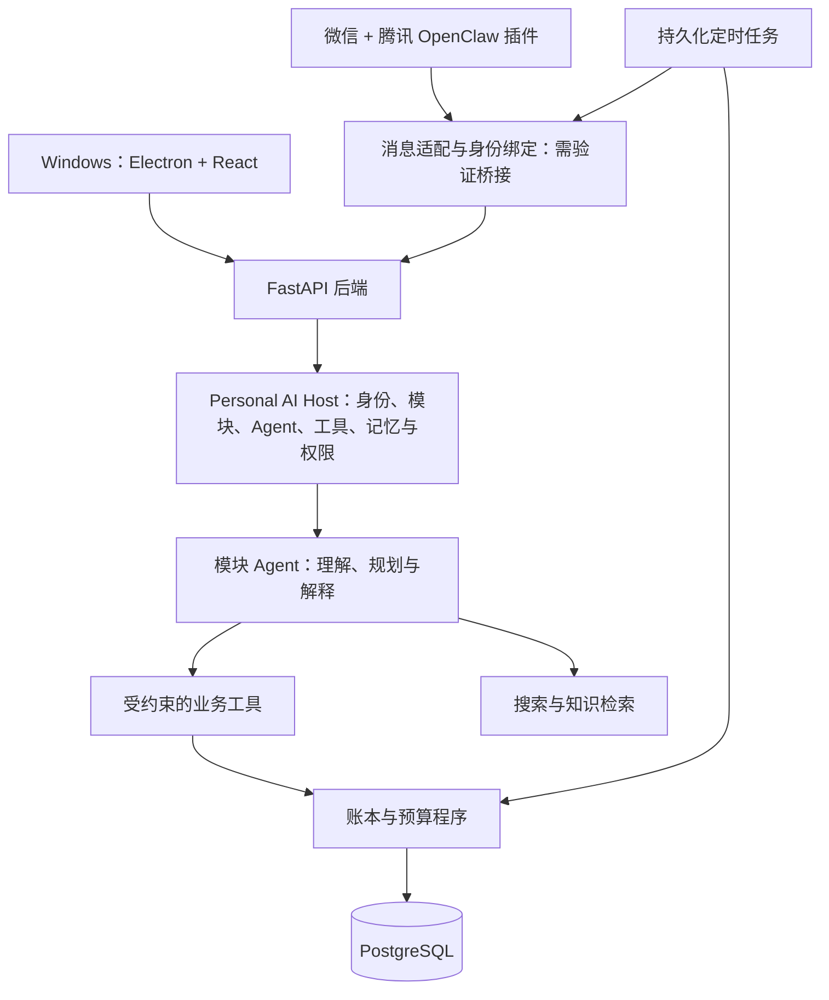

# 项目计划 v0.4

更新日期：2026-09-20。状态：P0～P3 已形成已验收地基；P4 处于产品与架构讨论。

## 已确定的方向

- 用户会 Python 和 Git 命令，尚未系统学习前后端，愿意学习 JavaScript/TypeScript。
- 技术选择兼顾长期 AI 应用工程能力，不因用户暂时不了解某项技术而直接排除。
- 由 Codex 承担主要实现工作；用户学习架构、读代码、运行、调试并完成小型修改。
- 采用四类角色：头脑风暴（计划与总协调）、技术顾问（选型建议、教学规划与教学子任务调度）、执行智能体（代码实现与执行子任务协调）、测试智能体（独立验证、边界检查与结构优化）。技术顾问根据学习需要组织用户代码检查、测试与理论资料检索，并向用户及头脑风暴反馈教学进度。详见 [任务分工与进度](project-coordination.md)。
- 地区默认中国大陆，币种默认 CNY，时区默认 Asia/Shanghai。当前生活费金额不是代码常量。
- 日常主要通过微信聊天表达消费意图、记录实际支出、调整计划和接收提醒。用户已明确指微信官方插件市场中的 OpenClaw；以腾讯微信团队维护的通道插件作为优先验证路线。
- Windows 桌面应用提供对话、计划、预算、账目、证据和修改历史界面；手机只通过微信消息交互，不开发独立 Android 应用。
- 以联网 Agent 为目标；断网时需说明状态，避免显示虚假成功。完整离线 Agent 不列为当前目标。
- 模型优先考虑用户可提供的 DeepSeek API；搜索服务、部署商和预算到接入阶段再决定。
- 用户几乎不用现金，首版优先电子支付场景。对话记录不等于已经接入微信支付或支付宝账单。
- 理财与投资从零学习：主动问答、消费现场解释、复盘、学习进度都属于产品能力。
- 长期产品定位为可扩展的个人 AI 应用 Host。财务生活与财富管理是第一组内置模块；后续 AI 应用通过模块、Agent Profile、工具、记忆、权限、页面和设置契约接入，不把整个产品固化为一条 workflow。
- Agent 负责理解、路由、规划和解释；workflow 负责候选、确认、暂停恢复和补偿；金额、事务、幂等及领域不变量继续由确定性程序负责。
- 投资是财富管理的子模块。财富管理还包括应急资金、储蓄、现金管理、风险保障、资产配置和长期目标。

## 核心交互

### Markdown 导入个人活动

用户可以先用普通 Markdown 描述活动、常用组合、典型价格和例外。格式以易于编辑为目标，后续可提供模板或可选元数据。

流程：文件上传 → 提取候选结构 → Pydantic 与业务校验 → 展示新增/修改/冲突及不确定项 → 按导入意图和确认结果提交事务 → 保存来源与版本。

导入文件是数据，不是可以改变 Agent 权限、工具或系统规则的指令。导入不授予代码执行权限。

原则：

- Markdown 是输入和导出格式；关系数据库保存应用采用的结构化事实。
- 不要求用户现在提供完整活动清单。运行时可以通过文件和对话逐步补充。
- 文件版本、内容摘要、来源位置用于追溯；稳定实体标识与冲突规则用于更新。
- 同一文件重复导入不能重复生成活动或账目。文字相近的活动不能未经核实就合并。
- 后续文件修改默认作为一批新变更导入，不做隐式双向同步或静默覆盖。
- 模板参考金额和预计次数不自动生成已支付账目。

示例（完全虚构，不代表用户的真实生活）：

```markdown
# 我的活动

## 食堂午餐
- 通常每次 15–20 元，只用于预测。
- 上课日一般一次；休息日不一定。

## 健身房
- 周末可能去零次、一次或两次。
- 交通费单独记录，有时会买饮料。

## 普通上课日组合
- 早餐一次、午餐一次、晚餐一次。
- 是否发生以及实际金额由当天记录确定。
```

### 微信聊天驱动

- 事前：“下周准备去两次健身房，帮我更新计划。”→ 调整活动安排与预测，不记为已消费。
- 事前：“想买一个耳机，先评估预算和实际用途。”→ 读取财务快照、核实商品资料、比较方案。
- 事后：“今天午餐十八，下午打车十二。”→ 识别两笔支出、关联活动、保存并提供可纠错回执。
- 纠正：“午餐是十六，不是十八。”→ 明确指代后改账、保留审计记录、更新预测。
- 收入改变：“下个月开始实习，预计新增收入。”→ 保存带生效日期的收入计划；未到账不计作实收。

同一后端服务提供所有渠道的账目和计划。微信与应用关联同一用户身份；实际消息到达顺序、重复回调和跨端修改通过服务端版本与去重控制。

手机入口以文字对话为基础，支持查询、事前评估、事后记录、纠错、调整计划和接收提醒。较复杂的图表与批量资料管理放在桌面；微信回复必须能独立说明关键结论、金额、来源和需要补充的信息，不强迫用户打开另一个手机应用。

### 动态规划与理财教学

- 生活费金额、收入来源、周期、生效区间、固定支出、兴趣和目标都是可更新记录。
- Agent 在应用内逐步询问必要信息，结合历史活动给出初步生活预算，标明哪些是已知、估计或待确认。
- 数据不足时展示范围和缺失信息；不把生活需求或风险承受能力当作已经知道的事实。
- 基本生活、已知未来支出、应急储备、兴趣试错和长期资金分开预留，但不重复扣减。
- 同时考虑正常到账、到账延迟和临时必要支出等情景。模型不给出无条件的生活保障或投资收益承诺。
- 实习等收入变化从新生效日期影响未来预测，不改写历史实际账目。
- 兴趣预算和投资计划通过后续问答逐步确定。没有投资经验是教学起点，不是推断风险偏好的依据。
- 财务教学记录概念、例子、练习、反馈和复习点，支持主动问答与消费现场简短解释。
- 早期投资功能用于教育、情景模拟与计划复盘，资金交易由用户操作。

## 数据概念

| 概念 | 核心职责 |
| --- | --- |
| 活动模板及版本 | 典型活动、参考金额范围、可选费用和来源 |
| 活动组合及成员 | 多种模板和默认次数；不是每天必然发生的事实 |
| 活动计划与实际发生 | 日期、次数、取消/完成状态及模板版本；同一活动可以多次发生 |
| 账目与账户 | 实际金额、发生时间、支付账户、类别、来源、修订；一项活动可以关联多笔账目 |
| 收入安排与实收 | 金额、频率、生效区间、预计到账和实际到账分别保存 |
| 预算与目标 | 规划区间、预留额度、优先级、版本和调整理由 |
| 个人记忆 | 明确偏好与系统假设分开；来源、有效期、纠正与删除 |
| 导入批次 | 文件版本、候选变更、冲突、校验和实际导入结果 |
| Agent 执行记录 | 消息、工具参数、结果摘要、状态、耗时、成本、失败原因；日志脱敏 |
| 通知记录 | 触发条件、渠道、计划时间、状态、去重键和重试 |
| 学习进度 | 财务知识掌握证据，与工程开发教学进度分别管理 |

金额采用整数分或精确十进制；业务层负责计算。账户转账不计为消费；退款关联原支出；代付与报销区分自付成本和现金流。后续明确分期口径，避免消费和还款重复计入支出。

## 候选架构



初版采用模块化单体后端：Host、模块 Agent、workflow、财务领域和渠道有明确边界，不先拆成多个独立微服务。定时任务可以独立运行，与数据库共享可靠状态。P4 的详细模块契约见 [可扩展个人 AI 应用 Host 架构草案](phase-4-modular-agent-host-architecture.md)。

## 技术提案与替代方案

下表是建议，不代表所有组件已经最终选定。每项功能实现前需给出当时具体选型说明。

| 部分 | 建议路线 | 需要比较的方案与取舍 |
| --- | --- | --- |
| 后端接口 | Python + FastAPI + Pydantic | Django 适合需要完整后台等能力的场景；FastAPI 便于围绕类型和 API 建立本项目后端。见 [FastAPI 文档](https://fastapi.tiangolo.com/features/)。 |
| 持久化 | PostgreSQL + SQLAlchemy + Alembic | 小实验可用内存数据或 SQLite；业务联调与事务验证以目标数据库为准，避免默认两种数据库行为相同。见 [SQLAlchemy](https://docs.sqlalchemy.org/en/20/orm/quickstart.html)、[Alembic](https://alembic.sqlalchemy.org/en/latest/) 和 [PostgreSQL 事务](https://www.postgresql.org/docs/current/tutorial-transactions.html)。 |
| 模型接入 | DeepSeek API，使用文档支持的 SDK 调用方式 | 先做薄的模型适配层，配置模型与端点；不自建庞大多供应商框架，也不预先绑定具体模型版本。 |
| Agent 运行 | 在现有小型 Python 工具循环上增加 Host、Agent Profile 和模块注册边界 | 达到暂停恢复、分支状态和可观察性需求后，对比引入 LangGraph；保持业务工具、workflow 和财务算法可独立测试。 |
| 前端 | TypeScript + React；Vite 作为构建候选 | Next.js 的服务端渲染等能力需结合需求比较；本项目已有 Python 后端，先采用 React 客户端路线。 |
| Windows | Electron | Electron 内含 Chromium 和 Node.js，支持 Windows/macOS/Linux。Tauri 为另一候选，但引入 Rust 工具链；不把 ChatGPT 桌面应用的内部实现当作已知事实。 |
| 微信 | 腾讯 OpenClaw 微信插件 + 可替换的业务桥接层 | 已核实有官方单聊通道；插件与自建 Python Agent 的连接方式、长期主动提醒和实际账号权限仍需验证。 |
| 搜索 | 独立搜索提供方接口 + 来源保存 | 第三方搜索 API、模型供应商提供的搜索能力、浏览器访问按可用性和费用比较；不提前购买。 |
| 记忆与 RAG | 先结构化偏好与基础知识检索 | 有真实知识库和检索评测后再引入 Embedding/向量检索；关系账目查询仍通过数据库工具。 |
| 外部工具 | Host 提供统一工具契约；有外部复用需求时加入 MCP/FastMCP 适配 | 本进程 Python 函数不必先包装成 MCP；模块只能调用 Profile 明确授权的本地或 MCP 工具。 |
| 验证与运维 | pytest、接口测试、Agent 场景集、结构化日志 | UI 阶段加入浏览器测试；部署阶段比较 Docker Compose 等方式。队列、缓存和追踪平台按实际需求加入。 |

DeepSeek 的工具调用文档明确区分“模型提出函数调用”和“开发者提供并执行函数”。项目将利用这点学习工具循环，并在执行前校验名称、参数与授权。[DeepSeek Tool Calls](https://api-docs.deepseek.com/guides/tool_calls/)

LangGraph 的暂停恢复可用于“询问补充信息后继续消费评估”等需求；持久化恢复不能替代写入幂等性，重复执行仍需业务层防护。[LangGraph Interrupts](https://docs.langchain.com/oss/python/langgraph/interrupts)

桌面技术依据：[Electron](https://www.electronjs.org/docs/latest)、[Tauri 环境要求](https://v2.tauri.app/start/prerequisites/)。当前只维护一套自建 React 桌面界面；手机端复用微信，不引入 Capacitor、React Native 或 Android 应用构建工具链。

## 必须验证的工程行为

- 模型参数校验、未知工具拒绝、最大调用次数、超时、失败分类与成本限制。
- 明确的记账指令可以走直接保存与回执；含糊金额或指代先澄清。批量导入和重要预算变更支持预览与确认。
- 搜索资料不能改变工具权限，也不能把个人账本内容拼到外部搜索词中。
- 每笔写入有请求去重和事务保障；每次预算调整与所用财务快照可追溯。
- 微信消息来源验证、用户绑定、重复/乱序回调与会话串扰防护。
- 提醒由持续运行的任务服务触发；聊天模型不会自行在未来醒来。任务取消、静默时段、通道限制、重试和重复投递均可验证。
- 在线模型不要求所有界面必须始终联网才可显示，但缓存、断网补记和本地模型都是独立范围选择。
- 密钥留在服务端；真实资料不进入示例、公开仓库或未经脱敏的日志。
- 自用仍需账号访问控制和备份恢复。公开注册、多租户及开源尚未确认。
- 手机通知由微信与系统通知设置共同影响；必须区分平台接受发送、消息进入微信会话和手机实际弹出通知。

## 微信可行性验证（尚未接入）

用户补充说明：所指为微信官方插件市场中的 OpenClaw。已核实 [OpenClaw 微信渠道文档](https://docs.openclaw.ai/channels/wechat) 列出由腾讯微信团队维护的 `@tencent-weixin/openclaw-weixin`，声明支持单聊与媒体；[腾讯源码仓库](https://github.com/Tencent/openclaw-weixin) 提供插件实现。因此以这条路线作为优先方案，无需再让用户证明微信通道是否存在。

OpenClaw 通道通常将入站消息路由给所选 OpenClaw Agent。让请求进入本项目 Python Agent 的桥接方式需要单独验证，不能把“插件可安装”当作“自建后端已经接通”。实现前比较通过 OpenClaw 扩展/工具委托业务服务与独立渠道适配的范围、维护成本和必要授权；优先复用官方通道能力。财务计算、数据库和 Agent 核心保持可独立测试。

主动提醒边界：[腾讯协议说明](https://github.com/Tencent/openclaw-weixin/blob/main/docs/protocol.md) 描述入站上下文 token 与回复传递，但未提供足以确认长期无互动后任意主动消息必达的服务端保证。实际验证新会话、隔夜或长时间无互动、重启恢复和失败回退，不编造有效期。

接入时重新核对版本和身份限制。当前 OpenClaw 文档记录了插件版本的配对/允许名单兼容问题，因此不能仅凭扫码或通道状态正常就宣告访问控制通过。

验证清单：文本收发、外部业务工具连接方式、主动提醒、登录维持、异常恢复、消息去重、身份绑定、运行位置、费用和授权条款。只有实际账号和环境验证后，才将“支持微信聊天及提醒”标为已完成。

具体分工、验证用语和通过标准见 [微信验证步骤](wechat-validation.md)。开发方准备环境与联调工具，用户负责手机端扫码授权、发送测试文字和确认收到消息。先用虚拟数据验证，可先在联网且保持运行的电脑上测试；关机或休眠会中断运行在该电脑上的服务，持续可用的部署方式后续决定。

## 尚需决定的事项

目前没有必须由用户补齐才能继续细化设计的信息。微信入口来源已明确，后续在接入阶段核对实际插件版本、账号授权和运行环境。

在对应功能开始前比较并确定：微信插件与后端连接方式、搜索服务、持续运行的部署与费用、资料存储边界、语音/截图的优先级、自用或公开发布。Android 容器和原生应用能力已经移出范围。

留给应用内 Agent 逐步了解：收入周期和变化、实际余额、活动模板、必要生活水平、兴趣试错、财务目标、投资知识与资金期限、提醒节奏。这些不作为启动项目设计的前置问卷。
